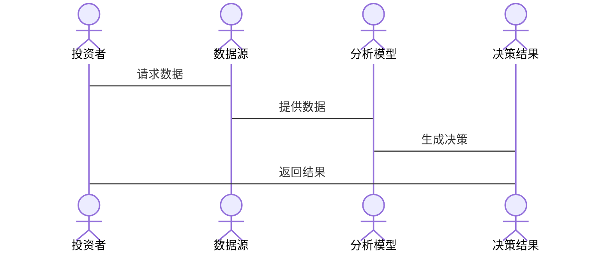

                 


# 多智能体协作提升价值投资决策质量

---

## 关键词
- 多智能体协作
- 价值投资
- 投资决策
- 分布式计算
- 博弈论

---

## 摘要
在当今快速变化的金融市场中，价值投资决策的质量直接影响投资者的收益和风险控制能力。传统的单智能体决策模式逐渐暴露出决策效率低下、信息处理能力有限等问题。多智能体协作作为一种新兴的决策模式，通过多个智能体的协同工作，能够显著提升决策的质量和效率。本文将深入探讨多智能体协作在价值投资中的应用，分析其核心概念、算法原理、系统架构设计，以及实际项目中的应用场景。通过理论分析和实践案例，本文旨在为投资者提供一种更高效、更可靠的决策支持方案。

---

## 目录

---

### 第一部分：多智能体协作与价值投资决策的背景

#### 第1章：多智能体协作的背景与价值投资决策

##### 1.1 多智能体协作的基本概念

- 1.1.1 多智能体协作的定义
- 1.1.2 多智能体协作的核心特点
- 1.1.3 多智能体协作与传统单智能体决策的区别

##### 1.2 价值投资决策的基本概念

- 1.2.1 价值投资的定义
- 1.2.2 价值投资的核心原则
- 1.2.3 价值投资在金融领域的应用

##### 1.3 多智能体协作与价值投资的结合

- 1.3.1 多智能体协作在价值投资中的作用
- 1.3.2 多智能体协作如何提升决策质量
- 1.3.3 多智能体协作与价值投资的未来发展趋势

---

### 第二部分：多智能体协作的核心概念与联系

#### 第2章：多智能体协作的原理

##### 2.1 多智能体协作的原理

- 2.1.1 多智能体协作的基本原理
- 2.1.2 多智能体协作中的通信机制
- 2.1.3 多智能体协作中的协调机制

##### 2.2 多智能体协作与价值投资的关系

- 2.2.1 多智能体协作在价值投资中的应用场景
- 2.2.2 多智能体协作如何提升投资决策的质量
- 2.2.3 多智能体协作在价值投资中的优势与挑战

##### 2.3 多智能体协作的核心概念对比表

| 概念         | 描述                                                                 |
|--------------|----------------------------------------------------------------------|
| 单智能体决策 | 基于单一决策主体的决策过程                                             |
| 多智能体协作 | 基于多个决策主体协作的决策过程                                         |
| 价值投资     | 基于资产内在价值的投资策略                                             |

##### 2.4 多智能体协作的ER实体关系图

```mermaid
erDiagram
    actor 投资者 {
        <string> id
        <string> 名称
        <string> 战略目标
    }
    actor 数据源 {
        <string> id
        <string> 数据类型
        <string> 数据来源
    }
    actor 分析模型 {
        <string> id
        <string> 类型
        <string> 输入数据
    }
    actor 决策结果 {
        <string> id
        <string> 决策类型
        <string> 结果
    }
    投资者 --> 数据源: 获取数据
    数据源 --> 分析模型: 提供数据
    分析模型 --> 决策结果: 生成决策
```

---

### 第三部分：多智能体协作的算法原理

#### 第3章：多智能体协作的算法原理

##### 3.1 多智能体协作的数学模型

- 3.1.1 博弈论基础
- 3.1.2 分布式计算模型
- 3.1.3 协作决策的优化算法

##### 3.2 基于博弈论的协作决策模型

- 3.2.1 博弈论的基本概念
- 3.2.2 协作决策中的纳什均衡
- 3.2.3 多智能体协作的博弈模型构建

##### 3.3 分布式计算与协作决策

- 3.3.1 分布式计算的基本原理
- 3.3.2 分布式协作决策算法
- 3.3.3 分布式计算在价值投资中的应用

##### 3.4 价值投资中的多智能体协作算法实现

- 3.4.1 算法流程图
- 3.4.2 Python代码实现
- 3.4.3 算法实现的优化与改进

##### 3.5 算法实现的代码示例

```python
import numpy as np
from sklearn.cluster import KMeans
import pandas as pd

# 示例数据：假设每个智能体的决策数据
data = pd.DataFrame({
    'id': [1, 2, 3, 4, 5],
    '策略': ['A', 'B', 'A', 'B', 'A'],
    '回报率': [0.1, 0.15, 0.08, 0.12, 0.1]
})

# 使用KMeans算法进行协作决策
clusters = KMeans(n_clusters=2).fit(data[['回报率']])

# 分配决策结果
data['决策结果'] = clusters.labels_
print(data)
```

---

### 第四部分：系统分析与架构设计方案

#### 第4章：系统分析与架构设计方案

##### 4.1 问题场景介绍

- 4.1.1 价值投资中的决策问题
- 4.1.2 多智能体协作的应用场景
- 4.1.3 系统设计的目标与范围

##### 4.2 系统功能设计

- 4.2.1 系统功能模块划分
- 4.2.2 系统功能流程图
- 4.2.3 系统功能的实现方式

##### 4.3 系统架构设计

- 4.3.1 系统架构图
- 4.3.2 系统模块之间的交互关系
- 4.3.3 系统架构的优化与改进

##### 4.4 系统接口设计

- 4.4.1 系统接口定义
- 4.4.2 接口交互流程
- 4.4.3 接口设计的注意事项

##### 4.5 系统交互过程的Mermaid序列图



---

### 第五部分：项目实战

#### 第5章：项目实战

##### 5.1 环境安装与配置

- 5.1.1 系统环境要求
- 5.1.2 软件工具安装
- 5.1.3 数据库配置

##### 5.2 系统核心实现

- 5.2.1 数据预处理
- 5.2.2 算法实现
- 5.2.3 系统功能实现

##### 5.3 代码实现与解读

- 5.3.1 代码结构
- 5.3.2 代码实现细节
- 5.3.3 代码优化与改进

##### 5.4 实际案例分析

- 5.4.1 案例背景介绍
- 5.4.2 数据分析与处理
- 5.4.3 决策结果与分析

##### 5.5 项目小结

- 5.5.1 项目成果总结
- 5.5.2 项目经验与教训
- 5.5.3 未来改进方向

---

### 第六部分：最佳实践与总结

#### 第6章：最佳实践

##### 6.1 最佳实践总结

- 6.1.1 多智能体协作的优势
- 6.1.2 价值投资的注意事项
- 6.1.3 系统设计的优化建议

##### 6.2 小结

- 6.2.1 多智能体协作的核心价值
- 6.2.2 未来的发展趋势
- 6.2.3 对投资者的建议

##### 6.3 注意事项

- 6.3.1 系统设计中的常见问题
- 6.3.2 价值投资中的风险控制
- 6.3.3 多智能体协作的局限性

##### 6.4 拓展阅读

- 6.4.1 推荐书籍
- 6.4.2 相关论文
- 6.4.3 在线资源

---

## 结语

多智能体协作在价值投资中的应用，不仅提升了决策的效率和质量，还为投资者提供了更可靠的投资决策支持。随着技术的不断进步，多智能体协作的应用前景将更加广阔，为金融市场的发展注入新的活力。

