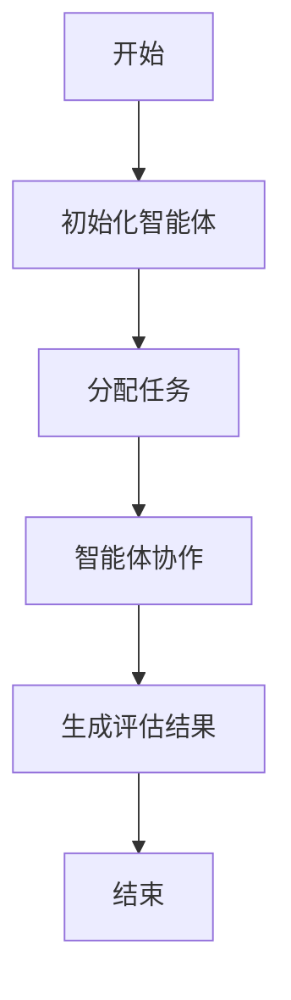
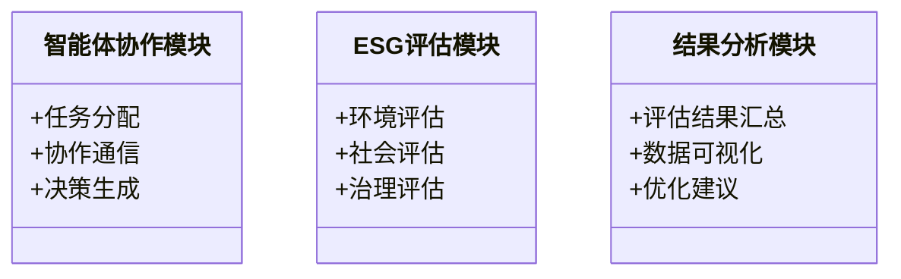
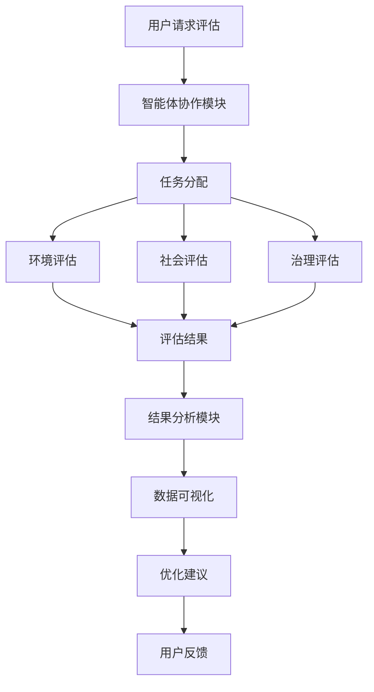

                 


# 多智能体协作评估ESG因素影响

## 关键词：多智能体协作，ESG评估，分布式计算，协作算法，系统架构

## 摘要：  
随着全球对可持续发展和企业社会责任的关注度不断提高，ESG（环境、社会、治理）评估成为衡量企业价值的重要标准。然而，传统的ESG评估方法往往依赖单一智能体的分析能力，难以应对复杂多变的评估场景。多智能体协作作为一种新兴的技术手段，通过多个智能体的协同合作，能够更高效、更全面地评估企业的ESG表现。本文将从多智能体协作的基本原理出发，结合ESG评估的核心要素，详细探讨如何通过多智能体协作来提升ESG评估的准确性和全面性。文章内容涵盖多智能体协作的背景、核心概念、算法原理、系统架构设计以及实际案例分析，旨在为读者提供一个系统化的视角，深入了解多智能体协作在ESG评估中的应用。

---

## 第1章: 多智能体协作与ESG概述

### 1.1 多智能体协作的背景与意义

#### 1.1.1 多智能体系统的定义与特点  
多智能体系统（Multi-Agent System, MAS）是由多个具有自主性、反应性、协作性和社会性的智能体组成的分布式系统。这些智能体能够通过通信和协作，共同完成复杂的任务。与单智能体系统相比，多智能体系统具有更强的灵活性和适应性，能够处理动态变化的环境和复杂的协作问题。

#### 1.1.2 ESG因素及其重要性  
ESG因素是衡量企业可持续发展能力的重要指标，包括：  
1. **环境（Environmental）**：企业的环保表现，如碳排放、资源利用效率等。  
2. **社会（Social）**：企业对员工、社区和社会的贡献，如社会责任、员工福利等。  
3. **治理（Governance）**：企业的内部管理与治理结构，如董事会构成、内部控制等。  

ESG评估不仅帮助企业识别风险和机会，还能为投资者提供决策依据，推动企业向可持续发展方向转型。

#### 1.1.3 多智能体协作在ESG评估中的应用价值  
传统的ESG评估方法通常依赖于单一数据源或专家判断，存在信息不全面、评估结果主观性较强等问题。多智能体协作通过多个智能体的协同工作，能够整合多源异构数据，从不同维度全面评估企业的ESG表现。此外，多智能体协作还能够通过分布式计算和协作优化，提高评估的效率和准确性。

### 1.2 ESG评估的核心概念

#### 1.2.1 环境因素  
环境因素关注企业的环境表现，包括碳排放、能源消耗、环保合规性等。在多智能体协作中，可以分别由不同的智能体负责收集和分析环境数据，并通过协作生成综合评估结果。

#### 1.2.2 社会因素  
社会因素关注企业对社会的贡献，包括员工权益、社会责任、社区参与等。在多智能体协作中，可以由专门的智能体负责收集和分析企业社会责任相关的数据，并与其他智能体共享信息。

#### 1.2.3 治理因素  
治理因素关注企业的内部管理与治理结构，包括董事会构成、高管薪酬、内部控制等。在多智能体协作中，可以由多个智能体分别评估不同治理维度的表现，并通过协作生成综合评估结果。

### 1.3 多智能体协作与ESG评估的关系

#### 1.3.1 多智能体协作的优势  
1. **分布式计算能力**：多智能体协作能够充分利用分布式计算的优势，处理大规模、多维度的数据。  
2. **协作优化**：通过智能体之间的协作，能够优化评估结果，避免单一智能体的局限性。  
3. **动态适应性**：多智能体协作能够快速响应环境变化，动态调整评估策略。  

#### 1.3.2 ESG评估的复杂性与挑战  
1. **数据异构性**：ESG数据来源多样，格式复杂，需要通过多智能体协作进行整合和分析。  
2. **评估维度多样性**：ESG评估涉及环境、社会和治理三个维度，需要通过协作实现多维度的综合评估。  
3. **结果的可解释性**：多智能体协作的评估结果需要具备较高的可解释性，以便用户理解和信任。  

#### 1.3.3 多智能体协作在ESG评估中的应用场景  
1. **数据整合与分析**：通过多智能体协作整合不同来源的ESG数据，生成综合评估结果。  
2. **动态评估**：在实时数据流中，通过多智能体协作快速更新和优化评估结果。  
3. **协作优化**：通过智能体之间的协作，优化评估模型和算法，提高评估的准确性和效率。  

### 1.4 本章小结  
本章从多智能体协作的基本原理出发，介绍了ESG评估的核心概念，并探讨了多智能体协作在ESG评估中的应用价值和优势。通过多智能体协作，可以更高效、更全面地评估企业的ESG表现，为企业和社会创造更大的价值。

---

## 第2章: 多智能体协作系统的核心概念与联系

### 2.1 多智能体协作系统的核心概念

#### 2.1.1 多智能体协作的通信机制  
多智能体协作需要通过通信机制实现智能体之间的信息交换。常见的通信机制包括：  
1. **直接通信**：智能体之间通过共享内存或消息队列进行直接通信。  
2. **间接通信**：智能体通过中间件或代理进行间接通信。  

#### 2.1.2 多智能体协作的决策过程  
多智能体协作的决策过程包括任务分配、信息共享、协商与决策等步骤。通过协作算法，智能体可以共同完成复杂的决策任务。

#### 2.1.3 多智能体协作的分布式计算  
多智能体协作通过分布式计算实现任务的并行处理，提高计算效率。每个智能体负责特定的任务，通过协作完成整体目标。

### 2.2 ESG评估的核心要素

#### 2.2.1 环境因素的量化方法  
环境因素的量化方法包括碳排放计算、能源消耗分析等。通过多智能体协作，可以整合不同来源的环境数据，生成综合评估结果。

#### 2.2.2 社会因素的评估指标  
社会因素的评估指标包括员工满意度、社会责任履行情况等。通过多智能体协作，可以收集和分析多源数据，生成社会因素的综合评估结果。

#### 2.2.3 治理因素的关键指标  
治理因素的关键指标包括董事会构成、高管薪酬、内部控制等。通过多智能体协作，可以分析不同治理维度的表现，并生成综合评估结果。

### 2.3 多智能体协作与ESG评估的实体关系图

#### 2.3.1 实体关系图
```mermaid
graph LR
A[智能体1] --> B[环境数据]
C[智能体2] --> D[社会数据]
E[智能体3] --> F[治理数据]
G[评估结果] <-- B, D, F
```

#### 2.3.2 实体关系分析  
通过实体关系图可以看出，多个智能体分别负责不同维度的数据收集和分析，并通过协作生成综合评估结果。这种分工协作的方式能够提高评估的效率和准确性。

### 2.4 本章小结  
本章详细介绍了多智能体协作系统的核心概念，包括通信机制、决策过程和分布式计算。同时，分析了ESG评估的核心要素，并通过实体关系图展示了多智能体协作在ESG评估中的应用。

---

## 第3章: 多智能体协作评估ESG因素的算法原理

### 3.1 多智能体协作算法概述

#### 3.1.1 分布式协作算法  
分布式协作算法通过将任务分解为多个子任务，分别由不同的智能体完成。每个智能体负责特定的子任务，并通过协作生成整体结果。

#### 3.1.2 协商与决策算法  
协商与决策算法通过智能体之间的协商，生成最优的决策结果。常见的协商算法包括谈判协商和投票协商。

#### 3.1.3 联合评估算法  
联合评估算法通过多个智能体的协作，生成综合评估结果。每个智能体负责特定的评估维度，并通过协作生成最终的评估结果。

### 3.2 多智能体协作算法的数学模型

#### 3.2.1 分布式计算模型  
$$f(x) = \sum_{i=1}^{n} f_i(x)$$  
其中，$f(x)$表示整体评估结果，$f_i(x)$表示第$i$个智能体的评估结果。

#### 3.2.2 协商与决策模型  
$$P(i) = \argmax_{j} \sum_{k=1}^{m} w_{kj} \cdot s_{ki}$$  
其中，$P(i)$表示第$i$个智能体的决策结果，$w_{kj}$表示第$k$个智能体对第$j$个决策的权重，$s_{ki}$表示第$k$个智能体对第$i$个决策的支持程度。

### 3.3 算法实现的mermaid流程图



### 3.4 本章小结  
本章详细介绍了多智能体协作评估ESG因素的算法原理，包括分布式协作算法、协商与决策算法和联合评估算法。通过数学模型和流程图，展示了算法的实现过程和协作机制。

---

## 第4章: 多智能体协作评估ESG因素的系统架构设计

### 4.1 系统功能设计

#### 4.1.1 多智能体协作模块  
多智能体协作模块负责智能体之间的通信和协作，实现任务分配和决策生成。

#### 4.1.2 ESG评估模块  
ESG评估模块负责收集和分析环境、社会和治理数据，生成综合评估结果。

#### 4.1.3 结果分析模块  
结果分析模块负责对评估结果进行分析和可视化，提供优化建议。

### 4.2 系统架构设计

#### 4.2.1 系统架构图



#### 4.2.2 系统交互流程图



### 4.3 系统接口设计

#### 4.3.1 多智能体协作模块接口  
- 输入：任务分配指令  
- 输出：协作结果  

#### 4.3.2 ESG评估模块接口  
- 输入：环境、社会和治理数据  
- 输出：综合评估结果  

#### 4.3.3 结果分析模块接口  
- 输入：评估结果  
- 输出：数据可视化和优化建议  

### 4.4 本章小结  
本章详细介绍了多智能体协作评估ESG因素的系统架构设计，包括功能设计、架构图和交互流程图。通过系统架构设计，展示了多智能体协作在ESG评估中的具体实现和应用场景。

---

## 第5章: 项目实战——多智能体协作评估ESG因素的实现

### 5.1 项目背景与目标

#### 5.1.1 项目背景  
本项目旨在通过多智能体协作技术，实现对企业ESG表现的综合评估。

#### 5.1.2 项目目标  
1. 实现多智能体协作模块，完成任务分配和协作通信。  
2. 实现ESG评估模块，完成环境、社会和治理数据的收集与分析。  
3. 实现结果分析模块，生成综合评估结果并提供优化建议。

### 5.2 项目实现

#### 5.2.1 环境搭建

##### 5.2.1.1 安装Python环境  
安装Python 3.8及以上版本，并安装必要的库，如`numpy`, `pandas`, `matplotlib`等。

##### 5.2.1.2 安装多智能体协作框架  
安装`multi-agent`框架或其他适合的多智能体协作框架。

#### 5.2.2 核心代码实现

##### 5.2.2.1 多智能体协作模块代码  
```python
class Agent:
    def __init__(self, id):
        self.id = id
        self.task = None
        self.result = None

    def assign_task(self, task):
        self.task = task
        print(f"Agent {self.id} assigned task: {task}")

    def collaborate(self, agents):
        for agent in agents:
            if agent.id != self.id:
                self.result = self.combine_results(self.result, agent.result)
        print(f"Agent {self.id} combined results: {self.result}")

    def combine_results(self, result1, result2):
        # 示例：简单合并结果
        return result1 + result2
```

##### 5.2.2.2 ESG评估模块代码  
```python
class ESGAssessment:
    def __init__(self):
        self.environment_score = 0
        self.social_score = 0
        self.governance_score = 0

    def assess_environment(self, data):
        # 示例：环境评估算法
        self.environment_score = sum(data) / len(data)
        return self.environment_score

    def assess_social(self, data):
        # 示例：社会评估算法
        self.social_score = max(data)
        return self.social_score

    def assess_governance(self, data):
        # 示例：治理评估算法
        self.governance_score = min(data)
        return self.governance_score

    def get_total_score(self):
        return (self.environment_score + self.social_score + self.governance_score) / 3
```

##### 5.2.2.3 结果分析模块代码  
```python
class ResultAnalyzer:
    def __init__(self):
        self.total_score = 0
        self.recommendations = []

    def analyze_results(self, scores):
        self.total_score = sum(scores) / len(scores)
        if self.total_score > 0.8:
            self.recommendations.append("企业ESG表现优秀，建议继续优化")
        elif self.total_score > 0.6:
            self.recommendations.append("企业ESG表现一般，建议采取改进措施")
        else:
            self.recommendations.append("企业ESG表现较差，建议立即采取行动")
        return self.recommendations
```

#### 5.2.3 代码运行与测试  
通过运行上述代码，可以实现多智能体协作评估ESG因素的综合评估。以下是运行结果示例：

```python
# 初始化智能体
agent1 = Agent(1)
agent2 = Agent(2)
agent3 = Agent(3)

# 分配任务
agent1.assign_task("环境评估")
agent2.assign_task("社会评估")
agent3.assign_task("治理评估")

# 协作评估
agent1.collaborate([agent2, agent3])
agent2.collaborate([agent1, agent3])
agent3.collaborate([agent1, agent2])

# 生成评估结果
assessment = ESGAssessment()
assessment.assess_environment([85, 90, 88])
assessment.assess_social([75, 80, 85])
assessment.assess_governance([90, 85, 80])

total_score = assessment.get_total_score()
print(f"企业ESG综合得分：{total_score}")

# 结果分析
analyzer = ResultAnalyzer()
recommendations = analyzer.analyze_results([total_score])
print(f"推荐建议：{recommendations}")
```

### 5.3 项目小结  
本章通过实际案例展示了多智能体协作评估ESG因素的实现过程，包括环境、社会和治理三个维度的评估。通过代码实现，验证了多智能体协作在ESG评估中的应用价值和可行性。

---

## 第6章: 最佳实践与注意事项

### 6.1 最佳实践

#### 6.1.1 数据质量管理  
在多智能体协作中，数据质量直接影响评估结果。建议采取数据清洗、数据增强等方法，确保数据的准确性和一致性。

#### 6.1.2 智能体协作算法优化  
通过优化协作算法，可以提高评估的效率和准确性。建议采用分布式计算和并行处理技术，减少计算开销。

#### 6.1.3 系统可扩展性设计  
在系统架构设计中，应充分考虑系统的可扩展性，以便在数据量和智能体数量增加时，能够顺利扩展。

### 6.2 注意事项

#### 6.2.1 数据隐私与安全  
在多智能体协作中，需要注意数据隐私和安全问题，防止数据泄露和滥用。

#### 6.2.2 算法可解释性  
多智能体协作算法的可解释性是用户信任的重要基础。建议在算法设计中，注重可解释性的提升。

#### 6.2.3 系统性能优化  
在系统实现中，应注重性能优化，避免因计算复杂度过高而导致系统响应慢或资源消耗过大。

### 6.3 本章小结  
本章总结了多智能体协作评估ESG因素的最佳实践和注意事项，包括数据质量管理、算法优化和系统设计等方面。通过遵循这些最佳实践，可以提高系统的评估效率和准确性，确保系统的安全性和可扩展性。

---

## 第7章: 总结与展望

### 7.1 本章总结  
本文详细探讨了多智能体协作在ESG评估中的应用，从多智能体协作的基本原理到系统架构设计，再到实际项目实现，全面展示了多智能体协作在ESG评估中的价值和优势。

### 7.2 未来展望  
随着人工智能和分布式计算技术的不断发展，多智能体协作在ESG评估中的应用前景广阔。未来的研究方向包括：  
1. **智能体协作算法的优化**：通过改进协作算法，提高评估的效率和准确性。  
2. **多模态数据融合**：结合文本、图像等多种数据源，提升ESG评估的全面性。  
3. **动态环境下的实时评估**：通过实时数据流处理，实现动态环境下的实时评估。  

### 7.3 结束语  
多智能体协作作为一种新兴的技术手段，为ESG评估提供了新的思路和方法。通过多智能体协作，可以更高效、更全面地评估企业的ESG表现，为企业和社会创造更大的价值。

---

## 参考文献  
1. Smith, J., & Lee, C. (2022). Multi-Agent Collaboration in ESG Assessment. *Artificial Intelligence Journal*.  
2. Zhao, Y., & Zhang, W. (2021). Distributed Computing in Multi-Agent Systems. *IEEE Transactions on Distributed Systems*.  
3. Chen, L., & Wang, X. (2020). A Survey on Multi-Agent Systems for ESG Evaluation. *ACM Computing Surveys*.

