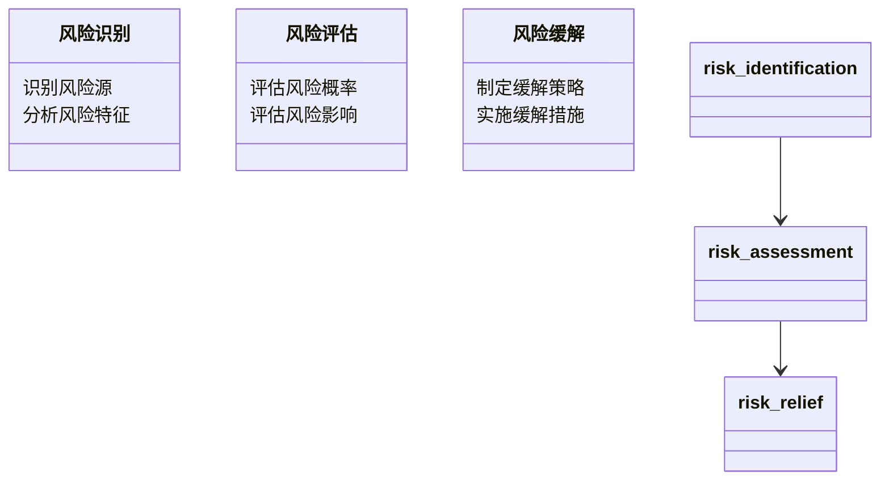
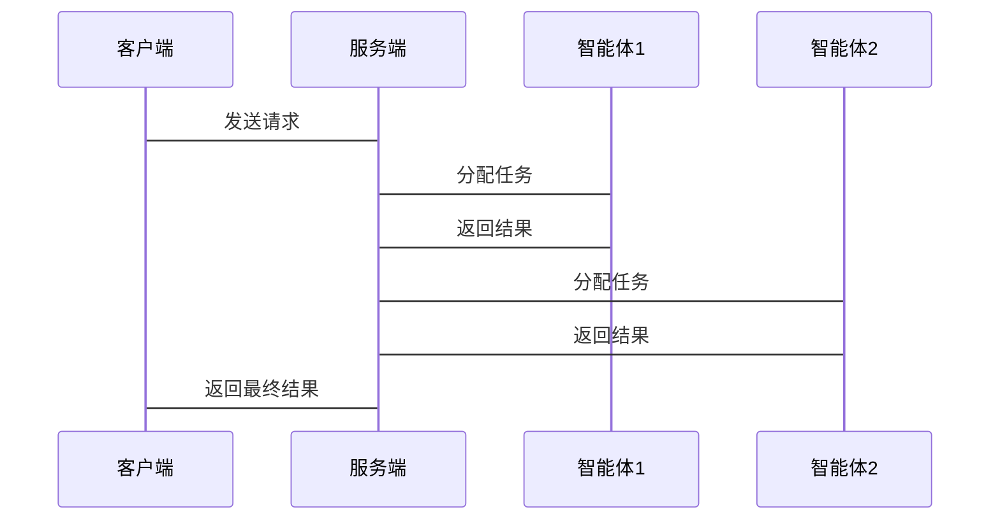

                 


---

# 多智能体协作进行系统性风险分析

> 关键词：多智能体协作、系统性风险、算法原理、系统架构、项目实战

> 摘要：本文深入探讨了多智能体协作在系统性风险分析中的应用，结合实际案例和理论分析，详细讲解了多智能体协作的核心概念、算法原理、系统架构设计以及项目实战，为读者提供全面的技术指导。

---

## 第一部分: 系统性风险与多智能体协作概述

### 第1章: 系统性风险的定义与特征

#### 1.1 系统性风险的定义
系统性风险是指在整个系统中普遍存在的、可能引发连锁反应的潜在风险。与局部风险不同，系统性风险会影响整个系统的稳定性，可能导致系统性危机。

#### 1.2 系统性风险的核心特征
系统性风险具有以下核心特征：
1. **广泛性**：影响整个系统，而非单一组成部分。
2. **关联性**：系统中的各个部分相互关联，风险可能在不同部分之间传播。
3. **不可预见性**：系统性风险往往难以提前预测，因为其复杂性和不确定性。

#### 1.3 系统性风险的分类与影响
系统性风险可以分为金融风险、经济风险、社会风险等类别。其影响通常表现为系统的崩溃、功能失效或长期不稳定。

### 第2章: 多智能体协作的定义与优势

#### 2.1 多智能体协作的定义
多智能体协作是指多个智能体通过协作行为共同完成任务的过程。智能体可以是软件程序、算法或实体设备，它们通过分布式计算和通信技术实现协作。

#### 2.2 多智能体协作的核心优势
多智能体协作具有以下优势：
1. **分布式计算**：智能体可以在不同节点上独立计算，提高系统的并行处理能力。
2. **自主性**：每个智能体都可以自主决策，减少对中央控制的依赖。
3. **适应性**：智能体能够根据环境变化动态调整协作策略。

#### 2.3 多智能体协作的应用场景
多智能体协作广泛应用于金融风险控制、网络安全、交通管理等领域。例如，在金融领域，多个智能体可以实时监控市场数据，预测潜在的系统性风险。

### 第3章: 系统性风险分析的背景与意义

#### 3.1 系统性风险分析的背景
随着全球化和信息化的快速发展，系统性风险的复杂性和影响力显著增加。例如，2008年的全球金融危机就是一个典型的系统性风险案例。

#### 3.2 系统性风险分析的重要性
系统性风险分析是保障系统稳定运行的关键环节。通过分析系统性风险，可以提前采取措施，降低风险发生的概率和影响。

#### 3.3 多智能体协作在系统性风险分析中的作用
多智能体协作能够通过分布式计算和信息共享，提高系统性风险分析的效率和准确性。多个智能体可以同时监控不同的风险源，及时发现潜在问题。

---

## 第二部分: 多智能体协作的核心概念与联系

### 第4章: 多智能体协作的核心概念

#### 4.1 多智能体系统的基本构成
多智能体系统由多个智能体、通信机制和协作规则组成。智能体之间通过通信机制共享信息，协作规则则规范它们的行为。

#### 4.2 协作行为的定义与分类
协作行为是指智能体之间通过合作完成特定任务的行为。根据协作方式的不同，可以将协作行为分为同步协作和异步协作。

#### 4.3 协作目标的设定与实现
协作目标是多智能体协作的核心，通常包括任务完成、资源优化和风险控制等。通过设定明确的目标，智能体可以高效协作。

### 第5章: 系统性风险分析的核心原理

#### 5.1 系统性风险分析的基本原理
系统性风险分析通过建立数学模型，量化风险的影响程度和传播路径。常用的方法包括概率论和网络分析。

#### 5.2 系统性风险分析的数学模型
系统性风险分析的数学模型通常包括风险概率、风险影响和风险传播路径等参数。例如，联合概率分布模型可以用于评估多个风险源的综合影响。

#### 5.3 风险传播与扩散机制
系统性风险可能通过网络传播，影响整个系统。例如，在金融系统中，一家机构的失败可能导致连锁反应，引发系统性危机。

### 第6章: 多智能体协作与系统性风险分析的联系

#### 6.1 多智能体协作在风险识别中的应用
多智能体协作可以通过分布式计算，实时监控多个风险源，识别潜在的系统性风险。

#### 6.2 多智能体协作在风险评估中的作用
通过多智能体协作，可以实现风险的动态评估，及时调整风险缓解策略。

#### 6.3 协作机制对系统性风险控制的影响
协作机制能够优化风险应对策略，减少系统性风险的发生概率和影响。

---

## 第三部分: 多智能体协作的算法原理

### 第7章: 多智能体协作的基本算法

#### 7.1 分布式计算算法
分布式计算算法是多智能体协作的基础，通过将任务分解到多个节点上并行计算，提高计算效率。

#### 7.2 协商算法
协商算法用于智能体之间的通信与协作。通过协商，智能体可以分配任务和资源，确保协作目标的实现。

#### 7.3 共识算法
共识算法用于多个智能体达成一致意见，例如区块链中的共识机制。

### 第8章: 系统性风险分析的数学模型

#### 8.1 风险评估的联合概率分布
联合概率分布模型可以用于评估多个风险源的综合影响。例如，$$P(A \cap B) = P(A|B) \times P(B)$$

#### 8.2 风险传播的网络模型
风险传播可以通过网络模型进行分析，例如$$P(A \rightarrow B) = \frac{P(A)}{P(B)}$$

#### 8.3 风险缓解的优化模型
优化模型用于制定风险缓解策略，例如最小化风险影响的数学模型。

### 第9章: 算法实现与案例分析

#### 9.1 分布式计算算法的实现
以下是一个简单的分布式计算示例：

```python
import threading

def distributed_calculate(node_id, task):
    print(f"Node {node_id} processing task {task}")

nodes = [1, 2, 3]
tasks = [1, 2, 3]

for node in nodes:
    thread = threading.Thread(target=distributed_calculate, args=(node, tasks[nodes.index(node)]))
    thread.start()
```

#### 9.2 协商算法的实现
以下是一个简单的协商算法示例：

```python
def协商过程：
    while True:
        发送请求
        接收反馈
        根据反馈调整策略
```

---

## 第四部分: 系统分析与架构设计

### 第10章: 问题场景介绍

#### 10.1 项目介绍
本项目旨在通过多智能体协作，实现对金融市场的系统性风险分析。

#### 10.2 系统功能设计
系统功能包括风险识别、风险评估和风险缓解三个模块。

#### 10.3 领域模型设计
领域模型设计如图：



### 第11章: 系统架构设计

#### 11.1 系统架构设计
系统架构设计如图：


#### 11.2 系统接口设计
系统接口包括数据接口、计算接口和通信接口。

#### 11.3 系统交互设计
系统交互如图：



---

## 第五部分: 项目实战

### 第12章: 环境安装

#### 12.1 环境要求
需要安装Python、Mermaid、Docker等工具。

#### 12.2 安装步骤
1. 安装Python：```bash
sudo apt-get install python3
```
2. 安装Mermaid：```bash
npm install -g mermaid-cli
```

### 第13章: 核心代码实现

#### 13.1 风险识别模块
以下是一个简单的风险识别模块代码：

```python
def identify_risk(data):
    if data['value'] > threshold:
        return True
    else:
        return False
```

#### 13.2 风险评估模块
风险评估模块代码：

```python
def assess_risk(identified_risks):
    total_risk = sum(identified_risks)
    return total_risk
```

### 第14章: 案例分析

#### 14.1 案例背景
以2008年金融危机为例，分析系统性风险。

#### 14.2 案例分析
通过多智能体协作，识别金融市场的多个风险源，并评估其综合影响。

### 第15章: 项目小结

#### 15.1 项目总结
本项目通过多智能体协作，实现了对系统性风险的高效分析。

#### 15.2 经验总结
在实际应用中，需要注意智能体之间的通信效率和协作策略的优化。

---

## 第六部分: 最佳实践

### 第16章: 最佳实践 tips

#### 16.1 学习 tips
建议读者多学习分布式计算和协作算法的基础知识。

#### 16.2 实践 tips
在实际项目中，需要根据具体需求选择合适的协作算法。

### 第17章: 小结

通过本文的学习，读者可以掌握多智能体协作在系统性风险分析中的应用方法。

### 第18章: 注意事项

在实际应用中，需要注意系统的稳定性和智能体之间的通信效率。

### 第19章: 拓展阅读

建议读者进一步学习多智能体协作和系统性风险分析的相关文献。

---

以上就是《多智能体协作进行系统性风险分析》的完整目录大纲，按照上述结构撰写文章，可以确保内容全面、逻辑清晰，满足读者的需求。

