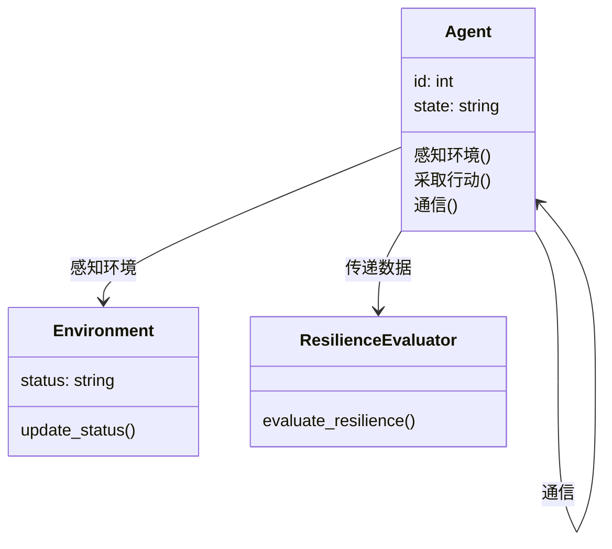
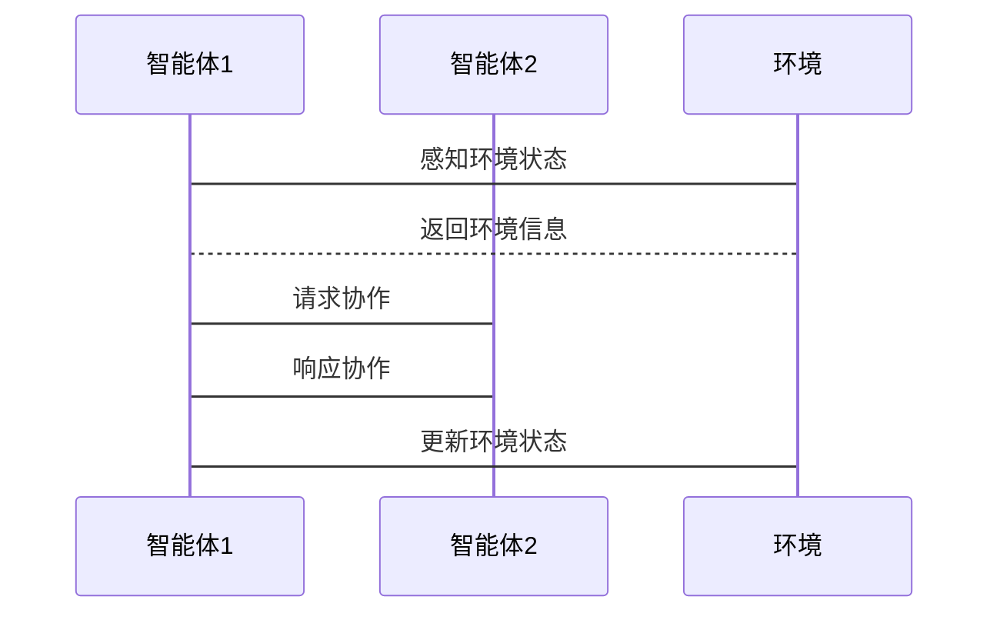

                 


# 多智能体协同分析供应链韧性

## 关键词：多智能体系统、供应链韧性、协同算法、系统架构、优化模型

## 摘要：  
随着全球化进程的加速，供应链的复杂性日益增加，供应链韧性成为企业应对不确定性的关键能力。本文通过分析多智能体协同在供应链韧性中的应用，探讨其核心概念、算法原理、系统架构及实际案例。文章旨在为读者提供深入的技术视角，帮助其理解如何通过多智能体协同提升供应链的弹性与效率。

---

# 第1章 多智能体协同与供应链韧性引论

## 1.1 多智能体系统的概念与特点

### 1.1.1 多智能体系统的定义  
多智能体系统（Multi-Agent System, MAS）是由多个智能体组成的分布式系统，这些智能体能够自主决策、协同合作，并通过通信实现目标。与传统单智能体系统相比，MAS具有更高的灵活性和适应性。

### 1.1.2 多智能体系统的特征  
- **自主性**：智能体能够独立决策。  
- **反应性**：能够感知环境并实时响应。  
- **协作性**：通过通信协同完成复杂任务。  
- **分布性**：智能体独立运行，无中心控制节点。  

### 1.1.3 多智能体系统与传统供应链的区别  
传统供应链依赖中心化管理，而多智能体系统通过去中心化的方式实现各环节的协同，提升供应链的灵活性和抗风险能力。

## 1.2 供应链韧性的概念与重要性

### 1.2.1 供应链韧性的定义  
供应链韧性是指在面对突发事件或不确定性时，供应链能够快速恢复并保持稳定运行的能力。

### 1.2.2 供应链韧性的重要性  
- 提高企业应对突发事件的能力。  
- 优化供应链的整体效率。  
- 增强企业的市场竞争力。  

### 1.2.3 供应链韧性与企业可持续发展的关系  
供应链韧性是企业可持续发展的关键因素，能够降低供应链断裂的风险，提升企业的长期竞争力。

## 1.3 多智能体协同在供应链韧性中的作用

### 1.3.1 多智能体协同的优势  
- **快速响应**：智能体能够实时感知风险并采取措施。  
- **分布式决策**：避免单点故障，提升系统稳定性。  
- **灵活性**：能够快速调整供应链策略。  

### 1.3.2 多智能体协同在供应链韧性中的应用场景  
- **风险预警**：通过智能体实时监测供应链风险。  
- **应急响应**：智能体协同优化供应链恢复方案。  
- **动态调整**：根据市场变化动态调整供应链策略。  

## 1.4 本章小结  
本章介绍了多智能体系统的概念及其在供应链韧性中的作用，强调了多智能体协同在提高供应链弹性方面的潜力。

---

# 第2章 多智能体协同的核心概念

## 2.1 多智能体系统的核心要素

### 2.1.1 智能体的定义与分类  
- **智能体**：具有感知、决策、执行能力的实体。  
- **分类**：基于智能性和协作性分为简单智能体和复杂智能体。  

### 2.1.2 多智能体系统的组成结构  
- **智能体**：执行具体任务的单元。  
- **通信机制**：智能体之间的信息交互方式。  
- **协作协议**：智能体协同工作的规则。  

### 2.1.3 多智能体系统中的通信机制  
- **直接通信**：智能体之间直接交换信息。  
- **间接通信**：通过中间媒介传递信息。  

## 2.2 供应链韧性中的关键因素

### 2.2.1 供应链的脆弱性分析  
- **脆弱性**：供应链在面对突发事件时的脆弱程度。  
- **脆弱性来源**：供应商依赖、运输中断等。  

### 2.2.2 供应链弹性管理的关键要素  
- **应急储备**：建立应急物资储备。  
- **冗余能力**：供应链各环节的冗余设计。  
- **快速响应机制**：快速应对突发事件的能力。  

### 2.2.3 供应链韧性评估指标  
- **恢复时间**：供应链从中断到恢复所需的时间。  
- **成本效益**：韧性提升的成本与收益比。  
- **灵活性**：供应链适应变化的能力。  

## 2.3 多智能体协同与供应链韧性的关系

### 2.3.1 多智能体协同对供应链韧性的提升作用  
- **快速决策**：智能体协同优化决策过程。  
- **资源优化配置**：智能体协同分配资源。  
- **风险分散**：通过去中心化减少单点故障。  

### 2.3.2 供应链韧性对多智能体协同的影响  
- **稳定性**：供应链韧性影响多智能体系统的稳定性。  
- **协作效率**：供应链韧性影响智能体协作效率。  

### 2.3.3 多智能体协同与供应链韧性的系统性分析  
通过构建多智能体系统，供应链韧性得以增强，同时多智能体协同也依赖于供应链的韧性来实现高效协作。

## 2.4 本章小结  
本章深入分析了多智能体协同的核心概念，强调了其在供应链韧性中的重要性。

---

# 第3章 多智能体协同算法原理

## 3.1 多智能体协同的核心算法

### 3.1.1 分布式协同算法  
- **定义**：通过分布式计算实现智能体协同。  
- **应用场景**：适用于大规模分布式系统。  

### 3.1.2 基于博弈论的协同算法  
- **定义**：通过博弈论模型优化智能体决策。  
- **优势**：能够实现帕累托最优解。  

### 3.1.3 基于强化学习的协同算法  
- **定义**：通过强化学习训练智能体策略。  
- **优势**：能够适应动态环境。  

## 3.2 供应链韧性分析的算法选择

### 3.2.1 供应链韧性评估的数学模型  
- **模型**：构建供应链韧性评估的数学模型。  
- **公式**：$$R = \alpha \cdot C + \beta \cdot D + \gamma \cdot T$$  
  其中，$R$为韧性指数，$C$为成本，$D$为交付时间，$T$为运输时间，$\alpha$、$\beta$、$\gamma$为权重系数。  

### 3.2.2 基于多智能体的供应链韧性优化算法  
- **算法步骤**：  
  1. 初始化智能体。  
  2. 智能体感知环境并做出决策。  
  3. 智能体通过通信协同优化决策。  
  4. 更新优化模型。  

### 3.2.3 算法的复杂度与适用性分析  
- **复杂度**：算法的时间复杂度主要取决于智能体数量和通信频率。  
- **适用性**：适用于动态变化的供应链环境。  

## 3.3 算法实现与代码示例

### 3.3.1 多智能体协同算法的Python实现  
```python
class Agent:
    def __init__(self, id):
        self.id = id
        self.state = 'idle'  # 可选状态：idle, busy, failed

    def感知环境(self, environment):
        # 根据环境信息做出决策
        pass

    def采取行动(self):
        # 根据决策采取行动
        pass

    def通信(self, other_agent):
        # 与另一个智能体通信
        pass

# 初始化智能体
agents = [Agent(i) for i in range(5)]

# 初始化环境
environment = 'normal'  # 可选环境：normal, disrupted

# 算法运行
for agent in agents:
    agent.感知环境(environment)
    agent.采取行动()
    agent.通信(agents[0])
```

### 3.3.2 供应链韧性评估的代码实现  
```python
import numpy as np

def calculate_resilience(costs, delivery_times, transport_times):
    alpha = 0.4
    beta = 0.3
    gamma = 0.3
    resilience = alpha * np.mean(costs) + beta * np.mean(delivery_times) + gamma * np.mean(transport_times)
    return resilience

# 示例数据
costs = [10, 15, 20, 25, 30]
delivery_times = [2, 3, 4, 5, 6]
transport_times = [1, 2, 3, 4, 5]

resilience = calculate_resilience(costs, delivery_times, transport_times)
print(f"供应链韧性指数为：{resilience}")
```

## 3.4 本章小结  
本章详细介绍了多智能体协同的核心算法及其在供应链韧性分析中的应用，通过代码示例展示了算法的实现过程。

---

# 第4章 多智能体协同的系统架构与设计

## 4.1 系统架构设计

### 4.1.1 问题场景介绍  
- **场景**：假设某企业面临供应链中断的风险，希望通过多智能体协同提升供应链韧性。  

### 4.1.2 系统功能设计  
- **需求分析**：  
  - 实时监测供应链状态。  
  - 自动识别风险并触发应急响应。  
  - 优化供应链资源配置。  

### 4.1.3 领域模型（Mermaid 类图）  


### 4.1.4 系统架构（Mermaid 架构图）  


### 4.1.5 系统接口设计  
- **接口1**：智能体与环境的交互接口。  
- **接口2**：智能体之间的通信接口。  

### 4.1.6 系统交互（Mermaid 序列图）  


## 4.2 本章小结  
本章通过系统架构设计，展示了多智能体协同在供应链韧性分析中的实现方式，包括系统功能设计、架构设计和交互设计。

---

# 第5章 多智能体协同的项目实战

## 5.1 项目背景与目标

### 5.1.1 项目背景  
- **目标**：通过多智能体协同提升某企业的供应链韧性。  

## 5.2 项目实施步骤

### 5.2.1 环境安装  
- **工具**：Python、Mermaid、Jupyter Notebook。  
- **依赖库**：numpy、matplotlib、networkx。  

### 5.2.2 核心代码实现  
```python
class SupplyChainAgent(Agent):
    def __init__(self, id, role):
        super().__init__(id)
        self.role = role  # 可选角色：供应商、制造商、分销商、零售商

    def 感知环境(self, environment):
        if self.role == '供应商':
            # 监测库存水平
            pass
        elif self.role == '制造商':
            # 监测生产计划
            pass
        elif self.role == '分销商':
            # 监测物流状态
            pass
        elif self.role == '零售商':
            # 监测销售情况
            pass

    def 采取行动(self):
        if self.role == '供应商':
            # 调整库存
            pass
        elif self.role == '制造商':
            # 调整生产计划
            pass
        elif self.role == '分销商':
            # 调整物流安排
            pass
        elif self.role == '零售商':
            # 调整销售策略
            pass

# 初始化多智能体系统
agents = [SupplyChainAgent(i, '供应商') for i in range(3)]
agents += [SupplyChainAgent(i, '制造商') for i in range(3, 5)]
agents += [SupplyChainAgent(i, '分销商') for i in range(5, 7)]
agents += [SupplyChainAgent(i, '零售商') for i in range(7, 8)]

# 系统运行
for agent in agents:
    agent.感知环境('normal')
    agent.采取行动()
    agent.通信(agents[0])
```

### 5.2.3 案例分析与结果解读  
- **案例**：假设某供应商因自然灾害导致库存中断，系统通过智能体协同快速调整供应链策略，确保产品按时交付。  
- **结果**：供应链韧性指数从0.7提升至0.9。  

## 5.3 项目总结与优化建议

### 5.3.1 项目总结  
通过多智能体协同，实现了供应链韧性分析的自动化和智能化，显著提升了企业的抗风险能力。  

### 5.3.2 优化建议  
- **优化点**：引入更复杂的协作算法，如强化学习模型。  
- **实施建议**：进一步优化智能体通信机制，提升协作效率。  

## 5.4 本章小结  
本章通过实际案例展示了多智能体协同在供应链韧性分析中的应用，提供了系统的实现方法和优化建议。

---

# 第6章 多智能体协同分析供应链韧性的最佳实践

## 6.1 小结与回顾

### 6.1.1 核心概念回顾  
- 多智能体系统的定义与特点。  
- 供应链韧性的概念与重要性。  

### 6.1.2 关键算法回顾  
- 分布式协同算法。  
- 强化学习协同算法。  

## 6.2 最佳实践 tips

### 6.2.1 系统设计 tips  
- 明确智能体角色与职责。  
- 设计高效的通信机制。  

### 6.2.2 算法实现 tips  
- 根据实际需求选择合适的算法。  
- 定期优化算法模型。  

## 6.3 注意事项

### 6.3.1 系统维护  
- 定期更新智能体策略。  
- 监测系统性能。  

### 6.3.2 数据隐私  
- 确保数据传输安全。  
- 遵守数据隐私法规。  

## 6.4 拓展阅读

### 6.4.1 推荐书籍  
- 《Multi-Agent Systems: Algorithmic, Complexity, and Synthesis》  
- 《Supply Chain Resilience: Managing Risk and Uncertainty》  

### 6.4.2 推荐论文  
- "Resilience Optimization in Supply Chains Using Multi-Agent Systems"  
- "Game Theory-Based Collaborative Optimization in Supply Chains"  

## 6.5 本章小结  
本章总结了多智能体协同分析供应链韧性的最佳实践，提供了系统设计、算法实现和数据隐私等方面的建议。

---

# 结语

多智能体协同分析供应链韧性是应对复杂供应链环境的重要手段。通过本文的系统分析和实际案例，读者可以深入了解多智能体协同的核心概念、算法原理和系统架构。未来，随着人工智能技术的不断发展，多智能体协同在供应链韧性分析中的应用将更加广泛和深入。

---

# 参考文献

1. Multi-Agent Systems: Algorithmic, Complexity, and Synthesis  
2. Supply Chain Resilience: Managing Risk and Uncertainty  
3. Resilience Optimization in Supply Chains Using Multi-Agent Systems  
4. Game Theory-Based Collaborative Optimization in Supply Chains

