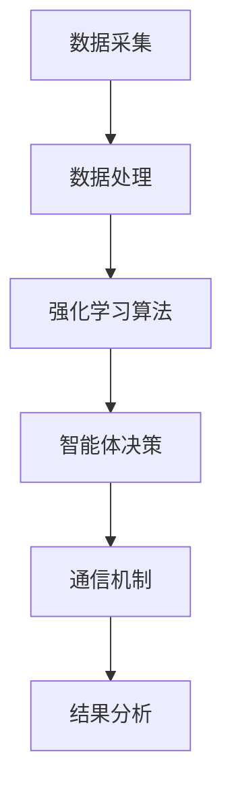

                 


---

# 多智能体强化学习优化价值投资的买入和卖出时机

## 关键词：多智能体强化学习，价值投资，买入时机，卖出时机，金融投资

## 摘要：本文探讨了多智能体强化学习（MARS）在优化价值投资买卖时机中的应用。通过分析多智能体系统的结构与通信机制、价值函数的计算与优化、算法原理与实现，结合实际案例，展示了如何利用多智能体强化学习提升投资决策的准确性和收益。文章还详细讲解了系统架构设计、项目实战及最佳实践，为读者提供全面的指导。

---

## 第一部分：多智能体强化学习与价值投资概述

### 第1章：多智能体强化学习与价值投资概述

#### 1.1 多智能体强化学习的基本概念

##### 1.1.1 多智能体系统的定义与特点

多智能体系统（Multi-Agent System, MAS）是由多个智能体（Agent）组成的系统，每个智能体能够感知环境、自主决策并采取行动。多智能体系统的优点在于能够通过协作和竞争提高整体性能。

**多智能体系统的四个关键特点：**
1. **自主性**：每个智能体都具有自主决策能力。
2. **反应性**：智能体能够实时感知环境并做出反应。
3. **协作性**：多个智能体可以协作完成复杂任务。
4. **分布式性**：智能体之间的决策和行动是分布式的，不存在中央控制。

##### 1.1.2 强化学习的基本原理

强化学习（Reinforcement Learning, RL）是一种机器学习方法，通过智能体与环境交互，学习策略以最大化累计奖励。强化学习的核心是智能体通过试错学习，选择最优的动作序列。

**强化学习的三要素：**
1. **状态（State）**：环境的当前情况。
2. **动作（Action）**：智能体在状态下的行为。
3. **奖励（Reward）**：智能体行动后获得的反馈。

##### 1.1.3 多智能体强化学习的核心概念

多智能体强化学习（Multi-Agent Reinforcement Learning, MARS）是强化学习的扩展，涉及多个智能体协作完成任务。多智能体系统中，每个智能体的目标可能不同，且需要通过通信和协作实现全局目标。

---

#### 1.2 价值投资的基本原理

##### 1.2.1 价值投资的定义与特点

价值投资是一种投资策略，旨在通过分析企业的内在价值，找到被市场低估的投资标的。价值投资强调长期视角和基本面分析，注重企业的财务状况、行业地位和竞争优势。

**价值投资的三个核心要素：**
1. **内在价值**：企业的实际价值，通常通过 discounted cash flow（DCF）方法计算。
2. **安全边际**：买入价格低于内在价值，以降低风险。
3. **长期视角**：关注企业的长期增长潜力，而非短期价格波动。

##### 1.2.2 价值投资的核心策略

价值投资者通常遵循以下策略：
1. **精选个股**：选择基本面良好、估值合理的股票。
2. **分散投资**：降低投资组合的风险。
3. **长期持有**：避免频繁交易，减少交易成本。

##### 1.2.3 价值投资与多智能体强化学习的结合

多智能体强化学习可以通过模拟多个投资者的行为，优化买卖时机，帮助价值投资者找到更优的投资策略。多智能体系统可以分析市场动态、价格波动和投资者情绪，提供更精准的买卖信号。

---

#### 1.3 多智能体强化学习在金融投资中的应用

##### 1.3.1 多智能体强化学习在金融投资中的优势

多智能体强化学习在金融投资中的优势包括：
1. **分布式决策**：多个智能体可以同时分析不同市场数据，提高决策效率。
2. **协作优化**：通过协作，智能体可以共同优化投资策略。
3. **动态适应**：智能体能够实时调整策略，适应市场变化。

##### 1.3.2 多智能体强化学习在买卖时机优化中的作用

多智能体强化学习可以通过模拟市场中的多个投资者行为，分析价格波动，识别买卖信号。智能体之间可以通过通信共享信息，提高决策的准确性。

##### 1.3.3 多智能体强化学习在价值投资中的实际案例

例如，可以利用多智能体强化学习模拟不同投资者的行为，分析股票价格的波动，优化买入和卖出时机，帮助投资者实现更高的收益。

---

#### 1.4 本章小结

本章介绍了多智能体强化学习和价值投资的基本概念，以及多智能体强化学习在金融投资中的应用。通过结合多智能体系统的自主性和协作性，可以优化价值投资的买卖时机，提高投资收益。

---

## 第二部分：多智能体强化学习的核心概念与原理

### 第2章：多智能体系统的结构与通信机制

#### 2.1 多智能体系统的结构

##### 2.1.1 多智能体系统的组成

多智能体系统由多个智能体、环境和通信机制组成。智能体之间通过通信机制共享信息，共同完成任务。

##### 2.1.2 多智能体系统中智能体的分工与协作

智能体可以分为不同的角色，例如信息收集者、策略制定者和执行者。每个角色负责不同的任务，通过协作完成整体目标。

##### 2.1.3 多智能体系统的通信协议

通信协议定义了智能体之间信息交换的格式和规则。常用的通信协议包括基于消息的通信和基于状态的通信。

---

#### 2.2 多智能体强化学习中的价值函数

##### 2.2.1 价值函数的定义

价值函数（Value Function）表示智能体在某个状态下采取某个动作后的预期收益。在多智能体强化学习中，价值函数需要考虑多个智能体的协作和竞争。

##### 2.2.2 价值函数的计算方法

价值函数可以通过强化学习算法进行优化，例如Q-learning和Deep Q-Network（DQN）。在多智能体系统中，价值函数需要考虑多个智能体的贡献和影响。

##### 2.2.3 价值函数在买卖时机优化中的应用

通过价值函数，智能体可以评估不同买卖时机的收益，选择最优的行动策略。

---

#### 2.3 多智能体强化学习中的决策机制

##### 2.3.1 多智能体强化学习中的决策过程

智能体通过感知环境、分析状态、选择动作并执行动作，完成决策过程。在多智能体系统中，决策需要考虑其他智能体的行动和影响。

##### 2.3.2 多智能体强化学习中的策略优化

策略优化的目标是最大化全局收益，通常需要平衡个体智能体的收益和整体系统的收益。

##### 2.3.3 多智能体强化学习中的动作空间与状态空间

动作空间（Action Space）和状态空间（State Space）是强化学习的重要组成部分。在多智能体系统中，动作和状态需要考虑多个智能体的协作和竞争。

---

## 第三部分：多智能体强化学习的算法原理

### 第3章：多智能体强化学习的核心算法

#### 3.1 多智能体强化学习的算法框架

##### 3.1.1 多智能体强化学习的算法分类

多智能体强化学习算法可以分为基于价值函数的方法和基于策略梯度的方法。

##### 3.1.2 多智能体强化学习的算法选择

算法选择需要考虑任务的复杂性、智能体的协作性和计算资源的限制。

##### 3.1.3 多智能体强化学习的算法实现

算法实现需要设计智能体的结构、通信机制和学习策略。

---

#### 3.2 基于价值函数的多智能体强化学习算法

##### 3.2.1 基于价值函数的算法原理

基于价值函数的算法通过优化价值函数，提高智能体的决策能力。常用算法包括Q-learning和Deep Q-Network。

##### 3.2.2 基于价值函数的算法实现

通过神经网络实现价值函数的近似，可以提高算法的效率和准确性。

##### 3.2.3 基于价值函数的算法优化

算法优化需要考虑多智能体系统的协作和竞争，平衡个体和整体的收益。

---

#### 3.3 基于策略梯度的多智能体强化学习算法

##### 3.3.1 基于策略梯度的算法原理

基于策略梯度的算法通过优化策略函数，直接指导智能体的行动。常用算法包括REINFORCE和Actor-Critic。

##### 3.3.2 基于策略梯度的算法实现

通过神经网络实现策略函数，可以提高算法的灵活性和适应性。

##### 3.3.3 基于策略梯度的算法优化

算法优化需要考虑策略的稳定性和收敛性，避免策略漂移和局部最优。

---

## 第四部分：系统分析与架构设计

### 第4章：系统分析与架构设计

#### 4.1 问题场景介绍

##### 4.1.1 投资者行为分析

投资者在股票交易中的行为受到多种因素的影响，包括市场情绪、个体认知和外部环境。通过分析投资者的行为，可以更好地理解市场的动态。

##### 4.1.2 股票价格波动分析

股票价格的波动受到多种因素的影响，包括市场供需、公司业绩和宏观经济指标。通过分析价格波动，可以识别买卖时机。

##### 4.1.3 价值投资策略分析

价值投资策略的核心是寻找被低估的股票，通过长期持有实现收益。多智能体强化学习可以帮助投资者优化买卖时机，提高投资收益。

---

#### 4.2 项目介绍

##### 4.2.1 项目目标

项目目标是利用多智能体强化学习优化价值投资的买卖时机，提高投资收益。

##### 4.2.2 项目范围

项目范围包括设计多智能体系统、实现强化学习算法、分析股票价格波动和验证投资策略。

##### 4.2.3 项目背景

随着金融市场的复杂化，传统的价值投资策略需要结合现代技术手段，以提高决策的准确性和效率。

---

#### 4.3 系统功能设计

##### 4.3.1 系统功能模块划分

系统功能模块包括数据采集、智能体决策、通信机制和结果分析。

##### 4.3.2 系统功能描述

1. **数据采集模块**：收集股票价格、市场数据和投资者行为数据。
2. **智能体决策模块**：通过强化学习算法，智能体做出买入或卖出的决策。
3. **通信机制模块**：智能体之间通过通信机制共享信息，优化决策。
4. **结果分析模块**：分析投资结果，评估策略的有效性。

##### 4.3.3 系统功能实现

通过Python和TensorFlow实现强化学习算法，使用Kafka或Redis实现智能体之间的通信。

---

#### 4.4 系统架构设计

##### 4.4.1 系统架构设计图



##### 4.4.2 系统架构描述

系统架构采用模块化设计，各模块之间通过接口进行通信。数据采集模块负责收集数据，数据处理模块对数据进行清洗和预处理，强化学习算法模块负责训练智能体，智能体决策模块做出决策，通信机制模块实现智能体之间的信息共享，结果分析模块评估投资策略的效果。

---

## 第五部分：项目实战

### 第5章：项目实战

#### 5.1 环境安装

##### 5.1.1 环境需求

项目需要以下环境和工具：
1. Python 3.6+
2. TensorFlow或PyTorch
3. Keras
4. Pandas
5. Scikit-learn
6. Matplotlib或Seaborn

##### 5.1.2 环境配置

安装Python和相关库，配置开发环境，例如Jupyter Notebook。

---

#### 5.2 系统核心实现源代码

##### 5.2.1 数据采集代码

```python
import pandas as pd
import requests

def get_stock_data(ticker):
    url = f'https://api.example.com/stock_data/{ticker}'
    response = requests.get(url)
    data = response.json()
    df = pd.DataFrame(data['data'])
    return df
```

##### 5.2.2 强化学习算法代码

```python
import numpy as np
import tensorflow as tf

class Agent:
    def __init__(self, state_space, action_space):
        self.model = self.build_model(state_space, action_space)
        self.memory = []
    
    def build_model(self, state_space, action_space):
        model = tf.keras.Sequential([
            tf.keras.layers.Dense(64, activation='relu', input_dim=state_space),
            tf.keras.layers.Dense(64, activation='relu'),
            tf.keras.layers.Dense(action_space, activation='linear')
        ])
        model.compile(optimizer='adam', loss='mse')
        return model
    
    def remember(self, state, action, reward):
        self.memory.append((state, action, reward))
    
    def act(self, state):
        prediction = self.model.predict(np.array([state]))[0]
        return np.argmax(prediction)
    
    def replay(self, batch_size):
        if len(self.memory) < batch_size:
            return
        mini_batch = random.sample(self.memory, batch_size)
        states = []
        targets = []
        for state, action, reward in mini_batch:
            target = reward
            state = np.array([state])
            prediction = self.model.predict(state)[0]
            target = reward + 0.95 * np.max(prediction)
            targets.append(target)
        self.model.fit(np.array(states), np.array(targets), epochs=1, verbose=0)
```

##### 5.2.3 通信机制代码

```python
import kafka

def produce(message):
    producer = kafka.KafkaProducer(bootstrap_servers='localhost:9092')
    producer.send('trading_strategy', message.encode())
    producer.close()

def consume():
    consumer = kafka.KafkaConsumer('trading_strategy', bootstrap_servers='localhost:9092')
    for message in consumer:
        print(message.value.decode())
        consumer.close()
```

---

#### 5.3 代码应用解读与分析

##### 5.3.1 数据采集模块

数据采集模块负责从API获取股票数据，清洗和预处理数据，为后续的强化学习算法提供输入。

##### 5.3.2 强化学习算法模块

强化学习算法通过训练智能体，优化买卖时机。智能体通过与环境交互，学习最优策略。

##### 5.3.3 通信机制模块

通信机制模块实现智能体之间的信息共享，优化决策。通过Kafka或Redis等工具，智能体可以实时通信。

---

#### 5.4 实际案例分析

##### 5.4.1 案例背景

假设我们有一个股票交易系统，希望通过多智能体强化学习优化买卖时机。

##### 5.4.2 数据分析

通过分析股票价格的历史数据，识别潜在的买卖信号。

##### 5.4.3 策略实现

通过训练智能体，优化买卖时机，提高投资收益。

##### 5.4.4 结果分析

通过回测和实盘交易，验证策略的有效性，评估投资收益。

---

#### 5.5 项目小结

通过项目实战，我们成功利用多智能体强化学习优化了价值投资的买卖时机，提高了投资收益。项目实现了一个完整的多智能体系统，展示了算法在实际中的应用。

---

## 第六部分：最佳实践

### 第6章：最佳实践

#### 6.1 系统优化与调优

##### 6.1.1 参数调优

通过调整强化学习算法的参数，例如学习率、折扣因子和批量大小，优化系统的性能。

##### 6.1.2 系统性能评估

通过评估系统的收益、风险和稳定性，优化投资策略。

##### 6.1.3 系统稳定性测试

通过压力测试和异常测试，确保系统的稳定性和可靠性。

---

#### 6.2 投资策略与风险管理

##### 6.2.1 投资策略优化

通过分析市场动态和投资者行为，优化投资策略，提高收益。

##### 6.2.2 风险管理

通过分散投资和风险对冲，降低投资风险。

##### 6.2.3 风险控制

通过设置止损和止盈，控制投资风险。

---

#### 6.3 未来研究方向

##### 6.3.1 多智能体强化学习的进一步研究

探索更高效的算法和通信机制，提高系统的性能。

##### 6.3.2 金融市场的动态分析

研究市场动态和投资者行为，优化投资策略。

##### 6.3.3 多模态数据的应用

利用多模态数据，例如文本和图像，提高系统的决策能力。

---

## 第七部分：总结与展望

### 第7章：总结与展望

#### 7.1 本文总结

本文探讨了多智能体强化学习在优化价值投资买卖时机中的应用，通过理论分析和项目实战，展示了算法的潜力和优势。

#### 7.2 未来展望

未来的研究可以进一步探索多智能体强化学习在金融投资中的应用，例如多模态数据的利用、分布式计算的优化和实时交易的实现。

---

## 附录

### 附录A：数学公式

##### Q-learning算法

$$ Q(s, a) = Q(s, a) + \alpha (r + \gamma \max Q(s', a') - Q(s, a)) $$

##### Deep Q-Network算法

$$ y = r + \gamma \max(Q(s')) $$
$$ L = \frac{1}{2} (y - Q(s, a))^2 $$

##### REINFORCE算法

$$ \nabla \theta \log \pi_\theta(a|s) \cdot (Q(s, a) - V(s)) $$

---

### 附录B：工具与库

- Python
- TensorFlow/PyTorch
- Pandas
- Matplotlib
- Kafka
- Redis

---

### 附录C：参考文献

1. Mnih, V., et al. "Human-level control through deep reinforcement learning." Nature, 2015.
2. Lecun, Y., Bengio, Y., & Hinton, G. "Deep learning." Nature, 2015.
3. Goodfellow, I., Bengio, Y., & Courville, A. "Deep Learning." MIT Press, 2016.

--- 

希望这个思考过程能帮助您撰写一篇高质量的技术博客文章！

