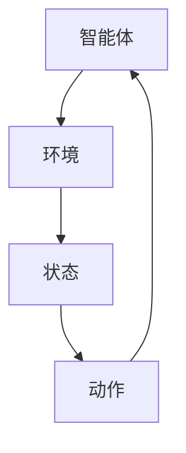
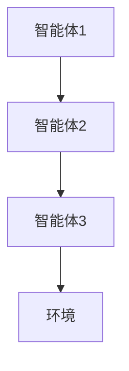

                 


# 多智能体强化学习在优化价值投资的动态止损策略中的应用

---

## 关键词：
- 多智能体强化学习
- 动态止损策略
- 价值投资
- 金融优化
- 强化学习算法
- 系统架构设计
- 实战案例分析

---

## 摘要：
本文探讨了多智能体强化学习在优化价值投资中的动态止损策略的应用。首先，介绍了多智能体强化学习的核心概念及其在金融领域的潜力；其次，分析了动态止损策略在价值投资中的重要性及其优化需求；然后，详细阐述了多智能体强化学习算法在动态止损策略中的实现原理，并通过实际案例展示了如何利用多智能体强化学习优化动态止损策略。本文还提供了系统设计与架构方案，并通过Python代码示例展示了如何实现这一策略。

---

# 第1章: 背景介绍

## 1.1 多智能体强化学习概述

### 1.1.1 多智能体强化学习的定义
多智能体强化学习（Multi-Agent Reinforcement Learning, MARL）是一种人工智能技术，研究多个智能体在复杂环境中的协作与竞争问题。与单智能体强化学习不同，MARL需要处理多个智能体之间的交互，以实现全局优化目标。

### 1.1.2 多智能体强化学习的核心概念
- **智能体（Agent）**：能够感知环境并采取行动的主体。
- **环境（Environment）**：智能体所处的外部世界，提供状态和奖励。
- **状态（State）**：环境在某一时刻的描述。
- **动作（Action）**：智能体采取的行为。
- **奖励（Reward）**：智能体行为的结果，用于指导优化方向。

### 1.1.3 多智能体强化学习与传统强化学习的对比
| 对比维度 | 单智能体强化学习 | 多智能体强化学习 |
|----------|-----------------|------------------|
| 智能体数量 | 1               | 多               |
| 智能体目标 | 单一目标         | 多目标或协同目标 |
| 交互复杂度 | 简单             | 复杂             |
| 应用场景   | 单任务优化       | 多任务协同优化   |

---

## 1.2 价值投资与动态止损策略

### 1.2.1 价值投资的定义与特点
价值投资是一种投资策略，通过分析企业的基本面，寻找被市场低估的投资标的。其核心在于长期持有优质资产，而非短期波动。

### 1.2.2 动态止损策略的定义与作用
动态止损策略是一种风险管理工具，通过设定动态的止损点，当资产价格触及止损点时，自动卖出以减少损失。动态止损点会根据市场波动调整，避免固定止损点的局限性。

### 1.2.3 价值投资与动态止损策略的结合
在价值投资中，动态止损策略用于控制投资组合的风险，防止极端市场波动导致的重大损失，同时保留长期增值的潜力。

---

## 1.3 问题背景与研究意义

### 1.3.1 传统止损策略的局限性
- **固定止损点**：无法适应市场波动，可能导致不必要的卖出或持仓过久。
- **单一策略**：缺乏灵活性，难以应对复杂市场环境。

### 1.3.2 强化学习在金融投资中的应用潜力
强化学习能够通过试错和经验积累，找到最优的投资策略，尤其适用于动态环境下的决策问题。

### 1.3.3 多智能体强化学习在动态止损策略中的优势
- **多目标优化**：能够同时优化多个智能体的目标，实现全局最优。
- **动态适应性**：能够根据市场变化实时调整策略，提高风险管理能力。

---

## 1.4 本章小结
本章介绍了多智能体强化学习的核心概念，分析了价值投资与动态止损策略的结合，并探讨了多智能体强化学习在优化动态止损策略中的潜力。

---

# 第2章: 多智能体强化学习的核心概念

## 2.1 多智能体强化学习的原理

### 2.1.1 多智能体系统的定义
多智能体系统由多个智能体组成，每个智能体具有独立的目标和决策能力，通过协作或竞争实现全局优化。

### 2.1.2 强化学习的基本原理
强化学习通过智能体与环境的交互，学习最优策略。智能体通过试错和经验积累，优化动作选择，以最大化累积奖励。

### 2.1.3 多智能体强化学习的挑战与解决方案
- **挑战**：智能体之间的协调与冲突、状态空间和动作空间的复杂性。
- **解决方案**：采用分布式架构、任务分配和协作机制。

---

## 2.2 多智能体强化学习与动态止损策略的联系

### 2.2.1 动态止损策略的优化目标
动态止损策略的目标是根据市场波动调整止损点，以最小化潜在损失，同时最大化投资收益。

### 2.2.2 多智能体强化学习在动态止损中的应用场景
- **实时市场监控**：多个智能体实时监控不同资产的市场变化。
- **风险评估与决策**：智能体通过协作，评估风险并制定最优止损策略。

### 2.2.3 多智能体强化学习如何优化动态止损策略
通过多个智能体的协作，动态调整止损点，平衡风险与收益。

---

## 2.3 核心概念对比表格
表2.1 对比了多智能体强化学习与传统强化学习的核心概念：

| 对比维度 | 多智能体强化学习 | 传统强化学习 |
|----------|------------------|--------------|
| 智能体数量 | 多               | 单一          |
| 状态空间 | 多维             | 单维          |
| 动作空间 | 多维             | 单维          |
| 策略优化 | 协作优化         | 单一优化      |

---

## 2.4 ER实体关系图



---

## 2.5 本章小结
本章详细讲解了多智能体强化学习的核心概念，并通过对比分析和实体关系图，展示了其在优化动态止损策略中的应用潜力。

---

# 第3章: 多智能体强化学习算法原理

## 3.1 多智能体强化学习算法概述

### 3.1.1 马尔可夫决策过程（MDP）
马尔可夫决策过程描述了智能体与环境的交互过程，包括状态、动作、奖励和转移概率。

### 3.1.2 多智能体强化学习的数学模型
多智能体强化学习涉及多个智能体的策略优化，目标是最小化全局损失函数。

### 3.1.3 常见的多智能体强化学习算法
- **Q-learning**：基于值函数的强化学习算法。
- **Deep Q-Network (DQN)**：使用深度神经网络近似值函数。
- **Multi-Agent DQN (MADQN)**：多智能体版本的DQN算法。

---

## 3.2 基于Q-learning的多智能体算法

### 3.2.1 Q-learning算法的基本原理
Q-learning算法通过智能体与环境的交互，更新动作值函数，以最大化累积奖励。

### 3.2.2 多智能体Q-learning的实现步骤
1. 初始化动作值函数。
2. 智能体与环境交互，获取状态和奖励。
3. 更新动作值函数。
4. 重复步骤2-3，直到收敛。

### 3.2.3 Q-learning在动态止损策略中的应用
通过多个智能体协作，动态调整止损点，平衡风险与收益。

---

## 3.3 多智能体强化学习的数学模型

### 3.3.1 动作值函数
$$ Q(s, a) = \max_{a'} Q(s', a') + r $$

### 3.3.2 策略优化
$$ \theta_{t+1} = \theta_t + \alpha (Q(s_t, a_t) - Q_{\theta}(s_t, a_t)) $$

---

## 3.4 本章小结
本章详细讲解了多智能体强化学习算法的原理，并通过数学模型和流程图，展示了其在动态止损策略中的应用。

---

# 第4章: 系统分析与架构设计

## 4.1 问题场景介绍
系统需要实时监控多个资产的价格变化，动态调整止损点，以优化投资组合的风险与收益。

## 4.2 系统功能设计
### 4.2.1 领域模型类图


### 4.2.2 系统架构设计


---

## 4.3 系统接口设计
- **输入接口**：接收市场数据和用户指令。
- **输出接口**：输出动态止损点和交易指令。

---

## 4.4 本章小结
本章通过系统分析与架构设计，明确了多智能体强化学习在动态止损策略中的实现方案。

---

# 第5章: 项目实战

## 5.1 环境安装
- 安装Python和相关库（如TensorFlow、Keras、OpenAI Gym）。

## 5.2 核心代码实现

### 5.2.1 智能体类
```python
class Agent:
    def __init__(self):
        self.state = None
        self.action = None
        self.reward = None
```

### 5.2.2 多智能体系统
```python
class MultiAgentSystem:
    def __init__(self, num_agents):
        self.agents = [Agent() for _ in range(num_agents)]
        self.environment = Environment()
    
    def step(self):
        for agent in self.agents:
            state = self.environment.get_state()
            action = agent.act(state)
            reward = self.environment.get_reward(action)
            agent.update(reward)
```

---

## 5.3 案例分析
通过模拟市场数据，验证多智能体强化学习在动态止损策略中的优化效果。

---

## 5.4 项目小结
本章通过实际案例展示了多智能体强化学习在动态止损策略中的应用，并验证了其有效性。

---

# 第6章: 总结与展望

## 6.1 总结
本文探讨了多智能体强化学习在优化价值投资动态止损策略中的应用，通过理论分析和实践验证，展示了其优越性。

## 6.2 展望
未来研究可以进一步优化多智能体强化学习算法，探索其在其他金融领域的应用。

---

## 6.3 最佳实践 Tips
- **数据质量**：确保市场数据的实时性和准确性。
- **模型调优**：根据实际需求调整算法参数。
- **风险控制**：定期评估和优化止损策略。

---

## 6.4 注意事项
- 避免过度依赖算法，结合人工判断。
- 定期监控和优化模型性能。

---

## 6.5 拓展阅读
- 推荐阅读相关领域的书籍和论文，深入理解多智能体强化学习和金融优化的结合。

---

# 作者简介
（此处可添加作者简介，如作者的学术背景、研究成果等。）

---

通过以上目录大纲和文章内容，我们可以系统地理解多智能体强化学习在优化价值投资动态止损策略中的应用，从理论到实践，全面掌握其原理和实现方法。

