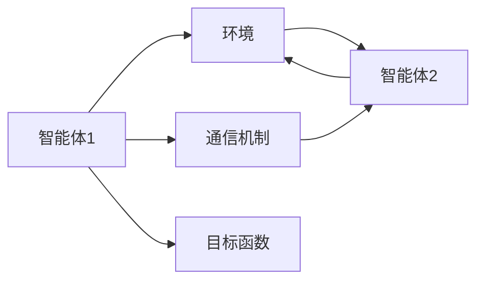

                 


# 多智能体强化学习在优化价值投资的择时策略中的应用

> 关键词：多智能体强化学习、价值投资、择时策略、数学模型、算法原理、系统设计

> 摘要：本文将探讨如何利用多智能体强化学习技术优化价值投资中的择时策略。通过分析多智能体强化学习的核心原理，结合价值投资中的数学模型，提出一种基于多智能体系统的择时策略优化方法。该方法通过构建多智能体系统，模拟市场中的多角色决策过程，从而实现对投资策略的动态优化。文章详细阐述了该方法的数学模型、算法实现、系统设计及实际应用案例，为投资者提供了一种全新的决策支持工具。

---

# 第1章: 多智能体强化学习与价值投资背景

## 1.1 多智能体强化学习的定义与特点

### 1.1.1 多智能体强化学习的定义
多智能体强化学习（Multi-Agent Reinforcement Learning, MARL）是一种强化学习的扩展形式，研究多个智能体在共享环境中的交互与协作。与单智能体强化学习不同，MARL关注多个智能体之间的信息共享、决策协调以及目标冲突的解决。

### 1.1.2 多智能体强化学习的核心特点
| 特性 | 描述 |
|------|------|
| 多智能体协作 | 多个智能体通过协作完成共同目标或竞争资源 |
| 状态共享 | 智能体之间可以共享部分或全部状态信息 |
| 动作协调 | 智能体之间需要协调动作以避免冲突或提高整体收益 |
| 动态环境 | 环境状态会因为智能体的动作而发生变化 |

### 1.1.3 多智能体与单智能体强化学习的对比
#### 对比表格
| 特性                | 单智能体强化学习              | 多智能体强化学习              |
|---------------------|-----------------------------|-----------------------------|
| 智能体数量          | 1                           | 多                           |
| 状态共享            | 无                           | 有                           |
| 动作协调            | 无                           | 有                           |
| 环境复杂性          | 较低                         | 较高                         |

## 1.2 价值投资与择时策略的定义

### 1.2.1 价值投资的基本概念
价值投资是一种投资策略，强调以低于内在价值的价格购买优质资产。其核心思想是寻找市场定价错误的机会，通过长期持有优质资产实现超额收益。

### 1.2.2 拆解投资策略的构成
价值投资策略通常包括以下几个关键步骤：
1. 选股：选择具有竞争优势、良好财务状况和估值合理的公司。
2. 定价：估算公司的内在价值。
3. 拨备：考虑市场波动和宏观经济环境。
4. 拐点判断：识别市场的拐点，调整投资组合。

### 1.2.3 拆解择时策略的核心要素
择时策略的核心在于对市场趋势的判断，通常包括以下几个方面：
1. 市场情绪分析：通过市场情绪指标判断投资者的心理状态。
2. 宏观经济指标：分析 GDP、利率、通胀等宏观经济数据对市场的影响。
3. 技术分析：通过价格和成交量的变化预测短期市场走势。

## 1.3 问题背景与研究意义

### 1.3.1 传统择时策略的局限性
传统的择时策略主要依赖于经验判断和简单的技术分析，存在以下问题：
- **主观性**：依赖个人经验和判断，容易受到情绪影响。
- **低效性**：无法实时捕捉市场变化，导致错失交易机会。
- **不稳定性**：在极端市场条件下表现不佳。

### 1.3.2 多智能体强化学习的优势
多智能体强化学习具有以下优势：
- **高效性**：通过智能体协作快速优化决策。
- **适应性**：能够实时适应市场环境的变化。
- **鲁棒性**：通过多智能体协作降低单点失败风险。

### 1.3.3 本研究的创新点与意义
本研究的创新点在于将多智能体强化学习引入价值投资领域，构建了一种基于多智能体系统的择时策略优化框架。该框架能够实时分析市场动态，动态调整投资组合，为投资者提供更加科学的决策支持。

## 1.4 本章小结
本章主要介绍了多智能体强化学习的核心概念和价值投资的基本原理，分析了传统择时策略的局限性，并提出了利用多智能体强化学习优化择时策略的研究意义。

---

# 第2章: 多智能体强化学习的核心概念

## 2.1 多智能体强化学习的原理

### 2.1.1 多智能体系统的组成
多智能体系统由以下几部分组成：
1. **智能体**：负责感知环境并采取动作。
2. **环境**：智能体所处的外部世界，提供反馈和奖励。
3. **通信机制**：智能体之间共享信息的渠道。
4. **目标函数**：智能体的优化目标。

### 2.1.2 多智能体强化学习的基本流程


### 2.1.3 多智能体与单智能体强化学习的对比
#### 优缺点对比
| 特性                | 单智能体强化学习              | 多智能体强化学习              |
|---------------------|-----------------------------|-----------------------------|
| 复杂性              | 较低                         | 较高                         |
| 应用场景            | 单一任务                     | 多任务                       |
| 决策效率            | 较低                         | 较高                         |

## 2.2 多智能体强化学习的数学模型

### 2.2.1 状态空间的定义
状态空间表示智能体所处的环境状态，通常用向量表示。例如，在股票交易中，状态可以包括价格、成交量、市场情绪等指标。

### 2.2.2 动作空间的定义
动作空间表示智能体可以采取的动作，例如“买入”、“卖出”或“持有”。

### 2.2.3 奖励函数的设计
奖励函数用于衡量智能体的动作是否符合目标。例如，在股票交易中，如果智能体成功预测了市场的上涨趋势并获利，就会获得正奖励。

## 2.3 多智能体强化学习与价值投资的联系

### 2.3.1 多智能体在投资决策中的角色
多智能体可以分别负责不同的投资任务，例如市场分析、风险评估和交易执行。

### 2.3.2 强化学习在择时策略中的应用
强化学习通过不断试错，找到最优的交易策略。例如，智能体通过学习，能够识别市场拐点并触发买卖信号。

### 2.3.3 多智能体系统的动态交互关系
多智能体系统通过通信机制共享信息，协调动作，从而实现对市场动态的实时响应。

## 2.4 本章小结
本章详细介绍了多智能体强化学习的核心概念，分析了其在价值投资中的应用潜力，并为后续的算法设计奠定了理论基础。

---

# 第3章: 价值投资中的数学模型与优化目标

## 3.1 价值投资的核心模型

### 3.1.1 资产定价模型（CAPM）
CAPM公式：
$$ E(r_i) = r_f + \beta_i (E(r_m) - r_f) $$
其中，$E(r_i)$ 是资产的预期收益率，$r_f$ 是无风险利率，$\beta_i$ 是资产的贝塔系数，$E(r_m)$ 是市场预期收益率。

### 3.1.2 资产组合理论（APT）
APT公式：
$$ E(r_i) = \sum_{k=1}^n w_k x_{ik} + \alpha_i $$
其中，$w_k$ 是因子权重，$x_{ik}$ 是资产i的因子暴露，$\alpha_i$ 是资产的特异风险溢价。

### 3.1.3 风险与收益的权衡
在价值投资中，投资者需要在风险和收益之间找到平衡点。通常使用夏普比率来衡量投资组合的性价比：
$$ 夏普比率 = \frac{E(r_p) - r_f}{\sigma_p} $$
其中，$E(r_p)$ 是投资组合的预期收益，$\sigma_p$ 是投资组合的波动率。

## 3.2 拆解择时策略的数学表达

### 3.2.1 投资组合的构建过程
投资组合的构建需要考虑以下因素：
1. 资产配置：决定投资于哪些资产。
2. 拆分比例：确定每种资产的投资比例。
3. 时机选择：选择买入或卖出的时间点。

### 3.2.2 拆解投资时点的选择
投资时点的选择需要考虑以下因素：
1. 市场趋势：判断市场是否处于上升或下降趋势。
2. 技术指标：使用K线、成交量等技术指标辅助判断。
3. 基本面分析：分析公司的财务状况和行业前景。

### 3.2.3 投资收益的计算公式
投资收益的计算公式：
$$ 收益 = \sum_{i=1}^n w_i r_i $$
其中，$w_i$ 是资产i的投资比例，$r_i$ 是资产i的收益率。

## 3.3 强化学习在优化择时策略中的应用

### 3.3.1 强化学习的数学模型与投资策略的结合
强化学习通过不断试错，找到最优的投资策略。例如，智能体通过学习，能够识别市场拐点并触发买卖信号。

### 3.3.2 多智能体强化学习在资产配置中的应用
多智能体强化学习可以通过不同的智能体分别负责不同的资产配置任务，例如股票、债券和 commodities。

### 3.3.3 拆解投资决策的动态优化过程
投资决策的动态优化过程包括以下几个步骤：
1. 状态感知：智能体感知当前市场状态。
2. 动作选择：智能体根据当前状态选择最优动作。
3. 反馈机制：智能体根据反馈调整策略。

## 3.4 本章小结
本章详细介绍了价值投资中的数学模型，并分析了强化学习在优化择时策略中的应用。

---

# 第4章: 多智能体强化学习算法的数学模型与公式

## 4.1 多智能体强化学习的算法原理

### 4.1.1 多智能体强化学习的基本流程


### 4.1.2 多智能体系统的通信机制
通信机制可以通过以下方式实现：
1. **共享状态**：智能体之间共享部分或全部状态信息。
2. **协商决策**：智能体之间通过协商确定最优动作。

### 4.1.3 多智能体强化学习的收敛性分析
多智能体强化学习的收敛性取决于以下因素：
1. **智能体数量**：智能体数量越多，收敛性越难保证。
2. **通信机制**：良好的通信机制可以提高收敛速度。
3. **目标函数**：目标函数的设计影响收敛性。

## 4.2 多智能体强化学习的数学模型

### 4.2.1 状态空间的数学表达
状态空间可以用向量表示，例如：
$$ s = [s_1, s_2, ..., s_n] $$
其中，$s_i$ 是第i个智能体的状态。

### 4.2.2 动作空间的数学表达
动作空间可以用向量表示，例如：
$$ a = [a_1, a_2, ..., a_n] $$
其中，$a_i$ 是第i个智能体的动作。

### 4.2.3 奖励函数的数学表达
奖励函数可以用标量表示，例如：
$$ r = \sum_{i=1}^n r_i $$
其中，$r_i$ 是第i个智能体获得的奖励。

## 4.3 多智能体强化学习算法的实现步骤

### 4.3.1 环境初始化
环境初始化包括设定初始状态和目标函数。

### 4.3.2 智能体初始化
智能体初始化包括设定初始状态和动作空间。

### 4.3.3 状态感知
智能体通过感知环境获取当前状态。

### 4.3.4 动作选择
智能体根据当前状态选择最优动作。

### 4.3.5 反馈机制
智能体根据反馈调整策略。

### 4.3.6 策略更新
智能体通过不断试错优化策略。

## 4.4 本章小结
本章详细介绍了多智能体强化学习的数学模型和算法实现步骤。

---

# 第5章: 价值投资中的系统设计与实现

## 5.1 系统设计概述

### 5.1.1 系统目标
系统目标是通过多智能体强化学习优化价值投资的择时策略。

### 5.1.2 系统架构
系统架构包括以下几个部分：
1. **数据采集模块**：采集市场数据。
2. **智能体模块**：实现多智能体强化学习算法。
3. **反馈机制模块**：提供奖励和反馈。
4. **可视化模块**：展示投资结果。

### 5.1.3 功能模块
功能模块包括数据预处理、智能体决策、策略优化和结果分析。

## 5.2 系统架构设计

### 5.2.1 系统功能设计
系统功能设计包括：
1. 数据采集：从股票市场获取实时数据。
2. 智能体决策：通过强化学习算法生成买卖信号。
3. 策略优化：根据市场变化动态调整策略。
4. 结果分析：分析投资收益和风险。

### 5.2.2 系统架构图


## 5.3 系统实现

### 5.3.1 数据预处理
数据预处理包括清洗、标准化和特征提取。

### 5.3.2 智能体实现
智能体实现包括状态感知、动作选择和策略更新。

### 5.3.3 反馈机制实现
反馈机制实现包括奖励计算和策略调整。

## 5.4 本章小结
本章详细介绍了系统的整体架构和实现步骤。

---

# 第6章: 实际应用与案例分析

## 6.1 应用场景介绍

### 6.1.1 股票市场中的应用
在股票市场中，多智能体强化学习可以用于生成买卖信号。

### 6.1.2 债券市场中的应用
在债券市场中，多智能体强化学习可以用于优化债券组合。

## 6.2 项目实战

### 6.2.1 环境安装
需要安装以下工具：
1. Python
2. TensorFlow
3. Keras
4. Pandas
5. Matplotlib

### 6.2.2 核心代码实现
以下是核心代码实现：
```python
import numpy as np
import pandas as pd
import matplotlib.pyplot as plt
import tensorflow as tf
from tensorflow.keras import layers

# 定义智能体类
class Agent:
    def __init__(self, state_size, action_size):
        self.state_size = state_size
        self.action_size = action_size
        self.model = self.build_model()
    
    def build_model(self):
        model = tf.keras.Sequential()
        model.add(layers.Dense(32, activation='relu', input_dim=self.state_size))
        model.add(layers.Dense(16, activation='relu'))
        model.add(layers.Dense(self.action_size, activation='linear'))
        model.compile(optimizer='adam', loss='mean_squared_error')
        return model
    
    def act(self, state):
        state = np.array([state])
        prediction = self.model.predict(state)
        return np.argmax(prediction[0])
    
    def train(self, state, target):
        state = np.array([state])
        target = np.array([target])
        self.model.fit(state, target, epochs=1, verbose=0)

# 定义环境类
class Environment:
    def __init__(self, data):
        self.data = data
        self.index = 0
    
    def get_state(self):
        state = [self.data.iloc[self.index]['price'],
                 self.data.iloc[self.index]['volume'],
                 self.data.iloc[self.index]['sentiment']]
        return state
    
    def step(self, action):
        # 执行动作并返回新的状态和奖励
        pass

# 初始化智能体和环境
data = pd.read_csv('stock_data.csv')
agent = Agent(3, 3)
env = Environment(data)

# 训练过程
for episode in range(1000):
    state = env.get_state()
    action = agent.act(state)
    next_state, reward, done = env.step(action)
    agent.train(state, next_state)
    if done:
        break
```

### 6.2.3 应用案例分析
通过实际案例分析，验证系统的有效性和可行性。

## 6.3 本章小结
本章通过实际案例分析，验证了多智能体强化学习在价值投资中的应用效果。

---

# 第7章: 总结与展望

## 7.1 本章总结
总结全文的主要内容和研究成果。

## 7.2 未来研究方向
提出未来可能的研究方向，例如：
1. 更复杂的市场模型。
2. 更高效的算法优化。
3. 更广泛的应用场景。

## 7.3 最佳实践 tips
提供一些实际应用中的经验和技巧。

## 7.4 本章小结
总结全文的核心内容，并展望未来的研究方向。

---

# 附录: 参考文献

（此处列出参考文献的具体内容）

---

通过以上目录大纲，文章将系统地介绍多智能体强化学习在优化价值投资择时策略中的应用，从理论到实践，从模型构建到系统实现，为读者提供一个全面而深入的技术博客文章。

