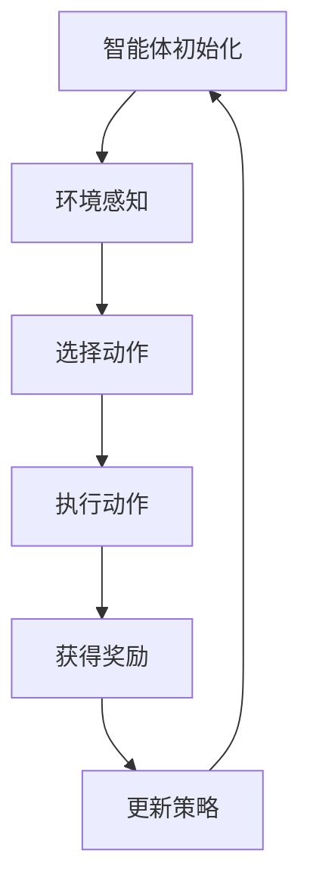
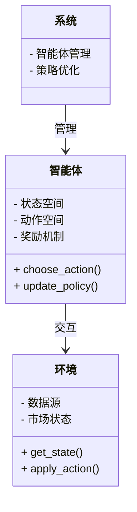
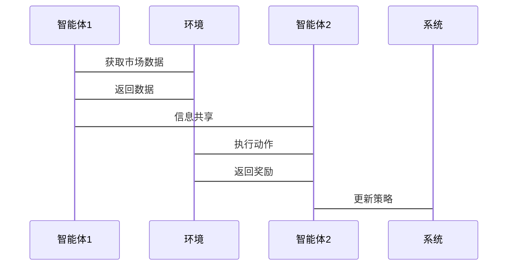

                 

# 多智能体强化学习在优化价值投资的择股策略中的应用

## 关键词：多智能体强化学习, 价值投资, 择股策略, 人工智能, 金融投资

## 摘要：  
本文探讨了多智能体强化学习（MARS）在优化价值投资中的应用，特别是如何通过多智能体协作和竞争机制提升选股策略的科学性和高效性。文章首先介绍了多智能体强化学习的基本原理和价值投资的核心概念，然后分析了MARS在选股中的优势和挑战。通过构建一个多智能体强化学习框架，文章详细阐述了如何利用该框架进行特征提取、策略优化和风险控制。最后，通过实际案例和系统架构设计，展示了如何将MARS应用于实际投资策略中，为价值投资者提供了一种全新的技术视角和解决方案。

---

## 第1章: 多智能体强化学习与价值投资概述

### 1.1 多智能体强化学习的基本概念  
#### 1.1.1 多智能体系统的定义与特点  
多智能体系统（Multi-Agent System, MAS）是由多个智能体组成的分布式系统，这些智能体能够通过协作或竞争完成复杂的任务。智能体具有以下特点：  
- **自主性**：能够独立决策。  
- **反应性**：能够感知环境并实时调整行为。  
- **协作性**：能够与其他智能体协作完成共同目标。  
- **学习能力**：能够通过经验改进自身的决策能力。  

#### 1.1.2 强化学习的基本原理  
强化学习（Reinforcement Learning, RL）是一种机器学习方法，通过智能体与环境的交互，学习最优策略。智能体通过执行动作（action）获得奖励（reward），并根据奖励调整策略以最大化累积奖励。  

#### 1.1.3 多智能体强化学习的核心要素  
多智能体强化学习（MARS）在传统强化学习的基础上，引入了多个智能体之间的协作与竞争。核心要素包括：  
- **状态空间（State Space）**：环境中的信息输入。  
- **动作空间（Action Space）**：智能体可以执行的动作。  
- **奖励机制（Reward Mechanism）**：智能体行为的反馈。  
- **智能体协作（Agent Collaboration）**：智能体之间的信息共享与策略协调。  

### 1.2 价值投资的基本原理  
#### 1.2.1 价值投资的定义与特点  
价值投资是一种长期投资策略，强调以低于内在价值的价格购买优质资产。其核心思想是通过分析企业的基本面，寻找被市场低估的投资标的。  

#### 1.2.2 价值投资的核心策略  
价值投资的策略包括：  
- **基本面分析**：评估企业的盈利能力、财务状况和行业地位。  
- **安全边际**：以低于内在价值的价格买入。  
- **长期持有**：避免短期波动，追求长期收益。  

#### 1.2.3 价值投资与传统投资方法的对比  
与传统投资方法相比，价值投资更注重长期价值，而非短期价格波动。传统方法可能依赖技术分析或市场趋势，而价值投资则更依赖对企业内在价值的深入分析。  

### 1.3 多智能体强化学习在价值投资中的应用前景  
#### 1.3.1 价值投资中的复杂决策问题  
价值投资涉及复杂的决策问题，如如何选择优质企业、如何应对市场波动等。这些问题需要综合分析多个因素，传统的单一策略难以应对。  

#### 1.3.2 多智能体强化学习的优势  
多智能体强化学习通过多个智能体的协作，能够同时考虑多个决策维度，如企业基本面、市场情绪、行业趋势等，从而提供更全面的分析和优化的策略。  

#### 1.3.3 应用中的挑战与机遇  
尽管多智能体强化学习在价值投资中具有潜力，但也面临一些挑战，如数据复杂性、计算资源需求高等。这些挑战也是未来研究的重要方向。  

---

## 第2章: 多智能体强化学习的核心概念与原理  

### 2.1 多智能体强化学习的基本原理  
#### 2.1.1 多智能体系统的协作与竞争  
多智能体系统中的智能体可以协作完成任务，也可以竞争有限资源。这种协作与竞争机制能够模拟复杂的金融市场环境。  

#### 2.1.2 强化学习中的奖励机制  
奖励机制是强化学习的核心，通过定义合适的奖励函数，可以引导智能体学习最优策略。例如，在选股策略中，可以定义奖励为投资收益或风险调整后的收益。  

#### 2.1.3 状态空间与动作空间的构建  
在选股策略中，状态空间可以包括企业的财务指标、市场情绪、行业趋势等；动作空间可以包括买入、卖出或持有股票等操作。  

### 2.2 多智能体强化学习的算法框架  
#### 2.2.1 基于Q-learning的多智能体算法  
Q-learning是一种经典的强化学习算法，通过学习Q值函数来优化决策。在多智能体环境中，可以使用分布式Q-learning，每个智能体维护自己的Q值表。  

#### 2.2.2 基于Actor-Critic的多智能体算法  
Actor-Critic算法通过同时学习策略（Actor）和价值函数（Critic）来优化决策。在多智能体环境中，每个智能体可以独立学习自己的策略和价值函数。  

#### 2.2.3 基于博弈论的多智能体算法  
博弈论在多智能体强化学习中具有重要应用，例如使用纳什均衡的概念来设计智能体的协作与竞争策略。  

### 2.3 多智能体强化学习在金融中的应用  
#### 2.3.1 金融市场的复杂性与不确定性  
金融市场具有高度不确定性和复杂性，传统的单一策略难以应对各种市场环境。  

#### 2.3.2 多智能体强化学习在金融交易中的应用案例  
例如，使用多智能体强化学习优化股票交易策略，通过多个智能体协作完成市场预测和交易决策。  

#### 2.3.3 价值投资中的多智能体强化学习策略  
通过多智能体协作，可以同时分析多个企业的基本面和市场趋势，优化选股策略。  

---

## 第3章: 价值投资的理论基础与实践  

### 3.1 价值投资的基本理论  
#### 3.1.1 价值投资的核心理念  
价值投资的核心理念是寻找被市场低估的企业，长期持有以实现收益。  

#### 3.1.2 价值投资的关键指标与分析方法  
关键指标包括市盈率（P/E）、市净率（P/B）、股息率等。分析方法包括横向比较和纵向分析。  

#### 3.1.3 价值投资的选股策略  
选股策略包括行业分析、财务分析和估值分析等步骤。  

### 3.2 价值投资的实践挑战  
#### 3.2.1 市场波动与不确定性对价值投资的影响  
市场波动可能导致价值投资者的短期亏损，但长期来看，优质企业的价值会被市场发现。  

#### 3.2.2 价值投资中的信息不对称问题  
信息不对称可能导致投资者难以准确评估企业的内在价值。  

#### 3.2.3 价值投资的长期性与短期波动的矛盾  
价值投资强调长期持有，但短期内的市场波动可能对投资者心理造成压力。  

### 3.3 价值投资的优化方向  
#### 3.3.1 提高选股策略的科学性  
通过引入技术分析和量化方法，优化选股策略的科学性。  

#### 3.3.2 引入技术分析与量化方法  
结合技术分析和量化方法，可以提高选股策略的多样性和适应性。  

#### 3.3.3 结合市场环境动态调整策略  
根据市场环境的变化，动态调整选股策略，以应对不同的市场条件。  

---

## 第4章: 多智能体强化学习在优化价值投资策略中的应用  

### 4.1 多智能体强化学习在选股策略中的问题建模  
#### 4.1.1 问题定义  
将选股策略建模为一个多智能体强化学习问题，其中每个智能体负责分析一个企业的基本面或市场趋势。  

#### 4.1.2 状态空间与动作空间的构建  
状态空间包括企业的财务指标、市场情绪等；动作空间包括买入、卖出或持有股票等操作。  

#### 4.1.3 奖励机制的设计  
奖励机制可以设计为投资收益或风险调整后的收益。  

### 4.2 多智能体强化学习的算法实现  
#### 4.2.1 算法选择  
选择适合的多智能体强化学习算法，例如分布式Q-learning或Actor-Critic算法。  

#### 4.2.2 算法实现步骤  
包括环境搭建、智能体初始化、状态感知、动作选择和奖励反馈等步骤。  

#### 4.2.3 算法优化  
通过参数调整和策略改进，优化算法的性能。  

### 4.3 系统架构设计  
#### 4.3.1 系统功能模块  
包括数据采集、特征提取、智能体协作、策略优化和结果评估等模块。  

#### 4.3.2 系统架构图  
使用mermaid图展示系统架构，包括数据流和模块之间的交互关系。  

#### 4.3.3 系统接口设计  
定义系统接口，包括数据输入接口、智能体协作接口和结果输出接口。  

---

## 第5章: 项目实战  

### 5.1 环境搭建  
#### 5.1.1 安装必要的库  
安装TensorFlow、Keras、numpy等库。  

#### 5.1.2 数据集准备  
收集企业的财务数据和市场数据。  

### 5.2 核心代码实现  
#### 5.2.1 智能体类的定义  
定义智能体类，包括状态感知、动作选择和奖励计算等方法。  

#### 5.2.2 多智能体协作的实现  
实现多个智能体之间的协作，例如通过共享信息或协调策略。  

#### 5.2.3 算法实现  
实现分布式Q-learning或Actor-Critic算法。  

### 5.3 实际案例分析  
#### 5.3.1 案例背景  
选择一个具体的市场环境和企业数据进行分析。  

#### 5.3.2 系统性能分析  
比较传统价值投资策略和基于MARS的策略在投资收益和风险控制方面的表现。  

#### 5.3.3 实验结果解读  
解读实验结果，分析多智能体强化学习在优化选股策略中的优势。  

---

## 第6章: 总结与展望  

### 6.1 总结  
本文探讨了多智能体强化学习在优化价值投资策略中的应用，通过构建一个多智能体强化学习框架，展示了如何利用该框架提升选股策略的科学性和高效性。  

### 6.2 未来展望  
未来的研究方向包括优化算法性能、拓展应用场景和提升系统的可解释性。  

### 6.3 实用建议  
在实际应用中，建议投资者结合多智能体强化学习和传统价值投资方法，制定更加科学和灵活的投资策略。  

---

## 图表说明  

#### 图表1: 多智能体强化学习算法流程图（mermaid）  

#### 图表2: 系统架构设计类图（mermaid）  

#### 图表3: 系统交互流程图（mermaid）  

