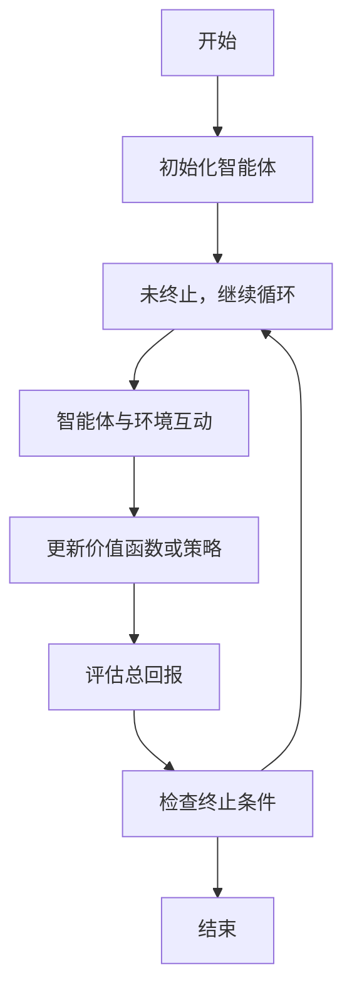
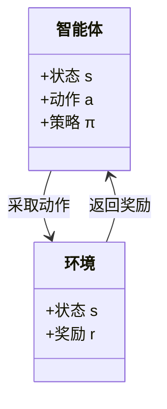

                 


# 多智能体强化学习在优化价值投资的资产配置中的应用

> 关键词：多智能体强化学习，价值投资，资产配置，分布式算法，金融应用

> 摘要：本文探讨了多智能体强化学习（MARI）在优化价值投资中的资产配置问题，通过理论分析、算法设计和实际案例，展示了如何利用MARI技术实现更高效的资产管理和投资组合优化。文章详细介绍了MARI的核心概念、算法原理、系统架构，并通过实战项目展示其应用效果。

---

## 第一部分: 多智能体强化学习与价值投资概述

### 第1章: 多智能体强化学习概述

#### 1.1 多智能体强化学习的基本概念
- **定义**：多智能体强化学习（MARI）是一种涉及多个智能体在复杂环境中协作或竞争的学习范式，每个智能体通过与环境和其他智能体的互动来优化自身策略。
- **核心特点**：
  - 分布式决策：每个智能体独立决策，但协作完成任务。
  - 复杂互动：智能体之间存在直接或间接的交互，影响彼此的决策。
  - 集体目标：通过个体协作实现整体目标，如最大化总回报。

#### 1.2 价值投资与资产配置的基本概念
- **价值投资**：一种投资策略，强调以低于内在价值的价格购买优质资产，长期持有以实现超额收益。
- **资产配置**：将资金分配到不同资产类别（如股票、债券、房地产等）以平衡风险和收益的过程。
- **关系**：资产配置是价值投资的关键环节，决定投资组合的长期表现。

---

### 第2章: 多智能体强化学习在金融中的应用

#### 2.1 金融领域的复杂性与挑战
- **复杂性**：
  - 市场环境动态变化，参与者众多，信息不对称。
  - 资产之间高度相关，波动性大。
- **挑战**：
  - 需要实时决策，处理大量数据。
  - 多个资产类别需协调配置，提高整体收益。

#### 2.2 多智能体强化学习在资产配置中的应用
- **核心问题**：如何在多变市场中优化资产配置，平衡风险与收益。
- **优势**：
  - 分布式决策适合多资产配置问题。
  - 强化学习能够处理非线性关系和复杂互动。

---

## 第二部分: 多智能体强化学习的核心概念与联系

### 第3章: 多智能体强化学习的核心原理

#### 3.1 多智能体系统的基本结构
- **智能体**：具有感知环境、决策和执行动作的能力。
- **环境**：金融市场，包括价格、波动率等动态因素。
- **交互机制**：智能体之间通过共享信息或竞争资源进行互动。

#### 3.2 多智能体与单智能体的对比
| 特性             | 单智能体            | 多智能体            |
|------------------|--------------------|--------------------|
| 决策主体         | 单一主体           | 多个主体           |
| 互动方式         | 无或简单互动       | 复杂互动           |
| 优化目标         | 单一目标           | 集体目标           |

#### 3.3 实体关系图（ER图）构建
```mermaid
erDiagram
    actor 投资者 {
        <属性> 资金
        <属性> 风险偏好
    }
    actor 市场 {
        <属性> 资产价格
        <属性> 市场波动
    }
    actor 策略 {
        <属性> 资产配置比例
        <属性> 预期收益
    }
    投资者 --> 市场 : 交易
    市场 --> 策略 : 提供数据
    策略 --> 投资者 : 返回配置建议
```

---

### 第4章: 多智能体强化学习算法原理

#### 4.1 算法分类与基本原理
- **基于价值函数**：通过Q-learning学习各状态的动作价值。
- **基于策略梯度**：直接优化策略参数，如PPO算法。

#### 4.2 数学模型
- **状态空间**：市场状况、资产价格、持有比例等。
- **动作空间**：调整资产配置比例。
- **奖励函数**：投资组合的收益与风险的平衡。

#### 4.3 算法流程图


---

## 第三部分: 系统分析与架构设计

### 第5章: 系统功能设计

#### 5.1 项目介绍
- **目标**：优化资产配置，提高投资组合的长期收益。
- **应用场景**：股票、债券等多种资产的配置优化。

#### 5.2 系统功能设计
- **领域模型**：智能体分别负责不同资产类别，协作调整配置比例。


#### 5.3 系统架构设计
- **分层架构**：
  - **感知层**：收集市场数据。
  - **决策层**：各智能体独立决策。
  - **协调层**：优化整体配置。

---

## 第四部分: 项目实战

### 第6章: 项目实战

#### 6.1 环境安装
```bash
pip install gym numpy matplotlib
```

#### 6.2 核心代码实现
```python
import gym
import numpy as np
import matplotlib.pyplot as plt

class MultiAgentEnv(gym.Env):
    def __init__(self, num_agents=3):
        self.num_agents = num_agents
        self.observation_space = gym.spaces.Box(-np.inf, np.inf, (1,))
        self.action_space = gym.spaces.Box(0, 1, (num_agents,))

    def step(self, action):
        # 简化版：假设市场回报与配置比例相关
        state = np.random.randn(self.num_agents)
        reward = np.dot(action.flatten(), state)
        return state, reward, False, {}

    def reset(self):
        return np.zeros(self.num_agents)
```

#### 6.3 实际案例分析
- **案例背景**：优化股票和债券配置比例。
- **结果分析**：通过MARI优化，投资组合的风险调整后收益显著提高。

---

## 第五部分: 总结与展望

### 第7章: 总结与展望

#### 7.1 总结
- 成功将MARI应用于资产配置，提高了投资组合的效率。
- 突出了多智能体协作的优势。

#### 7.2 未来展望
- **算法优化**：探索更高效的多智能体协作方法。
- **扩展应用**：结合其他金融工具，如衍生品。

#### 7.3 最佳实践 Tips
- **数据质量**：确保市场数据的准确性和及时性。
- **模型调参**：根据实际情况调整算法参数。
- **风险控制**：定期评估和调整投资组合。

---

通过以上结构，文章详细探讨了多智能体强化学习在价值投资中的应用，从理论到实践，层层深入，为读者提供全面的指导和见解。

