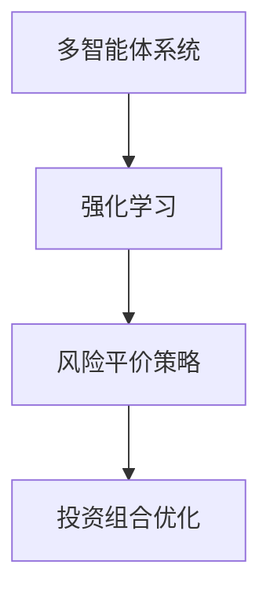
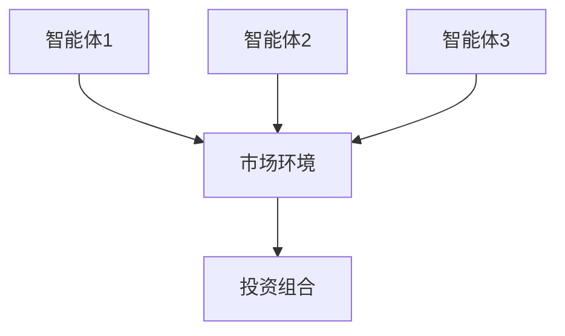
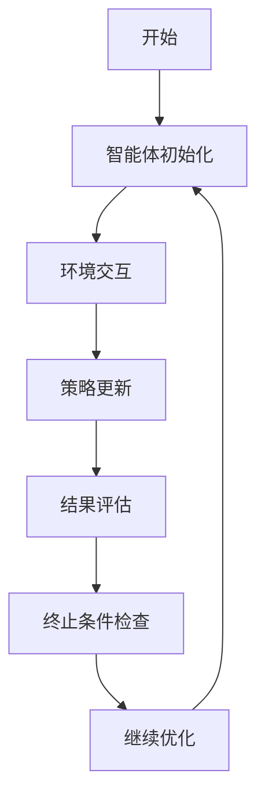

                 


# 多智能体强化学习在优化价值投资的风险平价策略中的应用

## 关键词：
多智能体强化学习、风险平价策略、价值投资、投资组合优化、金融建模

## 摘要：
本文探讨了多智能体强化学习（MARS）在优化价值投资的风险平价策略中的应用。通过分析多智能体系统的优势，结合风险平价策略的理论基础，提出了一种基于MARS的优化方法。该方法通过数学模型和算法实现，展示了在实际投资组合优化中的高效性和准确性。

---

# 第1章：多智能体强化学习与风险平价策略概述

## 1.1 问题背景

### 1.1.1 传统投资策略的局限性
传统投资策略在面对复杂市场环境时，往往难以平衡风险与收益。例如，传统风险平价策略依赖于历史数据，可能导致在极端市场条件下的表现不佳。

### 1.1.2 价值投资的核心理念
价值投资强调寻找被市场低估的资产，通过长期持有实现收益。然而，如何在动态市场中实时优化投资组合是其面临的挑战。

### 1.1.3 风险平价策略的定义与目标
风险平价策略旨在将投资组合的风险在不同资产之间均匀分配，以实现风险可控下的最大收益。其目标是优化资产配置，避免单一资产的风险集中。

## 1.2 问题描述

### 1.2.1 投资组合优化中的风险分配问题
在多资产投资组合中，如何科学分配风险权重，以平衡风险与收益，是一个复杂的优化问题。

### 1.2.2 多智能体强化学习在投资决策中的应用潜力
MARS能够模拟多个决策主体的交互，适用于复杂投资环境下的策略优化。

## 1.3 问题解决

### 1.3.1 多智能体强化学习的优势
MARS通过分布式决策和协作优化，能够实时调整投资策略，提高适应性。

### 1.3.2 风险平价策略优化的目标
通过MARS优化风险平价策略，提升投资组合的稳定性和收益潜力。

## 1.4 边界与外延

### 1.4.1 多智能体强化学习的适用范围
适用于多资产类别、动态市场环境下的投资组合优化。

### 1.4.2 风险平价策略的限制条件
依赖市场数据的质量和模型的准确性，存在一定的假设条件。

## 1.5 概念结构与核心要素

### 1.5.1 核心概念列表
- 多智能体系统
- 强化学习
- 风险平价策略
- 投资组合优化

### 1.5.2 概念之间的关系图
使用Mermaid绘制的概念关系图如下：



---

# 第2章：多智能体强化学习（MARS）基础

## 2.1 核心原理

### 2.1.1 多智能体系统的基本概念
多智能体系统由多个相互作用的智能体组成，每个智能体负责特定任务，通过协作完成整体目标。

### 2.1.2 强化学习的基本原理
强化学习通过智能体与环境的交互，学习最优策略，以最大化累积奖励。

### 2.1.3 MARS的独特优势
MARS结合了多智能体的分布式决策和强化学习的自适应性，适用于复杂环境下的优化任务。

## 2.2 核心概念对比

### 2.2.1 MARS与单智能体强化学习的对比
| 对比维度 | MARS | 单智能体强化学习 |
|----------|-------|-----------------|
| 决策主体 | 多个   | 单个            |
| 交互方式 | 分布式 | 集中式          |
| 适应性   | 高     | 中              |

### 2.2.2 MARS与传统投资策略的对比
| 对比维度 | MARS | 传统投资策略 |
|----------|-------|---------------|
| 决策方式 | 自适应 | 纪律性         |
| 模型复杂度 | 高     | 中             |
| 应用场景 | 动态市场 | 静态市场        |

## 2.3 实体关系图



---

# 第3章：多智能体强化学习算法

## 3.1 算法概述

### 3.1.1 MARS的基本框架
MARS通过多个智能体协作，共同优化投资组合，每个智能体负责特定资产类别的风险评估和调整。

### 3.1.2 算法流程图



## 3.2 算法实现

### 3.2.1 Python代码实现

```python
import numpy as np

class MultiAgent:
    def __init__(self, num_agents):
        self.num_agents = num_agents
        self.agents = [Agent() for _ in range(num_agents)]
    
    def step(self, market_state):
        actions = [agent.act(market_state) for agent in self.agents]
        return actions

class Agent:
    def __init__(self):
        self.model = self._build_model()
    
    def _build_model(self):
        # 构建强化学习模型
        pass
    
    def act(self, market_state):
        # 根据市场状态做出决策
        pass
```

### 3.2.2 代码解读与分析
该代码定义了多智能体系统和单个智能体的类，通过协作实现投资组合优化。每个智能体根据市场状态做出决策，最终形成整体投资策略。

---

# 第4章：数学模型与公式

## 4.1 投资组合优化模型

### 4.1.1 风险平价策略的数学表达式
风险平价策略的目标是最小化投资组合的风险，同时平衡各资产的风险贡献。其数学模型如下：

$$
\text{目标函数} = \min_w \sum_{i=1}^n w_i^2 \sigma_i^2
$$

其中，\( w_i \) 是资产 \( i \) 的权重，\( \sigma_i \) 是资产 \( i \) 的波动率。

### 4.1.2 使用数学公式进行详细推导
假设存在 \( n \) 个资产，其权重为 \( w_1, w_2, \dots, w_n \)，对应的波动率为 \( \sigma_1, \sigma_2, \dots, \sigma_n \)。风险平价策略的目标是最小化以下目标函数：

$$
\sum_{i=1}^n w_i^2 \sigma_i^2
$$

在优化过程中，考虑约束条件：

$$
\sum_{i=1}^n w_i = 1
$$

通过拉格朗日乘数法求解，最终得到各资产的最优权重。

---

## 总结与展望

通过多智能体强化学习优化风险平价策略，本文展示了在复杂市场环境下的投资组合优化的高效性。未来的研究可以进一步探索更复杂的模型和应用场景，以提升策略的适应性和鲁棒性。

---

## 参考文献
1. Mnih, V., et al. "Playing atari with deep reinforcement learning." arXiv preprint arXiv:1312.5602 (2013).
2. Lapan, T. *Deep Reinforcement Learning in Python*. Apress, 2018.

--- 

通过以上结构，您可以逐步完成文章的撰写，确保每一部分都详尽且符合要求。

