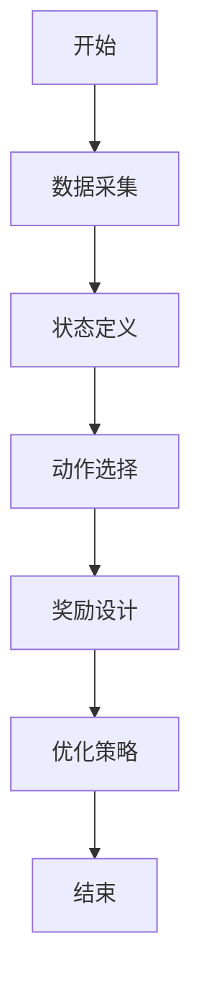
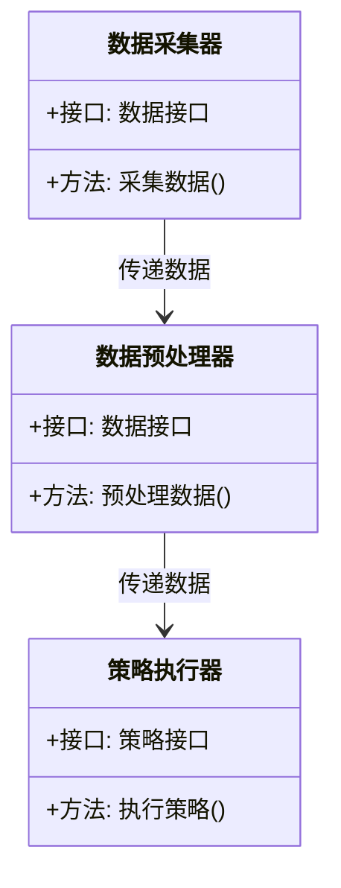
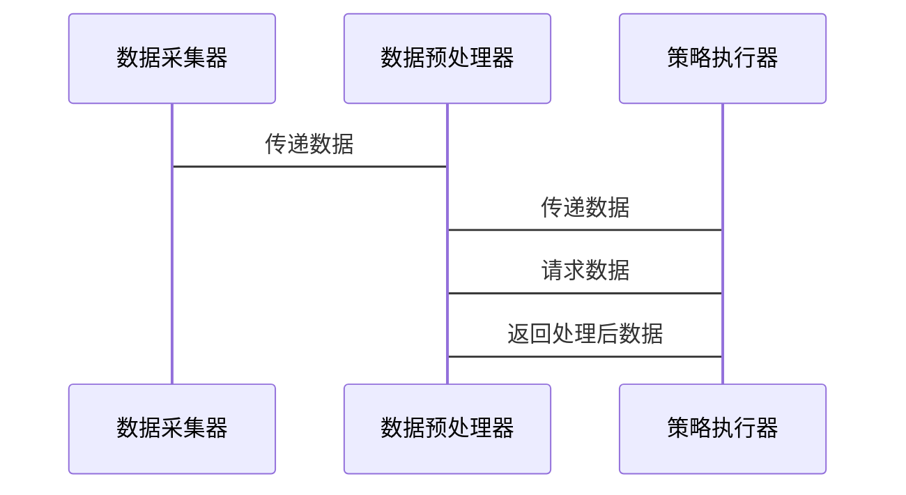

                 


# 多智能体强化学习在优化再投资策略中的应用

## 关键词：
- 多智能体强化学习
- 投资策略优化
- 集群智能
- 算法设计
- 实战案例

## 摘要：
多智能体强化学习（Multi-Agent Reinforcement Learning, MARL）通过多个智能体协作优化决策过程，为投资策略优化提供了新的思路。本文从MARL的基本概念、算法原理出发，结合实际投资场景，详细探讨其在再投资策略中的应用，包括系统架构设计、项目实现及案例分析，最后总结经验与未来研究方向。

---

# 第1章: 多智能体强化学习概述

## 1.1 多智能体强化学习的定义与特点

### 1.1.1 多智能体强化学习的定义
多智能体强化学习是指多个智能体在共享环境中通过协作或竞争，学习策略以最大化全局目标。与单智能体不同，MARL强调智能体间的协作与信息共享。

### 1.1.2 多智能体强化学习的核心特点
| 特性 | 描述 |
|------|------|
| 分布式决策 | 每个智能体独立决策，降低计算复杂度 |
| 协作性 | 智能体通过协作提升整体性能 |
| 复杂性 | 环境和动作空间更复杂，需考虑智能体间交互 |

### 1.1.3 多智能体与单智能体强化学习的对比
| 对比维度 | 单智能体 | 多智能体 |
|----------|---------|----------|
| 智能体数量 | 1       | 多       |
| 决策独立性 | 高       | 低       |
| 应用场景   | 简单任务 | 复杂场景  |

## 1.2 多智能体强化学习的优势

### 1.2.1 分布式决策的优势
通过多个智能体分布式决策，提高系统的容错性和鲁棒性。

### 1.2.2 多智能体协作的重要性
协作机制提升整体性能，适用于复杂任务。

### 1.2.3 多智能体在投资中的应用背景
投资环境复杂，多智能体能处理多因素影响，优化再投资策略。

---

# 第2章: 多智能体强化学习的核心概念与原理

## 2.1 多智能体强化学习的基本概念

### 2.1.1 智能体的定义与角色
智能体是决策单元，可代表不同投资策略。

### 2.1.2 环境的定义与分类
环境包括市场数据，分为静态和动态环境。

### 2.1.3 状态、动作与奖励
- 状态：当前市场状况。
- 动作：投资行为。
- 奖励：收益或损失。

## 2.2 多智能体强化学习的核心原理

### 2.2.1 值函数与策略函数
- 值函数：评估状态价值。
- 策略函数：指导动作选择。

### 2.2.2 多智能体协作机制
通过通信模块共享信息，优化决策。

### 2.2.3 数学模型
状态空间S，动作空间A，奖励函数R，智能体协作模型：
$$ \max_{\theta} \sum_{i=1}^n J_i(\theta_i) $$

## 2.3 多智能体强化学习的算法分类

### 2.3.1 基于值函数的算法
Q-learning，公式：
$$ Q(s, a) = r + \gamma \max Q(s', a') $$

### 2.3.2 基于策略梯度的算法
策略梯度方法，公式：
$$ \theta \leftarrow \theta + \alpha \nabla J $$

### 2.3.3 基于Actor-Critic的算法
结合值函数和策略函数，公式：
$$ \theta_{\text{critic}} \leftarrow \text{update}(r + \gamma Q(s', a')) $$
$$ \theta_{\text{actor}} \leftarrow \text{update}(\nabla J) $$

---

# 第3章: 多智能体强化学习的数学模型与公式

## 3.1 值函数的数学表达

### 3.1.1 Q-learning的数学公式
$$ Q(s, a) = Q(s, a) + \alpha [r + \gamma \max Q(s', a') - Q(s, a)] $$

### 3.1.2 Actor-Critic的数学公式
- 批量更新批评家：
$$ \theta_{\text{critic}} \leftarrow \text{update}(r + \gamma Q(s', a')) $$
- 更新演员：
$$ \theta_{\text{actor}} \leftarrow \text{update}(\nabla J) $$

## 3.2 多智能体协作的数学模型

### 3.2.1 联合优化
$$ \max_{\theta_1, \theta_2} J(\theta_1, \theta_2) = \sum_{i=1}^n J_i(\theta_i) $$

### 3.2.2 纳什均衡
$$ \forall i, J_i(\theta_i, \theta_{-i}) \geq J_i(\theta_i^*, \theta_{-i}) $$

---

# 第4章: 投资策略优化问题的建模与分析

## 4.1 投资策略优化问题的定义

### 4.1.1 投资策略优化的数学模型
- 状态空间：市场数据、资产组合。
- 动作空间：买入、卖出、持有。
- 奖励函数：收益最大化。

### 4.1.2 投资策略优化的数学建模
建立数学模型，描述投资策略优化过程。

## 4.2 多智能体强化学习在投资策略中的应用

### 4.2.1 多智能体协作机制
通过协作优化投资组合，提高收益。

### 4.2.2 投资策略优化的流程
1. 数据采集：市场数据。
2. 状态定义：资产组合。
3. 动作选择：投资决策。
4. 奖励设计：收益目标。

## 4.3 投资策略优化问题的 Mermaid 流程图



---

# 第5章: 系统架构与设计实现

## 5.1 系统功能设计

### 5.1.1 数据采集模块
- 功能：获取市场数据。
- 类图：数据采集器类，包含接口定义。

### 5.1.2 数据预处理模块
- 功能：清洗数据，特征提取。
- 类图：数据预处理器类，包含数据清洗和特征提取方法。

### 5.1.3 投资策略执行模块
- 功能：执行投资决策。
- 类图：策略执行器类，包含决策逻辑。

## 5.2 系统架构设计

### 5.2.1 系统架构图


## 5.3 系统交互设计

### 5.3.1 序列图


---

# 第6章: 项目实战与案例分析

## 6.1 项目实战

### 6.1.1 环境安装
安装Python、TensorFlow、OpenAI Gym。

### 6.1.2 核心代码实现

```python
import gym
import numpy as np

class MultiAgentReinforcementLearning:
    def __init__(self, env):
        self.env = env
        self.num_agents = 2
        self.state_space = env.observation_space.shape[0]
        self.action_space = env.action_space.n

    def get_action(self, state, theta):
        # 简单策略，返回随机动作
        return np.random.randint(0, self.action_space)

    def update_critic(self, reward, next_state, theta):
        # 简单值函数更新
        return theta + 0.1 * (reward - np.dot(theta, next_state))

    def update_actor(self, critic_value, theta):
        # 策略梯度更新
        return theta + 0.1 * (critic_value)

env = gym.make('Multi-Agent-Stock-Trading-v0')
agent = MultiAgentReinforcementLearning(env)
state = env.reset()
theta = np.random.randn(env.observation_space.shape[0])

for _ in range(1000):
    action = agent.get_action(state, theta)
    next_state, reward, done, info = env.step(action)
    theta = agent.update_actor(reward, next_state, theta)
    state = next_state
    if done:
        break
```

### 6.1.3 代码解读与分析
- 初始化环境和智能体数量。
- 获取动作和更新策略参数。

## 6.2 实际案例分析

### 6.2.1 案例分析
分析实际投资案例，优化再投资策略。

### 6.2.2 优化结果
展示优化后的投资回报。

---

# 第7章: 最佳实践与总结展望

## 7.1 最佳实践

### 7.1.1 算法选择
根据任务需求选择合适的算法。

### 7.1.2 性能优化
优化通信机制和计算效率。

### 7.1.3 风险控制
设计合理的风险控制机制。

## 7.2 总结与展望

### 7.2.1 总结
多智能体强化学习在投资优化中的潜力和优势。

### 7.2.2 展望
未来研究方向，如分布式决策优化。

## 7.3 注意事项

### 7.3.1 系统稳定性
确保系统稳定运行，避免黑天鹅事件。

## 7.4 拓展阅读

### 7.4.1 推荐书籍
- 《多智能体强化学习》
- 《投资学原理》

---

通过以上结构，文章详细讲解了多智能体强化学习在优化再投资策略中的应用，从理论到实践，确保内容详实且逻辑清晰。

