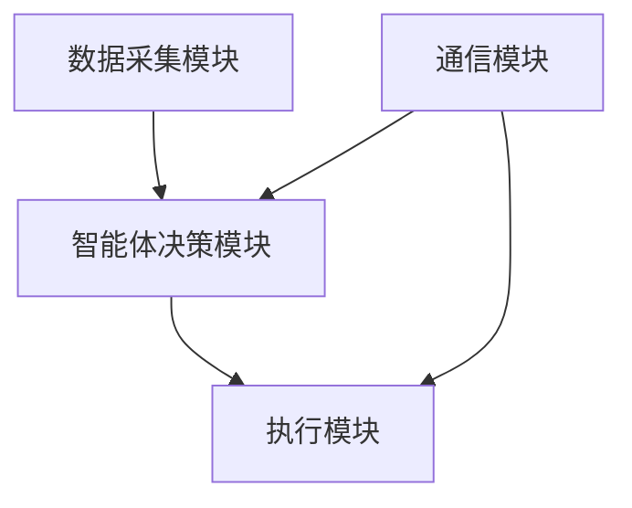

                 


# 多智能体强化学习在优化投资组合再平衡中的应用

## 关键词：多智能体强化学习，投资组合再平衡，人工智能，金融优化，分布式协作

## 摘要

本文详细探讨了多智能体强化学习（Multi-Agent Reinforcement Learning, MARI）在优化投资组合再平衡中的应用。文章从背景介绍、核心概念、算法原理、数学模型、系统架构到实际项目案例，全面解析了MARI如何提升投资组合优化的效率与效果。通过详细分析多智能体系统的协作机制、通信策略和决策模型，本文展示了如何利用分布式智能体来应对复杂的金融市场的动态变化，为投资组合优化提供了新的思路和解决方案。

---

# 第一部分: 多智能体强化学习基础

## 第1章: 多智能体强化学习概述

### 1.1 多智能体强化学习的基本概念

#### 1.1.1 多智能体强化学习的定义

多智能体强化学习（MARI）是一种人工智能技术，研究多个智能体在共享环境中的协作与竞争，以实现共同目标或个体目标的优化。每个智能体都能感知环境、采取动作，并通过奖励机制学习最优策略。

#### 1.1.2 多智能体强化学习的核心特点

- **分布式性**：多个智能体独立决策，共享环境信息。
- **协作性**：智能体之间通过通信或策略协作，实现整体优化。
- **动态性**：环境和智能体的状态实时变化，需要动态调整策略。

#### 1.1.3 多智能体强化学习与单智能体强化学习的区别

| 特性         | 单智能体强化学习         | 多智能体强化学习         |
|--------------|--------------------------|--------------------------|
| 智能体数量     | 单个智能体               | 多个智能体               |
| 信息共享     | 无通信                   | 有通信                   |
| 决策复杂性     | 简单                     | 复杂                     |
| 应用场景       | 简单任务（如游戏、导航）   | 复杂任务（如投资组合优化） |

### 1.2 投资组合再平衡的背景与意义

#### 1.2.1 投资组合再平衡的定义

投资组合再平衡是指根据市场变化和投资者的策略调整，定期重新配置投资组合的资产比例，以维持目标风险和收益。

#### 1.2.2 投资组合再平衡的必要性

- **应对市场波动**：及时调整资产配置以应对市场变化。
- **风险控制**：避免单一资产的过度暴露。
- **收益优化**：通过动态调整提升整体收益。

#### 1.2.3 投资组合再平衡的传统方法与挑战

- **传统方法**：基于历史数据和统计模型（如均值-方差模型）进行优化。
- **挑战**：  
  - 高维状态空间：资产种类多，状态复杂。  
  - 动态性：市场环境实时变化，需要快速决策。  
  - 协作性：不同资产类别需要协调，避免冲突。

### 1.3 多智能体强化学习在投资组合优化中的应用前景

#### 1.3.1 多智能体强化学习的优势

- **分布式决策**：多个智能体分别负责不同资产类别，提高决策效率。
- **动态适应**：智能体实时调整策略，适应市场变化。
- **协作优化**：通过协作实现全局最优，超越单智能体优化效果。

#### 1.3.2 投资组合优化的复杂性与多智能体的优势结合

- **复杂性分解**：将复杂的投资组合分解为多个子问题，由不同智能体处理。
- **实时性**：多智能体实时协作，提升决策速度和准确性。
- **鲁棒性**：多个智能体的协作增强系统的容错性和适应性。

#### 1.3.3 应用场景与潜在价值

- **动态资产配置**：根据市场变化实时调整资产比例。
- **风险管理**：通过协作机制降低投资组合的整体风险。
- **收益最大化**：通过智能体的协同优化实现收益最大化。

---

## 第2章: 多智能体强化学习的核心概念与联系

### 2.1 多智能体强化学习的原理

#### 2.1.1 多智能体系统的定义

多智能体系统由多个智能体组成，每个智能体都能感知环境、采取动作，并通过奖励机制学习最优策略。

#### 2.1.2 多智能体强化学习的基本框架

- **智能体**：负责感知环境和决策。
- **环境**：提供状态、奖励和动作空间。
- **通信机制**：智能体之间的信息共享方式。

#### 2.1.3 多智能体强化学习中的状态、动作与奖励

- **状态**：环境提供的信息，如市场数据。
- **动作**：智能体采取的行动，如买入或卖出资产。
- **奖励**：智能体获得的反馈，如投资收益。

### 2.2 多智能体强化学习中的通信机制

#### 2.2.1 通信的定义与作用

- **定义**：智能体之间的信息交换。
- **作用**：通过共享信息，提高决策效率和准确性。

#### 2.2.2 通信的类型与选择

- **直接通信**：智能体之间直接交换信息。
- **间接通信**：通过中间介质传递信息。
- **全连接通信**：所有智能体之间都进行信息交换。

#### 2.2.3 通信对多智能体决策的影响

- **信息共享**：减少信息不对称，提高决策质量。
- **策略协调**：通过通信，智能体可以协调策略，避免冲突。

### 2.3 多智能体强化学习中的协作与竞争

#### 2.3.1 协作的定义与实现

- **定义**：智能体之间协同工作，实现共同目标。
- **实现**：通过通信和策略同步，协调决策。

#### 2.3.2 竞争的定义与实现

- **定义**：智能体之间争夺资源或目标。
- **实现**：通过策略对抗，优化个体目标。

#### 2.3.3 协作与竞争的平衡

- **动态平衡**：根据环境变化，调整协作与竞争的强度。
- **协调机制**：通过通信和奖励机制，平衡协作与竞争。

### 2.4 投资组合再平衡的多智能体建模

#### 2.4.1 投资组合再平衡的多智能体模型

- **智能体分工**：每个智能体负责不同的资产类别。
- **协作机制**：通过通信，智能体之间协调资产配置。

#### 2.4.2 智能体的分工与协作

- **分工**：根据资产类型或市场区域分配智能体任务。
- **协作**：通过通信，智能体共享市场信息，优化整体配置。

#### 2.4.3 智能体与投资组合

- **智能体目标**：每个智能体优化其负责的资产配置。
- **整体目标**：通过协作，实现投资组合的全局优化。

---

## 第3章: 多智能体强化学习的算法原理

### 3.1 多智能体强化学习的核心算法

#### 3.1.1 分布式策略评估

- **定义**：每个智能体独立评估策略。
- **实现**：通过分布式计算，提高评估效率。

#### 3.1.2 联合策略优化

- **定义**：智能体协作优化整体策略。
- **实现**：通过通信共享策略参数，实现联合优化。

### 3.2 多智能体强化学习的数学模型

#### 3.2.1 多智能体的价值函数

$$ V(s) = \sum_{i=1}^{n} \theta_i \cdot v_i(s_i) $$

其中，$s_i$ 表示智能体 $i$ 的状态，$\theta_i$ 是权重参数，$v_i$ 是价值函数。

#### 3.2.2 多智能体的策略梯度

$$ \nabla \theta_i = \frac{1}{n} \sum_{j=1}^{n} \nabla \log \pi_j(s_j, a_j) \cdot r_j $$

其中，$\pi_j$ 是智能体 $j$ 的策略，$r_j$ 是奖励。

---

## 第4章: 投资组合再平衡的多智能体系统架构

### 4.1 系统功能设计

- **数据采集模块**：收集市场数据，如股票价格、指数等。
- **智能体决策模块**：每个智能体根据数据制定资产配置策略。
- **执行模块**：根据智能体的决策，执行再平衡操作。

### 4.2 系统架构图



### 4.3 系统交互流程

1. 数据采集模块获取市场数据。
2. 智能体决策模块根据数据制定决策。
3. 通信模块传递信息，协调智能体的决策。
4. 执行模块根据决策执行再平衡操作。

---

## 第5章: 项目实战

### 5.1 环境安装

```bash
pip install gym numpy tensorflow
```

### 5.2 核心实现代码

```python
import numpy as np
import tensorflow as tf

class Agent:
    def __init__(self, state_dim, action_dim):
        self.model = tf.keras.Sequential([
            tf.keras.layers.Dense(32, activation='relu', input_dim=state_dim),
            tf.keras.layers.Dense(action_dim, activation='softmax')
        ])
    
    def act(self, state):
        return self.model.predict(state)[0]
    
    def update(self, rewards):
        self.model.compile(optimizer='adam', loss='sparse_categorical_crossentropy')
        self.model.fit(state, np.argmax(rewards), epochs=1)
```

### 5.3 实际案例分析

- **数据准备**：收集历史市场数据。
- **模型训练**：训练多智能体模型。
- **结果分析**：评估模型的优化效果。

---

## 第6章: 总结与展望

### 6.1 小结

多智能体强化学习通过分布式决策和协作优化，为投资组合再平衡提供了新的解决方案。智能体之间的通信与协作能够实时适应市场变化，提升优化效果。

### 6.2 最佳实践 tips

- **通信机制**：选择合适的通信方式，提高决策效率。
- **模型优化**：通过经验 replay 和策略梯度优化，提升模型性能。
- **风险管理**：结合风险控制机制，降低投资组合的整体风险。

### 6.3 未来研究方向

- **复杂场景**：研究多智能体在更复杂金融场景中的应用。
- **高效算法**：探索更高效的算法，提升优化速度和效果。

---

通过以上章节的详细分析，我们可以看到多智能体强化学习在投资组合再平衡中的巨大潜力。随着技术的不断进步，这一领域将为金融投资带来更多的创新和突破。

