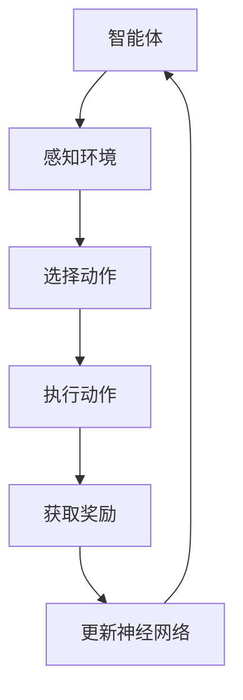
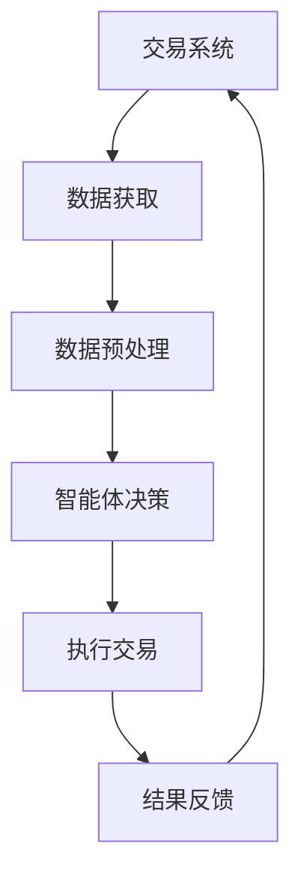

                 


# 多智能体强化学习在优化止损和止盈策略中的应用

> 关键词：多智能体强化学习、止损策略、止盈策略、金融交易、算法优化

> 摘要：本文探讨了多智能体强化学习（MARI）在优化金融交易中的止损和止盈策略中的应用。通过分析MARI的核心概念、算法实现、数学模型以及实际案例，本文展示了如何利用MARI技术提高交易策略的效率和准确性。

---

## 第一部分: 多智能体强化学习基础

### 第1章: 多智能体强化学习概述

#### 1.1 多智能体强化学习的基本概念

多智能体强化学习（Multi-Agent Reinforcement Learning, MARI）是一种人工智能技术，用于训练多个智能体在协作或竞争环境中做出决策。每个智能体通过与环境互动，学习优化自己的策略，以实现特定目标。

- **智能体**：智能体是能够感知环境并采取行动的主体，可以是软件程序或机器人。
- **环境**：环境是智能体互动的外部世界，例如金融市场或游戏场景。
- **状态**：状态是环境在某一时刻的描述，例如股票价格或游戏中的位置。
- **动作**：动作是智能体在特定状态下采取的行为，例如买入或卖出股票。
- **奖励**：奖励是对智能体行为的反馈，用于评估其决策的优劣。

#### 1.2 多智能体强化学习的应用场景

在金融交易中，MARI可以用于优化止损和止盈策略，帮助交易员在复杂市场中做出更明智的决策。

- **止损策略**：当投资出现较大亏损时，及时止损以避免更大的损失。
- **止盈策略**：当投资盈利达到预期时，及时止盈以锁定收益。

### 第2章: 多智能体强化学习的核心概念与联系

#### 2.1 多智能体强化学习的原理

多智能体系统中的每个智能体都有自己的目标，可能需要竞争或协作才能实现整体最优。例如，在股票交易中，多个智能体可以分别负责不同的市场分析任务，通过协作提高整体交易效率。

- **状态空间**：智能体所处环境的所有可能状态的集合。
- **动作空间**：智能体在每个状态下可以采取的所有动作的集合。
- **奖励函数**：衡量智能体行为优劣的函数。

#### 2.2 多智能体强化学习的核心概念

- **独立学习**：每个智能体独立学习，不与其他智能体共享信息。
- **协作学习**：智能体之间共享信息，协作完成任务。
- **竞争学习**：智能体之间存在竞争关系，例如在游戏中的对抗。

#### 2.3 多智能体强化学习的数学模型

多智能体强化学习的数学模型可以通过以下公式表示：

$$
R = \sum_{i=1}^{n} r_i
$$

其中，$R$ 是所有智能体的总奖励，$r_i$ 是第 $i$ 个智能体的奖励。

---

## 第二部分: 多智能体强化学习的算法实现

### 第3章: 多智能体强化学习的算法实现

#### 3.1 基于Q-learning的多智能体算法

Q-learning是一种经典的强化学习算法，通过智能体学习最优策略。在多智能体场景中，每个智能体维护自己的Q值表，记录状态-动作对的期望奖励。

- **Q值更新公式**：

$$
Q(s, a) = Q(s, a) + \alpha [r + \gamma \max Q(s', a') - Q(s, a)]
$$

其中，$\alpha$ 是学习率，$\gamma$ 是折扣因子。

- **伪代码实现**：

```python
def q_learning():
    initialize Q(s, a) for all s, a
    while True:
        s = get_state()
        a = choose_action(s)
        r = get_reward(s, a)
        s_next = get_next_state(s, a)
        Q(s, a) = Q(s, a) + α(r + γ * max(Q(s_next, a'))) - Q(s, a)
```

#### 3.2 基于DQN的多智能体算法

DQN（Deep Q-Network）通过深度神经网络近似Q值函数，适用于高维状态空间。

- **DQN算法流程图**（Mermaid）：



- **DQN伪代码**：

```python
def dqn():
    while True:
        s = get_state()
        a = model.predict(s)
        s_next = take_action(s, a)
        r = get_reward(s, a)
        target = r + γ * model.predict(s_next)
        model.fit(s, target)
```

### 第4章: 多智能体强化学习的数学模型与公式

#### 4.1 状态空间的数学表示

状态空间可以表示为向量空间，例如在股票交易中，状态可以包括价格、成交量等指标。

- **状态向量**：

$$
s = [s_1, s_2, \dots, s_n]
$$

其中，$s_i$ 是第 $i$ 个状态特征。

#### 4.2 动作空间的数学表示

动作空间可以表示为离散或连续的集合，例如在交易中，动作可以是买入、卖出或持有。

- **离散动作空间**：

$$
a \in \{0, 1, 2\}
$$

其中，0表示卖出，1表示持有，2表示买入。

#### 4.3 奖励函数的数学表示

奖励函数通常根据交易结果设计，例如：

- **单笔交易奖励**：

$$
r = \text{profit} - \text{transaction_cost}
$$

其中，$\text{profit}$ 是交易利润，$\text{transaction_cost}$ 是交易费用。

---

## 第三部分: 多智能体强化学习在止损和止盈策略中的应用

### 第5章: 多智能体强化学习在金融交易中的应用

#### 5.1 问题场景介绍

在金融交易中，止损和止盈策略是交易员常用的工具，用于控制风险和锁定收益。然而，手动制定策略容易受情绪影响，而多智能体强化学习可以通过算法优化策略，提高效率。

- **止损策略**：当资产价格下跌到一定幅度，自动卖出以避免更大损失。
- **止盈策略**：当资产价格上涨到一定程度，自动卖出以锁定收益。

#### 5.2 多智能体强化学习在止损策略中的应用

通过多智能体协作，每个智能体可以负责不同的市场分析任务，例如技术分析和情绪分析，共同制定最优的止损点。

- **止损点计算公式**：

$$
\text{stop\_loss} = \text{current\_price} - \text{max\_loss\_tolerance}
$$

其中，$\text{max\_loss\_tolerance}$ 是最大可承受的损失。

#### 5.3 多智能体强化学习在止盈策略中的应用

同样，多智能体协作可以优化止盈点，根据市场趋势和交易信号动态调整。

- **止盈点计算公式**：

$$
\text{take\_profit} = \text{current\_price} + \text{target\_profit}
$$

其中，$\text{target\_profit}$ 是目标利润。

### 第6章: 项目实战

#### 6.1 环境配置

在实际项目中，需要配置合适的开发环境和工具。

- **开发工具**：Python、TensorFlow、Keras
- **数据源**：金融数据API（如Yahoo Finance、Alpha Vantage）

#### 6.2 系统架构设计

- **系统架构图**（Mermaid）：



#### 6.3 核心代码实现

以下是多智能体强化学习在止损策略中的代码示例：

```python
import numpy as np
import gym

class TradingEnv(gym.Env):
    def __init__(self):
        super(TradingEnv, self).__init__()
        self.state_space = ...  # 定义状态空间
        self.action_space = ...  # 定义动作空间

    def step(self, action):
        # 执行动作并返回新状态、奖励、终止标志
        pass

    def reset(self):
        # 初始化环境
        pass

# 定义智能体
class Agent:
    def __init__(self):
        self.model = ...  # 定义模型

    def act(self, state):
        # 根据状态选择动作
        pass

# 训练过程
env = TradingEnv()
agent = Agent()
for episode in range(num_episodes):
    state = env.reset()
    while not done:
        action = agent.act(state)
        next_state, reward, done, _ = env.step(action)
        agent.train(state, action, reward, next_state)
```

#### 6.4 案例分析与结果解读

通过实际案例分析，验证多智能体强化学习在止损和止盈策略中的有效性。

- **案例分析**：
  - 某股票价格波动剧烈，多智能体策略能够在价格下跌时及时止损，避免重大损失。
  - 在价格上涨时，策略能够准确识别趋势，及时止盈，最大化收益。

- **结果解读**：
  - 比较传统策略和强化学习策略的收益和风险，展示多智能体策略的优势。

---

## 第四部分: 总结与展望

### 第7章: 总结

#### 7.1 本章总结

多智能体强化学习在优化止损和止盈策略中展现了强大的潜力。通过协作学习和算法优化，智能体能够更好地适应复杂市场环境，提高交易效率和收益。

#### 7.2 最佳实践 tips

- 确保数据质量和实时性。
- 设计合理的奖励函数，引导智能体做出最优决策。
- 定期更新模型，适应市场变化。

#### 7.3 注意事项

- 避免过度拟合，确保策略的泛化能力。
- 控制交易风险，确保策略稳健。

#### 7.4 未来展望

未来，随着AI技术的进步，多智能体强化学习在金融领域的应用将更加广泛和深入。例如，结合自然语言处理技术，分析新闻和社交媒体情绪，进一步优化交易策略。

---

通过以上结构，本文系统地探讨了多智能体强化学习在优化止损和止盈策略中的应用，从理论到实践，为读者提供了全面的指导和启示。

