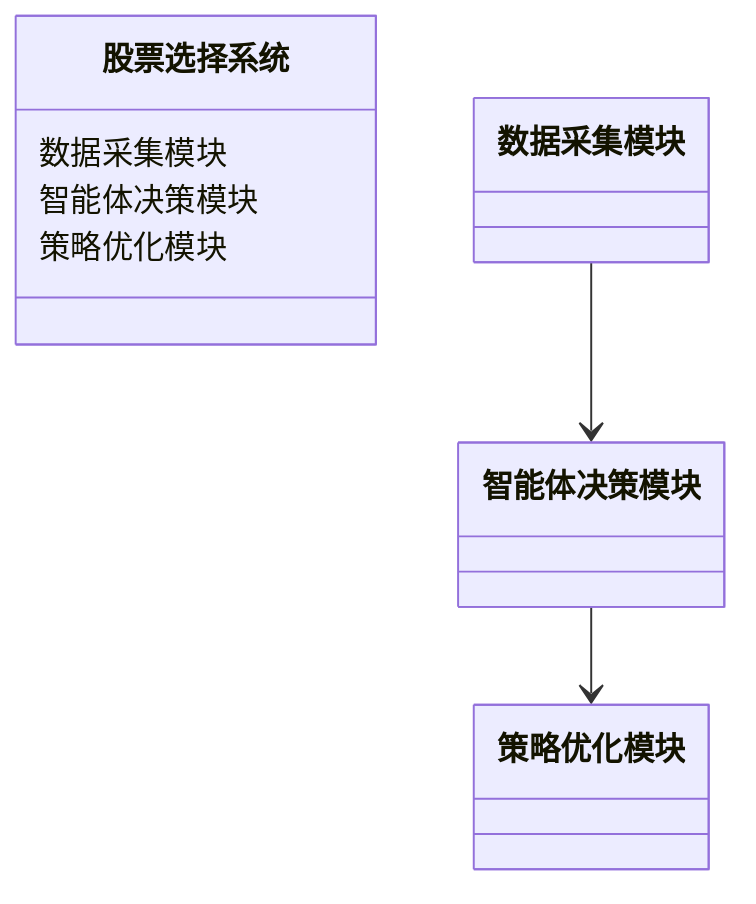
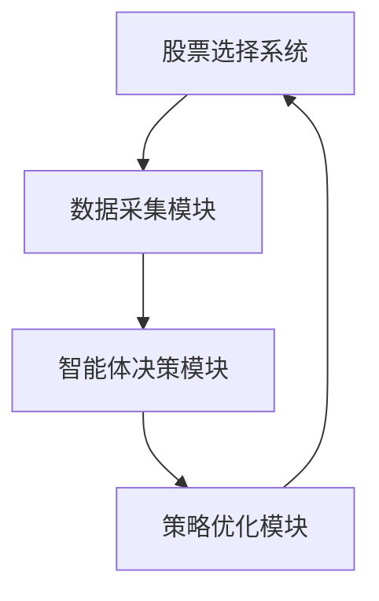
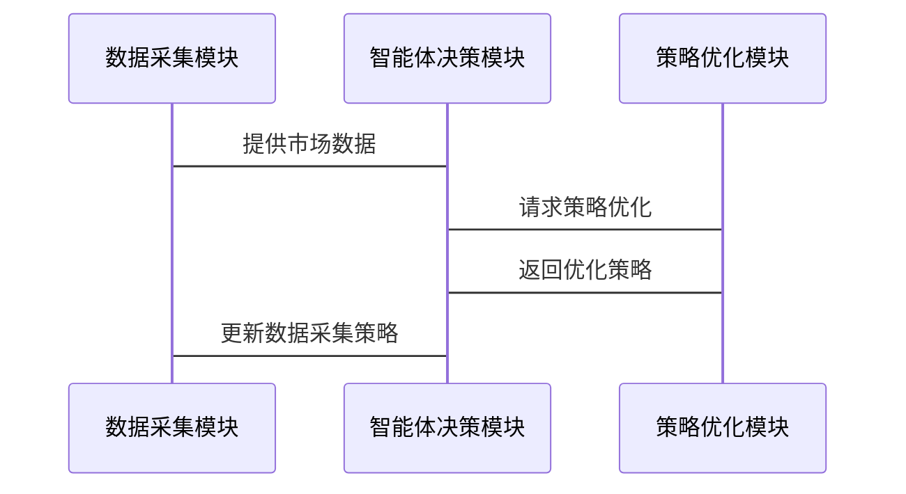

                 


# 多智能体强化学习在股票选择中的应用

> 关键词：多智能体强化学习、股票选择、投资策略、机器学习、金融市场、算法交易、量化投资

> 摘要：本文探讨了多智能体强化学习在股票选择中的应用，分析了其独特优势及实现原理，详细讲解了算法流程、系统架构，并通过实际案例展示了其在投资策略中的应用，为读者提供了全面的理论基础和实践指南。

---

# 第一部分: 多智能体强化学习与股票选择的背景与基础

## 第1章: 多智能体强化学习概述

### 1.1 多智能体强化学习的定义与特点

#### 1.1.1 多智能体系统的定义
多智能体系统由多个智能体组成，每个智能体能够感知环境、做出决策并采取行动，通过协同工作实现共同目标。其特点包括分布性、协作性、自主性和适应性。

#### 1.1.2 强化学习的基本原理
强化学习是一种机器学习方法，通过智能体与环境的交互，学习最优策略，最大化累计奖励。其核心是智能体通过试错学习，调整动作以获得最大奖励。

#### 1.1.3 多智能体强化学习的独特优势
多智能体强化学习结合了多个智能体的协作与竞争，能够处理复杂环境下的决策问题，提升系统的整体性能和适应性。

### 1.2 股票选择的基本原理

#### 1.2.1 股票市场的基本特性
股票市场具有不确定性、波动性和复杂性，传统方法难以捕捉所有影响因素，需要借助机器学习等技术进行分析。

#### 1.2.2 股票选择的常见策略
包括基本面分析、技术分析和量化投资策略等，但传统方法存在局限性，难以应对市场的快速变化。

#### 1.2.3 数据驱动的股票选择方法
通过大数据分析和机器学习模型，利用历史数据预测股票价格走势，优化投资组合。

## 第2章: 多智能体强化学习在股票选择中的应用背景

### 2.1 股票市场的复杂性与挑战

#### 2.1.1 市场的不确定性和波动性
股票价格受多种因素影响，包括经济指标、公司业绩、政策变化等，增加了预测的难度。

#### 2.1.2 信息不对称的问题
市场参与者获取信息的不平等可能导致交易策略的不公平性，强化学习需处理这种不对称性。

#### 2.1.3 投资者行为的多样性
投资者决策受心理因素影响，表现出非理性行为，增加了市场的复杂性。

### 2.2 强化学习在金融领域的优势

#### 2.2.1 强化学习的实时决策能力
强化学习能够实时调整策略，适应市场变化，提供及时有效的投资建议。

#### 2.2.2 复杂策略的自动优化
通过强化学习算法，自动优化投资组合，发现传统方法难以察觉的模式和机会。

#### 2.2.3 非线性关系的建模能力
强化学习擅长处理非线性关系，能够捕捉复杂市场中的潜在规律。

### 2.3 多智能体系统的必要性

#### 2.3.1 分散决策的优势
多个智能体分别负责不同任务，降低单点故障风险，提升系统的鲁棒性。

#### 2.3.2 多智能体协同的高效性
通过协作，多个智能体能够更高效地处理复杂问题，提升决策质量。

#### 2.3.3 实际场景中的应用案例
例如，多个智能体分别监控不同股票或市场指标，协同决策优化投资组合。

---

# 第二部分: 多智能体强化学习的核心概念与算法原理

## 第3章: 多智能体强化学习的核心概念

### 3.1 多智能体系统的基本组成

#### 3.1.1 智能体的定义与角色
智能体是具有感知、决策和行动能力的主体，能够独立或协同完成任务。

#### 3.1.2 环境的定义与类型
环境是智能体所处的外部世界，包括金融市场、交易系统等，环境的状态变化影响智能体的决策。

#### 3.1.3 状态、动作与奖励的定义
状态是环境的当前情况，动作是智能体的决策，奖励是对智能体行为的反馈，指导其优化策略。

### 3.2 多智能体强化学习的关键特性

#### 3.2.1 分散决策与集中控制
分散决策允许每个智能体独立做出决策，集中控制则通过中心协调器统一管理多个智能体。

#### 3.2.2 协作与竞争关系
智能体之间可以协作完成共同目标，也可以竞争有限资源，这种关系影响整体系统的性能。

#### 3.2.3 知识共享与信息同步
智能体之间通过共享知识和同步信息，提升整体决策的准确性和效率。

## 第4章: 多智能体强化学习的算法原理

### 4.1 集中式强化学习算法

#### 4.1.1 集中式价值函数方法
通过集中所有智能体的信息，计算全局价值函数，优化整体策略。

#### 4.1.2 集中式策略优化方法
将多个智能体的策略集中优化，寻找全局最优解。

#### 4.1.3 算法的收敛性分析
分析集中式算法在不同环境下的收敛性，确保其有效性和稳定性。

### 4.2 分散式强化学习算法

#### 4.2.1 分散式策略优化
每个智能体独立优化自己的策略，通过局部信息更新全局策略。

#### 4.2.2 基于Q-learning的多智能体方法
采用Q-learning算法，每个智能体维护自己的Q值表，通过协作更新。

#### 4.2.3 分散式算法的收敛性问题
探讨分散式算法在多智能体环境下的收敛性，解决可能的同步问题。

### 4.3 多智能体强化学习的数学模型

#### 4.3.1 集中式价值函数模型
描述集中式算法的数学表达，包括状态、动作、奖励的关系。

#### 4.3.2 分散式Q-learning模型
详细说明每个智能体的Q值更新公式，展示其数学推导。

#### 4.3.3 竞争与协作关系的数学表达
通过数学公式描述智能体之间的竞争与协作，分析其对整体系统的影响。

---

# 第三部分: 股票选择中的系统架构与实现

## 第5章: 股票选择系统的系统架构设计

### 5.1 系统功能模块划分

#### 5.1.1 数据采集模块
负责收集股票市场数据，包括历史价格、交易量、公司财报等。

#### 5.1.2 智能体决策模块
根据市场数据和智能体的状态，生成投资决策，如买入、卖出或持有。

#### 5.1.3 策略优化模块
通过强化学习算法优化投资策略，提升系统的收益和风险控制能力。

### 5.2 系统功能设计（领域模型）



### 5.3 系统架构设计



### 5.4 系统接口设计

- 数据接口：与数据源对接，获取实时市场数据。
- 智能体接口：定义智能体之间的通信协议，实现信息共享。
- 策略接口：提供策略优化的API，供其他模块调用。

### 5.5 系统交互设计



---

## 第6章: 项目实战与案例分析

### 6.1 环境配置

- 安装必要的Python库，如TensorFlow、Keras、Pandas、NumPy。
- 数据源选择，获取历史股票数据，清洗和预处理数据。

### 6.2 核心代码实现

```python
# 定义多智能体强化学习算法
class MultiAgentDQN:
    def __init__(self, state_dim, action_dim, agents_num):
        self.agents = []
        for _ in range(agents_num):
            self.agents.append(DQN(state_dim, action_dim))
    
    def act(self, states):
        actions = []
        for i, state in enumerate(states):
            actions.append(self.agents[i].act(state))
        return actions
    
    def train(self, states, actions, rewards, next_states):
        for i in range(len(self.agents)):
            self.agents[i].train(states[i], actions[i], rewards[i], next_states[i])
```

### 6.3 实际案例分析

- 选取特定股票，训练智能体进行买卖决策。
- 对比传统方法和强化学习方法的投资回报率，分析其优势。

### 6.4 项目总结

- 强化学习在股票选择中的潜力巨大，但实际应用中仍需考虑市场变化和模型泛化能力。
- 多智能体协同能够提升系统的稳定性和收益，但算法复杂性和计算成本也是挑战。

---

# 第四部分: 总结与展望

## 第7章: 总结与未来研究方向

### 7.1 核心观点回顾

- 多智能体强化学习为股票选择提供了新的思路，能够处理复杂市场环境。
- 系统架构设计和算法优化是实现高效投资的关键。

### 7.2 最佳实践 tips

- 在实际应用中，建议结合市场专家意见，优化强化学习模型。
- 定期更新模型参数，适应市场变化，提升系统的鲁棒性。

### 7.3 小结

- 多智能体强化学习在股票选择中的应用前景广阔，但需要进一步研究和实践。

### 7.4 注意事项

- 投资者需谨慎使用算法交易，注意市场波动和模型风险。
- 加强对模型的监控和评估，确保其稳定性和收益性。

### 7.5 拓展阅读

- 推荐阅读相关文献，深入理解多智能体强化学习的最新进展。
- 关注金融市场的动态，结合新技术优化投资策略。

---

通过以上结构和内容的详细设计，本文系统地介绍了多智能体强化学习在股票选择中的应用，从理论到实践，为读者提供了全面的指导和参考。

