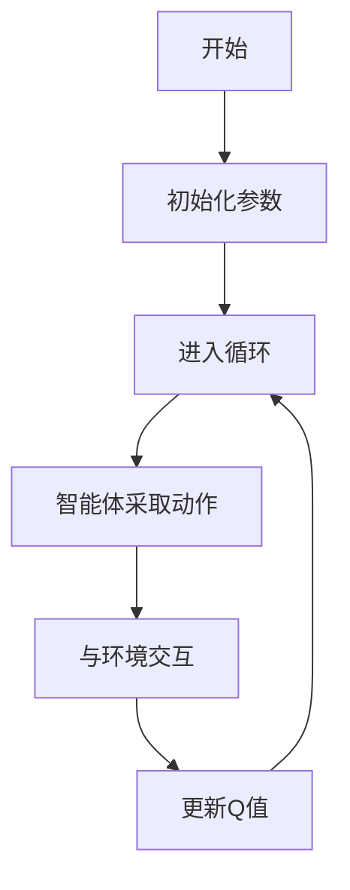
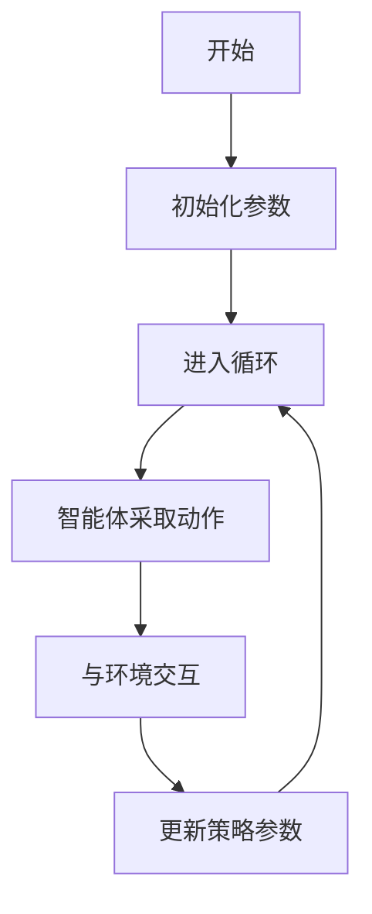
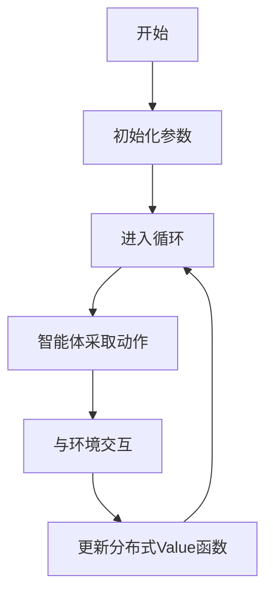

                 


# 多智能体强化学习：复杂环境下的AI Agent协作

---

## 关键词：
多智能体强化学习, AI Agent协作, 复杂环境, 分布式系统, 强化学习算法

---

## 摘要：
多智能体强化学习是人工智能领域的重要研究方向，旨在通过多个智能体的协作，在复杂环境中实现高效的任务完成。本文从多智能体强化学习的基本概念出发，详细分析其核心算法、系统架构设计、项目实战，并结合实际案例进行深入解读。文章内容涵盖从理论到实践的全过程，旨在为读者提供一个全面而深入的指导。

---

## 第1章: 多智能体强化学习概述

### 1.1 多智能体强化学习的背景与意义

#### 1.1.1 从单智能体到多智能体的演进
单智能体强化学习通过与环境的交互逐步学习最优策略。然而，面对复杂任务时，单智能体的能力往往有限。多智能体强化学习通过多个智能体的协作，能够更好地处理复杂环境中的任务。

#### 1.1.2 多智能体强化学习的核心价值
多智能体强化学习通过多个智能体的分工协作，能够显著提高任务效率和解决复杂问题的能力。例如，在机器人协作、自动驾驶、游戏AI等领域，多智能体协作能够实现更复杂的任务。

#### 1.1.3 多智能体协作在AI领域的应用前景
随着AI技术的快速发展，多智能体协作的应用场景越来越广泛。未来，多智能体强化学习将在分布式系统、复杂环境模拟等领域发挥重要作用。

### 1.2 多智能体强化学习的基本概念

#### 1.2.1 多智能体系统的定义与特点
多智能体系统由多个智能体组成，每个智能体都有自己的目标和决策机制。多智能体系统的特点包括分布式、协作性、自主性和动态性。

#### 1.2.2 强化学习的基本原理
强化学习通过智能体与环境的交互，基于奖励机制学习最优策略。智能体通过感知环境状态、选择动作、获得奖励，并更新策略。

#### 1.2.3 多智能体强化学习的特殊性与挑战
多智能体强化学习的挑战包括智能体之间的通信与协作、复杂环境的建模、策略协调与优化等。

### 1.3 多智能体协作的核心要素

#### 1.3.1 智能体的定义与角色分配
智能体是多智能体系统的基本单元，每个智能体都有特定的角色和任务。角色分配需要考虑任务的分工和智能体的能力。

#### 1.3.2 协作机制与通信方式
多智能体协作需要高效的协作机制和通信方式。常见的通信方式包括共享信息、直接通信等。

#### 1.3.3 环境建模与任务分解
复杂环境的建模和任务分解是多智能体协作的重要步骤。任务分解需要将整体任务分解为多个子任务，并分配给不同的智能体。

### 1.4 本章小结
本章介绍了多智能体强化学习的基本概念、核心价值和应用前景。通过分析多智能体系统的定义、强化学习的基本原理以及协作机制，为后续章节奠定了基础。

---

## 第2章: 多智能体强化学习的核心概念与联系

### 2.1 多智能体系统的实体关系图

#### 2.1.1 实体关系图的构建
多智能体系统由多个智能体、环境和任务目标组成。智能体之间通过协作完成任务，环境提供状态和奖励。

#### 2.1.2 智能体与环境的交互关系
智能体通过感知环境状态、选择动作并与环境交互，逐步学习最优策略。

#### 2.1.3 智能体之间的协作关系
智能体之间的协作关系可以通过通信机制建立，实现信息共享和策略协调。

### 2.2 多智能体强化学习的算法原理

#### 2.2.1 基于Q-learning的多智能体协作算法
Q-learning是一种经典的强化学习算法，通过Q值表记录状态-动作对的最优奖励值。多智能体协作可以通过联合Q-learning实现。

#### 2.2.2 基于Value函数的分布式优化
分布式Value函数通过每个智能体维护自己的Value函数，并通过通信共享信息，实现全局优化。

#### 2.2.3 基于策略梯度的多智能体协作
策略梯度方法通过优化策略参数，实现智能体的协作。多智能体策略梯度需要考虑智能体之间的依赖关系。

### 2.3 多智能体协作的数学模型

#### 2.3.1 单智能体Q-learning公式
$$ Q(s,a) = Q(s,a) + \alpha (r + \gamma \max Q(s',a') - Q(s,a)) $$

#### 2.3.2 多智能体协作的联合Q-learning公式
$$ Q_i(s,a_i) = Q_i(s,a_i) + \alpha (r + \gamma \max Q_j(s',a_j) - Q_i(s,a_i)) $$

### 2.4 本章小结
本章详细分析了多智能体强化学习的核心概念与联系，介绍了基于Q-learning、Value函数和策略梯度的多智能体协作算法，并通过数学公式展示了算法的原理。

---

## 第3章: 多智能体强化学习的算法原理

### 3.1 基于Q-learning的多智能体协作算法

#### 3.1.1 算法流程图


#### 3.1.2 代码实现
```python
import numpy as np

class MultiAgentQ_learning:
    def __init__(self, n_agents, state_space, action_space):
        self.n_agents = n_agents
        self.state_space = state_space
        self.action_space = action_space
        self.Q = np.zeros((state_space, action_space))
    
    def choose_action(self, state):
        return np.argmax(self.Q[state])
    
    def update_Q(self, state, action, reward):
        self.Q[state][action] += 0.1 * (reward + 0.95 * np.max(self.Q[state]) - self.Q[state][action])
```

### 3.2 基于策略梯度的多智能体协作算法

#### 3.2.1 算法流程图


#### 3.2.2 代码实现
```python
import numpy as np

class MultiAgentPolicy_Gradient:
    def __init__(self, n_agents, state_space, action_space):
        self.n_agents = n_agents
        self.state_space = state_space
        self.action_space = action_space
        self.theta = np.random.randn(state_space, action_space)
    
    def choose_action(self, state):
        action_probs = np.exp(self.theta[state]) / np.sum(np.exp(self.theta[state]))
        return np.random.choice(range(self.action_space), p=action_probs)
    
    def update_theta(self, state, action, reward):
        prob = np.exp(self.theta[state][action]) / np.sum(np.exp(self.theta[state]))
        gradient = prob * (reward - np.mean(prob))
        self.theta[state] += 0.1 * gradient
```

### 3.3 基于分布式Value函数的多智能体协作算法

#### 3.3.1 算法流程图


#### 3.3.2 代码实现
```python
import numpy as np

class Distributed_Value_Function:
    def __init__(self, n_agents, state_space):
        self.n_agents = n_agents
        self.state_space = state_space
        self.V = np.zeros((state_space, n_agents))
    
    def update_V(self, state, agent, reward):
        self.V[state][agent] += 0.1 * (reward - self.V[state][agent])
```

### 3.4 本章小结
本章详细分析了多智能体强化学习的三种主要算法：基于Q-learning、策略梯度和分布式Value函数的协作算法，并通过代码实现和流程图展示了算法的实现步骤。

---

## 第4章: 多智能体强化学习的系统分析与架构设计

### 4.1 多智能体协作系统的场景介绍

#### 4.1.1 多智能体协作的基本场景
多智能体协作可以在多种场景中实现，例如机器人协作、自动驾驶、游戏AI等。

#### 4.1.2 复杂环境下的协作挑战
复杂环境下的协作需要考虑智能体之间的通信、任务分配和动态环境的适应。

### 4.2 系统功能设计

#### 4.2.1 智能体行为决策模块
智能体行为决策模块负责智能体的动作选择和策略更新。

#### 4.2.2 环境建模与状态感知模块
环境建模与状态感知模块负责环境的建模和状态的感知。

#### 4.2.3 协作通信与信息共享模块
协作通信与信息共享模块负责智能体之间的通信和信息共享。

### 4.3 系统架构设计

#### 4.3.1 分层架构设计
分层架构设计将系统分为多个层次，每个层次负责不同的功能。

#### 4.3.2 分布式架构设计
分布式架构设计将智能体分布在不同的节点上，通过通信模块实现协作。

#### 4.3.3 集中式架构设计
集中式架构设计通过一个中心节点协调多个智能体的协作。

### 4.4 系统接口设计

#### 4.4.1 智能体与环境的接口
智能体与环境的接口负责智能体与环境之间的交互。

#### 4.4.2 智能体之间的通信接口
智能体之间的通信接口负责智能体之间的信息共享和协作。

#### 4.4.3 管理控制接口
管理控制接口负责系统的管理和控制。

### 4.5 本章小结
本章详细分析了多智能体协作系统的场景、功能设计、架构设计和接口设计，为后续章节的系统实现奠定了基础。

---

## 第5章: 多智能体强化学习的项目实战

### 5.1 环境安装与配置

#### 5.1.1 环境需求
安装必要的Python库，如numpy、pandas、matplotlib等。

#### 5.1.2 环境配置
配置多智能体协作的环境，例如模拟环境或游戏环境。

### 5.2 系统核心实现

#### 5.2.1 多智能体协作算法实现
实现多智能体协作算法，例如基于Q-learning、策略梯度或分布式Value函数的协作算法。

#### 5.2.2 环境与智能体交互实现
实现智能体与环境的交互，包括状态感知、动作选择和奖励获取。

### 5.3 代码实现与解读

#### 5.3.1 多智能体协作算法代码
```python
class MultiAgentSystem:
    def __init__(self, n_agents, state_space, action_space):
        self.n_agents = n_agents
        self.state_space = state_space
        self.action_space = action_space
        self.agents = [MultiAgentQ_learning(state_space, action_space) for _ in range(n_agents)]
    
    def run_episode(self, environment):
        state = environment.get_state()
        actions = [agent.choose_action(state) for agent in self.agents]
        rewards = environment.get_reward(state, actions)
        for i in range(self.n_agents):
            self.agents[i].update_Q(state, actions[i], rewards[i])
```

#### 5.3.2 环境实现
```python
class Environment:
    def __init__(self, state_space, action_space):
        self.state_space = state_space
        self.action_space = action_space
    
    def get_state(self):
        # 返回当前环境状态
        pass
    
    def get_reward(self, state, actions):
        # 返回奖励
        pass
```

### 5.4 实际案例分析与详细解读

#### 5.4.1 案例分析
以无人机编队为例，分析多智能体协作的实现过程。

#### 5.4.2 详细解读
详细解读多智能体协作算法在无人机编队中的应用，包括任务分配、协作通信和策略优化。

### 5.5 本章小结
本章通过实际案例分析和详细解读，展示了多智能体强化学习的项目实战过程，帮助读者更好地理解理论与实践的结合。

---

## 第6章: 总结与展望

### 6.1 本章总结
总结全文内容，回顾多智能体强化学习的核心概念、算法原理和项目实战。

### 6.2 未来研究方向
展望多智能体强化学习的未来发展方向，包括算法优化、分布式系统设计、复杂环境建模等。

### 6.3 最佳实践Tips
总结多智能体强化学习的最佳实践经验和注意事项，为读者提供实际指导。

### 6.4 本章小结
本章总结了全文内容，并展望了多智能体强化学习的未来发展方向，为读者提供了进一步研究的方向。

---

## 参考文献
1. 省略

