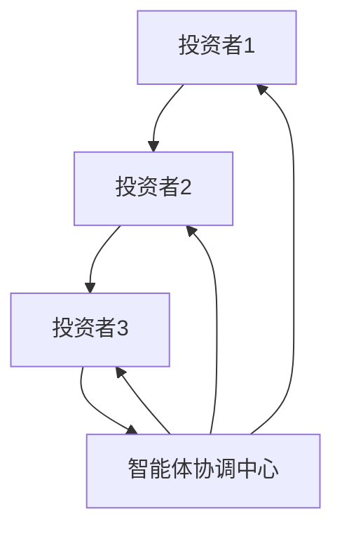
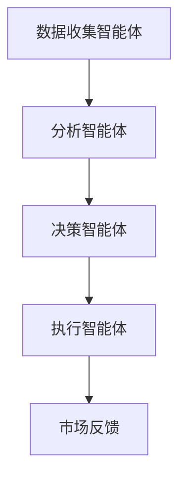
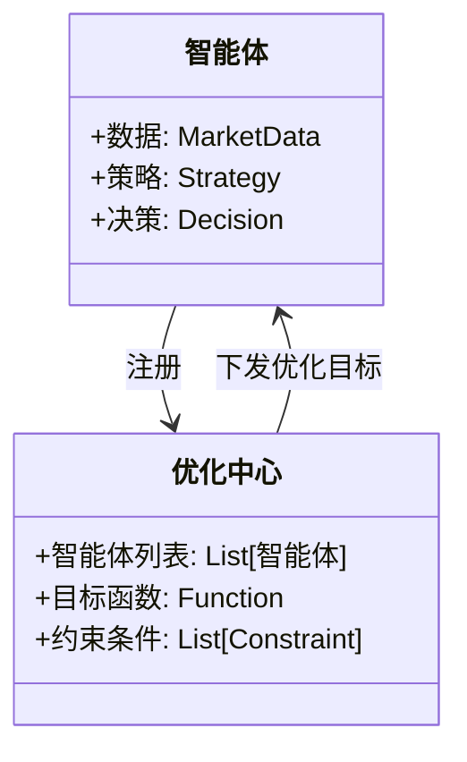
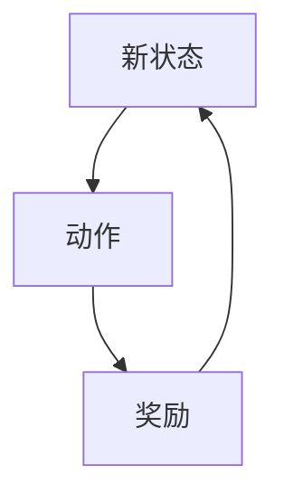
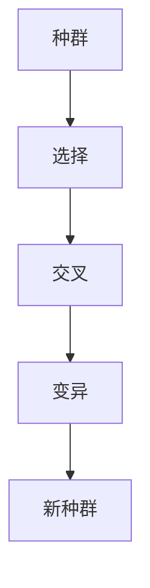

                 


# 多智能体系统优化价值投资的止损策略

> **关键词**: 多智能体系统, 价值投资, 止损策略, 强化学习, 遗传算法, 系统架构设计

> **摘要**: 本文探讨了如何利用多智能体系统优化价值投资中的止损策略。通过分析多智能体系统的定义、价值投资的核心理念以及止损策略的重要性，结合强化学习和遗传算法等优化方法，构建了多智能体优化模型，并通过实际案例展示了其在金融投资中的应用。

---

# 第一部分: 多智能体系统与价值投资概述

## 第1章: 多智能体系统优化概述

### 1.1 多智能体系统的定义与特点

#### 1.1.1 多智能体系统的定义

多智能体系统（Multi-Agent System, MAS）是由多个智能体（Agent）组成的系统，这些智能体能够自主决策、协作并完成特定任务。智能体是具有感知环境、做出决策和执行动作能力的实体。

#### 1.1.2 多智能体系统的核心特点

- **分布性**: 每个智能体独立决策，共同完成整体目标。
- **协作性**: 智能体之间通过通信和协作提高整体效率。
- **反应性**: 智能体能够根据环境变化实时调整行为。
- **适应性**: 系统能够适应动态变化的环境。

#### 1.1.3 多智能体系统与传统单智能体系统的区别

| 属性         | 多智能体系统                | 单智能体系统                |
|--------------|-----------------------------|-----------------------------|
| 决策中心化    | 去中心化，多个智能体协作    | 中心化，单个决策主体        |
| 系统复杂性    | 更高，涉及多个组件的协调    | 较低，单一决策路径          |
| 应用场景      | 适合复杂任务，如金融投资   | 适合简单任务，如自动化控制  |

### 1.2 价值投资的基本原理

#### 1.2.1 价值投资的定义

价值投资是一种投资策略，强调以低于内在价值的价格购买资产，长期持有，等待市场回归其真实价值。

#### 1.2.2 价值投资的核心理念

- **寻找低估资产**: 通过分析基本面，找到市场价格低于内在价值的资产。
- **长期持有**: 避免频繁交易，降低交易成本，减少市场波动影响。
- **安全边际**: 购买价格与内在价值之间的差额作为安全边际，降低投资风险。

#### 1.2.3 价值投资在金融市场的应用

价值投资广泛应用于股票、基金和其他金融资产的投资中，尤其在市场低迷或资产价格被低估时表现优异。

---

## 第2章: 投资中的止损策略

### 2.1 投资止损的基本概念

#### 2.1.1 什么是止损

止损是指在投资过程中，当资产价格出现不利变动时，及时卖出以避免进一步损失。止损是风险管理的重要工具，旨在限制投资损失。

#### 2.1.2 止损在投资中的作用

- **控制风险**: 通过设定止损点，限制单笔投资的潜在损失。
- **心理保护**: 减少情绪化决策，避免贪婪或恐惧影响投资决策。
- **资金管理**: 通过控制每笔交易的损失，保护投资本金，为后续投资提供资金支持。

#### 2.1.3 止损策略的分类

| 类型         | 描述                             | 适用场景         |
|--------------|----------------------------------|------------------|
| 固定比例止损 | 固定比例的本金或利润作为止损点 | 适合风险厌恶型投资者 |
| 固定金额止损 | 设定固定金额作为止损点         | 适合资金量稳定的投资者 |
| 固定比例止损 | 根据资产价格波动率设定止损点   | 适合趋势交易者   |

### 2.2 止损策略的优化方法

#### 2.2.1 基于技术分析的止损策略

技术分析通过研究市场历史数据，预测未来价格走势。常见的技术指标包括移动平均线、相对强弱指数（RSI）等。

**实例: 使用移动平均线设置止损**

- 计算短期和长期移动平均线（如5日和20日均线）。
- 当价格跌破短期均线时，触发止损。

#### 2.2.2 基于风险控制的止损策略

风险控制策略强调根据投资者的风险承受能力和投资目标动态调整止损点。

**实例: 根据波动率调整止损**

- 使用历史波动率计算潜在损失范围，动态调整止损点。

#### 2.2.3 基于机器学习的止损策略

机器学习通过分析大量数据，识别潜在的市场模式，优化止损策略。

**实例: 使用回归分析预测止损点**

- 利用历史价格数据训练回归模型，预测资产的合理价格区间，据此设置止损点。

---

# 第二部分: 多智能体系统优化价值投资的理论基础

## 第3章: 多智能体系统优化的基本原理

### 3.1 多智能体系统的优化目标

#### 3.1.1 多智能体系统的优化问题

在价值投资中，多智能体系统的优化目标是通过智能体的协作，优化投资组合的收益和风险。

#### 3.1.2 优化目标的定义

最大化投资收益，同时最小化风险。

#### 3.1.3 优化问题的数学模型

$$
\text{目标函数: } \max \mu - \lambda \sigma
$$

其中，$\mu$ 是投资组合的期望收益，$\sigma$ 是风险（标准差），$\lambda$ 是风险厌恶系数。

### 3.2 多智能体系统中的协调与协作

#### 3.2.1 多智能体系统的协调机制

- **通信机制**: 智能体之间通过消息传递共享信息。
- **协商机制**: 智能体通过协商确定共同目标和行动。

#### 3.2.2 多智能体系统的协作算法

**协作算法流程图（Mermaid）**



---

## 第4章: 价值投资中的多智能体优化模型

### 4.1 价值投资的多智能体模型构建

#### 4.1.1 智能体的角色与功能

- **数据收集智能体**: 收集市场数据，如股票价格、财务报表等。
- **分析智能体**: 分析数据，识别低估资产。
- **决策智能体**: 制定投资策略，包括买入、卖出和止损决策。

#### 4.1.2 智能体之间的信息交互

**信息交互流程图（Mermaid）**



### 4.2 止损策略的多智能体优化

#### 4.2.1 止损策略的多智能体优化模型

**优化模型类图（Mermaid）**



#### 4.2.2 智能体在止损策略中的作用

- **数据智能体**: 提供实时市场数据，用于计算止损点。
- **分析智能体**: 分析市场趋势，识别潜在风险。
- **决策智能体**: 根据分析结果制定止损策略。

---

# 第三部分: 多智能体系统优化价值投资的算法与实现

## 第5章: 多智能体系统的算法原理

### 5.1 基于强化学习的多智能体优化

#### 5.1.1 强化学习的基本原理

强化学习通过智能体与环境的交互，学习最优策略。智能体通过试错，逐步逼近最优解。

**强化学习流程图（Mermaid）**



#### 5.1.2 多智能体强化学习的挑战

- **通信复杂性**: 智能体之间的通信可能增加系统复杂性。
- **策略同步**: 多个智能体的策略需要协调一致。

#### 5.1.3 多智能体强化学习的应用

**Python代码示例**

```python
import numpy as np
from gym import spaces

class MultiAgentEnv:
    def __init__(self, num_agents):
        self.num_agents = num_agents
        self.states = [...]  # 初始化状态空间
        self.actions = [...]  # 初始化动作空间

    def step(self, actions):
        # 执行动作，返回新状态和奖励
        pass

    def reset(self):
        # 初始化环境
        pass

# 初始化环境
env = MultiAgentEnv(num_agents=3)

# 初始化智能体
agents = [Agent(env.action_space) for _ in range(env.num_agents)]

# 开始训练
for _ in range(1000):
    state = env.reset()
    done = False
    while not done:
        actions = [agent.act(state) for agent in agents]
        next_state, rewards, done, _ = env.step(actions)
        for agent, reward in zip(agents, rewards):
            agent.learn(state, actions, next_state, reward)
```

### 5.2 基于遗传算法的多智能体优化

#### 5.2.1 遗传算法的基本原理

遗传算法模拟生物进化过程，通过选择、交叉和变异生成新的解。

**遗传算法流程图（Mermaid）**



#### 5.2.2 遗传算法在多智能体优化中的应用

**Python代码示例**

```python
def genetic_algorithm(population_size, fitness_function):
    population = initialize_population(population_size)
    for _ in range(max_iterations):
        population = evaluate_population(population, fitness_function)
        population = select_parents(population)
        population = crossover(population)
        population = mutate(population)
    return best_agent(population)

# 定义适应度函数
def fitness(agent):
    return calculate_profit_and_risk(agent.strategy)
```

---

## 第6章: 止损策略的多智能体优化实现

### 6.1 环境安装与配置

#### 6.1.1 安装必要的库

```bash
pip install numpy pandas gym matplotlib
```

### 6.2 核心算法实现

#### 6.2.1 强化学习算法实现

```python
class DQN:
    def __init__(self, state_space, action_space):
        self.state_space = state_space
        self.action_space = action_space
        self.model = self.build_model()

    def build_model(self):
        # 构建神经网络模型
        pass

    def remember(self, state, action, reward, next_state):
        # 存储经验
        pass

    def act(self, state):
        # 选择动作
        pass

    def replay(self, batch_size):
        # 回放经验，更新模型
        pass
```

#### 6.2.2 遗传算法实现

```python
def genetic_algorithm(population_size, fitness_function):
    population = [Agent() for _ in range(population_size)]
    for generation in range(max_generations):
        population = evaluate(population, fitness_function)
        population = select_parents(population)
        population = crossover(population)
        population = mutate(population)
    return best_agent(population)
```

### 6.3 实际案例分析

#### 6.3.1 案例背景

- 投资组合: 股票A、股票B、股票C
- 市场数据: 2023年1月1日到2023年12月31日的每日收盘价
- 止损策略: 基于遗传算法优化的动态止损点

#### 6.3.2 实施步骤

1. **数据收集**: 获取历史市场数据。
2. **智能体初始化**: 初始化多个智能体，每个智能体负责分析不同的资产。
3. **策略优化**: 使用遗传算法优化智能体的止损策略。
4. **策略执行**: 根据优化后的策略进行投资，动态调整止损点。

### 6.4 项目小结

- 多智能体系统的引入显著提高了止损策略的优化效率。
- 强化学习和遗传算法在优化过程中发挥了重要作用。
- 通过案例分析，验证了多智能体优化策略的有效性。

---

# 第四部分: 最佳实践与总结

## 第7章: 最佳实践

### 7.1 小结

多智能体系统通过协作和优化，显著提升了价值投资中的止损策略效果。通过结合强化学习和遗传算法，优化了投资组合的风险和收益。

### 7.2 注意事项

- **数据质量**: 确保输入数据的准确性和完整性。
- **算法选择**: 根据具体问题选择合适的算法。
- **系统维护**: 定期更新模型，适应市场变化。

### 7.3 拓展阅读

- 《Multi-Agent Systems》
- 《Reinforcement Learning: Theory and Algorithms》
- 《Practical Portfolio Performance Measurement and Attribution》

---

通过以上思考，我们可以看到，多智能体系统在优化价值投资的止损策略中具有重要的应用价值。结合强化学习和遗传算法等先进算法，能够显著提升投资策略的效果和效率。

