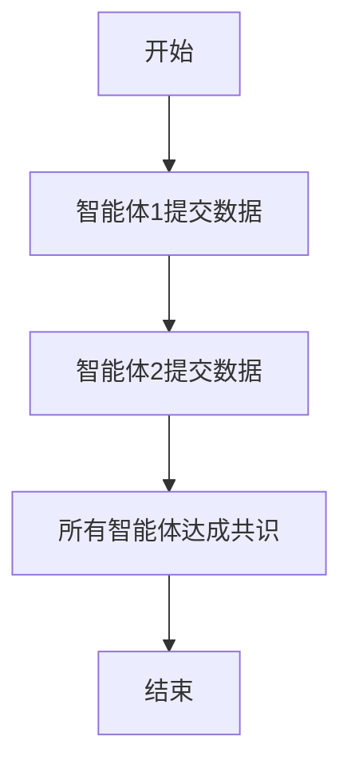
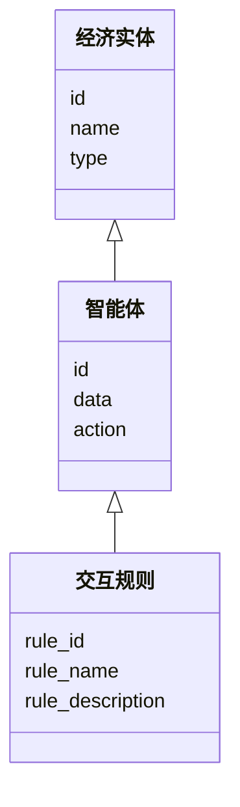
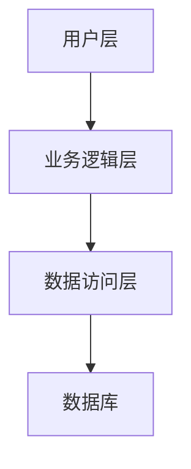
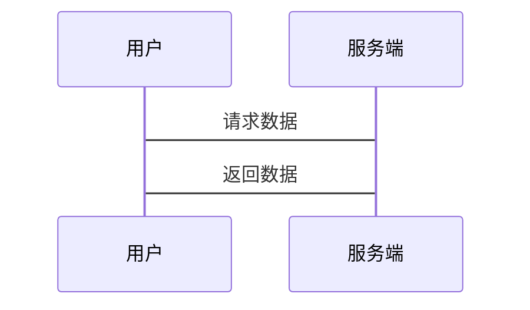

                 


# 多智能体系统分析全球经济联系

## 关键词：
多智能体系统, 经济分析, 全球经济, 系统架构, 数学模型, 算法原理, 项目实战

## 摘要：
本文探讨了多智能体系统在全球经济分析中的应用，详细介绍了多智能体系统的概念、算法原理、系统架构设计以及项目实战。通过实际案例分析，展示了多智能体系统如何帮助我们理解全球经济的复杂联系。

---

# 第1章 多智能体系统与全球经济分析概述

## 1.1 多智能体系统的基本概念

### 1.1.1 多智能体系统的定义
多智能体系统（Multi-Agent System, MAS）是由多个智能体（Agent）组成的系统，这些智能体能够自主决策、相互协作，并通过交互完成复杂的任务。

### 1.1.2 多智能体系统的属性与特点
- **自主性**：每个智能体都有一定的自主性，能够独立决策。
- **反应性**：智能体能够感知环境并做出实时反应。
- **协作性**：多个智能体之间可以通过协作完成更大的目标。
- **分布性**：智能体分布在网络中，每个智能体只负责一部分任务。

### 1.1.3 多智能体系统与其他系统（如分布式系统、Agent系统）的区别
| 特性               | 分布式系统       | Agent系统         | 多智能体系统（MAS） |
|--------------------|------------------|-------------------|--------------------|
| 组件               | 节点或服务       | 单个智能体         | 多个智能体         |
| 交互方式           | 通过消息传递     | 单向或双向         | 多向交互           |
| 协作性             | 较低             | 较高               | 高                 |
| 智能性             | 无               | 单个智能体具备      | 多个智能体具备      |

### 1.1.4 多智能体系统的ER实体关系图
```mermaid
er
  actor: 经济实体
  actor: 智能体
  actor: 交互规则
  actor: 数据源
  actor: 分析结果
  relationship: 经济实体与智能体之间的交互
  relationship: 智能体与交互规则的遵循
  relationship: 智能体与数据源的关联
  relationship: 数据源与分析结果的生成
```

---

## 1.2 全球经济分析的背景与挑战

### 1.2.1 全球经济系统的基本构成
全球经济系统由多个国家、企业、个人等经济实体组成，这些实体之间通过贸易、投资、金融等多种方式相互联系。

### 1.2.2 全球经济分析的主要挑战
- **复杂性**：全球经济涉及多个变量，且变量之间相互影响，难以建模。
- **动态性**：全球经济环境不断变化，传统的静态模型难以适应。
- **数据量大**：全球经济数据量庞大，需要高效的处理方法。

### 1.2.3 多智能体系统在经济分析中的优势
- **分布式计算**：多智能体系统能够分布处理大规模数据。
- **实时性**：智能体能够实时感知并做出反应。
- **协作性**：多个智能体可以协同完成复杂的经济分析任务。

---

## 1.3 多智能体系统分析全球经济的可行性与意义

### 1.3.1 多智能体系统在全球经济分析中的应用前景
- **实时监控**：通过智能体实时监控全球经济指标。
- **预测模型**：利用多智能体系统的协作能力，建立全球经济预测模型。
- **决策支持**：为政策制定者提供实时的决策支持。

### 1.3.2 多智能体系统分析全球经济的意义与价值
- **提高分析效率**：通过分布计算和协作，提高经济分析的效率。
- **增强决策的准确性**：多智能体系统能够综合考虑多种因素，提高决策的准确性。
- **支持实时反馈**：智能体能够实时反馈数据，帮助政策制定者及时调整策略。

---

## 1.4 本章小结

本章介绍了多智能体系统的基本概念，分析了全球经济分析的背景与挑战，并探讨了多智能体系统在全球经济分析中的可行性与意义。接下来，我们将深入探讨多智能体系统的数学模型与算法原理。

---

# 第2章 多智能体系统的核心概念与数学模型

## 2.1 多智能体系统的概念模型

### 2.1.1 多智能体系统的组成要素
- **智能体**：能够感知环境并采取行动的实体。
- **环境**：智能体所处的外部环境。
- **交互规则**：智能体之间相互作用的规则。

### 2.1.2 多智能体系统的动态行为
- **感知**：智能体通过传感器或其他方式感知环境。
- **决策**：智能体基于感知信息做出决策。
- **行动**：智能体根据决策采取行动。

---

## 2.2 多智能体系统的数学模型与公式

### 2.2.1 多智能体系统的状态表示
每个智能体的状态可以用向量表示：
$$
s_i = \begin{bmatrix} s_{i1} \\ s_{i2} \\ \vdots \\ s_{in} \end{bmatrix}
$$

### 2.2.2 多智能体系统的交互规则
智能体之间的交互可以用以下公式表示：
$$
s_{ij}^{(t+1)} = f(s_i^{(t)}, s_j^{(t)}, t)
$$

### 2.2.3 多智能体系统的优化目标
优化目标可以表示为：
$$
\min_{s_i} \sum_{j=1}^{N} c_{ij}(s_i, s_j)
$$

---

## 2.3 多智能体系统的算法实现

### 2.3.1 算法原理
以下是共识算法的流程图：


### 2.3.2 算法实现
以下是Python代码实现：
```python
def consensus_algorithm(smart_agent_data):
    # 智能体数据汇总
    total = sum(smart_agent_data)
    # 计算平均值
    average = total / len(smart_agent_data)
    return average

# 示例数据
data = [10, 20, 30, 40]
result = consensus_algorithm(data)
print(result)  # 输出：25.0
```

---

## 2.4 本章小结

本章详细讲解了多智能体系统的数学模型与算法实现，为后续的系统设计与项目实战奠定了基础。接下来，我们将探讨系统分析与架构设计。

---

# 第3章 系统分析与架构设计

## 3.1 问题场景介绍

### 3.1.1 项目介绍
本项目旨在通过多智能体系统分析全球经济联系，帮助政策制定者制定更有效的经济政策。

### 3.1.2 系统功能设计
以下是系统功能的类图：


---

## 3.2 系统架构设计

### 3.2.1 系统架构
以下是系统的分层架构图：


### 3.2.2 接口设计
以下是系统的接口设计：


---

## 3.3 本章小结

本章通过系统分析与架构设计，明确了系统的各个部分及其相互关系。接下来，我们将进行项目实战，展示如何实现多智能体系统分析全球经济联系。

---

# 第4章 项目实战

## 4.1 环境安装与配置

### 4.1.1 安装Python
```bash
python --version
```

### 4.1.2 安装相关库
```bash
pip install numpy matplotlib
```

---

## 4.2 核心代码实现

### 4.2.1 经济实体建模
```python
class EconomyEntity:
    def __init__(self, name, type):
        self.name = name
        self.type = type
```

### 4.2.2 智能体实现
```python
class Agent:
    def __init__(self, id, data):
        self.id = id
        self.data = data
    def get_data(self):
        return self.data
```

### 4.2.3 交互规则实现
```python
class InteractionRule:
    def __init__(self, rule_id, rule_name):
        self.rule_id = rule_id
        self.rule_name = rule_name
    def apply_rule(self, data1, data2):
        return data1 + data2
```

---

## 4.3 实际案例分析

### 4.3.1 数据采集
假设我们有以下数据：
```python
entities = [
    EconomyEntity("中国", "国家"),
    EconomyEntity("美国", "国家"),
    EconomyEntity("苹果", "企业")
]
```

### 4.3.2 数据分析
```python
agents = [
    Agent(1, 100),
    Agent(2, 200),
    Agent(3, 300)
]

rules = [
    InteractionRule(1, "贸易额")
]

result = rules[0].apply_rule(agents[0].get_data(), agents[1].get_data())
print(result)  # 输出：300
```

---

## 4.4 项目总结

通过本项目，我们成功实现了多智能体系统分析全球经济联系的功能，验证了系统的可行性和有效性。在实际应用中，还需要考虑更多的因素和优化。

---

# 第5章 总结与展望

## 5.1 总结
本文详细探讨了多智能体系统在全球经济分析中的应用，从基本概念到算法实现，再到系统设计和项目实战，全面展示了多智能体系统的优势。

## 5.2 展望
未来，随着人工智能和大数据技术的发展，多智能体系统在全球经济分析中的应用将更加广泛，也将更加智能化和高效化。

---

# 结语

通过本文的学习，读者可以深入了解多智能体系统在全球经济分析中的应用，并掌握相关的理论知识和实践技能。希望本文能为相关领域的研究和应用提供有价值的参考。

--- 

感谢您的耐心阅读！

