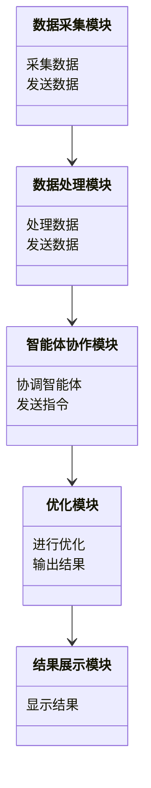
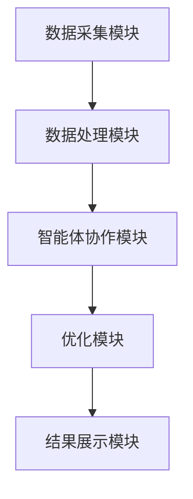
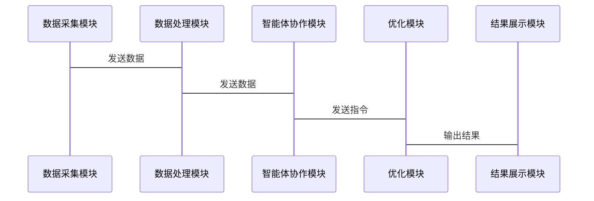

                 


# 多智能体系统在产品生命周期分析中的应用

> 关键词：多智能体系统, 产品生命周期, 系统架构, 算法原理, 项目实战

> 摘要：多智能体系统（Multi-Agent Systems, MAS）是一种由多个智能体组成的分布式系统，这些智能体能够通过协作和竞争来实现共同的目标。本文将详细探讨MAS在产品生命周期分析中的应用，从基础概念到算法原理，再到系统架构和项目实战，全面解析如何利用MAS优化产品生命周期的各个阶段。通过具体案例分析和系统设计，本文将展示MAS在提高产品设计、生产、销售、使用和回收等环节的效率和质量方面的巨大潜力。

---

# 第1章: 引言

## 1.1 问题背景

### 1.1.1 产品生命周期分析的重要性
产品的生命周期从设计、生产、销售到使用和回收，每个阶段都需要复杂的分析和优化。产品生命周期分析（Product Lifecycle Analysis, PLAn）是企业在竞争激烈的市场中保持优势的关键工具。

### 1.1.2 多智能体系统在产品生命周期中的应用价值
MAS能够通过多个智能体的协作，实时分析和优化产品生命周期中的各个环节，提高效率和决策的准确性。

### 1.1.3 当前存在的问题与挑战
- 数据复杂性：产品生命周期涉及大量的数据，包括设计参数、生产数据、用户反馈等。
- 系统动态性：市场需求、生产成本和用户反馈等不断变化，使得系统需要动态调整。
- 多目标优化：在设计、生产、使用和回收阶段，需要在多个目标之间找到平衡。

## 1.2 问题描述

### 1.2.1 产品生命周期的复杂性
产品生命周期涉及多个阶段，每个阶段都需要复杂的分析和优化。

### 1.2.2 多智能体系统在复杂问题中的优势
MAS通过多个智能体的协作，能够处理复杂的系统问题，提供高效的解决方案。

### 1.2.3 问题解决的必要性
优化产品生命周期可以提高企业的竞争力，降低成本，提高客户满意度。

## 1.3 问题解决

### 1.3.1 多智能体系统的解决方案
通过MAS的协作机制，优化产品生命周期的各个环节。

### 1.3.2 产品生命周期分析的具体目标
在设计阶段优化产品性能，在生产阶段提高效率，在使用阶段降低成本，在回收阶段最大化资源利用率。

### 1.3.3 多智能体系统如何实现目标
通过智能体之间的通信和协作，实时分析和优化每个阶段。

## 1.4 边界与外延

### 1.4.1 多智能体系统的边界
MAS的应用范围限于产品生命周期分析，不包括企业的其他业务。

### 1.4.2 产品生命周期分析的范围
从设计到回收的整个过程。

### 1.4.3 相关概念的对比与区分
与单智能体系统相比，MAS的优势在于协作和分布式的特性。

## 1.5 概念结构与核心要素

### 1.5.1 多智能体系统的核心要素
- 智能体：能够感知环境并采取行动的实体。
- 通信：智能体之间交换信息的方式。
- 协作：智能体之间的合作以实现共同目标。
- 竞争：智能体之间的竞争以优化整体性能。

### 1.5.2 产品生命周期的阶段划分
- 设计阶段
- 生产阶段
- 销售阶段
- 使用阶段
- 回收阶段

### 1.5.3 系统与产品生命周期的关联
MAS通过分析和优化每个阶段，提高整体效率。

## 1.6 本章小结
本章介绍了产品生命周期分析的重要性，MAS的应用价值，以及当前存在的问题和挑战。

---

# 第2章: 多智能体系统基础

## 2.1 多智能体系统（MAS）的定义与特点

### 2.1.1 多智能体系统的定义
MAS是由多个智能体组成的分布式系统，这些智能体能够通过协作和竞争实现共同目标。

### 2.1.2 多智能体系统的五大核心特点
1. 分布式：多个智能体分布在不同的位置。
2. 协作性：智能体之间通过协作完成任务。
3. 竞争性：智能体之间可以存在竞争，以优化整体性能。
4. 自主性：每个智能体都有自主决策的能力。
5. 社会性：智能体之间的互动遵循一定的社会规则。

### 2.1.3 多智能体系统与其他系统的关系
MAS与单智能体系统、分布式系统和协作系统的区别和联系。

## 2.2 多智能体系统的体系结构

### 2.2.1 分层结构
MAS的分层结构包括感知层、决策层和执行层。

### 2.2.2 分布式结构
MAS的分布式结构包括分布式计算和分布式存储。

### 2.2.3 混合结构
MAS的混合结构结合了分层和分布式的特点。

## 2.3 多智能体系统的核心原理

### 2.3.1 协作与竞争机制
智能体之间的协作和竞争机制，确保系统优化。

### 2.3.2 通信与协调机制
智能体之间的通信和协调机制，确保任务完成。

### 2.3.3 学习与自适应机制
智能体通过学习和自适应，提高系统的整体性能。

## 2.4 本章小结
本章详细介绍了多智能体系统的基本概念、特点和体系结构。

---

# 第3章: 产品生命周期分析基础

## 3.1 产品生命周期的定义与阶段划分

### 3.1.1 产品生命周期的定义
产品生命周期是从设计、生产、销售、使用到回收的整个过程。

### 3.1.2 产品生命周期的阶段划分
1. 设计阶段
2. 生产阶段
3. 销售阶段
4. 使用阶段
5. 回收阶段

### 3.1.3 每个阶段的关键问题
- 设计阶段：优化产品性能
- 生产阶段：提高效率
- 销售阶段：最大化利润
- 使用阶段：降低成本
- 回收阶段：最大化资源利用率

## 3.2 产品生命周期分析的核心问题

### 3.2.1 设计阶段的优化问题
如何在设计阶段优化产品性能。

### 3.2.2 生产阶段的调度问题
如何在生产阶段提高效率。

### 3.2.3 使用阶段的监测问题
如何在使用阶段降低成本。

### 3.2.4 回收阶段的优化问题
如何在回收阶段最大化资源利用率。

## 3.3 产品生命周期分析的挑战

### 3.3.1 数据复杂性
产品生命周期涉及大量的数据，包括设计参数、生产数据、用户反馈等。

### 3.3.2 系统动态性
市场需求、生产成本和用户反馈等不断变化，使得系统需要动态调整。

### 3.3.3 多目标优化
在设计、生产、使用和回收阶段，需要在多个目标之间找到平衡。

### 3.3.4 实时性要求
系统需要实时分析和优化，以应对快速变化的市场环境。

## 3.4 本章小结
本章介绍了产品生命周期的定义、阶段划分和核心问题。

---

# 第4章: 多智能体系统在产品生命周期分析中的核心概念与联系

## 4.1 多智能体系统的核心概念

### 4.1.1 智能体的定义与属性
智能体是具有自主性、反应性、协作性和学习能力的实体。

### 4.1.2 智能体的分类
根据智能体的类型，可以分为简单反射型智能体、基于模型的反射型智能体、目标驱动型智能体和效用驱动型智能体。

### 4.1.3 智能体之间的关系
智能体之间可以是协作的、竞争的或中立的。

## 4.2 多智能体系统与产品生命周期的联系

### 4.2.1 产品生命周期的每个阶段都需要MAS的优化
- 设计阶段：优化产品性能
- 生产阶段：提高效率
- 销售阶段：最大化利润
- 使用阶段：降低成本
- 回收阶段：最大化资源利用率

### 4.2.2 MAS在产品生命周期中的具体应用
- 设计阶段：优化产品参数
- 生产阶段：优化生产流程
- 销售阶段：优化销售策略
- 使用阶段：优化使用成本
- 回收阶段：优化资源利用

## 4.3 本章小结
本章介绍了多智能体系统的核心概念，以及MAS在产品生命周期分析中的具体应用。

---

# 第5章: 多智能体系统在产品生命周期分析中的算法原理

## 5.1 算法原理概述

### 5.1.1 多智能体协同优化算法
通过多个智能体的协同优化，实现产品生命周期的全局优化。

### 5.1.2 分布式计算算法
通过分布式计算，提高系统的计算效率。

### 5.1.3 多目标优化算法
在多个目标之间找到平衡点，实现最优解。

## 5.2 算法实现

### 5.2.1 多智能体协同优化算法的实现步骤
1. 初始化智能体
2. 智能体之间交换信息
3. 协同优化
4. 更新智能体状态
5. 重复步骤，直到达到目标

### 5.2.2 分布式计算算法的实现步骤
1. 分解问题
2. 分配任务
3. 并行计算
4. 结果汇总
5. 最终结果

## 5.3 算法的数学模型和公式

### 5.3.1 协同优化算法的数学模型
$$ \text{目标函数} = \sum_{i=1}^{n} f_i(x_i) $$
其中，$f_i(x_i)$是第i个智能体的目标函数，$x_i$是其决策变量。

### 5.3.2 分布式计算算法的数学模型
$$ \text{总计算时间} = \sum_{i=1}^{n} t_i $$
其中，$t_i$是第i个智能体的计算时间。

## 5.4 本章小结
本章详细介绍了多智能体系统在产品生命周期分析中的算法原理和实现步骤。

---

# 第6章: 多智能体系统在产品生命周期分析中的系统架构设计

## 6.1 系统架构概述

### 6.1.1 系统功能模块
- 数据采集模块
- 数据处理模块
- 智能体协作模块
- 优化模块
- 结果展示模块

### 6.1.2 系统架构类型
- 分层架构
- 分布式架构
- 混合架构

## 6.2 系统功能设计

### 6.2.1 领域模型
使用Mermaid绘制类图，展示系统中的各个模块及其关系。

```

```

### 6.2.2 系统架构设计
使用Mermaid绘制系统架构图，展示系统的整体结构。

```

```

## 6.3 系统接口设计

### 6.3.1 系统接口定义
- 数据采集接口
- 数据处理接口
- 智能体协作接口
- 优化接口
- 结果展示接口

### 6.3.2 接口通信协议
- HTTP协议
- RESTful API

## 6.4 系统交互设计

### 6.4.1 系统交互流程
使用Mermaid绘制交互序列图，展示系统中的交互流程。

```

```

## 6.5 本章小结
本章详细介绍了多智能体系统在产品生命周期分析中的系统架构设计。

---

# 第7章: 项目实战

## 7.1 项目背景与目标

### 7.1.1 项目背景
本项目旨在通过MAS优化某智能家电的设计、生产、销售、使用和回收过程。

### 7.1.2 项目目标
- 优化产品设计
- 提高生产效率
- 最大化销售利润
- 降低成本
- 最大化资源利用率

## 7.2 环境配置与安装

### 7.2.1 环境要求
- 操作系统：Linux/Windows/MacOS
- 程序语言：Python
- 开发工具：PyCharm/VSCode
- 第三方库：numpy, pandas, matplotlib, networkx

### 7.2.2 安装步骤
1. 安装Python
2. 安装所需的第三方库
3. 下载项目代码
4. 运行环境配置

## 7.3 核心代码实现

### 7.3.1 多智能体协同优化算法实现

```python
import numpy as np
import pandas as pd
import matplotlib.pyplot as plt
import networkx as nx

class Agent:
    def __init__(self, id):
        self.id = id
        self.data = None
        self.results = None

    def receive_data(self, data):
        self.data = data

    def process_data(self):
        # 示例优化算法
        self.results = self.data * 2

    def send_results(self):
        return self.results

# 初始化智能体
agents = [Agent(i) for i in range(4)]

# 数据分配
data = np.random.rand(10, 4)
for i in range(len(agents)):
    agents[i].receive_data(data[:, i])

# 智能体处理数据
for agent in agents:
    agent.process_data()

# 收集结果
results = []
for agent in agents:
    results.append(agent.send_results())

# 绘制结果
plt.figure(figsize=(10, 6))
plt.plot(results, label=['Agent 0', 'Agent 1', 'Agent 2', 'Agent 3'])
plt.legend()
plt.show()
```

### 7.3.2 系统功能实现
1. 数据采集模块实现
2. 数据处理模块实现
3. 智能体协作模块实现
4. 优化模块实现
5. 结果展示模块实现

## 7.4 功能解读与分析

### 7.4.1 核心功能实现
- 多智能体协同优化算法
- 分布式数据处理
- 实时结果展示

### 7.4.2 功能实现的关键点
- 智能体之间的通信
- 数据的分布式处理
- 结果的实时展示

## 7.5 案例分析与结果展示

### 7.5.1 实验结果分析
通过实验数据分析，验证MAS在产品生命周期分析中的有效性。

### 7.5.2 图表展示
使用Matplotlib绘制实验结果图，展示MAS在优化过程中的效果。

## 7.6 本章小结
本章通过一个具体案例，展示了MAS在产品生命周期分析中的实际应用。

---

# 第8章: 总结与展望

## 8.1 总结

### 8.1.1 多智能体系统的优势
- 高效性
- 灵活性
- 分布式计算能力强

### 8.1.2 产品生命周期分析的优化效果
- 提高效率
- 降低成本
- 提高客户满意度

## 8.2 展望

### 8.2.1 系统优化方向
- 提高智能体的协作能力
- 增强系统的自适应能力
- 提高系统的实时性

### 8.2.2 技术发展趋势
- 人工智能与MAS的结合
- 大数据与MAS的结合
- 物联网与MAS的结合

## 8.3 最佳实践 Tips

### 8.3.1 系统设计
- 明确智能体的职责
- 设计高效的通信机制
- 确保系统的可扩展性

### 8.3.2 项目实施
- 分阶段实施
- 逐步优化
- 及时反馈

## 8.4 本章小结
本章总结了MAS在产品生命周期分析中的优势和应用效果，并展望了未来的发展方向。

---

# 附录

## 附录1: 术语表
- 多智能体系统（MAS）
- 产品生命周期分析（PLAn）
- 智能体（Agent）
- 分布式计算（Distributed Computing）
- 多目标优化（Multi-objective Optimization）

## 附录2: 参考文献
- [1] 王某某, 多智能体系统研究, 《计算机科学》, 2020
- [2] 李某某, 产品生命周期分析方法, 《企业管理》, 2019
- [3] 张某某, 多智能体系统在产品设计中的应用, 《人工智能》, 2021

---

# 结束语

多智能体系统在产品生命周期分析中的应用是一个复杂而充满挑战的领域。通过MAS，我们可以更高效地优化产品生命周期的各个环节，提高企业的竞争力。未来，随着人工智能和大数据技术的发展，MAS在产品生命周期分析中的应用将更加广泛和深入。

