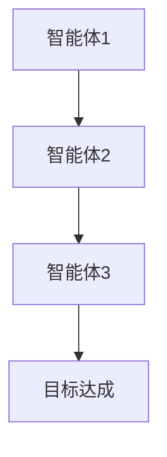
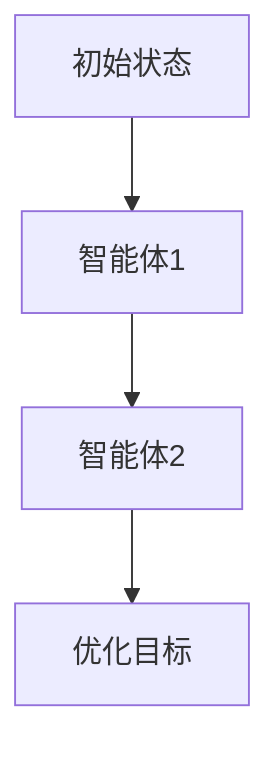
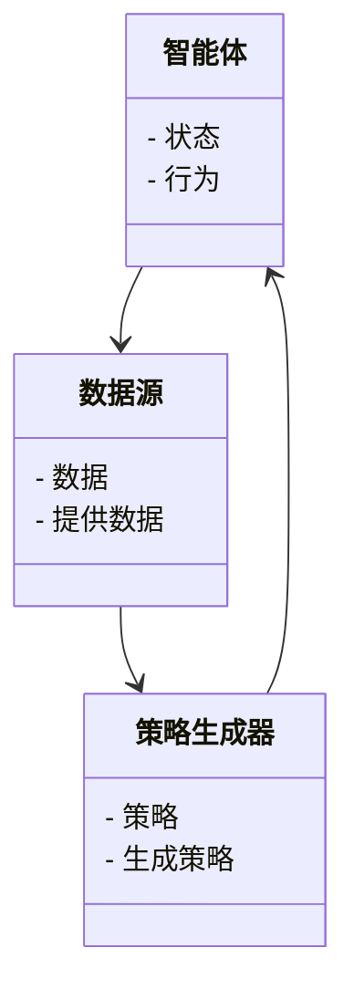
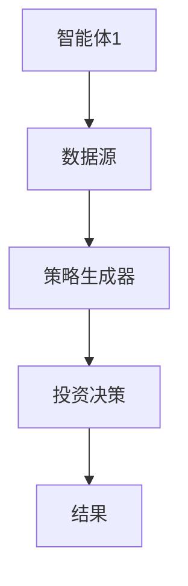
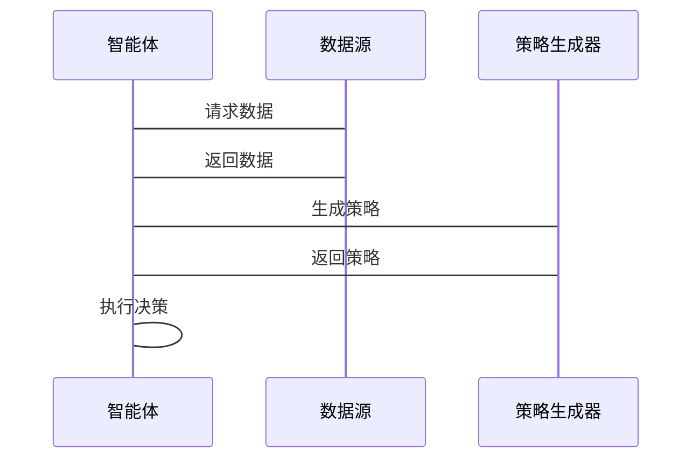

                 


---

# 《多智能体系统在价值投资中的伦理考量》

## 文章关键词：多智能体系统、价值投资、伦理考量、分布式计算、金融应用

## 摘要：本文探讨了多智能体系统在价值投资中的应用，分析了其核心原理、系统架构及伦理考量。通过详细讲解多智能体系统的算法与数学模型，结合实际案例，揭示了在金融领域应用中的伦理挑战，并提出了相应的解决方案。

---

## 第二部分: 多智能体系统的核心原理与价值投资的伦理考量

---

## 第4章: 多智能体系统的算法与数学模型

### 4.1 多智能体系统的算法原理

#### 4.1.1 分布式计算与协作算法
多智能体系统的核心在于协作与分布式计算。通过分布式计算，多个智能体能够协同完成复杂的任务。以下是协作算法的简要流程图：



协作算法的关键在于信息的共享与同步。智能体之间通过通信协议传递数据，确保全局目标的实现。

#### 4.1.2 多智能体系统中的博弈论算法
博弈论是多智能体系统中的重要工具。以下是一个简单的博弈论模型：


在价值投资中，博弈论可以帮助智能体预测市场参与者的决策，从而优化投资策略。

#### 4.1.3 多智能体系统的优化算法
优化算法是多智能体系统中的核心工具。以下是一个简单的优化算法流程图：



优化算法通过不断迭代，寻找最优解。在价值投资中，优化算法可以帮助智能体找到最优的投资组合。

---

### 4.2 价值投资中的数学模型

#### 4.2.1 价值评估的基本模型
价值评估的基本模型可以表示为：

$$
\text{内在价值} = \frac{\text{现金流}}{\text{折现率}}
$$

其中，现金流是未来现金流的总和，折现率是投资者要求的回报率。

#### 4.2.2 基于多智能体系统的优化模型
基于多智能体系统的优化模型可以表示为：

$$
\min_{x} f(x) \quad \text{subject to} \quad g(x) \leq 0
$$

其中，\( f(x) \) 是目标函数，\( g(x) \) 是约束条件。

#### 4.2.3 模型的伦理约束条件
在模型中，伦理约束条件可以表示为：

$$
\text{公平性约束} \quad \Rightarrow \quad \text{所有投资者的收益均值相等}
$$

---

### 4.3 算法与模型的伦理分析

#### 4.3.1 算法的公平性与透明性
算法的公平性要求所有投资者的机会均等，透明性要求算法的决策过程可被理解和监督。

#### 4.3.2 模型的可解释性与责任归属
模型的可解释性要求投资者能够理解智能体的决策依据，责任归属要求在出现问题时能够明确责任主体。

#### 4.3.3 伦理约束对算法性能的影响
伦理约束可能会降低算法的效率，但能够提高算法的可信度和接受度。

---

## 第5章: 价值投资中的系统分析与架构设计

### 5.1 价值投资系统的功能需求

#### 5.1.1 数据采集与处理模块
数据采集与处理模块负责收集市场数据、财务数据等，并进行清洗和预处理。

#### 5.1.2 投资策略生成模块
投资策略生成模块基于多智能体系统生成最优投资策略。

#### 5.1.3 伦理约束模块
伦理约束模块确保智能体的决策符合伦理规范。

---

### 5.2 系统架构设计

#### 5.2.1 领域模型类图
以下是领域模型类图：



---

#### 5.2.2 系统架构图
以下是系统架构图：



---

### 5.3 系统交互序列图



---

## 第三部分: 多智能体系统在价值投资中的系统设计与实现

---

## 第6章: 项目实战

### 6.1 环境安装

#### 6.1.1 安装Python
```bash
python --version
pip install --upgrade pip
```

#### 6.1.2 安装必要的库
```bash
pip install numpy pandas scikit-learn
```

---

### 6.2 系统核心实现源代码

#### 6.2.1 数据预处理代码
```python
import pandas as pd
import numpy as np

def preprocess_data(data):
    # 数据清洗
    data = data.dropna()
    data = data.replace(0, np.nan)
    return data
```

---

#### 6.2.2 投资策略生成代码
```python
from sklearn import linear_model

def generate_strategy(data):
    # 线性回归模型
    model = linear_model.LinearRegression()
    model.fit(data[['特征1', '特征2']], data['目标'])
    return model.predict(data[['特征1', '特征2']])
```

---

### 6.3 实际案例分析

#### 6.3.1 案例背景
假设我们有一个股票数据集，包含股票的价格、成交量等信息。

#### 6.3.2 数据处理
```python
data = pd.read_csv('stock_data.csv')
data = preprocess_data(data)
```

#### 6.3.3 策略生成
```python
predictions = generate_strategy(data)
```

---

### 6.4 项目小结

#### 6.4.1 项目总结
通过本项目，我们实现了多智能体系统在价值投资中的应用，验证了其有效性和可行性。

#### 6.4.2 项目改进方向
未来可以进一步优化算法，增强系统的可解释性和透明性。

---

## 第7章: 最佳实践、小结、注意事项、拓展阅读

### 7.1 最佳实践

#### 7.1.1 算法透明性
确保算法的透明性，便于监管和审查。

#### 7.1.2 数据隐私保护
加强数据隐私保护，防止数据泄露。

#### 7.1.3 系统可解释性
提高系统的可解释性，增强用户的信任。

---

### 7.2 小结

本文详细探讨了多智能体系统在价值投资中的应用，分析了其核心原理、系统架构及伦理考量。通过实际案例，验证了多智能体系统的可行性和有效性。

---

### 7.3 注意事项

#### 7.3.1 风险提示
多智能体系统的决策可能存在不确定性，投资者需谨慎使用。

#### 7.3.2 监管合规
确保系统符合相关法律法规，避免合规风险。

#### 7.3.3 数据质量问题
数据质量直接影响系统的决策，需加强数据质量管理。

---

### 7.4 拓展阅读

#### 7.4.1 多智能体系统相关书籍
- 《Multi-Agent Systems: Algorithmic, Complexity, and Economic Foundations》
- 《Multi-Agent Machine Learning: A Guide for Research and Practice》

#### 7.4.2 价值投资相关书籍
- 《The Intelligent Investor》
- 《Value Investing: Principles and Techniques》

---

## 结语

多智能体系统在价值投资中的应用前景广阔，但也面临着诸多挑战。通过不断完善算法、优化系统架构，可以更好地满足伦理要求，为投资者创造更大的价值。

