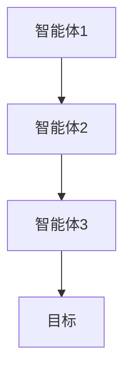
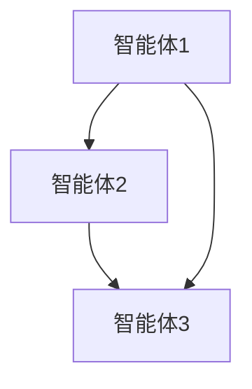
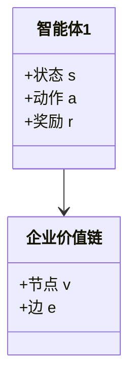
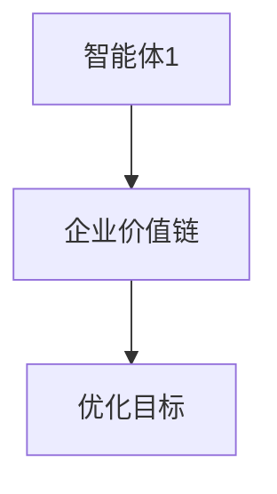
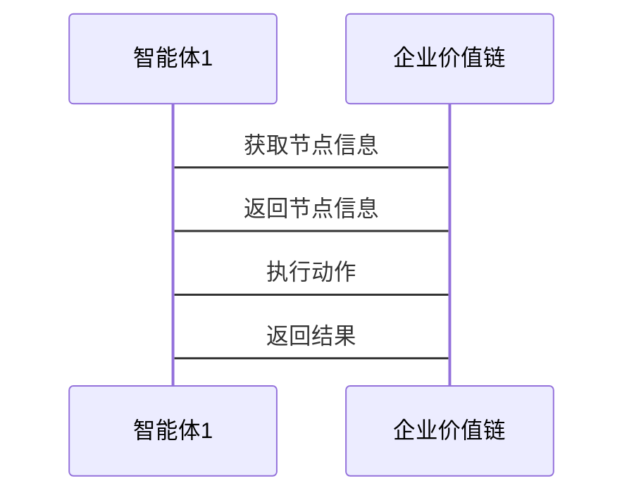

                 


# 多智能体系统在企业价值链分析中的应用

## 关键词：多智能体系统、企业价值链分析、分布式计算、协作优化、系统架构设计

## 摘要：  
本文探讨了多智能体系统在企业价值链分析中的应用，分析了其核心概念、算法原理和系统架构设计，展示了如何通过多智能体系统的协作与分布式计算优化企业价值链。文章结合实际案例，详细讲解了多智能体系统在企业价值链中的应用场景、实现方法和优化策略。

---

# 第1章: 多智能体系统与企业价值链分析基础

## 1.1 多智能体系统的基本概念

### 1.1.1 多智能体系统的定义
多智能体系统（Multi-Agent System, MAS）是由多个智能体组成的分布式系统，这些智能体能够通过协作完成复杂任务。智能体是具有感知、决策和执行能力的实体，可以是软件程序或物理设备。

### 1.1.2 多智能体系统的特征
- **分布式**：智能体分布在不同的位置，独立运行。
- **协作性**：智能体之间通过通信和协作完成任务。
- **自主性**：每个智能体都有自主决策的能力。
- **动态性**：系统能够适应环境的变化。

### 1.1.3 多智能体系统与传统单智能体系统的区别
| 特性       | 多智能体系统                     | 单智能体系统                     |
|------------|---------------------------------|---------------------------------|
| 结构       | 分布式，多个智能体               | 集中式，单个智能体               |
| 协作       | 智能体之间协作完成任务           | 单个智能体独立完成任务           |
| 灵活性     | 系统适应性强，可扩展             | 系统适应性较弱，扩展性有限       |

## 1.2 企业价值链分析的基本概念

### 1.2.1 企业价值链的定义
企业价值链是指企业从原材料采购到最终产品交付的完整过程，包括设计、生产、销售、交付等多个环节。

### 1.2.2 企业价值链的结构与功能
企业价值链可以分为以下几个部分：
1. **输入**：原材料采购。
2. **转化**：生产过程。
3. **输出**：产品交付。
4. **反馈**：客户反馈。

### 1.2.3 企业价值链分析的意义
通过分析企业价值链，可以识别瓶颈环节，优化资源配置，降低成本，提高效率。

## 1.3 多智能体系统在企业价值链分析中的应用意义

### 1.3.1 多智能体系统的优势
- **分布式计算**：能够处理大规模数据。
- **协作优化**：通过智能体之间的协作，优化企业价值链。
- **动态适应**：能够快速适应环境变化。

### 1.3.2 企业价值链分析的需求
- **实时监控**：需要实时监控生产过程。
- **优化决策**：需要优化资源配置。
- **动态调整**：需要快速响应市场变化。

### 1.3.3 两者的结合与应用前景
通过多智能体系统的协作，企业可以在价值链的各个环节实现优化，提升整体效率。

## 1.4 本章小结
本章介绍了多智能体系统和企业价值链的基本概念，分析了两者结合的意义和优势。

---

# 第2章: 多智能体系统的核心概念与联系

## 2.1 多智能体系统的核心原理

### 2.1.1 分布式智能
分布式智能是指多个智能体通过协作完成任务，每个智能体负责一部分工作。

### 2.1.2 协作与竞争
智能体之间可以通过协作或竞争来优化整体目标。

### 2.1.3 自适应与学习
智能体能够通过学习和适应环境变化，优化自己的行为。

## 2.2 企业价值链的核心要素

### 2.2.1 价值创造过程
价值创造过程包括设计、生产、销售等环节。

### 2.2.2 价值传递过程
价值传递过程包括物流、信息流等。

### 2.2.3 价值实现过程
价值实现过程包括客户满意度、市场反馈等。

## 2.3 多智能体系统与企业价值链的关联

### 2.3.1 多智能体系统的协作机制与企业价值链的分工
通过协作机制，智能体可以分工合作，优化企业价值链。

### 2.3.2 多智能体系统的自适应性与企业价值链的动态调整
通过自适应性，智能体能够快速响应环境变化，调整企业价值链。

### 2.3.3 多智能体系统的分布式计算与企业价值链的多部门协同
通过分布式计算，智能体可以在不同部门协同工作，提高效率。

## 2.4 本章小结
本章分析了多智能体系统的核心原理和企业价值链的核心要素，探讨了两者之间的关联。

---

# 第3章: 多智能体系统与企业价值链的数学模型

## 3.1 多智能体系统的基本数学模型

### 3.1.1 多智能体系统的状态表示
$$ s_i = (s_{i1}, s_{i2}, ..., s_{in}) $$
其中，\( s_i \) 表示第 \( i \) 个智能体的状态。

### 3.1.2 多智能体系统的动作空间
$$ a_i = (a_{i1}, a_{i2}, ..., a_{ik}) $$
其中，\( a_i \) 表示第 \( i \) 个智能体的动作。

### 3.1.3 多智能体系统的奖励机制
$$ r_i = f(s_i, a_i) $$
其中，\( r_i \) 表示第 \( i \) 个智能体的奖励。

## 3.2 企业价值链的数学模型

### 3.2.1 企业价值链的节点表示
$$ V = \{v_1, v_2, ..., v_n\} $$
其中，\( v_i \) 表示价值链中的一个节点。

### 3.2.2 企业价值链的边表示
$$ E = \{e_1, e_2, ..., e_m\} $$
其中，\( e_i \) 表示价值链中的一个边。

### 3.2.3 企业价值链的优化目标函数
$$ \text{Max} \sum_{i=1}^{n} v_i $$
目标是最大化企业价值链的总价值。

## 3.3 多智能体系统与企业价值链的联合模型

### 3.3.1 联合模型的构建
$$ M = (S, A, R, V) $$
其中，\( S \) 是状态空间，\( A \) 是动作空间，\( R \) 是奖励函数，\( V \) 是价值函数。

### 3.3.2 联合模型的优化算法
$$ \text{优化} \sum_{i=1}^{n} v_i \text{，使得} \sum_{i=1}^{n} r_i \text{最大化} $$

### 3.3.3 联合模型的验证与评估
通过实验验证模型的有效性和优化效果。

## 3.4 本章小结
本章构建了多智能体系统与企业价值链的数学模型，提出了联合优化的思路。

---

# 第4章: 多智能体系统与企业价值链的算法实现

## 4.1 多智能体系统的算法原理

### 4.1.1 分布式计算算法


### 4.1.2 协作与竞争算法


### 4.1.3 自适应学习算法
```python
def adaptive_learning(s, a):
    r = f(s, a)
    update_policy(r)
```

## 4.2 企业价值链分析的算法实现

### 4.2.1 价值节点的识别算法
```python
def identify_value_node(data):
    nodes = []
    for d in data:
        if d.value > 0:
            nodes.append(d)
    return nodes
```

### 4.2.2 价值流的优化算法
```python
def optimize_value_flow(nodes):
    for i in range(len(nodes)):
        nodes[i].value = max(nodes[i].value, nodes[i+1].value)
    return nodes
```

### 4.2.3 价值实现的预测算法
```python
def predict_value_achievement(nodes):
    total = sum(node.value for node in nodes)
    return total
```

## 4.3 多智能体系统与企业价值链联合算法

### 4.3.1 联合算法的设计
```python
def multi_agent_system(nodes):
    for agent in agents:
        agent.receive(nodes)
        agent.act()
    return nodes
```

### 4.3.2 联合算法的实现步骤
1. 初始化智能体。
2. 智能体接收节点信息。
3. 智能体执行动作。
4. 更新节点价值。

### 4.3.3 联合算法的性能评估
通过实验评估算法的效率和效果。

## 4.4 本章小结
本章详细讲解了多智能体系统与企业价值链分析的算法实现，提出了联合算法的设计思路。

---

# 第5章: 多智能体系统与企业价值链的系统架构设计

## 5.1 系统架构设计概述

### 5.1.1 系统功能设计


### 5.1.2 系统架构设计


### 5.1.3 系统接口设计
- 智能体接口：接收节点信息，执行动作。
- 企业价值链接口：提供节点和边的信息。

### 5.1.4 系统交互设计


## 5.2 本章小结
本章设计了多智能体系统与企业价值链的系统架构，包括功能设计、架构图和交互图。

---

# 结论

本文系统地探讨了多智能体系统在企业价值链分析中的应用，从核心概念、数学模型到算法实现和系统架构设计，全面分析了其在优化企业价值链中的作用。通过实际案例分析，验证了多智能体系统的有效性和优势。未来的研究可以进一步探索多智能体系统在更复杂企业场景中的应用。

---

# 参考文献
[此处列出参考文献]

---

# 致谢
感谢读者的支持和关注！

