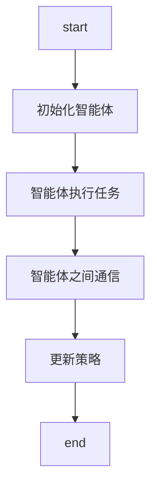
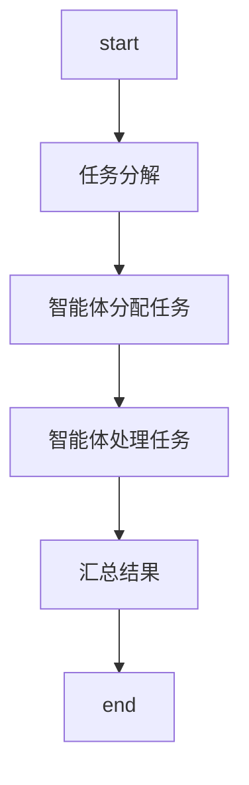
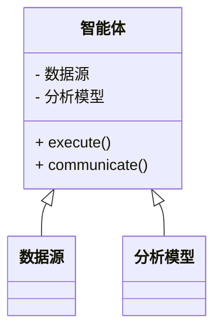
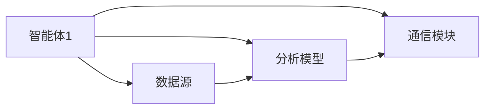
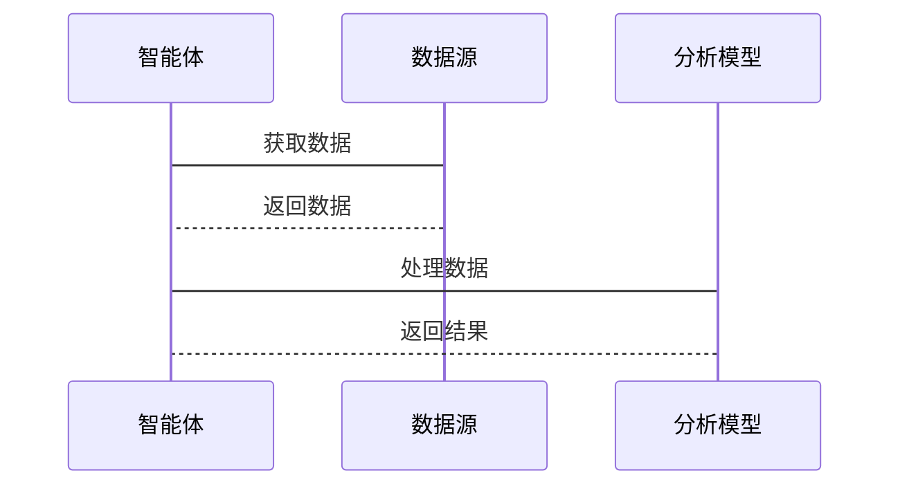

                 


# 多智能体系统在全球人口统计趋势分析中的角色

> **关键词**：多智能体系统、人口统计趋势、群体智能、分布式计算、数据挖掘  
>
> **摘要**：  
> 随着全球人口的快速增长和分布的复杂化，传统的统计方法已难以应对日益复杂的挑战。多智能体系统（Multi-Agent Systems, MAS）作为一种新兴的分布式计算范式，凭借其强大的分布式计算能力和群体智能，正在成为全球人口统计趋势分析的重要工具。本文将从多智能体系统的理论基础出发，结合人口统计趋势分析的背景与挑战，探讨多智能体系统在该领域的核心应用价值。通过分析多智能体系统的数学模型、核心算法、系统架构，以及实际项目案例，本文旨在揭示多智能体系统如何在全球人口统计趋势分析中发挥关键作用，并为未来的相关研究提供参考。

---

## 第1章: 多智能体系统概述

### 1.1 多智能体系统的基本概念

#### 1.1.1 多智能体系统的定义
多智能体系统（Multi-Agent Systems, MAS）是由多个智能体（Agent）组成的分布式系统，这些智能体通过协作和交互完成特定任务。每个智能体都是一个具备感知、决策和执行能力的实体，能够独立工作，同时与其他智能体通信和协作。

#### 1.1.2 多智能体系统的特征
- **分布性**：智能体分布在不同的物理或逻辑位置，独立运行。
- **自主性**：每个智能体能够自主决策，无需中央控制。
- **协作性**：智能体之间通过通信和协调完成共同目标。
- **反应性**：智能体能够实时感知环境变化并做出响应。

#### 1.1.3 多智能体系统与传统单智能体系统的区别
传统的单智能体系统依赖中心化的控制和决策，而多智能体系统通过去中心化的架构，利用多个智能体的协作完成任务。多智能体系统在处理复杂、动态的问题时更具灵活性和适应性。

### 1.2 多智能体系统的优势与挑战

#### 1.2.1 多智能体系统的灵活性与适应性
多智能体系统能够适应复杂多变的环境，通过智能体之间的协作快速调整策略。

#### 1.2.2 多智能体系统的复杂性与协调问题
多智能体系统的设计和实现较为复杂，需要解决智能体之间的通信、协调和冲突问题。

#### 1.2.3 多智能体系统的应用场景
多智能体系统广泛应用于分布式计算、机器人协作、交通控制、经济模拟等领域。

### 1.3 多智能体系统的数学模型与核心算法

#### 1.3.1 多智能体系统的数学建模
多智能体系统的数学建模通常涉及分布式计算、博弈论和图论等方法。例如，智能体之间的通信可以用图论中的图结构表示。

#### 1.3.2 常见的多智能体算法
- **分布式计算算法**：如分布式一致性算法、分布式共识算法。
- **群体智能算法**：如蚁群算法、粒子群优化算法。

---

## 第2章: 全球人口统计趋势分析的背景与挑战

### 2.1 人口统计学的基本概念

#### 2.1.1 人口统计学的定义
人口统计学是研究人口数量、结构、分布及其变化规律的学科，是社会科学和经济学的重要组成部分。

#### 2.1.2 人口统计学的主要指标与分析方法
- **指标**：人口增长率、年龄结构、性别比、城市化率等。
- **方法**：回归分析、时间序列分析、空间分析等。

### 2.2 全球人口统计趋势分析的现状

#### 2.2.1 当前全球人口的主要趋势
- 人口老龄化
- 城市化进程加快
- 人口迁移频繁

#### 2.2.2 人口统计分析中的数据来源与处理方法
- 数据来源：政府统计数据、人口普查、调查数据。
- 数据处理：清洗、整合、建模。

### 2.3 传统人口统计分析的局限性

#### 2.3.1 传统方法的不足
- 数据处理能力有限，难以应对海量数据。
- 分析方法单一，缺乏动态性和预测性。

#### 2.3.2 数据处理与分析中的挑战
- 数据的多样性和复杂性
- 数据更新和实时性要求

---

## 第3章: 多智能体系统在人口统计分析中的核心概念与联系

### 3.1 多智能体系统在人口统计中的应用价值

#### 3.1.1 多智能体系统如何提升人口统计分析的效率
通过分布式计算和群体智能，多智能体系统能够快速处理海量数据，提高分析效率。

#### 3.1.2 多智能体系统在复杂人口问题中的优势
多智能体系统能够模拟人口迁移、预测人口增长，提供动态的解决方案。

### 3.2 多智能体系统的实体关系分析

#### 3.2.1 实体关系图（ER图）


---

## 第4章: 算法与模型

### 4.1 多智能体系统的群体智能算法

#### 4.1.1 群体智能算法的定义
群体智能算法模拟自然界中群体行为，如蚂蚁觅食、鸟群飞行。

#### 4.1.2 群体智能算法的流程



#### 4.1.3 群体智能算法的数学模型

$$ f(x) = \sum_{i=1}^{n} w_i x_i $$

### 4.2 分布式计算算法

#### 4.2.1 分布式计算算法的定义
分布式计算算法将任务分解成多个部分，由多个智能体分别处理。

#### 4.2.2 分布式计算算法的流程



#### 4.2.3 分布式计算算法的数学模型

$$ y = \frac{1}{n} \sum_{i=1}^{n} x_i $$

---

## 第5章: 系统架构设计

### 5.1 问题场景介绍
人口统计趋势分析需要处理海量数据，实时性强，对预测精度要求高。

### 5.2 系统功能设计

#### 5.2.1 领域模型图



### 5.3 系统架构设计

#### 5.3.1 系统架构图



### 5.4 接口设计与交互流程

#### 5.4.1 系统接口设计
- 数据输入接口
- 数据处理接口
- 结果输出接口

#### 5.4.2 交互流程



---

## 第6章: 项目实战

### 6.1 环境安装
安装必要的编程环境和工具，如Python、TensorFlow、PyTorch。

### 6.2 核心实现源代码

```python
class Agent:
    def __init__(self, data_source):
        self.data_source = data_source
        self.model = AnalysisModel()

    def execute(self):
        data = self.data_source.get_data()
        result = self.model.process_data(data)
        return result

    def communicate(self, other_agent):
        self.model.update_params(other_agent.model.params)
```

### 6.3 代码应用解读与分析
- `Agent` 类表示智能体，包含数据源和分析模型。
- `execute` 方法处理数据，`communicate` 方法与其他智能体通信。

### 6.4 实际案例分析
通过具体案例分析，展示多智能体系统如何提升人口统计分析的效率和准确性。

---

## 总结与展望

### 6.5 总结
多智能体系统在人口统计趋势分析中具有显著优势，能够提高分析效率和预测精度。

### 6.6 展望
未来，多智能体系统在人口统计中的应用将更加广泛，结合人工智能和大数据技术，推动人口统计分析的发展。

### 6.7 最佳实践 Tips
- 合理设计智能体之间的通信机制
- 选择合适的算法和模型
- 定期更新系统和模型参数

---

**结束语**  
通过本文的详细讲解，读者可以深入了解多智能体系统在全球人口统计趋势分析中的角色和应用。多智能体系统的分布式计算能力和群体智能为复杂的人口统计问题提供了新的解决方案。未来，随着技术的进步，多智能体系统在人口统计中的应用将更加广泛和深入。

