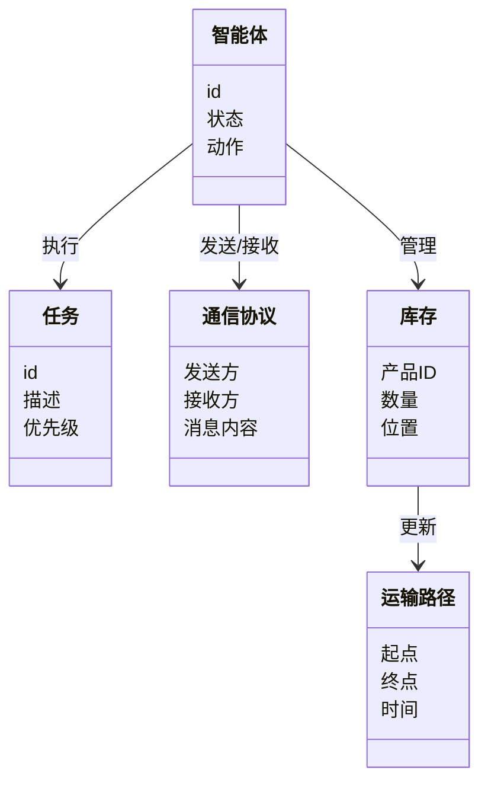
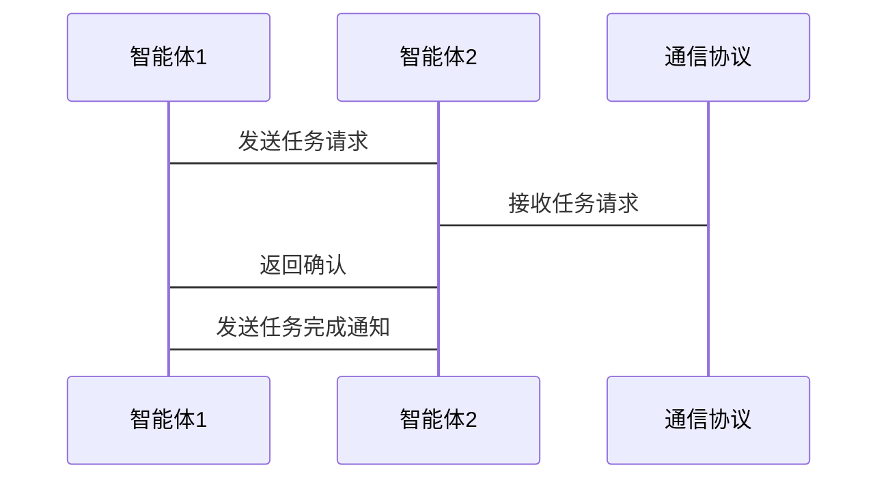

                 


# 多智能体系统在全球供应链优化中的应用：提升运营效率

## 关键词：多智能体系统、供应链优化、分布式计算、协同优化、物流管理

## 摘要：  
随着全球化进程的加速，全球供应链的复杂性不断提高，传统的供应链管理方式已难以满足高效优化的需求。多智能体系统（Multi-Agent System, MAS）作为一种分布式计算范式，能够通过多个智能体的协同工作，实现复杂系统的优化与管理。本文将深入探讨多智能体系统在全球供应链优化中的应用，分析其核心概念、算法原理、系统架构以及实际案例，展示其在提升供应链运营效率方面的巨大潜力。

---

# 第一部分: 多智能体系统与全球供应链优化概述

## 第1章: 多智能体系统的基本概念

### 1.1 多智能体系统的定义与特点

#### 1.1.1 多智能体系统的定义  
多智能体系统是由多个智能体组成的分布式系统，这些智能体能够通过协同工作完成复杂的任务。每个智能体都是一个独立的实体，具有感知环境、自主决策和学习的能力。多智能体系统的核心在于智能体之间的通信与协作。

#### 1.1.2 多智能体系统的五大核心特点  
1. **分布式性**：智能体独立运行，分布在不同的位置，通过通信协作完成任务。  
2. **自主性**：每个智能体都能自主决策，无需中央控制。  
3. **社会性**：智能体之间需要通过通信和协商来协作完成任务。  
4. **反应性**：智能体能够感知环境变化并做出实时反应。  
5. **适应性**：系统能够动态调整以应对环境的变化。

#### 1.1.3 多智能体系统与传统单智能体系统的对比  

| 对比维度           | 多智能体系统                           | 单智能体系统                           |
|--------------------|--------------------------------------|--------------------------------------|
| 结构               | 分布式，多个智能体协作                | 集中式，单个智能体控制                |
| 决策方式           | 去中心化，多个智能体共同决策          | 中央控制，单个智能体决策              |
| 灵活性             | 高，能够快速适应变化                 | 较低，依赖中央决策                     |
| 故障容错性         | 高，单个智能体故障不影响整体功能      | 较低，中央智能体故障可能导致系统瘫痪  |

---

### 1.2 全球供应链优化的背景与挑战

#### 1.2.1 全球供应链的基本概念  
全球供应链是指从原材料采购到产品交付给最终用户的整个过程，涉及多个环节和参与者，包括供应商、制造商、分销商、零售商和消费者。

#### 1.2.2 传统供应链管理的痛点  
1. **信息孤岛**：供应链中的参与者之间信息不透明，导致协调困难。  
2. **效率低下**：传统的人工管理方式效率低，难以应对复杂的优化需求。  
3. **缺乏灵活性**：供应链在面对市场变化时，难以快速调整策略。  

#### 1.2.3 全球化供应链的复杂性与优化需求  
全球供应链的全球化特点使其更加复杂，涉及跨国物流、多种法律法规和文化差异。优化供应链效率成为企业提高竞争力的关键。

---

## 第2章: 多智能体系统在全球供应链中的应用价值

### 2.1 多智能体系统在供应链优化中的优势

#### 2.1.1 分布式决策的优势  
多智能体系统能够将决策权分散到各个智能体，减少中央决策的负担，提高系统的响应速度和效率。

#### 2.1.2 多智能体协同优化的效率提升  
通过多个智能体的协同工作，能够快速找到最优解，显著提高供应链的运营效率。

#### 2.1.3 多智能体系统的灵活性与适应性  
多智能体系统能够根据环境变化动态调整策略，具有较强的适应性，适合全球化供应链的复杂需求。

---

### 2.2 多智能体系统与全球供应链的结合

#### 2.2.1 多智能体系统在全球供应链中的角色  
1. **供应商智能体**：负责原材料的采购和供应。  
2. **制造商智能体**：负责产品的生产与调度。  
3. **分销商智能体**：负责产品的仓储与配送。  
4. **零售商智能体**：负责产品的销售与客户服务。  

#### 2.2.2 多智能体系统在供应链网络中的分布与协作  
多智能体系统能够在全球范围内分布，实现跨国协作，优化物流和库存管理。

#### 2.2.3 多智能体系统在供应链优化中的应用场景  
1. **库存优化**：通过智能体之间的协作，实现库存的最优分配。  
2. **物流调度**：智能体协同优化运输路径，降低物流成本。  
3. **需求预测**：基于历史数据和实时信息，智能体协同进行需求预测。  

---

# 第二部分: 多智能体系统的原理与核心概念

## 第3章: 多智能体系统的原理

### 3.1 多智能体系统的通信机制

#### 3.1.1 智能体之间的通信方式  
1. **直接通信**：智能体之间直接交换信息。  
2. **间接通信**：通过中间媒介（如消息队列）进行信息交换。  

#### 3.1.2 通信协议的设计与实现  
通信协议需要定义信息的格式、传输方式和安全机制，确保智能体之间的高效协作。

#### 3.1.3 通信中的信息压缩与加密  
为了提高通信效率和安全性，需要对信息进行压缩和加密处理。

---

### 3.2 多智能体系统的任务分配与协同

#### 3.2.1 任务分配的基本原理  
任务分配是通过智能体之间的协商，将任务分配给最适合的智能体执行。

#### 3.2.2 基于分布式计算的任务分配算法  
1. **分布式协商算法**：智能体通过协商确定任务分配。  
2. **负载均衡算法**：根据智能体的负载情况动态分配任务。  

#### 3.2.3 协同优化的实现方式  
1. **局部优化**：每个智能体优化自己的任务。  
2. **全局优化**：通过智能体的协同，实现整体的最优解。  

---

## 第4章: 多智能体系统的数学模型与算法

### 4.1 多智能体系统的数学模型

#### 4.1.1 多智能体系统的状态表示  
状态表示需要描述系统的当前情况，例如库存量、运输时间等。

#### 4.1.2 多智能体系统的动作空间  
动作空间表示智能体可以执行的操作，例如采购原材料、安排运输等。

#### 4.1.3 多智能体系统的奖励函数  
奖励函数用于衡量智能体的行为是否符合优化目标，例如最小化成本或最大化效率。

---

### 4.2 多智能体系统的优化算法

#### 4.2.1 基于强化学习的多智能体优化  
强化学习是一种通过试错来优化智能体行为的算法，适用于复杂的动态环境。

#### 4.2.2 基于分布式优化的多智能体算法  
分布式优化算法通过智能体之间的协作，逐步逼近全局最优解。

#### 4.2.3 基于博弈论的多智能体决策  
博弈论为多智能体系统的决策提供理论基础，帮助智能体在竞争与合作中找到均衡点。

---

## 第5章: 多智能体系统的通信与协作机制

### 5.1 多智能体系统中的通信协议

#### 5.1.1 通信协议的设计原则  
1. **简洁性**：信息格式简洁明了，便于解析。  
2. **可靠性**：确保信息的准确传输。  
3. **安全性**：防止信息被篡改或窃取。  

#### 5.1.2 通信协议的实现方式  
1. **基于消息队列**：使用消息队列（如Kafka、RabbitMQ）进行异步通信。  
2. **基于 RPC 调用**：使用远程过程调用（如gRPC）进行同步通信。  

---

### 5.2 多智能体系统中的协作机制

#### 5.2.1 基于角色分配的协作机制  
根据智能体的职责分配不同的角色，例如采购、生产、物流等。

#### 5.2.2 基于任务分配的协作机制  
根据任务的性质将任务分配给最适合的智能体执行。

#### 5.2.3 基于分布式决策的协作机制  
智能体通过分布式决策共同优化供应链的整体性能。

---

# 第三部分: 系统分析与架构设计

## 第6章: 全球供应链优化系统的分析与设计

### 6.1 问题场景介绍

#### 6.1.1 供应链优化的核心问题  
1. **库存积压**：原材料或成品的库存过多，占用资金。  
2. **物流成本高**：运输路径不合理，导致成本增加。  
3. **需求预测不准**：无法准确预测市场需求，导致生产和库存的浪费。  

#### 6.1.2 多智能体系统在供应链优化中的应用场景  
1. **库存优化**：智能体协同管理库存，减少积压和缺货。  
2. **物流调度**：智能体优化运输路径，降低物流成本。  
3. **需求预测**：智能体协同分析历史数据，提高预测准确性。  

---

### 6.2 系统功能设计

#### 6.2.1 领域模型设计  
领域模型是系统功能设计的基础，需要明确系统中的实体及其关系。以下是一个供应链优化系统的领域模型：



#### 6.2.2 系统架构设计  
以下是一个典型的多智能体供应链优化系统的架构图：


---

### 6.3 系统接口设计

#### 6.3.1 系统接口的设计原则  
1. **松耦合**：接口设计应松耦合，便于后续扩展。  
2. **标准化**：接口应遵循标准化协议，便于集成。  
3. **安全性**：接口应具备身份验证和权限控制功能。  

#### 6.3.2 系统交互序列图  
以下是一个智能体之间的交互序列图：



---

## 第7章: 项目实战

### 7.1 环境安装

#### 7.1.1 系统运行环境  
1. **操作系统**：Linux/Windows/MacOS  
2. **编程语言**：Python/Java  
3. **框架与库**：如Python的`multi-agent`库、`socket`库等。  

#### 7.1.2 开发工具安装  
1. **Python安装**：使用pip安装所需的库，例如`pip install multi-agent`。  
2. **框架安装**：安装如`networkx`用于网络分析，`matplotlib`用于可视化。  

---

### 7.2 系统核心实现源代码

#### 7.2.1 智能体通信模块  
```python
import socket

class Agent:
    def __init__(self, name, port):
        self.name = name
        self.port = port
        self.socket = socket.socket(socket.AF_INET, socket.SOCK_DGRAM)
        self.socket.bind(('localhost', self.port))
    
    def send(self, message, target_port):
        self.socket.sendto(message.encode(), ('localhost', target_port))
    
    def receive(self):
        data, addr = self.socket.recvfrom(1024)
        return data.decode()
```

#### 7.2.2 任务分配模块  
```python
import random

class TaskAllocator:
    def __init__(self, agents):
        self.agents = agents
    
    def allocate_task(self, task):
        # 随机分配任务
        selected_agent = random.choice(self.agents)
        return selected_agent
```

#### 7.2.3 智能体协同优化模块  
```python
class Optimizer:
    def __init__(self, agents):
        self.agents = agents
    
    def optimize(self):
        # 简单的优化逻辑：每个智能体优化自己的任务
        for agent in self.agents:
            agent.optimize_task()
```

---

### 7.3 代码应用解读与分析

#### 7.3.1 智能体通信模块解读  
上述代码定义了一个`Agent`类，实现了智能体之间的通信功能。通过`send`方法发送消息，`receive`方法接收消息。

#### 7.3.2 任务分配模块解读  
`TaskAllocator`类负责任务的分配，通过随机选择的方式将任务分配给智能体。

#### 7.3.3 智能体协同优化模块解读  
`Optimizer`类负责智能体的协同优化，每个智能体独立优化自己的任务，最终实现全局优化。

---

### 7.4 实际案例分析

#### 7.4.1 案例背景  
假设我们有一个包含3个智能体的供应链优化系统，分别负责采购、生产和销售。

#### 7.4.2 案例实现  
```python
agent1 = Agent("采购智能体", 5000)
agent2 = Agent("生产智能体", 5001)
agent3 = Agent("销售智能体", 5002)
allocator = TaskAllocator([agent1, agent2, agent3])
optimizer = Optimizer([agent1, agent2, agent3])

# 分配任务
task = "采购原材料"
selected_agent = allocator.allocate_task(task)
selected_agent.send(f"开始执行任务：{task}", selected_agent.port)

# 协同优化
optimizer.optimize()
```

#### 7.4.3 案例分析  
通过上述代码，实现了三个智能体之间的任务分配与协同优化，提高了供应链的整体效率。

---

## 第8章: 最佳实践与总结

### 8.1 最佳实践 tips

#### 8.1.1 系统设计原则  
1. **模块化设计**：确保系统模块化，便于维护和扩展。  
2. **安全性设计**：重视通信的安全性，防止数据泄露。  
3. **可扩展性设计**：设计时考虑系统的可扩展性，便于后续功能的添加。  

#### 8.1.2 代码实现建议  
1. **代码复用**：尽量复用现有的库和框架，减少重复造轮子。  
2. **测试与调试**：编写充分的测试用例，确保系统稳定运行。  
3. **性能优化**：通过优化算法和通信机制，提高系统的运行效率。  

---

### 8.2 小结

多智能体系统在全球供应链优化中的应用具有巨大的潜力。通过智能体之间的协同工作，能够显著提高供应链的效率和灵活性。本文详细介绍了多智能体系统的原理、算法、系统设计以及实际案例，为读者提供了全面的指导。

---

### 8.3 注意事项

1. **通信延迟**：多智能体系统依赖智能体之间的通信，通信延迟可能影响系统的实时性。  
2. **安全性问题**：智能体之间的通信需要加密，防止数据被窃取或篡改。  
3. **系统容错性**：需要设计容错机制，确保单个智能体故障不会导致整个系统崩溃。  

---

### 8.4 拓展阅读

1. **推荐书籍**  
   - 《Multi-Agent Systems: Algorithmic, Complexity, and Synthesis》  
   - 《Supply Chain Management: Design and Innovation》  

2. **推荐论文**  
   - "A survey on multi-agent systems and their applications"  
   - "Multi-Agent Systems in Supply Chain Management"  

---

通过本文的深入探讨，读者可以全面了解多智能体系统在全球供应链优化中的应用，并将其应用于实际项目中，提升供应链的运营效率。
</think>

---

以上是文章的完整目录和部分内容，您可以根据需要进一步补充和调整各章节的具体内容。

