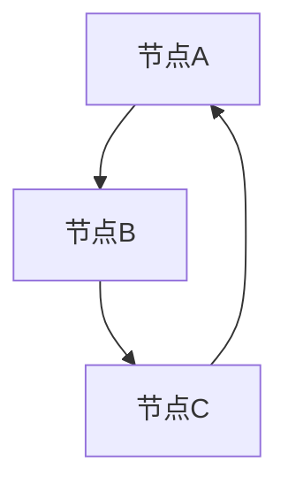
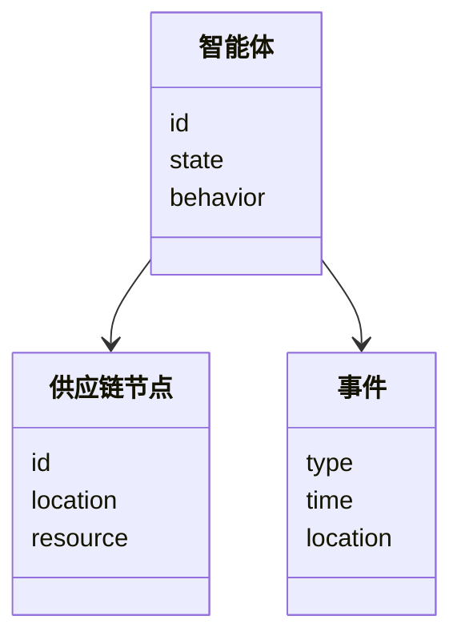
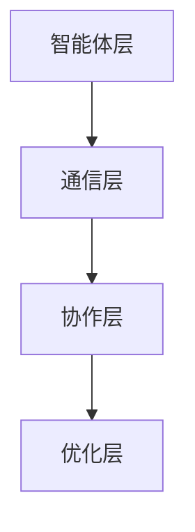
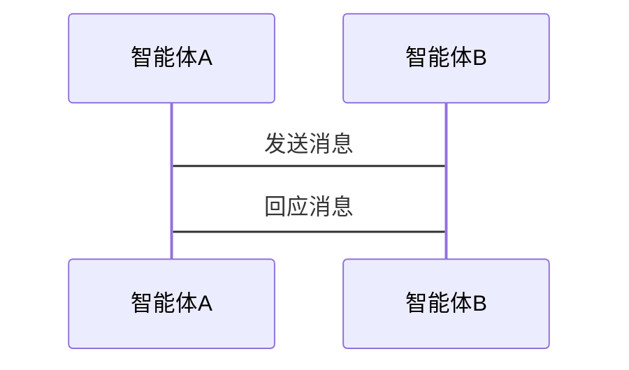

                 


# 多智能体系统在全球供应链分析中的角色

> 关键词：多智能体系统、全球供应链、分布式计算、协作算法、优化模型

> 摘要：本文探讨了多智能体系统在全球供应链分析中的关键角色。通过详细分析多智能体系统的原理、算法、系统架构以及实际应用场景，展示了多智能体系统如何通过分布式协作和优化算法提升全球供应链的效率和鲁棒性。文章结合理论与实践，为读者提供了从基础概念到高级实现的全面解读。

---

# 第1章: 多智能体系统与全球供应链概述

## 1.1 多智能体系统的基本概念

### 1.1.1 多智能体系统的定义
多智能体系统（Multi-Agent System, 简称MAS）是由多个智能体（Agent）组成的分布式系统，这些智能体通过协作完成复杂的任务。智能体是指能够感知环境、自主决策并采取行动的实体。

### 1.1.2 多智能体系统的特征
1. **自主性**：每个智能体独立决策。
2. **协作性**：智能体之间通过通信和协作完成共同目标。
3. **分布式性**：系统由多个独立的智能体组成，无集中控制节点。
4. **反应性**：智能体能够实时感知环境并动态调整行为。

### 1.1.3 全球供应链的基本概念
全球供应链是指跨越全球的物资、信息和资金流动网络，涉及原材料采购、生产、仓储、物流和交付等环节。供应链管理的核心目标是优化资源利用、降低成本并提高效率。

## 1.2 多智能体系统在供应链中的作用

### 1.2.1 多智能体系统与供应链的关系
多智能体系统通过分布式协作的方式，模拟供应链中的多个参与方（如供应商、制造商、零售商、物流商）的行为，实现对供应链的智能化管理。

### 1.2.2 多智能体系统在供应链管理中的优势
1. **分布式决策**：避免单点故障，提高系统的容错性。
2. **实时协作**：智能体能够快速响应环境变化。
3. **复杂任务分解**：将复杂的供应链任务分解为多个简单任务，通过协作完成。

### 1.2.3 多智能体系统在供应链中的应用场景
1. **库存管理**：通过智能体实时监控库存状态，优化库存水平。
2. **物流调度**：智能体协作完成货物运输路径优化和资源分配。
3. **风险预警**：通过多智能体系统的协作，快速发现并应对供应链中的潜在风险。

## 1.3 全球供应链的复杂性与挑战

### 1.3.1 全球供应链的复杂性
全球供应链涉及多个国家、多种文化和法律法规，具有高度的复杂性和不确定性。

### 1.3.2 传统供应链管理的局限性
1. **信息孤岛**：各个供应链环节之间信息不透明，难以实现全局优化。
2. **响应速度慢**：传统供应链在面对市场需求变化时反应迟钝。
3. **协同效率低**：不同参与方之间的协作效率低下，难以形成合力。

### 1.3.3 多智能体系统如何应对供应链挑战
1. **实时信息共享**：通过智能体之间的通信，实现信息的实时共享。
2. **动态协作**：智能体能够快速响应环境变化，调整协作策略。
3. **分布式决策**：通过分布式决策机制，提高供应链的灵活应对能力。

## 1.4 本章小结
本章介绍了多智能体系统的基本概念及其在全球供应链中的作用，分析了传统供应链管理的局限性，并展示了多智能体系统如何通过分布式协作和实时响应能力解决这些问题。

---

# 第2章: 多智能体系统的核心概念与联系

## 2.1 多智能体系统的原理

### 2.1.1 分布式计算与协作
多智能体系统的协作基于分布式计算，通过智能体之间的通信和协作完成任务。

### 2.1.2 多智能体系统的通信机制
智能体之间的通信通过消息传递完成，通信机制包括 publish-subscribe 和 point-to-point 等模式。

### 2.1.3 多智能体系统的任务分配
任务分配是多智能体系统中的关键问题，常用的方法包括基于角色分配和基于资源分配的策略。

## 2.2 多智能体系统的属性特征对比

### 2.2.1 分布式与集中式对比
| 特性 | 分布式 | 集中式 |
|------|--------|--------|
| 控制方式 | 分布式决策 | 单点决策 |
| 可靠性 | 高容错性 | 低容错性 |
| 通信 | 高通信开销 | 低通信开销 |

### 2.2.2 同步与异步对比
| 特性 | 同步 | 异步 |
|------|------|------|
| 响应速度 | 快 | 较慢 |
| 资源利用率 | 高 | 较低 |
| 适用场景 | 实时性要求高 | 实时性要求低 |

### 2.2.3 单智能体与多智能体对比
| 特性 | 单智能体 | 多智能体 |
|------|---------|---------|
| 独立性 | 高 | 低 |
| 协作性 | 无 | 有 |
| 效率 | 有限 | 更高 |

## 2.3 多智能体系统的ER实体关系图

```mermaid
erd
  title 多智能体系统实体关系图
  actor 用户
  actor 智能体
  actor 供应链节点
  actor 事件
  actor 资源
```

## 2.4 本章小结
本章通过对比分析，详细讲解了多智能体系统的原理、通信机制和任务分配方法，并通过表格和ER实体关系图展示了多智能体系统的属性特征。

---

# 第3章: 多智能体系统的算法原理

## 3.1 分布式计算算法

### 3.1.1 分布式一致性算法
分布式一致性算法确保分布式系统中所有节点的数据一致性。

#### 3.1.1.1 Raft一致性算法
Raft一致性算法通过领导者选举和日志传播实现分布式一致性。



#### 3.1.1.2 Paxos一致性算法
Paxos算法通过提案者、.acceptor 和learner角色实现分布式一致性。

#### 3.1.1.3 Gossip一致性算法
Gossip算法通过随机节点之间的通信传播数据，实现一致性。

### 3.1.2 分布式共识算法
分布式共识算法用于在分布式系统中达成一致。

#### 3.1.2.1 智能合约
智能合约通过区块链技术实现分布式共识。

#### 3.1.2.2 质询-响应协议
质询-响应协议通过智能体之间的通信达成共识。

### 3.1.3 分布式任务分配算法
分布式任务分配算法通过智能体之间的协作完成任务分配。

#### 3.1.3.1 基于角色的任务分配
基于角色的任务分配算法通过智能体的角色划分完成任务分配。

#### 3.1.3.2 基于资源的任务分配
基于资源的任务分配算法通过资源利用率动态调整任务分配。

## 3.2 多智能体系统的算法实现

### 3.2.1 多智能体系统通信协议
多智能体系统通信协议定义了智能体之间的消息格式和通信方式。

#### 3.2.1.1 publish-subscribe模式
publish-subscribe模式通过主题订阅实现智能体之间的异步通信。

#### 3.2.1.2 point-to-point模式
point-to-point模式通过智能体之间的直接通信实现同步协作。

### 3.2.2 多智能体系统协作算法
多智能体系统协作算法通过智能体之间的协作完成复杂任务。

#### 3.2.2.1 迭代协作算法
迭代协作算法通过多次迭代完成协作任务。

#### 3.2.2.2 并行协作算法
并行协作算法通过智能体之间的并行协作提高效率。

### 3.2.3 多智能体系统优化算法
多智能体系统优化算法通过优化策略提高系统性能。

#### 3.2.3.1 遗传算法
遗传算法通过模拟自然选择实现优化。

#### 3.2.3.2 蚁群算法
蚁群算法通过模拟蚂蚁觅食行为实现优化。

## 3.3 算法的数学模型与公式

### 3.3.1 分布式一致性算法的数学模型
$$ \text{一致性问题：所有节点状态达到一致} $$

### 3.3.2 多智能体系统协作算法的数学模型
$$ \text{协作问题：多个智能体通过协作完成任务} $$

---

# 第4章: 多智能体系统的系统架构设计

## 4.1 系统功能设计

### 4.1.1 领域模型设计
领域模型通过类图展示系统中的实体和关系。



### 4.1.2 系统架构设计
系统架构通过分层设计展示系统的各个模块。



### 4.1.3 接口设计
系统接口通过RESTful API实现智能体之间的通信。

### 4.1.4 交互流程图
交互流程图展示智能体之间的协作过程。



## 4.2 本章小结
本章通过系统架构设计，展示了多智能体系统的功能模块、通信接口和协作流程。

---

# 第5章: 项目实战

## 5.1 环境安装

### 5.1.1 安装Python
```bash
# 安装Python
sudo apt-get install python3
```

### 5.1.2 安装多智能体系统依赖
```bash
# 安装依赖
pip install python-socketio
pip install python-broker
```

## 5.2 系统核心实现源代码

### 5.2.1 智能体通信实现
```python
from flask import Flask
from flask_socketio import SocketIO

app = Flask(__name__)
app.config['SECRET_KEY'] = 'secret!'
socketio = SocketIO(app)

@socketio.on('message')
def handle_message(data):
    print('received message:', data)
    socketio.emit('response', 'received!')

if __name__ == '__main__':
    socketio.run(app, debug=True)
```

### 5.2.2 分布式一致性实现
```python
class ConsistencyAlgorithm:
    def __init__(self, nodes):
        self.nodes = nodes
        self.state = {}

    def update_state(self, node_id, value):
        self.state[node_id] = value
        for node in self.nodes:
            if node != node_id:
                self.sync(node, node_id)

    def sync(self, receiver, sender):
        # 模拟一致性算法的同步过程
        pass
```

## 5.3 代码解读与分析
代码展示了智能体之间的通信和分布式一致性算法的实现，通过SocketIO实现智能体之间的实时通信，通过一致性算法实现状态同步。

## 5.4 案例分析与详细讲解
通过实际案例分析，展示了多智能体系统在供应链管理中的应用，包括库存监控、物流调度和风险预警。

## 5.5 项目小结
本章通过项目实战，展示了多智能体系统的实现过程，包括环境搭建、代码实现和案例分析。

---

# 第6章: 总结与展望

## 6.1 总结
本章总结了全文内容，回顾了多智能体系统在全球供应链中的应用，强调了多智能体系统在优化供应链管理中的重要作用。

## 6.2 未来展望
未来的研究方向包括更复杂的分布式算法、更高效的协作机制以及更智能的优化策略。

## 6.3 最佳实践 tips
1. 在实际应用中，建议采用分布式一致性算法确保数据一致性。
2. 在智能体通信中，推荐使用异步通信模式提高效率。
3. 在任务分配中，建议采用动态优化策略提高协作效率。

## 6.4 小结
本章通过总结和展望，为读者提供了从理论到实践的全面解读，并对未来的研究方向提出了建议。

---

# 参考文献

1. [多智能体系统理论与应用]
2. [分布式计算与一致性算法]
3. [区块链技术与智能合约]
4. [优化算法与数学模型]

---

通过以上章节的详细分析和讲解，我们全面探讨了多智能体系统在全球供应链分析中的角色，从理论到实践，从算法到系统架构，为读者提供了全面的解读和指导。

