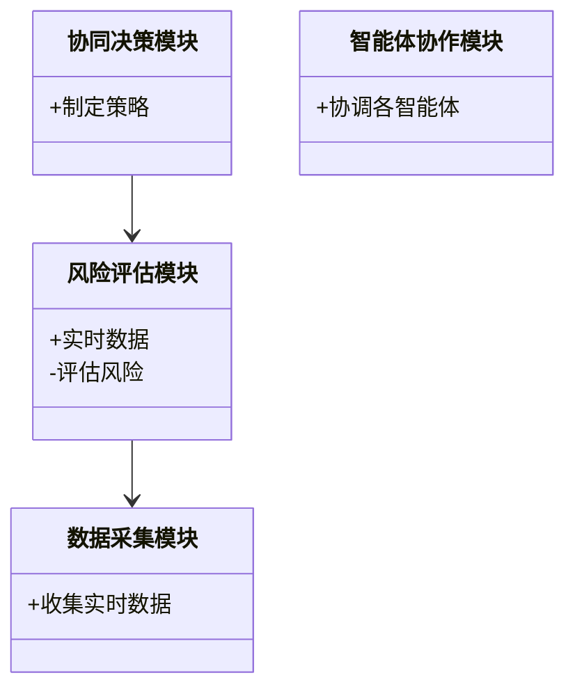
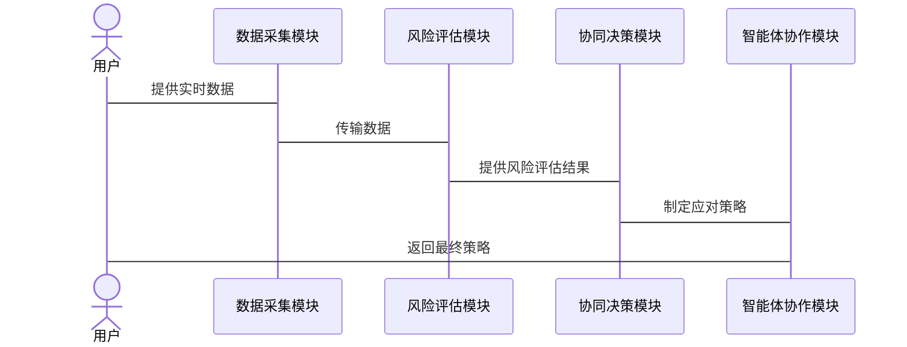

                 


# 多智能体系统在全球供应链风险评估中的应用

## 关键词：多智能体系统, 供应链风险, 算法原理, 系统架构, 项目实战

## 摘要：  
随着全球化程度的加深，供应链的复杂性也在不断增加，传统的供应链管理方法难以应对日益复杂的全球性风险。多智能体系统（Multi-Agent System, MAS）作为一种新兴的分布式计算范式，能够有效解决供应链中的协同优化问题。本文将深入探讨多智能体系统在全球供应链风险评估中的应用，结合算法原理、系统架构设计以及实际案例分析，为读者提供系统的知识框架。

---

## 第一章：多智能体系统与供应链风险评估概述

### 1.1 多智能体系统的定义与特点

多智能体系统是由多个智能体组成的分布式系统，每个智能体都是具有自主性、反应性和协作能力的实体。其特点包括：

- **自主性**：智能体能够独立决策。
- **反应性**：能够感知环境并实时响应。
- **协作性**：通过通信和协调完成共同目标。
- **分布性**：各智能体独立运行，无集中控制。

### 1.2 供应链风险评估的重要性

供应链作为现代企业运营的核心，面临着多种风险，如自然灾害、疫情、政治经济波动等。及时识别和评估这些风险，对于保障供应链的稳定性和高效性至关重要。

### 1.3 多智能体系统在供应链管理中的优势

多智能体系统能够通过智能体之间的协作，实时分析供应链各环节的数据，预测潜在风险，并制定应对策略。其优势包括：

- **实时性**：快速响应风险。
- **分布式计算**：提高系统鲁棒性。
- **智能协同**：优化资源配置。

---

## 第二章：多智能体系统的原理与模型

### 2.1 多智能体系统的结构与功能

#### 2.1.1 供应链中的智能体角色

在供应链中，主要的智能体角色包括：

- **供应商**：提供原材料。
- **制造商**：生产产品。
- **分销商**：负责物流和配送。
- **零售商**：面向终端消费者。

#### 2.1.2 智能体之间的通信与协作

智能体之间的通信机制包括：

- **消息传递**：通过消息传递信息。
- **协商机制**：智能体之间通过协商分配任务。
- **协调机制**：确保各智能体协同工作。

### 2.2 多智能体系统的数学模型与算法

#### 2.2.1 分布式计算模型

分布式计算模型通过将任务分配给多个智能体完成，每个智能体负责一部分计算，最终汇总结果。例如：

$$
\text{总任务} = \sum_{i=1}^{n} \text{智能体}_i
$$

#### 2.2.2 博弈论模型

博弈论模型用于分析智能体之间的策略选择，常用纳什均衡作为稳定点。例如，在供应链中，各智能体选择最优策略以最大化自身收益，同时考虑其他智能体的反应。

### 2.3 多智能体系统的算法实现

#### 2.3.1 分布式算法

分布式算法通过将问题分解为多个子问题，由多个智能体协同解决。例如：

1. **初始化**：分配任务给各智能体。
2. **计算**：各智能体独立计算。
3. **汇总**：汇总结果，得出最终结论。

#### 2.3.2 博弈论算法

博弈论算法用于模拟智能体之间的竞争与合作，例如纳什均衡的计算。公式如下：

$$
\text{纳什均衡} = \{s_i^*, s_j^*\}
$$

其中，$s_i^*$和$s_j^*$分别表示两个智能体的最优策略。

---

## 第三章：供应链风险评估的系统设计

### 3.1 供应链风险评估的系统架构

#### 3.1.1 系统整体架构

系统架构包括以下几个模块：

1. **风险评估模块**：识别潜在风险。
2. **协同决策模块**：制定应对策略。
3. **数据采集模块**：收集实时数据。
4. **智能体协作模块**：协调各智能体的工作。

#### 3.1.2 系统功能设计

使用Mermaid类图展示各模块之间的关系：



### 3.2 供应链风险评估的系统架构图

使用Mermaid架构图展示系统整体架构：

```mermaid
archi
    title 供应链风险评估系统架构
    actor 用户
    container 数据采集模块
    container 风险评估模块
    container 协同决策模块
    container 智能体协作模块
    用户 --> 数据采集模块
    数据采集模块 --> 风险评估模块
    风险评估模块 --> 协同决策模块
    协同决策模块 --> 智能体协作模块
```

### 3.3 系统接口与交互设计

使用Mermaid序列图展示系统交互过程：



---

## 第四章：项目实战

### 4.1 项目背景与目标

本项目旨在开发一个基于多智能体系统的供应链风险评估系统，目标是实现对供应链潜在风险的实时监测和应对策略的制定。

### 4.2 系统核心代码实现

以下是一个简单的Python实现，用于展示多智能体系统如何协同完成风险评估：

```python
class Agent:
    def __init__(self, id):
        self.id = id
        self.data = None

    def receive_data(self, data):
        self.data = data

    def process_data(self):
        # 模拟数据处理
        return f"Agent {self.id} processed data."

class SupplyChainMAS:
    def __init__(self, agents):
        self.agents = agents

    def distribute_data(self, data):
        for agent in self.agents:
            agent.receive_data(data)

    def collect_results(self):
        results = []
        for agent in self.agents:
            results.append(agent.process_data())
        return results

# 示例用法
agents = [Agent(1), Agent(2), Agent(3)]
mas = SupplyChainMAS(agents)
mas.distribute_data("Supply chain risk data")
results = mas.collect_results()
print(results)
```

### 4.3 实际案例分析

以新冠疫情为例，分析系统如何应对供应链中断的风险：

1. **数据采集**：收集疫情对各环节的影响。
2. **风险评估**：识别关键风险点。
3. **协同决策**：制定多元化应对策略，如寻找替代供应商、调整生产计划。

---

## 第五章：总结与展望

### 5.1 总结

多智能体系统通过分布式计算和智能体协作，有效提升了供应链风险评估的效率和准确性。其优势在于实时响应和协同优化，能够帮助企业在复杂多变的环境中保持供应链的稳定。

### 5.2 展望

未来，多智能体系统将与其他技术如大数据和区块链结合，进一步提升供应链的智能化和安全性。同时，随着算法的优化，系统的决策能力将更强，应用范围也将更广。

---

## 最佳实践 Tips：

- 在实施多智能体系统时，需确保各智能体之间的通信机制高效可靠。
- 定期更新系统模型，以适应不断变化的供应链环境。
- 加强数据安全措施，保护供应链数据不被恶意攻击。

通过以上步骤，您可以系统地理解和应用多智能体系统在全球供应链风险评估中的应用。

