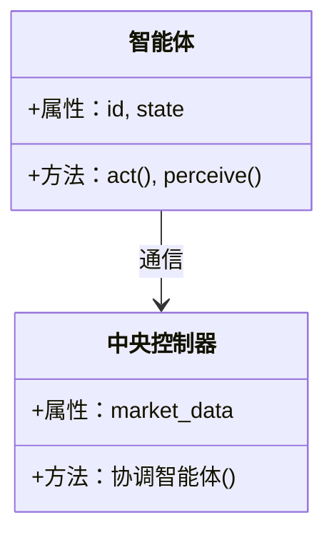
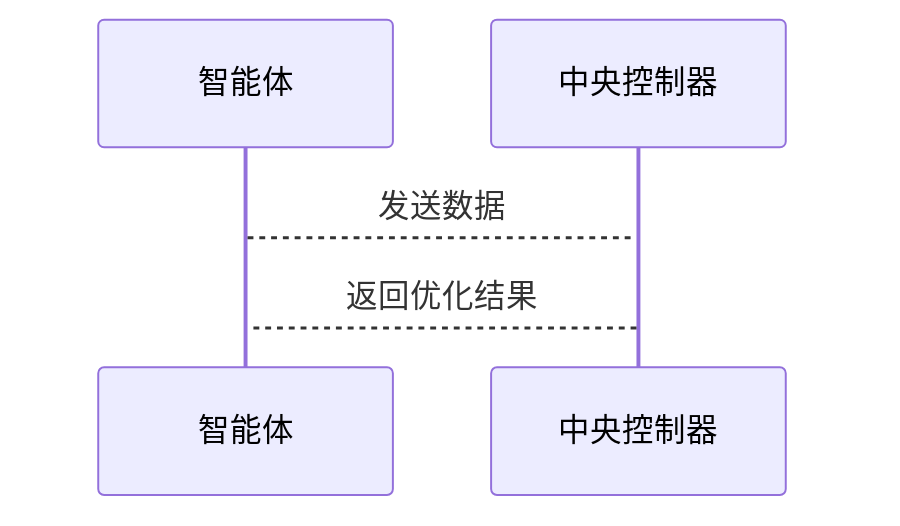

                 


# 多智能体系统在全球资产配置中的角色

## 关键词
多智能体系统, 全球资产配置, 优化算法, 分布式计算, 博弈论, 金融建模

## 摘要
多智能体系统（Multi-Agent Systems, MAS）在全球资产配置中发挥着越来越重要的角色。本文系统地分析了多智能体系统的核心概念、算法原理及其在金融领域的应用，详细介绍了多智能体系统如何通过分布式优化和博弈论模型实现全球资产配置的优化。同时，本文结合实际案例，展示了多智能体系统的实施过程和效果，为读者提供了全面的理解和实践指导。

---

## 第1章 多智能体系统概述

### 1.1 多智能体系统的定义与特点
多智能体系统是由多个智能体组成的分布式系统，每个智能体具备一定的感知、决策和执行能力。与单智能体系统相比，多智能体系统具有以下特点：

#### 1.1.1 多智能体系统的定义
- **智能体**：能够感知环境并采取行动以实现目标的实体。
- **多智能体系统**：由多个智能体组成的分布式系统，智能体之间通过通信和协作完成复杂任务。

#### 1.1.2 多智能体系统的核心特点
| 特性 | 描述 |
|------|------|
| 分布性 | 智能体分布在网络中，独立运行 |
| 协作性 | 智能体之间通过通信协作完成任务 |
| 反应性 | 能够实时感知环境变化并调整行动 |
| 灵活性 | 系统具备动态调整能力，适应环境变化 |

### 1.2 全球资产配置的背景与挑战
全球资产配置是指将资金分配到不同国家和资产类别中以实现风险分散和收益最大化。然而，全球资产配置面临以下挑战：

#### 1.2.1 全球化投资的背景
- 全球经济一体化使得投资者可以配置全球资产。
- 不同市场之间的相关性和波动性差异为资产配置提供了机会。

#### 1.2.2 全球资产配置的核心问题
- **风险分散**：通过配置不同市场的资产降低风险。
- **收益优化**：在不同资产类别中寻找最优收益组合。
- **动态调整**：根据市场变化及时调整配置。

#### 1.2.3 多智能体系统在资产配置中的角色
多智能体系统能够通过分布式的计算和协作，高效地解决全球资产配置中的复杂问题。智能体可以分别负责不同的市场分析、风险评估和优化决策。

---

## 第2章 多智能体系统的核心概念与算法原理

### 2.1 多智能体系统的组成与功能
#### 2.1.1 智能体的定义与属性
- **智能体属性**：每个智能体具备感知、决策和执行能力。
- **协作机制**：智能体之间通过通信和协商完成任务。

#### 2.1.2 多智能体系统的协作机制
- **通信机制**：智能体之间通过消息传递进行协作。
- **协调机制**：通过协商达成一致的行动方案。

#### 2.1.3 智能体之间的通信与协调
- **通信协议**：定义智能体之间消息的格式和传输方式。
- **协调策略**：确保智能体之间的协作不会产生冲突。

### 2.2 全球资产配置的数学模型与优化目标
#### 2.2.1 资产配置的基本数学模型
$$ \text{目标函数} = \sum_{i=1}^{n} w_i r_i $$
其中，\( w_i \) 为资产 \( i \) 的权重，\( r_i \) 为资产 \( i \) 的预期收益。

#### 2.2.2 优化目标与约束条件
- **目标**：最大化收益，最小化风险。
- **约束**：权重之和为1，满足风险承受能力。

#### 2.2.3 资产配置中的风险与收益平衡
- **风险度量**：使用方差、标准差等指标衡量风险。
- **收益-风险权衡**：通过优化算法寻找收益与风险的最佳平衡点。

---

## 第3章 多智能体系统在资产配置中的角色与功能

### 3.1 多智能体系统的数据采集与处理
#### 3.1.1 数据来源
- 市场数据：股票、债券、外汇等市场数据。
- 新闻数据：影响市场的新闻和事件。

#### 3.1.2 数据处理流程
1. 数据采集：从多个数据源获取实时数据。
2. 数据清洗：去除噪声数据，确保数据质量。
3. 数据分析：使用统计方法和机器学习模型进行分析。

### 3.2 智能体的决策机制
#### 3.2.1 决策模型
- **基于规则的决策**：根据预设规则进行决策。
- **基于模型的决策**：使用数学模型进行优化决策。

#### 3.2.2 决策过程
1. 智能体根据市场数据生成初步决策。
2. 通过通信机制与其他智能体协商，调整决策方案。
3. 执行决策并反馈结果。

### 3.3 资产配置的优化与调整
#### 3.3.1 优化策略
- **动态调整**：根据市场变化实时优化资产配置。
- **风险控制**：通过智能体协作降低整体风险。

#### 3.3.2 调整过程
1. 智能体分析市场变化。
2. 协商并制定新的配置方案。
3. 执行调整并监控效果。

---

## 第4章 多智能体系统的算法原理

### 4.1 分布式优化算法
#### 4.1.1 分布式优化的基本概念
- **分布式优化**：将优化问题分解为多个子问题，分别求解后再合并。

#### 4.1.2 分布式优化算法的数学模型
$$ \text{目标函数} = \sum_{i=1}^{n} f_i(x_i) $$
其中，\( x_i \) 为第 \( i \) 个子问题的变量。

#### 4.1.3 分布式优化算法的实现步骤
1. 将优化问题分解为多个子问题。
2. 各子问题分别求解。
3. 将结果合并，得到全局最优解。

### 4.2 博弈论与多智能体系统
#### 4.2.1 博弈论的基本概念
- **博弈论**：研究理性决策者在互动中的策略选择。

#### 4.2.2 博弈论在多智能体系统中的应用
- **纳什均衡**：多个智能体在博弈中达到的稳定状态。

---

## 第5章 多智能体系统的系统架构设计

### 5.1 系统功能设计
#### 5.1.1 领域模型


#### 5.1.2 系统架构图
```mermaid
container 全球资产配置系统 {
    智能体1
    智能体2
    智能体3
    中央控制器
}
```

### 5.2 接口设计与交互流程
#### 5.2.1 系统接口设计
- **输入接口**：接收市场数据和用户指令。
- **输出接口**：提供优化结果和反馈信息。

#### 5.2.2 交互流程图


---

## 第6章 项目实战

### 6.1 环境安装
- **工具安装**：安装Python、NumPy、Pandas、Matplotlib等库。
- **依赖管理**：使用pip管理Python包。

### 6.2 核心代码实现
#### 6.2.1 分布式优化算法实现
```python
import numpy as np

def distributed_optimization(nagents, objective_func):
    agents = [Agent(i) for i in range(nagents)]
    for agent in agents:
        agent.solve_subproblem()
    return np.mean([agent.result for agent in agents])

class Agent:
    def __init__(self, id):
        self.id = id
        self.result = 0
    
    def solve_subproblem(self):
        # 假设目标函数为平方和
        self.result = np.random.randn()
```

#### 6.2.2 博弈论模型实现
```python
def nash_equilibrium(players, strategies):
    # 简单博弈论模型
    pass
```

### 6.3 实际案例分析
- **案例背景**：假设一个全球资产配置系统，配置股票、债券和外汇。
- **优化过程**：智能体分别分析不同市场，协商后制定最优配置方案。
- **结果分析**：比较优化前后的收益和风险，验证系统效果。

---

## 第7章 总结与展望

### 7.1 总结
多智能体系统在全球资产配置中具有显著优势，通过分布式计算和协作优化，能够高效解决复杂问题。

### 7.2 展望
未来，随着人工智能和分布式技术的发展，多智能体系统在金融领域的应用将更加广泛和深入。

---

## 第8章 最佳实践与注意事项

### 8.1 最佳实践
- **数据质量**：确保数据来源可靠，处理准确。
- **智能体设计**：合理设计智能体的功能和协作机制。

### 8.2 注意事项
- **通信延迟**：避免因通信延迟影响系统实时性。
- **安全性**：确保智能体之间的通信安全，防止数据泄露。

---

## 第9章 拓展阅读

- 推荐阅读《多智能体系统的理论与应用》。
- 关注学术期刊中关于多智能体系统在金融中的最新研究。

---

通过以上内容，我们系统地介绍了多智能体系统在全球资产配置中的角色与功能，分析了其实现的算法原理，并结合实际案例进行了详细解读。希望读者能够通过本文对多智能体系统在金融领域的应用有一个全面的理解，并能够将相关知识应用到实际项目中。

