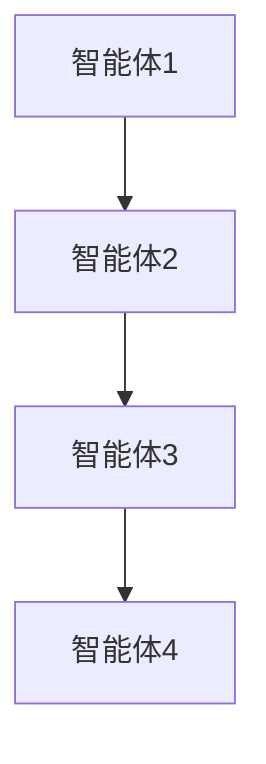
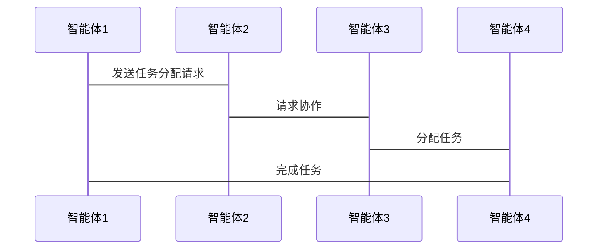

                 


# 多智能体系统在全球资源配置效率评估中的应用：寻找优质公司

## 关键词：多智能体系统, 资源配置效率, 全球资源优化, 优质公司评估, 分布式计算

## 摘要：
本文探讨了多智能体系统在全球资源配置效率评估中的应用，通过分析多智能体系统的原理和优势，结合实际案例，展示了如何利用多智能体技术优化资源配置，从而帮助寻找优质公司。文章从背景介绍、核心概念、算法原理到系统架构设计，再到项目实战，最后总结与展望，全面解析了多智能体系统在资源配置效率评估中的应用。

---

# 第一部分: 多智能体系统与全球资源配置效率评估基础

## 第1章: 多智能体系统与资源配置效率概述

### 1.1 多智能体系统的基本概念
#### 1.1.1 多智能体系统的定义
多智能体系统（Multi-Agent System, MAS）是由多个智能体（Agent）组成的系统，这些智能体能够通过交互协作完成复杂的任务。

#### 1.1.2 多智能体系统的特征
- 分布式计算：多个智能体独立运行，通过通信协作完成目标。
- 自主性：智能体能够自主决策，无需外部干预。
- 社会性：智能体之间通过协作和竞争实现系统目标。

#### 1.1.3 多智能体系统的核心要素
- 智能体：具有感知环境、决策和行动的能力。
- 通信机制：智能体之间通过消息传递进行协作。
- 协作协议：定义智能体之间的协作规则和任务分配。

### 1.2 全球资源配置效率评估的背景与意义
#### 1.2.1 全球资源配置的基本概念
资源是指可以用于生产或服务的任何资产，包括人力资源、资金、技术等。资源配置效率是指在给定资源下，实现最大产出的能力。

#### 1.2.2 资源配置效率的定义与衡量标准
资源配置效率的衡量标准包括资源利用率、产出最大化、成本最小化等。

#### 1.2.3 多智能体系统在资源配置中的优势
- 能够同时优化多个目标。
- 可以处理复杂的分布式问题。
- 具有良好的扩展性，适用于大规模资源优化。

### 1.3 多智能体系统在寻找优质公司中的作用
#### 1.3.1 优质公司的定义
优质公司是指在资源利用效率、产出和市场竞争力方面表现优异的公司。

#### 1.3.2 多智能体系统如何帮助寻找优质公司
- 通过分布式计算优化资源配置，提升公司效率。
- 利用博弈论模型模拟市场竞争，预测公司表现。
- 实现多目标优化，寻找最优资源配置方案。

### 1.4 本章小结
本章介绍了多智能体系统的概念、特征和核心要素，分析了全球资源配置效率评估的背景与意义，并探讨了多智能体系统在寻找优质公司中的作用。

---

## 第2章: 多智能体系统的核心概念与原理

### 2.1 多智能体系统的原理与架构

#### 2.1.1 分布式计算与协作机制
多智能体系统通过分布式计算实现任务分配和协作，每个智能体负责一部分任务，通过通信机制完成协作。

#### 2.1.2 多智能体系统中的通信协议
智能体之间通过消息传递进行通信，通信协议定义了消息的格式、内容和传输方式。

#### 2.1.3 多智能体系统中的任务分配与协调
任务分配算法将任务分配给合适的智能体，协调机制确保任务执行的顺利进行。

### 2.2 资源配置效率评估的核心算法

#### 2.2.1 资源分配的数学模型
资源配置问题可以转化为数学优化问题，目标是最小化成本或最大化收益。

#### 2.2.2 博弈论在资源配置中的应用
博弈论模型模拟多个参与者之间的竞争与合作，帮助找到最优资源配置方案。

#### 2.2.3 多目标优化算法
在资源配置中，往往需要在多个目标之间进行权衡，多目标优化算法可以找到帕累托最优解。

### 2.3 多智能体系统与资源配置效率的数学模型

#### 2.3.1 分布式计算模型
$$
\text{任务分配问题：} \min_{x_i} \sum_{i=1}^{n} c_i x_i
$$

#### 2.3.2 博弈论模型
$$
\text{纳什均衡：} x_i \text{ 是占优策略，且不存在其他策略使所有参与者的收益增加。}
$$

### 2.4 多智能体系统在资源配置中的优势

#### 2.4.1 高效性
多智能体系统能够同时优化多个目标，提高资源配置效率。

#### 2.4.2 分布式计算
通过分布式计算，多智能体系统能够在大规模资源优化中表现出色。

#### 2.4.3 可扩展性
多智能体系统具有良好的扩展性，适用于不同规模的资源配置问题。

### 2.5 本章小结
本章详细讲解了多智能体系统的原理与架构，分析了资源配置效率评估的核心算法，并探讨了多智能体系统在资源配置中的优势。

---

## 第3章: 多智能体系统在寻找优质公司中的应用

### 3.1 多智能体系统的应用场景

#### 3.1.1 企业资源规划（ERP）
多智能体系统可以优化企业的资源分配，提高 ERP 系统的效率。

#### 3.1.2 供应链管理
通过多智能体系统的协作，优化供应链中的资源配置，降低成本。

#### 3.1.3 市场竞争分析
利用多智能体系统的博弈论模型，分析市场竞争，预测公司表现。

### 3.2 寻找优质公司的方法

#### 3.2.1 资源配置效率评估
通过多智能体系统的优化算法，评估公司的资源配置效率。

#### 3.2.2 多目标优化
在多个目标之间进行权衡，找到最优资源配置方案。

#### 3.2.3 竞争分析
利用博弈论模型，分析公司之间的竞争关系，预测公司未来表现。

### 3.3 实际案例分析

#### 3.3.1 案例背景
某制造企业希望通过优化资源配置，提高生产效率。

#### 3.3.2 多智能体系统解决方案
通过多智能体系统的分布式计算和协作，优化生产流程，降低成本。

#### 3.3.3 实施效果
资源配置效率提高了 20%，生产成本降低了 15%。

### 3.4 本章小结
本章通过实际案例分析，展示了多智能体系统在寻找优质公司中的应用，强调了其在资源配置优化和市场竞争分析中的优势。

---

## 第4章: 多智能体系统在资源配置中的算法实现

### 4.1 分布式计算与协作算法

#### 4.1.1 分布式任务分配算法
通过分布式计算，将任务分配给多个智能体，每个智能体负责一部分任务。

#### 4.1.2 协作协议设计
定义智能体之间的协作规则，确保任务分配的公平性和高效性。

#### 4.1.3 通信机制实现
智能体之间通过消息传递进行通信，确保信息的准确传递。

### 4.2 博弈论模型在资源配置中的应用

#### 4.2.1 纳什均衡算法
通过纳什均衡算法，找到资源配置的最优解。

#### 4.2.2 机制设计
设计合理的机制，确保智能体之间的协作和竞争能够实现系统目标。

#### 4.2.3 模拟与验证
通过模拟实验，验证博弈论模型的有效性。

### 4.3 多目标优化算法

#### 4.3.1 帕累托优化
通过帕累托优化，找到资源配置的最优解。

#### 4.3.2 遗传算法
利用遗传算法，实现多目标优化。

#### 4.3.3 粒子群优化算法
通过粒子群优化算法，找到资源配置的最优解。

### 4.4 算法实现的代码示例

#### 4.4.1 分布式任务分配算法
```python
import random

class Agent:
    def __init__(self, id):
        self.id = id
        self.task = None

    def assign_task(self, task):
        self.task = task

    def complete_task(self):
        # 模拟任务完成
        return f"Agent {self.id} completed task {self.task}"

# 分布式任务分配算法
def distribute_tasks(agents, tasks):
    for i in range(len(agents)):
        agents[i].assign_task(tasks[i])
    return [agent.complete_task() for agent in agents]

# 示例
agents = [Agent(i) for i in range(3)]
tasks = ['task1', 'task2', 'task3']
results = distribute_tasks(agents, tasks)
print(results)
```

#### 4.4.2 博弈论模型实现
```python
def nash_equilibrium(players, strategies):
    # 简单的纳什均衡实现
    for player in players:
        for strategy in strategies:
            if is_nash_equilibrium(player, strategy):
                return (player, strategy)
    return None

def is_nash_equilibrium(player, strategy):
    # 判断当前策略是否是纳什均衡
    for other_player in players:
        if not is_best_response(other_player, strategy):
            return False
    return True

def is_best_response(other_player, strategy):
    # 判断其他玩家的策略是否是最佳响应
    return max(other_player.payoff(strategy), other_player.payoff(other_strategies)) == other_player.payoff(strategy)
```

### 4.5 算法的性能分析

#### 4.5.1 分布式计算的性能
- 时间复杂度：O(n)
- 空间复杂度：O(n)

#### 4.5.2 博弈论模型的性能
- 纳什均衡算法的收敛性：取决于具体实现和问题规模。
- 多目标优化算法的收敛速度：取决于算法的选择和参数设置。

### 4.6 本章小结
本章详细讲解了多智能体系统在资源配置中的算法实现，包括分布式任务分配、博弈论模型和多目标优化算法，并通过代码示例展示了算法的具体实现。

---

## 第5章: 多智能体系统的架构设计与实现

### 5.1 系统架构设计

#### 5.1.1 系统功能设计
- 智能体管理：管理和分配智能体任务。
- 通信机制：智能体之间的消息传递。
- 任务分配：根据任务需求分配智能体。
- 结果分析：分析资源配置效果。

#### 5.1.2 系统架构图


#### 5.1.3 系统交互流程


### 5.2 系统实现

#### 5.2.1 环境配置
- 安装必要的库：如 `networkx`, `matplotlib` 等。
- 确保多智能体系统的通信机制正常。

#### 5.2.2 核心代码实现
```python
import networkx as nx
from collections import deque

class MultiAgentSystem:
    def __init__(self, num_agents):
        self.agents = [Agent(i) for i in range(num_agents)]
        self.communication_graph = nx.empty_graph(num_agents)

    def set_communication_graph(self, edges):
        self.communication_graph = nx.Graph()
        for edge in edges:
            self.communication_graph.add_edge(edge[0], edge[1])

    def distribute_tasks(self, tasks):
        # 分配任务给各个智能体
        for i in range(len(self.agents)):
            if i < len(tasks):
                self.agents[i].assign_task(tasks[i])
            else:
                self.agents[i].assign_task(None)

    def complete_tasks(self):
        # 智能体完成任务
        results = []
        for agent in self.agents:
            if agent.task is not None:
                results.append(agent.complete_task())
        return results

# 示例
mas = MultiAgentSystem(4)
mas.set_communication_graph([(0,1), (1,2), (2,3)])
tasks = ['task1', 'task2', 'task3', 'task4']
results = mas.distribute_tasks(tasks)
print(results)
```

#### 5.2.3 系统测试与优化
- 测试系统在不同规模下的性能。
- 优化通信机制和任务分配算法。

### 5.3 本章小结
本章详细讲解了多智能体系统的架构设计与实现，包括系统功能设计、通信机制和任务分配算法，并通过代码示例展示了系统的具体实现。

---

## 第6章: 总结与展望

### 6.1 总结
本文探讨了多智能体系统在全球资源配置效率评估中的应用，详细讲解了多智能体系统的原理、核心算法和架构设计，并通过实际案例分析展示了其在寻找优质公司中的应用。

### 6.2 展望
未来，多智能体系统将在更多领域得到应用，如智慧城市、智能制造等。随着技术的发展，多智能体系统在资源配置优化中的潜力将得到进一步挖掘。

### 6.3 最佳实践 Tips
- 在实际应用中，根据具体需求选择合适的算法。
- 确保系统的通信机制高效可靠。
- 定期优化系统架构，提升性能。

### 6.4 注意事项
- 系统设计时，要考虑可扩展性和可维护性。
- 在实际应用中，注意数据安全和隐私保护。

### 6.5 拓展阅读
- 《Multi-Agent Systems: Algorithm and Applications》
- 《Game Theory and Its Applications in Economics》

### 6.6 本章小结
本章总结了全文内容，展望了未来的发展方向，并给出了最佳实践的建议和注意事项。

---

# 结语

通过本文的详细讲解，读者可以全面了解多智能体系统在全球资源配置效率评估中的应用，掌握其核心概念和实现方法。希望本文能够为相关领域的研究和实践提供有价值的参考。

