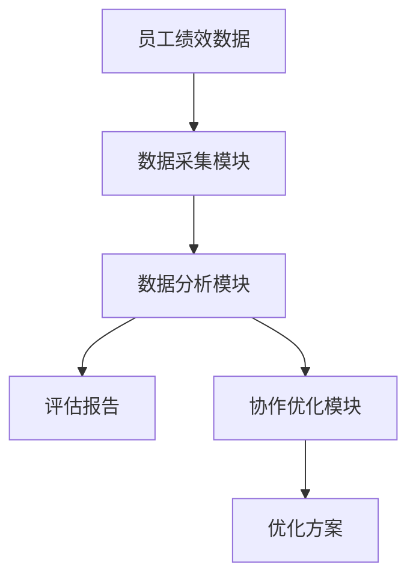
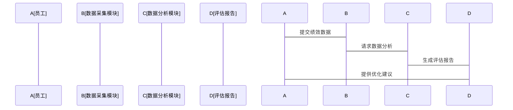

                 


# 多智能体系统在公司人力资本效率评估中的应用

## 关键词：多智能体系统、人力资本效率、智能化评估、员工绩效、协作优化

## 摘要：  
随着企业规模的不断扩大和竞争的加剧，如何高效评估和优化人力资本效率成为企业面临的重大挑战。多智能体系统（Multi-Agent System, MAS）作为一种新兴的技术手段，能够通过多个智能体的协作，实现对员工绩效、团队协作和组织效率的智能化评估。本文将详细探讨多智能体系统在人力资本效率评估中的应用，从理论基础到实际案例，系统性地分析其优势和实现方式。通过本文的阐述，读者将能够理解如何利用MAS技术优化企业的人力资源管理，提升整体效率。

---

# 第1章: 多智能体系统与人力资本效率评估引论

## 1.1 多智能体系统的基本概念

### 1.1.1 多智能体系统的定义与特点  
多智能体系统（MAS）是由多个智能体（Agent）组成的分布式系统，这些智能体能够通过自主决策和协作完成特定任务。MAS具有以下特点：  
- **自主性**：每个智能体能够独立决策。  
- **反应性**：能够实时感知环境并做出反应。  
- **协作性**：多个智能体之间可以协同工作，共同完成目标。  
- **分布式性**：系统中的智能体分布在网络中，不依赖于单一中心节点。  

### 1.1.2 多智能体系统的分类与应用场景  
多智能体系统可以分为以下几类：  
1. **基于任务的MAS**：智能体协作完成特定任务（如项目管理）。  
2. **基于市场的MAS**：智能体通过市场机制进行资源分配（如经济模拟）。  
3. **基于规则的MAS**：智能体通过预定义规则进行协作（如流程自动化）。  

MAS的应用场景包括：供应链管理、智能交通系统、分布式计算、组织管理等。

### 1.1.3 多智能体系统的核心要素与结构  
MAS的核心要素包括：  
- **智能体**：系统的执行单元，具有感知、决策和执行能力。  
- **通信机制**：智能体之间的信息交换方式。  
- **协作机制**：智能体如何共同完成目标的规则和策略。  
- **环境**：智能体所处的外部环境，可能是物理环境或虚拟环境。  

---

## 1.2 人力资本效率评估的背景与意义

### 1.2.1 人力资本的定义与内涵  
人力资本是指员工的知识、技能、经验和创造力的总和，是企业核心竞争力的重要来源。人力资本效率评估的目标是通过量化员工的贡献，优化资源配置，提升组织绩效。

### 1.2.2 人力资本效率评估的必要性  
在现代企业中，人力资本的管理至关重要。传统的人力资本评估方法存在以下问题：  
- 数据分散，难以整合。  
- 评估标准不统一，缺乏客观性。  
- 部门协作效率低下，难以量化。  

### 1.2.3 多智能体系统在人力资本管理中的优势  
MAS能够通过以下方式解决上述问题：  
- **数据整合**：智能体可以实时收集和分析员工绩效数据。  
- **协作优化**：通过智能体的协作，提升部门之间的协同效率。  
- **动态适应**：MAS能够根据环境变化实时调整评估策略。  

---

## 1.3 多智能体系统与人力资本效率评估的结合

### 1.3.1 多智能体系统在组织管理中的应用  
在组织管理中，MAS可以用于：  
- **任务分配**：智能体根据员工能力和任务需求，自动分配最优任务。  
- **绩效监控**：智能体实时监控员工的工作进度和质量。  
- **反馈优化**：根据绩效数据，智能体能够调整员工的职责和任务分配。  

### 1.3.2 人力资本效率评估的多维度分析  
人力资本效率评估需要从以下几个维度进行分析：  
1. **员工绩效**：员工的工作成果和效率。  
2. **团队协作**：团队内部的沟通与合作效率。  
3. **组织结构**：组织架构对效率的影响。  
4. **资源分配**：资源的合理配置程度。  

### 1.3.3 多智能体系统在人力资本优化中的潜力  
MAS可以通过以下方式优化人力资本管理：  
- **智能化决策**：基于数据的智能决策，减少人为误差。  
- **动态优化**：根据实时数据调整资源分配。  
- **预测分析**：通过数据分析预测未来的人力需求。  

---

## 1.4 本章小结  
本章介绍了多智能体系统的基本概念、分类和核心要素，并探讨了MAS在人力资本效率评估中的应用背景和意义。通过MAS技术，企业可以实现人力资本管理的智能化和优化，从而提升整体效率。

---

# 第2章: 多智能体系统的核心概念与原理

## 2.1 多智能体系统的原理

### 2.1.1 智能体的基本属性与行为模式  
智能体具有以下基本属性：  
- **知识库**：存储智能体的知识和经验。  
- **目标**：智能体的行为动机。  
- **决策机制**：根据感知信息做出决策。  
- **执行机制**：将决策转化为行动。  

### 2.1.2 多智能体系统的通信机制  
通信机制是MAS的重要组成部分，主要包括以下几种方式：  
- **直接通信**：智能体之间直接交换信息。  
- **间接通信**：通过中间媒介传递信息。  
- **发布-订阅模式**：智能体发布信息，其他智能体订阅并接收信息。  

### 2.1.3 多智能体系统的协作与决策机制  
协作机制包括以下几种：  
- **协商机制**：智能体之间通过协商达成一致。  
- **分布式决策**：多个智能体共同参与决策过程。  
- **任务分配机制**：智能体根据自身能力分配任务。  

---

## 2.2 多智能体系统的架构设计

### 2.2.1 分层架构与功能模块划分  
MAS的分层架构通常包括以下层次：  
1. **感知层**：智能体感知环境信息。  
2. **决策层**：智能体根据感知信息做出决策。  
3. **执行层**：智能体执行决策并输出结果。  

### 2.2.2 智能体之间的关系与交互  
智能体之间的关系可以是：  
- **竞争关系**：智能体之间存在竞争，例如任务分配中的竞争。  
- **合作关系**：智能体之间需要协作完成任务。  
- **混合关系**：既有竞争也有合作。  

### 2.2.3 多智能体系统的动态性与适应性  
MAS具有高度的动态性，能够根据环境变化实时调整行为。适应性体现在以下几个方面：  
- **自适应决策**：智能体能够根据环境变化调整决策。  
- **自我修复**：系统能够在出现故障时自我修复。  
- **学习能力**：智能体通过学习提升自身能力。  

---

## 2.3 多智能体系统的数学模型与算法

### 2.3.1 多智能体系统的状态表示与转换  
智能体的状态可以通过以下方式表示：  
- **状态空间**：所有可能的状态集合。  
- **状态转移**：状态之间的转换关系。  

### 2.3.2 智能体之间的博弈与协作模型  
博弈论是MAS的重要理论基础，可以通过博弈模型描述智能体之间的关系。常见的博弈模型包括：  
- **纳什均衡**：所有智能体都采取最优策略，无法通过单方面改变策略而受益。  
- **囚徒困境**：智能体之间可能存在的非合作行为。  

### 2.3.3 多智能体系统的优化算法  
常用的优化算法包括：  
- **遗传算法**：模拟生物进化过程，用于寻找最优解。  
- **粒子群优化算法**：模拟鸟群觅食行为，用于优化问题求解。  
- **蚁群算法**：模拟蚂蚁觅食行为，用于路径优化等问题。  

---

## 2.4 本章小结  
本章详细介绍了多智能体系统的原理、架构设计和数学模型。通过这些内容，读者可以理解MAS的核心概念和实现方式，为后续章节的应用分析奠定基础。

---

# 第3章: 多智能体系统在人力资本效率评估中的应用

## 3.1 人力资本效率评估的多维度分析

### 3.1.1 员工绩效评估的多智能体模型  
员工绩效评估可以通过MAS实现，具体步骤如下：  
1. **数据采集**：智能体采集员工的工作数据，包括任务完成情况、工作效率等。  
2. **数据分析**：智能体对数据进行分析，评估员工绩效。  
3. **反馈优化**：智能体根据评估结果，优化员工的工作安排。  

### 3.1.2 团队协作的多智能体建模  
团队协作可以通过以下方式建模：  
- **任务分配**：智能体根据团队成员的能力和任务需求，分配最优任务。  
- **协作监控**：智能体实时监控团队协作的进度和效果。  
- **协作优化**：智能体根据协作数据，优化团队的协作方式。  

### 3.1.3 组织效率的多智能体优化  
组织效率的优化可以通过MAS实现，具体包括：  
- **资源分配**：智能体根据组织需求，优化资源分配。  
- **流程优化**：智能体分析组织流程，提出优化建议。  
- **决策支持**：智能体为管理层提供数据支持，辅助决策。  

---

## 3.2 多智能体系统在人力资本效率评估中的算法实现

### 3.2.1 多智能体协作算法的设计  
以下是多智能体协作算法的伪代码：  
```python
function multi_agent_collaboration():
    for each agent in agents:
        collect_data(agent)
    analyze_data()
    generate_report()
    return result
```

### 3.2.2 多智能体系统的数学模型  
以下是一个简单的多智能体协作模型：  
$$ C = \sum_{i=1}^{n} w_i x_i $$  
其中，$C$ 表示协作效果，$w_i$ 表示第 $i$ 个智能体的权重，$x_i$ 表示第 $i$ 个智能体的贡献。  

### 3.2.3 多智能体系统的实现案例  
以下是一个基于MAS的员工绩效评估系统实现案例：  
1. **需求分析**：明确系统需要评估的员工绩效指标。  
2. **系统设计**：设计智能体的通信机制和协作算法。  
3. **系统实现**：编写智能体的代码，实现数据采集、分析和报告生成功能。  
4. **系统测试**：测试系统的性能和准确性。  

---

## 3.3 本章小结  
本章探讨了多智能体系统在人力资本效率评估中的应用，分析了员工绩效评估、团队协作和组织效率优化的实现方式。通过MAS技术，企业可以实现人力资本管理的智能化和优化。

---

# 第4章: 多智能体系统在人力资本效率评估中的系统分析与架构设计

## 4.1 系统分析与设计

### 4.1.1 项目介绍  
本项目旨在开发一个多智能体系统，用于评估公司的人力资本效率。  

### 4.1.2 系统功能设计  
系统功能模块包括：  
- **数据采集模块**：采集员工绩效数据。  
- **数据分析模块**：分析员工绩效数据，生成评估报告。  
- **协作优化模块**：优化团队协作和资源分配。  

### 4.1.3 系统架构设计  
以下是系统架构设计的Mermaid图：  


### 4.1.4 系统接口设计  
系统接口包括：  
- **员工绩效接口**：用于采集员工绩效数据。  
- **协作优化接口**：用于优化团队协作。  
- **报告生成接口**：用于生成评估报告。  

### 4.1.5 系统交互设计  
以下是系统交互设计的Mermaid图：  


---

## 4.2 系统实现与优化

### 4.2.1 环境安装与配置  
开发环境包括：  
- **Python**：用于编写智能体代码。  
- **Flask**：用于实现数据采集模块。  
- **TensorFlow**：用于数据分析和建模。  

### 4.2.2 系统核心代码实现  
以下是系统核心代码实现：  
```python
from flask import Flask
import tensorflow as tf

app = Flask(__name__)

@app.route('/collect_data', methods=['POST'])
def collect_data():
    # 接收数据并存储
    return 'Data collected successfully'

@app.route('/analyze_data', methods=['POST'])
def analyze_data():
    # 数据分析逻辑
    return 'Analysis completed'

if __name__ == '__main__':
    app.run()
```

### 4.2.3 系统优化与测试  
系统优化包括：  
- **性能优化**：优化算法，提升系统运行效率。  
- **数据安全性**：确保数据的安全性和隐私性。  
- **用户体验优化**：提升系统的易用性和响应速度。  

---

## 4.3 本章小结  
本章详细分析了多智能体系统在人力资本效率评估中的系统架构设计和实现过程，通过实际案例展示了MAS技术的应用潜力。

---

# 第5章: 多智能体系统在人力资本效率评估中的项目实战

## 5.1 项目背景与需求分析

### 5.1.1 项目背景  
本项目旨在开发一个多智能体系统，用于评估某公司的员工绩效和团队协作效率。  

### 5.1.2 项目需求  
项目需求包括：  
- 实现员工绩效数据的采集和分析。  
- 优化团队协作效率。  
- 提供可视化的评估报告。  

---

## 5.2 项目实施与代码实现

### 5.2.1 项目实施步骤  
1. **需求分析**：明确项目目标和需求。  
2. **系统设计**：设计系统架构和功能模块。  
3. **系统实现**：编写智能体代码，实现数据采集、分析和报告生成功能。  
4. **系统测试**：测试系统的性能和准确性。  
5. **系统优化**：优化算法和系统性能。  

### 5.2.2 核心代码实现  
以下是项目的核心代码实现：  
```python
import numpy as np
from sklearn.metrics import accuracy_score

# 数据预处理
data = np.array([...])  # 输入数据
labels = np.array([...])  # 标签

# 模型训练
model = tf.keras.Sequential([...])  # 定义模型
model.compile(optimizer='adam', loss='binary_crossentropy', metrics=['accuracy'])
model.fit(data, labels, epochs=10, batch_size=32)

# 模型评估
y_pred = model.predict(data)
print(accuracy_score(labels, y_pred.argmax(axis=1)))
```

---

## 5.3 项目总结与经验分享

### 5.3.1 项目总结  
本项目成功实现了多智能体系统在人力资本效率评估中的应用，验证了MAS技术的有效性和潜力。  

### 5.3.2 经验分享  
在项目实施过程中，需要注意以下几点：  
- **数据质量**：数据的准确性和完整性对系统性能影响重大。  
- **算法选择**：选择合适的算法和模型，提升系统效率。  
- **团队协作**：团队成员之间的协作和沟通至关重要。  

---

## 5.4 本章小结  
本章通过实际项目案例，详细展示了多智能体系统在人力资本效率评估中的应用过程，为读者提供了宝贵的实战经验。

---

# 第6章: 多智能体系统在人力资本效率评估中的最佳实践

## 6.1 最佳实践

### 6.1.1 系统设计的注意事项  
在系统设计过程中，需要注意以下几点：  
- **可扩展性**：系统应具备良好的扩展性，便于后续功能的添加。  
- **可维护性**：系统应具备良好的可维护性，便于后续优化和升级。  
- **安全性**：系统应具备良好的安全性，确保数据的安全性和隐私性。  

### 6.1.2 系统优化的技巧  
系统优化的技巧包括：  
- **算法优化**：选择合适的算法和优化方法，提升系统性能。  
- **资源优化**：合理分配和利用资源，提升系统效率。  
- **性能监控**：实时监控系统性能，及时发现和解决问题。  

### 6.1.3 系统维护的建议  
系统维护的建议包括：  
- **定期更新**：定期更新系统和算法，保持系统的先进性和有效性。  
- **数据备份**：定期备份数据，防止数据丢失。  
- **用户支持**：提供良好的用户支持，及时解决用户的问题和需求。  

---

## 6.2 项目小结

### 6.2.1 小结  
通过本项目的实施，我们验证了多智能体系统在人力资本效率评估中的应用潜力，同时也积累了一些宝贵的经验和教训。  

### 6.2.2 注意事项  
在实际应用中，需要注意以下几点：  
- **数据的准确性**：数据的准确性和完整性对系统性能影响重大。  
- **算法的适用性**：选择合适的算法和模型，提升系统效率。  
- **团队的协作**：团队成员之间的协作和沟通至关重要。  

### 6.2.3 拓展阅读  
对于感兴趣的研究者和实践者，可以进一步研究以下内容：  
- **多智能体系统的优化算法**：研究更高效的算法和优化方法。  
- **多智能体系统的应用领域**：探索MAS在其他领域的应用潜力。  
- **多智能体系统的前沿技术**：关注MAS领域的最新研究成果和技术进展。  

---

## 6.3 本章小结  
本章总结了多智能体系统在人力资本效率评估中的最佳实践，并提出了系统的维护建议和未来的拓展方向。

---

# 结语  
多智能体系统在人力资本效率评估中的应用前景广阔，随着技术的不断发展，MAS技术将为企业的人力资源管理带来更多的创新和优化。通过本文的详细阐述，读者可以深入了解MAS在人力资本管理中的应用，并为未来的实践提供宝贵的参考和指导。

---

# 参考文献  
（此处列出相关文献和参考资料）

