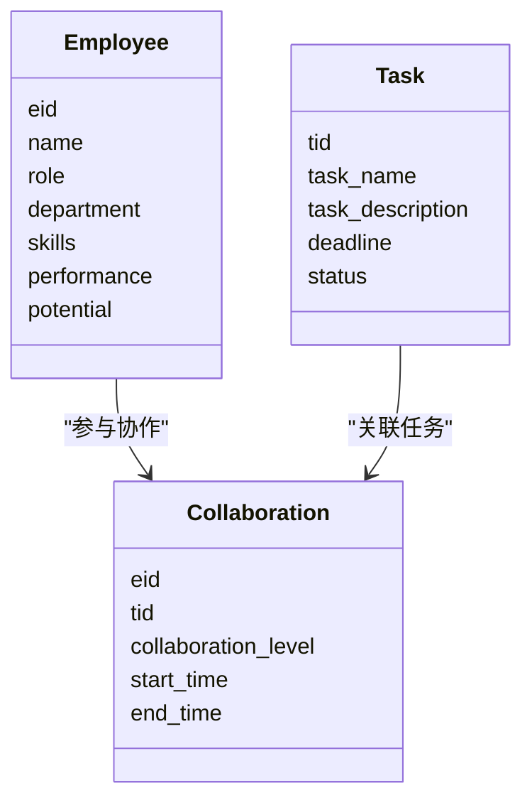

                 


# 多智能体系统在公司人力资本评估中的应用

> 关键词：多智能体系统、人力资本评估、分布式计算、博弈论模型、协作算法

> 摘要：本文深入探讨了多智能体系统在公司人力资本评估中的应用。通过分析多智能体系统的原理、算法、系统架构，结合实际案例，详细讲解了如何利用多智能体技术提升公司人力资本评估的效率和准确性。文章内容涵盖背景介绍、核心概念、算法原理、系统设计、项目实战等部分，为读者提供了全面的技术指导和实践参考。

---

## 第1章: 多智能体系统与公司人力资本评估的背景介绍

### 1.1 多智能体系统的基本概念
#### 1.1.1 多智能体系统的定义
多智能体系统（Multi-Agent Systems, MAS）是由多个智能体（Agent）组成的分布式系统，这些智能体能够通过协作完成复杂的任务。每个智能体都有自己的目标、知识、推理能力，并能够与其他智能体或环境进行交互。

#### 1.1.2 多智能体系统的分类与特点
- **分类**：  
  - 分布式多智能体系统（Distributed MAS）：智能体分布在网络中，通过通信完成任务。  
  - 集中式多智能体系统（Centralized MAS）：所有智能体在一个中心系统中协作。  
- **特点**：  
  - 分布式计算能力  
  - 自主性与协作性  
  - 动态性和适应性  

#### 1.1.3 多智能体系统的应用场景
多智能体系统广泛应用于机器人、自动驾驶、金融交易、物流等领域。在公司人力资本评估中，可以利用多智能体系统来优化员工绩效评估、团队协作分析和人才推荐等任务。

---

### 1.2 公司人力资本评估的背景与意义
#### 1.2.1 人力资本的重要性
人力资本是公司最重要的资源之一，直接影响企业的绩效和发展。科学的人力资本评估能够帮助企业优化人员配置、提升员工绩效和团队协作能力。

#### 1.2.2 传统人力资本评估的局限性
- 数据分散，难以整合  
- 评估方法单一，缺乏动态性  
- 协作效率低，难以实现跨部门协作  

#### 1.2.3 多智能体系统在人力资本评估中的优势
- 分布式计算能力，能够处理大规模数据  
- 智能体协作，实现多维度评估  
- 动态适应性，能够实时更新评估结果  

---

## 第2章: 多智能体系统与人力资本评估的核心概念与联系

### 2.1 多智能体系统的核心原理
#### 2.1.1 智能体的定义与属性
- **智能体定义**：智能体是具有感知、决策、执行能力的实体。  
- **智能体属性**：自主性、反应性、协作性、学习能力。  

#### 2.1.2 多智能体系统的协作机制
- 通信与协调：智能体之间通过通信模块共享信息。  
- 协作协议：制定协作规则和任务分配策略。  
- 冲突解决：通过协商或仲裁机制解决协作中的冲突。  

#### 2.1.3 多智能体系统的分布式计算
- 分布式计算的核心思想是将任务分解为多个子任务，由不同智能体分别执行。  
- 通过分布式计算，可以提高系统的并行处理能力和资源利用率。  

---

### 2.2 多智能体系统与人力资本评估的联系
#### 2.2.1 人力资本评估中的多智能体模型
- **员工绩效评估**：每个员工被视为一个智能体，通过其行为数据评估绩效。  
- **团队协作分析**：团队由多个智能体组成，通过协作完成任务。  
- **人才推荐系统**：利用智能体协作，实现精准的人才匹配。  

#### 2.2.2 多智能体系统在人力资本评估中的应用场景
- 员工绩效评估：通过智能体协作，综合评估员工的技能、贡献和潜力。  
- 团队协作分析：分析团队成员的协作效率，优化团队结构。  
- 人才推荐：基于智能体的协作数据，推荐适合岗位的人才。  

---

### 2.3 多智能体系统与人力资本评估的ER实体关系图
```mermaid
erDiagram
    employee {
        eid : integer
        name : string
        role : string
        department : string
        skills : set of string
        performance : float
        potential : float
    }
    task {
        tid : integer
        task_name : string
        task_description : string
        deadline : date
        status : enum('pending', 'in_progress', 'completed')
    }
    collaboration {
        eid : integer
        tid : integer
        collaboration_level : integer
        start_time : datetime
        end_time : datetime
    }
    employee --> task : "参与"
    employee --> collaboration : "记录协作"
    task --> collaboration : "关联协作记录"
```

---

## 第3章: 多智能体系统在人力资本评估中的算法原理

### 3.1 分布式计算与协作算法
#### 3.1.1 分布式计算的基本原理
- 分布式计算将任务分解为多个子任务，由不同节点（智能体）分别执行。  
- 通过通信模块实现节点之间的数据同步和任务协调。  

#### 3.1.2 协作算法的设计
- **任务分配算法**：根据智能体的能力和负载，动态分配任务。  
- **协作协议**：定义智能体之间的通信规则和协作流程。  
- **冲突解决算法**：通过协商或仲裁机制解决协作中的冲突。  

#### 3.1.3 协作算法的实现
```python
def distribute_task(tasks, agents):
    for task in tasks:
        agent = select_agent(task)  # 根据任务需求选择合适的智能体
        agent.receive_task(task)
        agent.execute_task(task)
        agent.send_result(task)
```

---

### 3.2 博弈论模型在人力资本评估中的应用
#### 3.2.1 博弈论的基本概念
- **博弈论**：研究多个参与者在策略互动中的行为及其结果的理论。  
- **纳什均衡**：所有参与者在给定其他参与者策略的情况下，不再改变自己的策略的稳定状态。  

#### 3.2.2 博弈论模型在协作中的应用
- **收益分配模型**：根据智能体的贡献，动态分配收益。  
- **激励机制**：通过激励措施，提高智能体的协作积极性。  

#### 3.2.3 博弈论模型的数学表达
$$ \text{收益分配} = \sum_{i=1}^{n} \alpha_i \cdot \text{贡献}_i $$  
其中，$\alpha_i$是智能体i的权重，$\text{贡献}_i$是智能体i的贡献值。

---

## 第4章: 多智能体系统在人力资本评估中的系统分析与架构设计

### 4.1 系统分析
#### 4.1.1 问题场景介绍
- 员工绩效评估：如何综合评估员工的技能、贡献和潜力。  
- 团队协作分析：如何分析团队成员的协作效率。  
- 人才推荐：如何实现精准的人才推荐。  

#### 4.1.2 系统功能需求
- 数据采集：收集员工的行为数据、绩效数据和协作数据。  
- 智能体协作：实现智能体之间的通信与协作。  
- 评估与推荐：基于协作数据，生成评估报告和人才推荐。  

---

### 4.2 系统架构设计
#### 4.2.1 领域模型设计


#### 4.2.2 系统架构设计


---

## 第5章: 多智能体系统在人力资本评估中的项目实战

### 5.1 环境安装与配置
#### 5.1.1 环境要求
- Python 3.8 或更高版本  
- 安装必要的库：numpy, pandas, matplotlib, scikit-learn  

#### 5.1.2 系统核心代码实现
```python
class Agent:
    def __init__(self, agent_id):
        self.agent_id = agent_id
        self.tasks = []
        self.skills = {}
    
    def receive_task(self, task):
        self.tasks.append(task)
    
    def execute_task(self, task):
        # 模拟任务执行
        pass
    
    def send_result(self, task):
        # 模拟结果发送
        pass
```

#### 5.1.3 系统功能实现
- 数据预处理：清洗和整合员工数据、任务数据和协作数据。  
- 模型训练：基于历史数据，训练评估模型。  
- 智能体协作：实现智能体之间的通信与协作。  

---

## 第6章: 多智能体系统在人力资本评估中的总结与展望

### 6.1 总结
本文详细探讨了多智能体系统在公司人力资本评估中的应用，分析了其核心原理、算法和系统架构。通过实际案例展示了如何利用多智能体系统提升人力资本评估的效率和准确性。

### 6.2 展望
未来，随着人工智能技术的不断发展，多智能体系统在人力资本评估中的应用将更加广泛。可以通过引入更复杂的协作算法和博弈论模型，进一步优化评估过程和结果。

---

## 附录: 参考文献与扩展阅读
- 参考文献：  
  - 王某某, 《多智能体系统与分布式计算》，某某出版社，2023年。  
  - 李某某, 《博弈论与人工智能》，某某出版社，2022年。  
- 扩展阅读：  
  - 多智能体系统的最新研究进展  
  - 人工智能在人力资源管理中的应用  

---

以上是《多智能体系统在公司人力资本评估中的应用》的目录结构和部分内容概述，希望对您有所帮助！如果需要进一步的细节或具体章节内容，可以随时告诉我！

