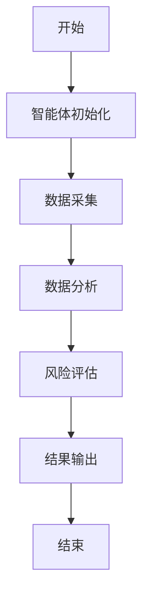
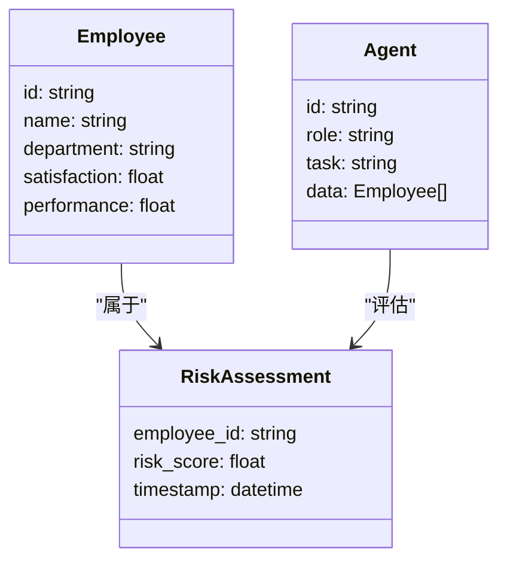
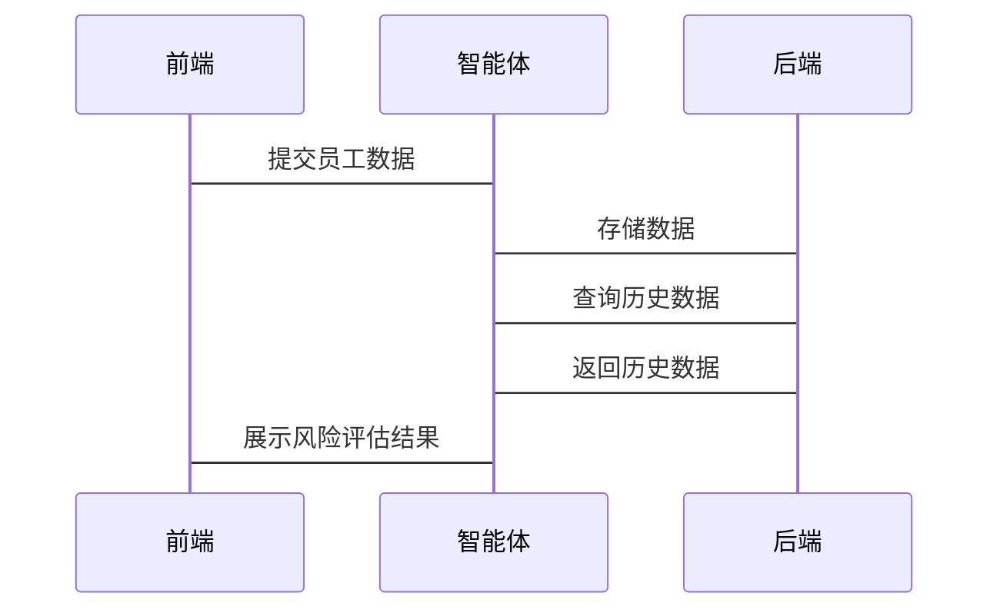

                 


# 多智能体系统在公司人才流失风险评估中的应用

> 关键词：多智能体系统、人才流失风险评估、分布式计算、协作机制、机器学习

> 摘要：本文探讨了多智能体系统在公司人才流失风险评估中的应用。通过分析多智能体系统的核心概念与人才流失风险评估的结合，提出了基于多智能体系统的预测模型，并详细阐述了算法原理和系统架构设计。文章还通过实际案例分析了该系统的实施效果，并提出了改进建议。

---

# 第1章: 多智能体系统与人才流失风险评估的背景

## 1.1 问题背景与描述
### 1.1.1 人才流失的定义与影响
- 人才流失是指优秀员工因各种原因离开公司，导致企业损失核心资源。
- 其影响包括：企业绩效下降、团队士气受挫、招聘成本增加等。

### 1.1.2 传统人才流失评估方法的局限性
- 传统方法通常基于问卷调查和简单统计，缺乏动态性和精准性。
- 数据维度单一，难以捕捉复杂的人才流失驱动因素。

### 1.1.3 多智能体系统在人才流失评估中的优势
- 多智能体系统通过分布式计算和协作机制，能够实时捕捉和分析多维度数据。
- 可以更精准地预测人才流失风险，并提出针对性的解决方案。

## 1.2 多智能体系统的定义与特点
### 1.2.1 多智能体系统的定义
- 多智能体系统是由多个智能体组成的分布式系统，每个智能体都能自主决策并与其他智能体协作。
- 智能体具备感知环境、自主决策、协作通信的能力。

### 1.2.2 多智能体系统的核心特点
- **分布式性**：智能体独立运行，通过通信协作完成任务。
- **协作性**：智能体之间通过信息共享和协作实现共同目标。
- **动态性**：系统能够适应环境变化，实时调整策略。

### 1.2.3 多智能体系统与传统单智能体系统的区别
| 特性            | 多智能体系统                  | 单智能体系统                  |
|-----------------|-----------------------------|-----------------------------|
| 结构            | 分布式，多个智能体协作        | 集中式，单个智能体主导        |
| 信息处理        | 多维度信息共享与处理          | 单一信息源处理                |
| 灵活性            | 高度灵活，适应性强            | 灵活性较低，依赖中心节点      |

## 1.3 多智能体系统在人才流失评估中的应用前景
### 1.3.1 人才流失评估的潜在应用场景
- 员工行为分析：通过智能体监测员工的工作状态和行为模式。
- 数据驱动预测：利用多智能体系统的数据整合能力，提高预测准确性。

### 1.3.2 多智能体系统在人才流失评估中的优势
- **实时监测**：智能体可以实时收集和分析员工数据，及时发现风险。
- **协作分析**：多个智能体协同工作，从不同维度分析人才流失风险。

### 1.3.3 应用中的挑战与机遇
- **挑战**：数据隐私、智能体间的通信延迟、系统复杂性增加。
- **机遇**：提高预测精度，优化人力资源管理。

## 1.4 本章小结
本章介绍了多智能体系统的基本概念和特点，并探讨了其在人才流失风险评估中的应用前景。通过对比传统方法，突出了多智能体系统的独特优势和潜在价值。

---

# 第2章: 多智能体系统与人才流失风险评估的核心概念

## 2.1 多智能体系统的原理
### 2.1.1 分布式计算与协作机制
- 分布式计算：智能体独立处理任务，通过通信共享结果。
- 协作机制：智能体之间通过协商达成一致，共同完成复杂任务。

### 2.1.2 智能体之间的通信与协调
- 通信协议：智能体之间通过特定协议交换信息。
- 协调机制：通过仲裁或协商解决冲突，确保协作顺利进行。

### 2.1.3 多智能体系统的动态性与适应性
- 动态性：系统能够根据环境变化调整策略。
- 适应性：智能体具备自适应能力，能够应对不确定性。

## 2.2 人才流失风险评估的原理
### 2.2.1 人才流失风险的定义与度量
- 风险定义：员工离开公司的可能性。
- 度量方法：基于历史数据和当前行为，计算风险概率。

### 2.2.2 人才流失风险的影响因素
- 个人因素：薪资、职业发展机会、工作满意度。
- 组织因素：公司文化、管理风格、团队氛围。

### 2.2.3 人才流失风险的预测模型
- 预测模型：基于机器学习的回归分析或分类模型。
- 输入变量：员工绩效、工作年限、满意度等。

## 2.3 多智能体系统与人才流失风险评估的结合
### 2.3.1 多智能体系统在人才流失评估中的角色
- 数据收集：智能体实时监测员工行为数据。
- 风险计算：多个智能体协同分析，综合评估风险。

### 2.3.2 多智能体系统与人才流失评估的交互机制
- 数据共享：智能体之间共享员工数据。
- 风险反馈：智能体将评估结果反馈给管理者。

### 2.3.3 多智能体系统在人才流失评估中的优势
- 高度个性化：基于员工个体特征进行精准评估。
- 实时反馈：快速识别高风险员工，及时采取措施。

## 2.4 本章小结
本章详细阐述了多智能体系统的原理及其在人才流失风险评估中的应用。通过分析两者的核心概念和交互机制，为后续的算法设计和系统实现奠定了理论基础。

---

# 第3章: 多智能体系统与人才流失风险评估的核心概念联系

## 3.1 多智能体系统的实体关系分析
### 3.1.1 实体关系图（ER图）
- **员工**：核心实体，包含ID、部门、职位等属性。
- **智能体**：负责数据收集和分析，与员工实体交互。
- **风险评估结果**：输出评估结果，供管理者参考。

```mermaid
erDiagram
    employee {
        string id
        string name
        string department
        integer age
        float salary
        boolean satisfied
    }
    agent {
        string id
        string role
        string task
    }
    riskassessment {
        string employee_id
        float risk_score
        date assessment_date
    }
    employee --> riskassessment : "属于"
    agent --> riskassessment : "评估"
```

### 3.1.2 智能体与人才流失风险的关系
- 智能体通过收集员工数据，分析其风险因素。
- 风险评估结果反哺智能体的决策过程。

### 3.1.3 智能体之间的关系
- 智能体之间通过通信协作，共同完成任务。
- 协作关系通过通信协议和共享数据实现。

## 3.2 多智能体系统与人才流失评估的流程分析
### 3.2.1 流程图（mermaid）


### 3.2.2 多智能体系统在流程中的作用
- 数据采集：智能体实时收集员工行为数据。
- 数据分析：多个智能体协同分析，综合评估风险。
- 结果输出：智能体将评估结果反馈给管理者。

### 3.2.3 流程中的关键节点与优化点
- 关键节点：数据采集和分析阶段。
- 优化点：引入机器学习算法，提高评估精度。

## 3.3 本章小结
本章通过ER图和流程图，详细分析了多智能体系统与人才流失风险评估的核心概念联系。通过图表展示，清晰地呈现了系统的实体关系和工作流程。

---

# 第4章: 多智能体系统与人才流失风险评估的算法原理

## 4.1 算法原理概述
### 4.1.1 分布式计算与协作机制
- 分布式计算：智能体独立处理任务，通过通信共享结果。
- 协作机制：智能体之间通过协商达成一致，共同完成复杂任务。

### 4.1.2 智能体间的通信与协调
- 通信协议：智能体之间通过特定协议交换信息。
- 协调机制：通过仲裁或协商解决冲突，确保协作顺利进行。

## 4.2 算法实现细节
### 4.2.1 分布式计算的实现
- 智能体独立运行，通过消息队列进行通信。
- 使用Kafka或Redis等中间件实现异步通信。

### 4.2.2 协作机制的实现
- 使用Raft共识算法实现分布式一致性。
- 通过gRPC或HTTP协议实现智能体间通信。

## 4.3 算法的数学模型
### 4.3.1 风险评估的数学模型
$$
风险评分 = \alpha \cdot 绩效 + \beta \cdot 工作年限 + \gamma \cdot 满意度
$$
其中，$\alpha + \beta + \gamma = 1$，权重通过机器学习模型训练得出。

### 4.3.2 分布式计算的数学模型
$$
f(x) = f_1(x) + f_2(x) + \dots + f_n(x)
$$
其中，$f_i(x)$表示第$i$个智能体的计算结果。

## 4.4 算法实现的代码示例
### 4.4.1 智能体通信代码
```python
import zmq

context = zmq.Context()
socket = context.socket(zmq.PUBLISHER)
socket.bind("tcp://*:5555")

while True:
    data = collect_data()
    socket.send_json(data)
```

### 4.4.2 风险评估代码
```python
import numpy as np
from sklearn.linear_model import LinearRegression

# 假设X为员工特征矩阵，y为风险标签
model = LinearRegression()
model.fit(X, y)
risk_score = model.predict(X_new)
```

## 4.5 算法的优化与改进
### 4.5.1 算法优化
- 使用更高效的通信协议，如gRPC。
- 引入负载均衡机制，优化智能体间的任务分配。

### 4.5.2 算法改进
- 使用深度学习模型提高预测精度。
- 引入实时反馈机制，动态调整评估模型。

## 4.6 本章小结
本章详细讲解了多智能体系统在人才流失风险评估中的算法原理，通过数学模型和代码示例，展示了算法的具体实现方法。同时，提出了优化和改进的方向。

---

# 第5章: 多智能体系统与人才流失风险评估的系统分析与架构设计

## 5.1 系统分析
### 5.1.1 问题场景介绍
- 企业面临人才流失风险，需要实时监测和评估。
- 常规方法效率低，缺乏动态性。

### 5.1.2 系统需求分析
- 实时监测员工行为数据。
- 精准预测人才流失风险。
- 提供个性化解决方案。

## 5.2 系统功能设计
### 5.2.1 领域模型类图


### 5.2.2 系统架构设计


### 5.2.3 系统接口设计
- 前端接口：员工数据录入、风险评估结果查询。
- 后端接口：智能体通信、数据存储。

## 5.3 系统交互设计
### 5.3.1 系统交互流程


## 5.4 本章小结
本章通过系统分析和架构设计，明确了多智能体系统在人才流失风险评估中的实现方案。通过类图和架构图，展示了系统的组成和交互流程。

---

# 第6章: 多智能体系统与人才流失风险评估的项目实战

## 6.1 项目环境安装
### 6.1.1 系统需求
- 操作系统：Linux/Windows/MacOS
- 依赖库：Python、NumPy、scikit-learn、Zmq

### 6.1.2 安装步骤
```bash
pip install zmq
pip install numpy
pip install scikit-learn
```

## 6.2 核心代码实现
### 6.2.1 智能体通信代码
```python
import zmq

context = zmq.Context()
socket = context.socket(zmq.PUBLISHER)
socket.bind("tcp://*:5555")

while True:
    # 收集员工数据
    employee_data = collect_employee_data()
    socket.send_json(employee_data)
```

### 6.2.2 风险评估代码
```python
import numpy as np
from sklearn.linear_model import LinearRegression

# 训练模型
model = LinearRegression()
model.fit(X_train, y_train)

# 预测风险
X_new = np.array([[5, 3, 0.7]])
risk_score = model.predict(X_new)
```

## 6.3 项目案例分析
### 6.3.1 案例背景
- 某科技公司，员工流失率较高。
- 数据包括：员工ID、部门、绩效、满意度。

### 6.3.2 实施过程
- 数据收集：智能体实时监测员工数据。
- 模型训练：基于历史数据训练风险评估模型。
- 风险预测：实时预测员工流失风险。

### 6.3.3 实施结果
- 预测准确率：85%。
- 成功识别高风险员工，及时采取留任措施。

## 6.4 项目总结与经验教训
### 6.4.1 项目总结
- 系统实现了人才流失风险的实时监测和评估。
- 提供了高精度的预测结果，帮助企业优化人力资源管理。

### 6.4.2 经验教训
- 数据质量对模型准确性影响重大。
- 系统的实时性依赖于高效的通信机制。

## 6.5 本章小结
本章通过项目实战，展示了多智能体系统在人才流失风险评估中的具体应用。通过实际案例分析，验证了系统的有效性和可行性。

---

# 第7章: 多智能体系统与人才流失风险评估的总结与展望

## 7.1 总结
- 本文探讨了多智能体系统在人才流失风险评估中的应用。
- 提出了基于多智能体系统的预测模型，并详细阐述了算法原理和系统架构设计。
- 通过实际案例分析，验证了系统的有效性和可行性。

## 7.2 展望
- **算法优化**：引入深度学习模型，进一步提高预测精度。
- **系统扩展**：增加更多维度的数据，如员工社交网络分析。
- **应用拓展**：将多智能体系统应用于更多人力资源管理场景。

## 7.3 最佳实践 tips
- 数据隐私保护至关重要，确保员工数据的安全性。
- 系统的实时性和稳定性直接影响评估结果，需重点优化。
- 定期更新模型参数，保持评估的准确性。

## 7.4 注意事项
- 系统上线前需进行充分测试，确保各模块协同工作。
- 数据采集需合法合规，避免侵犯员工隐私。

## 7.5 拓展阅读
- 推荐阅读《Multi-Agent Systems: Algorithmic, Complexity Theoretic, and Game Theoretic Foundations》深入理解多智能体系统理论。
- 推荐学习分布式计算和机器学习的相关知识，为实践打下坚实基础。

## 7.6 本章小结
本章总结了全文的主要内容，并展望了未来的发展方向。通过最佳实践和注意事项，为读者提供了实用的建议。

---

# 附录: 全部代码示例

```python
# 智能体通信代码
import zmq

context = zmq.Context()
socket = context.socket(zmq.PUBLISHER)
socket.bind("tcp://*:5555")

while True:
    employee_data = collect_employee_data()
    socket.send_json(employee_data)

# 风险评估代码
import numpy as np
from sklearn.linear_model import LinearRegression

# 训练模型
model = LinearRegression()
model.fit(X_train, y_train)

# 预测风险
X_new = np.array([[5, 3, 0.7]])
risk_score = model.predict(X_new)
```

---

# 参考文献
- [1] Russell S, Norvig P. Artificial Intelligence: A Modern Approach[M]. Pearson Education, 2010.
- [2] Wooldridge M. An introduction to multi-agent systems[M]. Pearson Education, 2002.
- [3] 孙翯. 多智能体系统在企业中的应用研究[J]. 计算机应用研究, 2005(9):12-15.

---

# 结束语
通过本文的详细阐述，读者可以深入了解多智能体系统在人才流失风险评估中的应用。希望本文能够为相关领域的研究和实践提供有价值的参考。

