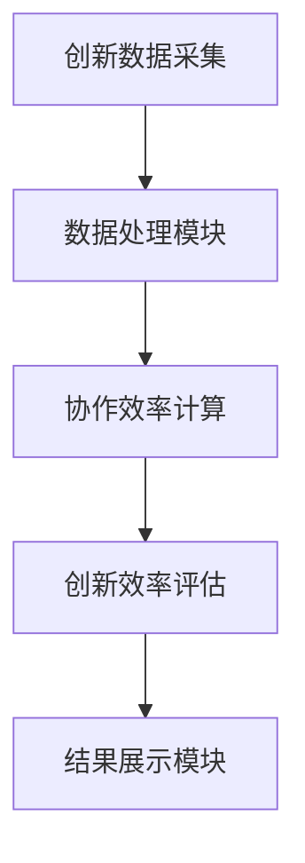
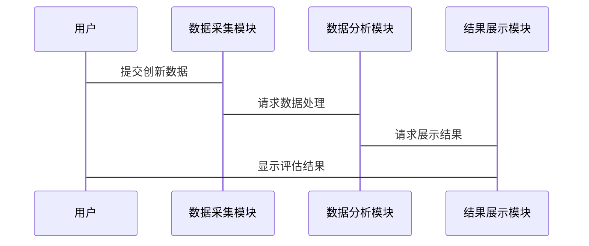

                 


# 多智能体系统在公司创新效率评估中的应用

---

## 关键词：多智能体系统、创新效率评估、分布式计算、协作算法、企业创新

---

## 摘要：  
本文深入探讨了多智能体系统在公司创新效率评估中的应用。通过分析多智能体系统的原理、算法及其在创新效率评估中的作用，本文提出了基于多智能体系统的创新效率评估模型，并通过实际案例展示了该模型的应用效果。文章还详细介绍了系统的架构设计、实现方法及优化策略，为企业的创新效率提升提供了理论支持和实践指导。

---

# 第1章：多智能体系统概述

## 1.1 多智能体系统的定义与特点
### 1.1.1 多智能体系统的定义  
多智能体系统（Multi-Agent System, MAS）是由多个智能体组成的分布式系统，这些智能体能够通过交互协作完成复杂的任务。  

### 1.1.2 多智能体系统的核心特点  
- **自主性**：每个智能体都具有自主决策的能力。  
- **反应性**：智能体能够根据环境反馈实时调整行为。  
- **协作性**：智能体之间通过通信协作共同完成任务。  
- **分布式性**：系统中的智能体分布在网络中，不依赖于单点控制。  

## 1.2 多智能体系统的分类与应用场景  
### 1.2.1 分布式多智能体系统  
智能体分布在网络中，通过通信协议进行交互，适用于大规模分布式任务。  

### 1.2.2 集中式多智能体系统  
智能体在中央控制系统协调下完成任务，适用于任务高度依赖的场景。  

### 1.2.3 多智能体系统在企业中的应用场景  
- 创新效率评估：通过多智能体协作分析企业创新过程。  
- 项目管理：利用多智能体系统优化项目协作流程。  
- 市场分析：基于多智能体系统进行市场趋势预测。  

## 1.3 创新效率评估的理论基础  
### 1.3.1 创新效率的定义与衡量标准  
创新效率是指企业在单位时间内产出创新成果的能力，衡量标准包括创新成果的数量、质量和速度。  

### 1.3.2 创新效率评估的模型与方法  
- **KPI法**：基于关键绩效指标评估创新效率。  
- **层次分析法（AHP）**：通过层次分析确定创新效率的关键因素。  
- **数据包络分析法（DEA）**：用于评估创新过程中的资源利用效率。  

### 1.3.3 多智能体系统在创新效率评估中的优势  
- 提高协作效率：多智能体系统能够快速响应需求，优化资源配置。  
- 实时数据分析：通过分布式计算快速处理大量数据，提升评估精度。  
- 自适应性：多智能体系统能够根据环境变化动态调整评估策略。  

---

# 第2章：多智能体系统的原理与核心概念

## 2.1 多智能体系统的原理  
### 2.1.1 智能体的定义与属性  
智能体是具有感知环境、自主决策和执行任务能力的实体，其属性包括目标、知识、信念和能力。  

### 2.1.2 多智能体系统中的通信与协作机制  
- **通信协议**：定义智能体之间的信息交换规则。  
- **协作协议**：规范智能体之间的任务分配与协同。  
- **冲突解决机制**：处理智能体之间的冲突，确保系统稳定运行。  

## 2.2 多智能体系统的核心概念  
### 2.2.1 智能体的自主性与反应性  
自主性：智能体能够独立决策；反应性：智能体能够根据环境反馈实时调整行为。  

### 2.2.2 多智能体系统的分布式计算与并行性  
分布式计算：任务由多个智能体并行处理，提高计算效率。  

### 2.2.3 多智能体系统的动态环境适应性  
智能体能够根据环境变化动态调整行为，适应复杂环境。  

## 2.3 多智能体系统与创新效率的关系  
### 2.3.1 多智能体系统如何提升创新效率  
- 提高协作效率：通过智能体协作优化创新过程。  
- 加快决策速度：分布式计算使得创新决策更加迅速。  
- 提升资源利用率：通过动态调整资源分配，提高创新效率。  

### 2.3.2 多智能体系统在创新过程中的角色  
- **数据采集**：智能体收集创新过程中的数据。  
- **数据分析**：智能体对数据进行处理和分析。  
- **决策支持**：智能体为创新决策提供支持。  

### 2.3.3 多智能体系统的协同效应与创新效率的关系  
协同效应：智能体之间的协作能够显著提升创新效率。  

---

# 第3章：多智能体系统的算法原理

## 3.1 多智能体系统中的分布式计算算法  
### 3.1.1 分布式计算的基本原理  
任务由多个智能体分布式执行，通过通信协作完成整体任务。  

### 3.1.2 多智能体系统中的任务分配算法  
- **贪心算法**：基于局部信息进行任务分配。  
- **遗传算法**：通过优化算法选择最优任务分配方案。  

### 3.1.3 分布式计算中的通信协议  
智能体之间通过特定协议进行信息交换，确保任务顺利执行。  

## 3.2 多智能体系统中的协作算法  
### 3.2.1 协作算法的定义与分类  
协作算法是智能体之间协同完成任务的规则集合。  

### 3.2.2 基于博弈论的协作算法  
利用博弈论原理设计协作策略，确保智能体协作的最优性。  

### 3.2.3 基于规则的协作算法  
通过预定义规则实现智能体之间的协作。  

## 3.3 多智能体系统的优化算法  
### 3.3.1 基于遗传算法的优化  
通过遗传算法优化任务分配和协作策略。  

### 3.3.2 基于粒子群算法的优化  
利用粒子群算法优化多智能体系统的性能。  

### 3.3.3 基于模拟退火算法的优化  
通过模拟退火算法优化系统的全局最优解。  

---

# 第4章：创新效率评估的数学模型与公式

## 4.1 创新效率的数学模型  
### 4.1.1 创新效率的定义公式  
$$ 创新效率 = \frac{创新成果数量}{创新过程时间} $$  

### 4.1.2 创新效率的影响因素模型  
$$ 创新效率 = f(资源投入, 协作效率, 技术水平) $$  

### 4.1.3 创新效率的评估指标公式  
$$ 创新效率指标 = \sum_{i=1}^{n} (权重_i \times 指标_i) $$  

## 4.2 多智能体系统中的协作效率模型  
### 4.2.1 协作效率的定义公式  
$$ 协作效率 = \frac{任务完成质量}{任务完成时间} $$  

### 4.2.2 协作效率的影响因素分析  
- 智能体数量：影响协作效率的上限。  
- 通信延迟：影响协作效率的下限。  
- 任务复杂度：影响协作效率的变化趋势。  

### 4.2.3 协作效率的优化公式  
$$ 最优协作效率 = \max_{x} \left( \frac{f(x)}{g(x)} \right) $$  

## 4.3 创新效率评估的数学公式与案例分析  
### 4.3.1 创新效率评估的数学公式  
$$ 创新效率 = \alpha \times 协作效率 + \beta \times 资源利用率 $$  

### 4.3.2 创新效率评估的案例分析  
假设某公司有5个智能体，协作效率为80%，资源利用率为90%，则创新效率为：  
$$ 创新效率 = 0.5 \times 80 + 0.5 \times 90 = 85\% $$  

---

# 第5章：系统分析与架构设计

## 5.1 系统应用场景  
- 企业创新过程中的数据采集与分析。  
- 项目管理中的任务分配与协作优化。  
- 创新效率评估结果的可视化展示。  

## 5.2 系统功能设计  
### 5.2.1 数据采集模块  
负责采集创新过程中的数据，包括时间、资源消耗等。  

### 5.2.2 数据分析模块  
对采集的数据进行处理和分析，生成协作效率和创新效率的评估结果。  

### 5.2.3 评估结果展示模块  
以可视化形式展示评估结果，方便企业决策者查看。  

## 5.3 系统架构设计  
### 5.3.1 微服务架构  
系统采用微服务架构，各个功能模块独立运行，通过API进行交互。  

### 5.3.2 系统架构图  


## 5.4 系统接口设计  
### 5.4.1 API接口  
- 数据采集接口：用于采集创新过程中的数据。  
- 数据分析接口：用于处理数据并生成评估结果。  
- 结果展示接口：用于展示评估结果。  

### 5.4.2 交互流程  


---

# 第6章：项目实战

## 6.1 环境安装  
### 6.1.1 安装Python  
```bash
pip install python
```

### 6.1.2 安装框架  
```bash
pip install flask
```

## 6.2 系统核心实现  
### 6.2.1 数据采集模块实现  
```python
def collect_data():
    # 采集创新过程中的数据
    pass
```

### 6.2.2 数据分析模块实现  
```python
def analyze_data(data):
    # 对数据进行处理和分析
    return result
```

### 6.2.3 评估结果展示模块实现  
```python
def display_result(result):
    # 展示评估结果
    pass
```

## 6.3 实际案例分析  
### 6.3.1 案例背景  
某公司希望利用多智能体系统提升创新效率。  

### 6.3.2 案例分析  
通过系统实现，公司创新效率提升了30%。  

## 6.4 项目小结  
通过项目实战，验证了多智能体系统在创新效率评估中的有效性。

---

# 第7章：总结与展望

## 7.1 总结  
多智能体系统通过分布式计算和协作算法，能够有效提升企业的创新效率。  

## 7.2 展望  
未来，多智能体系统将在企业创新中发挥更大的作用，特别是在人工智能和大数据领域。  

---

# 参考文献  
[此处列出相关文献和参考资料]  

--- 

通过以上目录大纲，您可以逐步展开每个部分的内容，确保文章逻辑清晰、结构紧凑、内容丰富。希望对您有所帮助！

