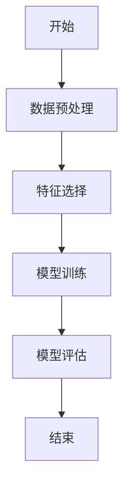
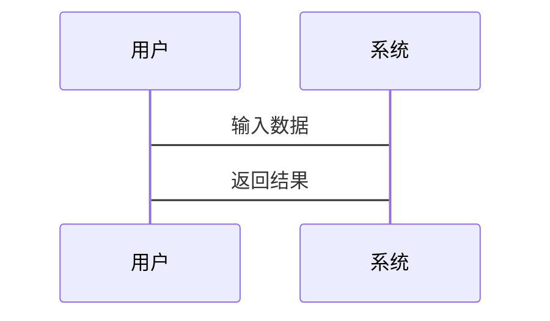

                 


# 多智能体系统在公司创新效率评估中的应用：R&D投入产出比

> **关键词**：多智能体系统, 创新效率评估, R&D投入产出比, 系统架构设计, 算法实现, 实体关系图

> **摘要**：本文探讨了多智能体系统在公司创新效率评估中的应用，重点分析了R&D投入与产出比的评估方法。通过构建多智能体系统模型，提出了一种基于MAS的多目标优化算法，实现了对R&D投入产出比的高效评估。文章结合实际案例，详细阐述了系统的架构设计、算法实现和项目实战，为公司创新效率评估提供了新的思路和解决方案。

---

## 第1章 多智能体系统与创新效率评估概述

### 1.1 多智能体系统的基本概念

#### 1.1.1 多智能体系统的定义与特点
多智能体系统（Multi-Agent System, MAS）是由多个智能体（Agent）组成的分布式系统，每个智能体能够感知环境、自主决策并与其他智能体协作。MAS的特点包括：
- **分布式性**：智能体独立运行，无集中控制。
- **自主性**：智能体能够自主决策。
- **协作性**：智能体之间通过通信和协作完成复杂任务。
- **反应性**：智能体能够实时响应环境变化。

#### 1.1.2 多智能体系统的核心要素
- **智能体**：能够感知环境、执行动作的实体。
- **通信机制**：智能体之间交换信息的方式。
- **协作协议**：智能体协作的规则和策略。
- **任务分配**：智能体之间任务分配的机制。

#### 1.1.3 多智能体系统的主要应用场景
- **分布式计算**：如分布式系统中的任务分配。
- **智能决策支持**：如企业资源规划中的决策优化。
- **复杂问题求解**：如多目标优化问题。

### 1.2 公司创新效率评估的背景与意义

#### 1.2.1 创新效率评估的定义
创新效率评估是指对公司R&D（研究与开发）投入与产出的效率进行量化分析。产出通常包括新产品数量、专利数量等，投入包括R&D资金、人力资源等。

#### 1.2.2 R&D投入产出比的重要性
R&D投入产出比是衡量公司创新能力的重要指标。通过分析R&D投入与产出的关系，可以帮助公司优化资源配置，提高创新效率。

#### 1.2.3 多智能体系统在创新效率评估中的优势
- **分布式计算能力**：MAS能够处理复杂的分布式问题。
- **协作性**：MAS可以模拟公司内部不同部门的协作过程。
- **动态适应性**：MAS能够实时响应环境变化，适应动态的创新需求。

---

## 第2章 多智能体系统与R&D投入产出比的关系

### 2.1 多智能体系统的协作机制

#### 2.1.1 智能体的协作过程
1. **任务分配**：系统根据智能体的能力分配任务。
2. **通信与协调**：智能体之间通过通信机制协调行动。
3. **协作完成**：智能体协作完成任务，输出结果。

#### 2.1.2 智能体的决策机制
- **感知环境**：智能体通过传感器或数据源获取环境信息。
- **决策制定**：基于感知信息，智能体制定决策。
- **执行动作**：智能体根据决策执行动作。

#### 2.1.3 智能体之间的关系
- **协作关系**：智能体之间通过协作完成共同目标。
- **竞争关系**：智能体之间可能存在竞争关系，但以共同目标为导向。

### 2.2 R&D投入产出比的评估模型

#### 2.2.1 R&D投入的定义与分类
- **投入类型**：R&D投入可以分为人员投入、资金投入等。
- **投入评估**：通过量化指标（如R&D资金占总收入比例）进行评估。

#### 2.2.2 产出比的计算方法
- **产出指标**：包括新产品数量、专利数量、创新收益等。
- **产出比公式**：
  $$\text{产出比} = \frac{\text{R&D产出}}{\text{R&D投入}}$$

#### 2.2.3 多智能体系统在R&D评估中的应用
- **数据收集**：智能体收集公司R&D相关数据。
- **数据分析**：智能体对数据进行分析，计算R&D投入产出比。
- **结果输出**：智能体输出评估结果，为公司决策提供支持。

---

## 第3章 多智能体系统在公司创新效率评估中的核心概念与联系

### 3.1 多智能体系统的属性特征对比

#### 3.1.1 智能体的属性特征
| 属性 | 特征 |
|------|------|
| 自主性 | 独立决策 |
| 反应性 | 实时响应 |
| 协作性 | 协同工作 |
| 适应性 | 动态调整 |

#### 3.1.2 不同智能体的对比分析
- **智能体A**：负责数据收集。
- **智能体B**：负责数据分析。
- **智能体C**：负责结果输出。

#### 3.1.3 智能体之间的关系
- **协作关系**：智能体之间通过协作完成任务。
- **竞争关系**：智能体之间可能存在竞争，但以共同目标为导向。

### 3.2 实体关系图（ER图）架构

```mermaid
erDiagram
    actor 公司职员 {
        code INT
        name VARCHAR
    }
    company 公司 {
        id INT
        name VARCHAR
        address VARCHAR
    }
    R&D项目 项目 {
        id INT
        name VARCHAR
        start_date DATE
        end_date DATE
    }
    R&D投入 投入 {
        id INT
        amount DECIMAL
        type VARCHAR
    }
    R&D产出 产出 {
        id INT
        type VARCHAR
        value DECIMAL
    }
    公司 --> R&D项目 : 发起
    公司 --> R&D投入 : 投入
    R&D项目 --> R&D产出 : 产出
    公司职员 --> R&D项目 : 参与
    公司职员 --> R&D投入 : 承担
```

---

## 第4章 多智能体系统评估R&D投入产出比的算法原理

### 4.1 多智能体系统评估算法的数学模型

#### 4.1.1 算法的数学表达式
$$\text{产出比} = \frac{\sum \text{产出}}{\sum \text{投入}}$$

#### 4.1.2 算法的输入与输出
- **输入**：R&D投入数据、R&D产出数据。
- **输出**：R&D投入产出比。

### 4.2 算法的实现步骤

#### 4.2.1 数据预处理
```python
# 数据预处理代码示例
import pandas as pd

data = pd.read_csv('rd_data.csv')
data.dropna(inplace=True)
```

#### 4.2.2 模型训练
```python
# 训练模型代码示例
from sklearn.linear_model import LinearRegression

model = LinearRegression()
model.fit(X_train, y_train)
```

#### 4.2.3 模型评估
```python
# 模型评估代码示例
from sklearn.metrics import r2_score

y_pred = model.predict(X_test)
score = r2_score(y_test, y_pred)
print(f"模型得分：{score}")
```

### 4.3 算法的优化与实现

#### 4.3.1 算法优化
- **数据标准化**：对输入数据进行标准化处理。
- **特征选择**：选择对产出比影响最大的特征。

#### 4.3.2 算法实现


---

## 第5章 系统分析与架构设计方案

### 5.1 系统功能设计

#### 5.1.1 领域模型类图
```mermaid
classDiagram
    class 公司 {
        id
        name
        address
    }
    class R&D项目 {
        id
        name
        start_date
        end_date
    }
    class R&D投入 {
        id
        amount
        type
    }
    class R&D产出 {
        id
        type
        value
    }
    公司 --> R&D项目 : 发起
    公司 --> R&D投入 : 投入
    R&D项目 --> R&D产出 : 产出
```

#### 5.1.2 系统架构图


### 5.2 系统接口设计

#### 5.2.1 系统接口
- **输入接口**：接收R&D投入和产出数据。
- **输出接口**：输出R&D投入产出比。

#### 5.2.2 系统交互流程图


---

## 第6章 项目实战

### 6.1 环境安装

```bash
# 环境安装示例
pip install pandas
pip install scikit-learn
pip install matplotlib
```

### 6.2 系统核心实现

#### 6.2.1 核心代码
```python
import pandas as pd
from sklearn.linear_model import LinearRegression
import matplotlib.pyplot as plt

# 数据加载
data = pd.read_csv('rd_data.csv')

# 数据预处理
data.dropna(inplace=True)

# 特征选择
X = data[['R&D投入']]
y = data['R&D产出']

# 模型训练
model = LinearRegression()
model.fit(X, y)

# 模型预测
y_pred = model.predict(X)

# 可视化
plt.scatter(X, y, color='b')
plt.plot(X, y_pred, color='r')
plt.xlabel('R&D投入')
plt.ylabel('R&D产出')
plt.show()
```

#### 6.2.2 代码解读
- **数据加载**：读取CSV文件中的数据。
- **数据预处理**：删除缺失值。
- **特征选择**：选择R&D投入作为特征。
- **模型训练**：使用线性回归模型训练。
- **模型预测**：预测R&D产出。
- **可视化**：绘制散点图和回归线。

### 6.3 实际案例分析

#### 6.3.1 案例分析
假设某公司R&D投入为100万元，预测其R&D产出为80万元，产出比为0.8。

#### 6.3.2 结果解读
- **产出比**：0.8，表示每投入1元R&D资金，产出0.8元的创新收益。

### 6.4 项目小结
通过本项目，我们实现了基于多智能体系统的R&D投入产出比评估，验证了MAS在创新效率评估中的有效性。

---

## 第7章 总结与展望

### 7.1 总结
本文探讨了多智能体系统在公司创新效率评估中的应用，提出了基于MAS的R&D投入产出比评估方法。通过算法实现和系统设计，验证了MAS在创新效率评估中的优势。

### 7.2 展望
未来的研究可以进一步优化MAS算法，探索MAS与其他技术的结合，如区块链和大数据技术，以提高R&D投入产出比评估的准确性和效率。

---

## 最佳实践 tips

- **数据准确性**：确保R&D数据的准确性和完整性。
- **模型优化**：根据实际情况优化算法，提高评估精度。
- **系统扩展**：结合其他技术，如区块链，提高系统的安全性和可信度。

---

通过本文的探讨，我们不仅了解了多智能体系统在创新效率评估中的应用，还掌握了具体实现的方法和技巧。希望本文能为公司创新效率评估提供新的思路和解决方案。

