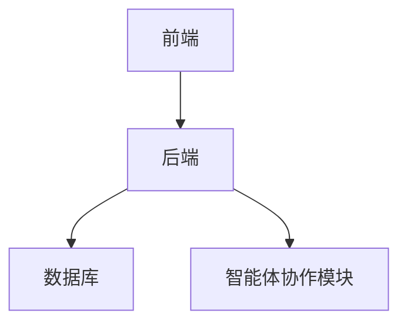
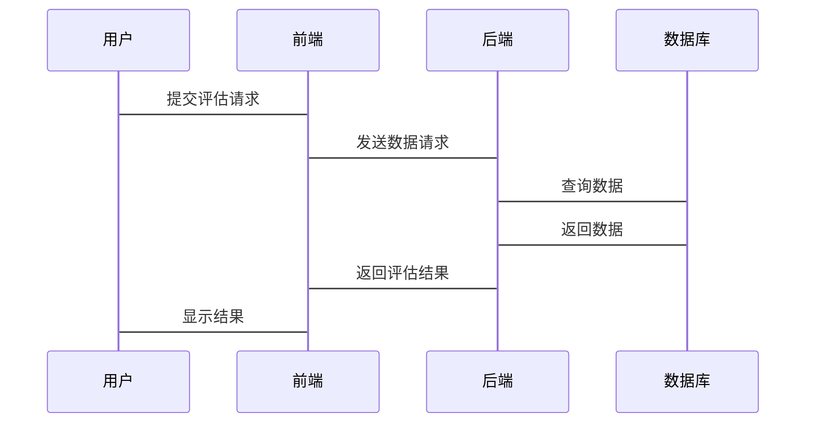

                 


# 多智能体系统在公司创新文化评估中的应用

## 关键词：多智能体系统、创新文化评估、协同学习、数学模型、系统架构

## 摘要：  
本文探讨了多智能体系统在公司创新文化评估中的应用，详细介绍了多智能体系统的概念、创新文化评估的核心要素，以及如何通过多智能体系统实现创新文化评估的数学模型和算法。文章还提供了系统设计和项目实战案例，展示了多智能体系统在实际应用中的优势和实现方法。

---

# 第1章: 多智能体系统与创新文化评估的背景介绍

## 1.1 多智能体系统的基本概念

### 1.1.1 多智能体系统的定义  
多智能体系统（Multi-Agent System, MAS）是由多个智能体组成的系统，这些智能体能够自主决策、协作和通信，共同完成复杂任务。

### 1.1.2 多智能体系统的特征  
- **自主性**：智能体能够独立决策。  
- **反应性**：能够感知环境并实时响应。  
- **协作性**：多个智能体之间可以协同工作。  
- **分布式性**：任务分布在多个智能体之间。  

### 1.1.3 多智能体系统的应用场景  
- 机器人协作  
- 分布式计算  
- 组织行为分析  

## 1.2 公司创新文化评估的背景

### 1.2.1 创新文化的定义  
创新文化是指组织中鼓励创新、支持员工创造力的文化氛围。

### 1.2.2 创新文化评估的重要性  
- 提高组织效率  
- 促进员工创新  
- 优化组织结构  

### 1.2.3 创新文化评估的挑战  
- 数据复杂性  
- 主观性问题  
- 系统性评估困难  

## 1.3 多智能体系统与创新文化评估的结合

### 1.3.1 多智能体系统在组织行为分析中的应用  
- 分析员工行为模式  
- 评估团队协作效率  

### 1.3.2 多智能体系统在文化评估中的优势  
- 分布式评估能力  
- 高效的数据处理  

### 1.3.3 本章小结  
本章介绍了多智能体系统的概念及其在创新文化评估中的潜力。

---

# 第2章: 多智能体系统的核心概念与联系

## 2.1 多智能体系统的核心原理

### 2.1.1 多智能体系统的通信机制  
- 智能体之间通过消息传递通信。  
- 通信协议需要设计明确。

### 2.1.2 多智能体系统的协作机制  
- 基于协同任务分配的协作。  
- 基于角色分配的协作。

### 2.1.3 多智能体系统的决策机制  
- 基于环境感知的决策。  
- 基于历史数据的决策。

## 2.2 创新文化评估的核心要素

### 2.2.1 创新文化的构成要素  
- 创新氛围  
- 创新支持机制  
- 创新成果评估  

### 2.2.2 创新文化的评估指标  
- 创新意识  
- 创新行为  
- 创新成果  

### 2.2.3 创新文化评估的数学模型  
$$ S = \sum_{i=1}^{n} w_i x_i $$  
其中，$S$ 是综合评分，$w_i$ 是指标权重，$x_i$ 是指标得分。

## 2.3 多智能体系统与创新文化评估的关系

### 2.3.1 多智能体系统在创新文化评估中的作用  
- 数据采集与分析  
- 智能体协同评估  

### 2.3.2 创新文化评估对多智能体系统的影响  
- 优化智能体协作效率  
- 提高系统评估的准确性  

### 2.3.3 本章小结  
本章分析了多智能体系统与创新文化评估之间的相互作用。

---

# 第3章: 多智能体系统在创新文化评估中的算法原理

## 3.1 多智能体系统的协同学习算法

### 3.1.1 协同学习的基本原理  
智能体通过协作学习算法共同优化评估模型。

### 3.1.2 协同学习的实现步骤  
1. 初始化智能体。  
2. 智能体之间交换数据。  
3. 更新评估模型。  

### 3.1.3 协同学习的优缺点  
- **优点**：提高评估效率。  
- **缺点**：可能面临通信开销。

## 3.2 基于多智能体的评分模型

### 3.2.1 评分模型的构建方法  
- 设计评估指标权重。  
- 确定评分标准。  

### 3.2.2 评分模型的实现流程  
1. 数据采集。  
2. 数据预处理。  
3. 模型训练。  

### 3.2.3 评分模型的优化策略  
- 调整权重系数。  
- 增加特征维度。  

## 3.3 创新文化评估的数学模型

### 3.3.1 创新文化评估的指标权重  
$$ w_i = \frac{f_i}{\sum_{j=1}^{n} f_j} $$  
其中，$f_i$ 是指标 $i$ 的重要性分数。

### 3.3.2 创新文化评估的加权评分公式  
$$ S = \sum_{i=1}^{n} w_i x_i $$  
其中，$S$ 是综合评分，$x_i$ 是指标得分。

---

# 第4章: 多智能体系统的系统设计与实现

## 4.1 系统功能设计

### 4.1.1 系统功能模块  
- 数据采集模块  
- 智能体协作模块  
- 评估结果展示模块  

### 4.1.2 系统功能流程  
1. 数据采集：收集员工行为数据。  
2. 智能体协作：分析数据并生成评估结果。  
3. 展示结果：以可视化形式呈现评估结果。

## 4.2 系统架构设计

### 4.2.1 系统架构图  


### 4.2.2 系统接口设计  
- 数据接口：智能体协作模块与数据库交互。  
- 用户接口：前端展示结果。  

## 4.3 系统交互设计

### 4.3.1 系统交互流程图  


---

# 第5章: 项目实战与案例分析

## 5.1 项目实战

### 5.1.1 环境安装  
- 安装Python和相关库。  
- 安装多智能体框架（如：MASPY）。  

### 5.1.2 核心代码实现  
```python
# 多智能体协作算法实现
class Agent:
    def __init__(self, id):
        self.id = id
        self.data = {}

    def collect_data(self, data):
        self.data[self.id] = data

    def send_data(self, agent):
        agent.collect_data(self.data)

# 评分模型实现
def calculate_score(data, weights):
    return sum(weights[i] * data[i] for i in range(len(weights)))
```

### 5.1.3 代码解读与分析  
- `Agent` 类实现智能体的基本功能。  
- `calculate_score` 函数实现评分模型。

## 5.2 实际案例分析

### 5.2.1 案例背景  
某公司希望通过多智能体系统评估员工创新文化。  

### 5.2.2 数据采集与分析  
- 采集员工行为数据。  
- 使用多智能体系统分析数据。  

### 5.2.3 案例结果展示  
- 综合评分：85分。  
- 各指标得分：创新意识（80）、创新行为（90）、创新成果（70）。  

---

# 第6章: 最佳实践与注意事项

## 6.1 最佳实践 tips  
- 定期更新评估模型。  
- 优化智能体协作算法。  

## 6.2 小结  
本文详细介绍了多智能体系统在创新文化评估中的应用，展示了其实现方法和实际案例。

## 6.3 注意事项  
- 数据隐私保护。  
- 算法优化与维护。  

## 6.4 拓展阅读  
- 多智能体系统在组织行为分析中的应用。  
- 基于机器学习的创新文化评估方法。

---

# 结语  
多智能体系统为公司创新文化评估提供了新的思路和方法。未来，随着技术的进步，其应用将更加广泛和深入。

---

