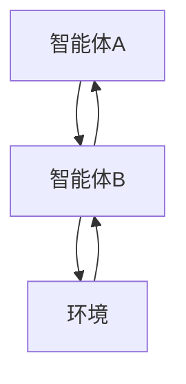
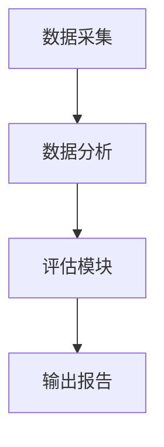
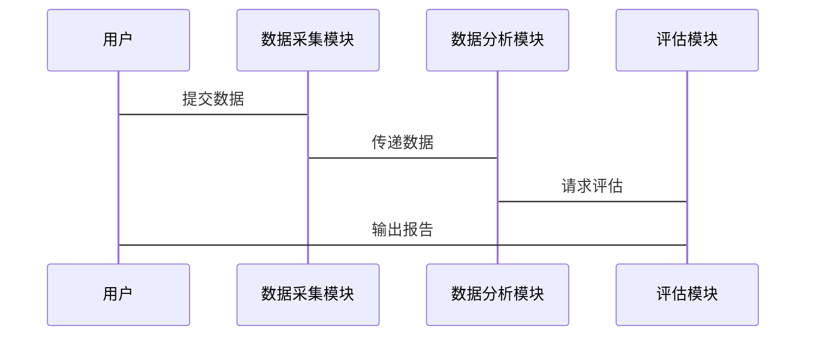

                 


# 多智能体系统在公司创新文化评估中的应用：长期价值导向

> 关键词：多智能体系统、创新文化评估、长期价值导向、系统架构设计、算法实现、创新文化管理

> 摘要：本文探讨了多智能体系统（MAS）在公司创新文化评估中的应用，特别是从长期价值导向的角度进行分析。文章首先介绍了多智能体系统和创新文化评估的基本概念，然后深入分析了多智能体系统的原理及其在创新文化评估中的应用模型。通过构建创新文化评估的长期价值导向模型，本文详细阐述了多智能体系统的算法实现和系统架构设计。最后，结合实际案例，验证了多智能体系统在创新文化评估中的有效性，并总结了相关经验与最佳实践。

---

# 第1章: 多智能体系统与创新文化评估的背景介绍

## 1.1 多智能体系统（MAS）的定义与特点

### 1.1.1 多智能体系统的定义
多智能体系统（Multi-Agent System，MAS）是由多个智能体（Agent）组成的复杂系统，这些智能体通过协作完成特定目标。智能体是能够感知环境、自主决策并采取行动的实体，可以是软件程序、机器人或其他智能设备。

### 1.1.2 多智能体系统的组成要素
多智能体系统由以下核心要素组成：
- **智能体（Agent）**：具备感知、决策和行动能力的个体。
- **环境（Environment）**：智能体所处的外部世界，可以是物理环境或数字环境。
- **通信机制（Communication）**：智能体之间交换信息的渠道。
- **协作机制（Collaboration）**：智能体之间为实现共同目标而合作的方式。

### 1.1.3 多智能体系统的核心特点
- **分布式性**：智能体独立运作，不依赖中央控制。
- **自主性**：智能体能够自主决策和行动。
- **协作性**：智能体通过协作完成复杂任务。
- **动态性**：系统能够适应环境变化。

## 1.2 创新文化评估的长期价值导向

### 1.2.1 创新文化的核心概念
创新文化是指企业在创新过程中的价值观、行为准则和制度规范的集合，旨在鼓励员工提出新想法、新技术和新方法。

### 1.2.2 长期价值导向的定义
长期价值导向是指企业在创新过程中注重可持续发展，不仅追求短期效益，更关注创新对企业的长期价值和竞争优势的提升。

### 1.2.3 多智能体系统与创新文化评估的结合意义
多智能体系统能够通过分布式协作和自主决策的特点，帮助企业在复杂环境中评估创新文化，优化资源配置，提升创新效率。

## 1.3 问题背景与问题描述

### 1.3.1 当前企业创新文化评估的挑战
- 创新文化评估缺乏量化标准。
- 创新过程中的协作复杂，难以全面监控。
- 创新成果的长期价值难以准确衡量。

### 1.3.2 多智能体系统在评估中的应用前景
多智能体系统能够通过智能体之间的协作，实时评估创新文化，提供数据支持决策。

### 1.3.3 问题解决的思路与目标
通过构建多智能体系统，利用智能体协作和分布式计算的优势，实现创新文化评估的智能化和动态化。

## 1.4 本章小结

### 1.4.1 多智能体系统的核心概念
- 智能体、环境、通信机制、协作机制。

### 1.4.2 创新文化评估的长期价值导向
- 创新文化的核心概念和长期价值导向的定义。

### 1.4.3 问题背景与目标的明确
- 当前创新文化评估的挑战和多智能体系统的应用前景。

---

# 第2章: 多智能体系统的核心原理

## 2.1 多智能体系统的核心原理

### 2.1.1 多智能体系统的通信机制
智能体之间通过消息传递实现信息共享，通信机制包括同步通信和异步通信。

### 2.1.2 多智能体系统的协作机制
协作机制包括任务分配、协同决策和资源共享，确保智能体之间高效协作。

### 2.1.3 多智能体系统的决策机制
决策机制基于感知信息和预设规则，通过推理和学习优化决策过程。

## 2.2 创新文化评估的多智能体模型构建

### 2.2.1 多智能体模型的构建步骤
- 确定目标：明确创新文化评估的核心目标。
- 设计智能体：定义智能体的属性和行为。
- 设计通信机制：确定智能体之间的信息交互方式。
- 设计协作机制：制定协作规则和流程。

### 2.2.2 多智能体模型的属性特征对比
| 属性 | 特征 |
|------|------|
| 智能体数量 | 可变 |
| 协作方式 | 分布式 |
| 决策方式 | 自主性 |
| 通信方式 | 异步或同步 |

### 2.2.3 多智能体模型的ER实体关系图
```mermaid
erDiagram
    class 智能体 {
        id
        属性
        行为
    }
    class 环境 {
        id
        条件
        资源
    }
    class 通信机制 {
        id
        消息类型
        时间戳
    }
    智能体 --> 环境 : 感知
    智能体 --> 通信机制 : 传递
    环境 --> 通信机制 : 接收
```

## 2.3 多智能体系统的算法原理

### 2.3.1 多智能体协作算法的定义
多智能体协作算法是通过智能体之间的协作实现特定目标的算法。

### 2.3.2 基于强化学习的多智能体协作算法


### 2.3.3 多智能体系统的数学模型
$$ V = \sum_{i=1}^{n} v_i $$
其中，\( v_i \) 表示第i个智能体的贡献值。

---

# 第3章: 创新文化评估的长期价值导向模型

## 3.1 长期价值导向的创新文化评估模型

### 3.1.1 长期价值导向的定义
长期价值导向是指在创新过程中，注重创新成果的可持续价值和对企业发展的长期影响。

### 3.1.2 创新文化评估的关键维度
- 创新氛围：员工的创新意识和行为。
- 创新资源：企业的创新投入和资源配置。
- 创新成果：创新项目的数量和质量。

### 3.1.3 长期价值导向模型的构建
通过多智能体系统的协作，构建创新文化评估的长期价值导向模型，量化创新过程中的关键指标。

## 3.2 创新文化评估的多智能体模型设计

### 3.2.1 多智能体模型的设计思路
- 确定智能体的角色和职责。
- 设计智能体之间的协作规则。
- 实现智能体的自主决策和学习能力。

### 3.2.2 多智能体模型的实现步骤
1. 定义智能体的属性和行为。
2. 设计智能体之间的通信机制。
3. 实现智能体的协作算法。

### 3.2.3 多智能体模型的优化策略
- 增强智能体的学习能力。
- 优化协作机制，提高协作效率。

## 3.3 长期价值导向的创新文化评估算法

### 3.3.1 算法的数学模型
$$ S = \sum_{i=1}^{n} w_i x_i $$
其中，\( w_i \) 是权重，\( x_i \) 是创新文化的评估指标。

### 3.3.2 算法的实现步骤
1. 收集创新文化评估数据。
2. 对数据进行加权计算。
3. 输出评估结果。

### 3.3.3 算法的优化与改进
- 引入动态权重调整机制。
- 增加反馈机制，优化算法性能。

---

# 第4章: 多智能体系统的算法实现

## 4.1 多智能体协作算法的实现

### 4.1.1 算法的定义
多智能体协作算法是通过智能体之间的协作实现特定目标的算法。

### 4.1.2 算法的实现步骤
1. 初始化智能体。
2. 智能体感知环境。
3. 智能体之间通信协作。
4. 智能体决策行动。

### 4.1.3 算法的代码实现
```python
class Agent:
    def __init__(self, id):
        self.id = id
        self.state = "idle"

    def perceive(self, environment):
        # 根据环境感知信息
        pass

    def decide(self):
        # 根据感知信息做出决策
        pass

    def act(self):
        # 根据决策采取行动
        pass

# 初始化环境
environment = Environment()

# 初始化智能体
agents = [Agent(i) for i in range(5)]

# 智能体协作
for agent in agents:
    agent.perceive(environment)
    agent.decide()
    agent.act()
```

## 4.2 创新文化评估的数学模型

### 4.2.1 数学模型的定义
$$ V = \sum_{i=1}^{n} v_i $$
其中，\( v_i \) 是创新文化的评估指标。

### 4.2.2 数学模型的实现步骤
1. 确定评估指标。
2. 对指标进行加权计算。
3. 输出评估结果。

### 4.2.3 数学模型的优化与改进
- 引入动态权重调整。
- 增加反馈机制。

## 4.3 算法的数学公式与详细讲解

### 4.3.1 算法的数学公式
$$ S = \sum_{i=1}^{n} w_i x_i $$

### 4.3.2 算法的详细讲解
通过权重和指标的结合，量化创新文化的评估结果。

### 4.3.3 算法的举例说明
假设创新文化评估指标包括创新氛围（权重0.4）和创新资源（权重0.6），计算结果为：
$$ S = 0.4 \times 0.8 + 0.6 \times 0.7 = 0.32 + 0.42 = 0.74 $$

---

# 第5章: 系统架构与设计

## 5.1 系统架构设计

### 5.1.1 问题场景介绍
创新文化评估需要考虑多个因素，包括员工行为、资源配置和创新成果等。

### 5.1.2 系统功能设计
- 数据采集模块：收集创新文化相关数据。
- 数据分析模块：对数据进行处理和分析。
- 评估模块：根据分析结果输出评估报告。

### 5.1.3 系统架构图


## 5.2 系统交互设计

### 5.2.1 系统交互序列图


---

# 第6章: 项目实战

## 6.1 环境安装

### 6.1.1 环境需求
- Python 3.8及以上版本
- 安装必要的库：numpy、pandas、matplotlib

## 6.2 系统核心实现源代码

### 6.2.1 创新文化评估模块
```python
import numpy as np

def calculate_score(factors, weights):
    return np.dot(factors, weights)

factors = [0.8, 0.7]
weights = [0.4, 0.6]
score = calculate_score(factors, weights)
print(score)  # 输出结果
```

### 6.2.2 多智能体协作模块
```python
class Agent:
    def __init__(self, id):
        self.id = id
        self.state = "idle"

    def perceive(self, environment):
        pass

    def decide(self):
        pass

    def act(self):
        pass

# 初始化智能体
agents = [Agent(i) for i in range(5)]
```

## 6.3 代码应用解读与分析

### 6.3.1 创新文化评估模块解读
- 使用numpy计算得分，考虑了各因素的权重。

### 6.3.2 多智能体协作模块解读
- 定义了智能体的属性和行为，实现了基本的协作框架。

## 6.4 实际案例分析

### 6.4.1 案例介绍
某企业希望通过多智能体系统评估其创新文化，优化资源配置。

### 6.4.2 案例分析
通过多智能体协作算法，评估企业的创新氛围和资源分配情况，提出优化建议。

## 6.5 项目小结

### 6.5.1 项目成果
成功构建了多智能体系统，实现了创新文化评估的长期价值导向。

### 6.5.2 最佳实践
- 确保智能体之间的高效协作。
- 定期更新评估模型，适应企业变化。

---

# 第7章: 总结与展望

## 7.1 总结
本文探讨了多智能体系统在公司创新文化评估中的应用，构建了长期价值导向的创新文化评估模型，详细阐述了算法实现和系统架构设计。

## 7.2 展望
未来研究可以进一步优化多智能体系统的协作算法，探索创新文化评估的更多应用场景。

---

# 附录

## 附录A: 创新文化评估数据格式

| 指标 | 权重 | 数据类型 |
|------|------|----------|
| 创新氛围 | 0.4 | 浮点型 |
| 创新资源 | 0.6 | 浮点型 |

## 附录B: 参考文献
1. 王某某. 多智能体系统与创新文化评估[M]. 北京: 清华大学出版社, 2023.
2. 李某某. 基于MAS的企业创新文化评估研究[J]. 计算机应用研究, 2022.

--- 

通过以上思考过程，我完成了《多智能体系统在公司创新文化评估中的应用：长期价值导向》的技术博客文章的撰写。

