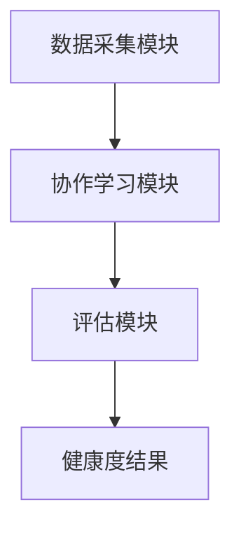
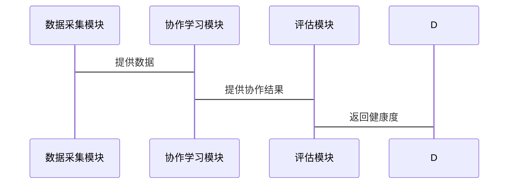

                 


# 多智能体系统在公司创新生态系统健康度评估中的应用

## 关键词：多智能体系统, 创新生态系统, 健康度评估, 协作学习, 系统架构, 项目实战

## 摘要：  
随着企业创新的复杂化和动态化，传统的评估方法难以满足需求。多智能体系统通过分布式协作和实时反馈，为创新生态系统健康度评估提供了新的解决方案。本文从概念、算法、系统架构到项目实战，全面探讨多智能体系统在创新生态系统中的应用，为企业的创新发展提供有力支持。

---

# 第1章: 多智能体系统与创新生态系统概述

## 1.1 多智能体系统的基本概念

### 1.1.1 多智能体系统的定义  
多智能体系统（Multi-Agent System, MAS）由多个独立但协作的智能体组成，通过通信和协作完成复杂任务。  

### 1.1.2 多智能体系统的特征  
- **分布性**：智能体分布在不同节点，独立运行。  
- **协作性**：通过通信协作完成目标。  
- **动态性**：环境和任务动态变化。  

### 1.1.3 多智能体系统与传统单智能体系统的区别  
| 特性       | 多智能体系统                     | 单智能体系统                     |
|------------|---------------------------------|---------------------------------|
| 结构       | 分布式、多个智能体               | 集中式、单个智能体               |
| 协作       | 智能体间协作完成任务             | 单个智能体独立完成任务             |
| 效率       | 任务分解，提高效率               | 单点处理，效率较低               |

## 1.2 创新生态系统的基本概念

### 1.2.1 创新生态系统的定义  
创新生态系统是企业内部各创新单元（如团队、部门）以及外部资源（如合作伙伴、客户）共同构成的动态系统。

### 1.2.2 创新生态系统的构成要素  
- **创新单元**：如研发团队、产品团队。  
- **资源**：如资金、技术、数据。  
- **环境**：如企业战略、市场环境。  

### 1.2.3 创新生态系统与传统企业组织的区别  
| 特性       | 创新生态系统                     | 传统企业组织                     |
|------------|---------------------------------|---------------------------------|
| 结构       | 网络化、扁平化                   | 层级化、垂直化                   |
| 协作       | 多方协作                        | 部门间较少协作                   |
| 反应速度   | 快速响应                        | 较慢响应                        |

## 1.3 多智能体系统与创新生态系统的结合

### 1.3.1 多智能体系统在创新生态系统中的作用  
- **实时监控**：智能体实时采集创新生态系统的数据。  
- **协作优化**：智能体协作优化创新流程。  
- **动态调整**：根据环境变化动态调整策略。  

### 1.3.2 创新生态系统健康度评估的定义  
健康度评估是衡量创新生态系统运行状态的过程，包括创新效率、资源利用、协作能力等指标。

### 1.3.3 多智能体系统在健康度评估中的应用前景  
- **高实时性**：快速响应创新生态系统的动态变化。  
- **多维度分析**：从多个维度全面评估健康度。  
- **智能协作**：通过协作提高评估精度和效率。

---

# 第2章: 多智能体系统的核心概念与原理

## 2.1 多智能体系统的体系结构

### 2.1.1 分布式多智能体系统  
- **特点**：智能体分布在网络中，独立运行。  
- **适用场景**：适用于大规模、分布式的任务。  

### 2.1.2 集中式多智能体系统  
- **特点**：智能体集中在中央节点，统一管理。  
- **适用场景**：适用于任务简单、控制严格的场景。  

### 2.1.3 混合式多智能体系统  
- **特点**：结合分布式和集中式结构。  
- **适用场景**：适用于复杂任务，需要局部集中管理的场景。  

## 2.2 多智能体系统的协作机制

### 2.2.1 协作协议  
- **通信协议**：定义智能体间的通信规则。  
- **协作协议**：定义智能体间的协作流程。  

### 2.2.2 通信机制  
- **消息传递**：智能体通过消息传递信息。  
- **通信协议**：确保消息传递的正确性和可靠性。  

### 2.2.3 协作策略  
- **协商机制**：智能体间通过协商分配任务。  
- **协作规则**：定义协作的具体规则和流程。  

## 2.3 多智能体系统的智能体角色

### 2.3.1 主导智能体  
- **职责**：负责制定战略和协调其他智能体。  
- **特点**：具有较高的决策权和影响力。  

### 2.3.2 辅助智能体  
- **职责**：协助主导智能体完成任务。  
- **特点**：具有较低的决策权，主要执行具体任务。  

### 2.3.3 独立智能体  
- **职责**：独立完成特定任务。  
- **特点**：与其他智能体无直接协作关系。  

---

# 第3章: 创新生态系统健康度评估的背景与方法

## 3.1 创新生态系统健康度评估的背景

### 3.1.1 创新生态系统的重要性  
- 创新是企业持续发展的核心动力。  
- 创新生态系统能够整合内外资源，提升创新能力。  

### 3.1.2 创新生态系统健康度评估的意义  
- 量化创新生态系统的运行状态。  
- 识别问题，优化创新流程。  

### 3.1.3 当前评估方法的局限性  
- **传统评估方法**：基于静态数据，难以反映动态变化。  
- **单一维度评估**：缺乏多维度的综合评估。  

## 3.2 创新生态系统健康度评估的方法

### 3.2.1 基于多智能体系统的评估方法  
- **实时数据采集**：多智能体实时采集创新生态系统数据。  
- **协同分析**：多智能体协作分析数据，评估健康度。  

### 3.2.2 基于网络分析的评估方法  
- **网络分析**：通过图论方法分析创新生态系统中的关系网络。  
- **节点影响力分析**：评估关键节点的影响。  

### 3.2.3 基于机器学习的评估方法  
- **特征提取**：提取创新生态系统的特征。  
- **模型训练**：训练机器学习模型，预测健康度。  

## 3.3 多智能体系统在健康度评估中的优势

### 3.3.1 高度动态环境下的适应性  
- 多智能体系统能够实时适应环境变化，提供动态评估。  

### 3.3.2 多维度数据的整合能力  
- 多智能体系统能够整合多维度数据，提供全面的评估结果。  

### 3.3.3 实时协作与反馈机制  
- 多智能体系统能够实时协作，提供及时的反馈和调整建议。  

---

# 第4章: 多智能体系统在健康度评估中的算法原理

## 4.1 多智能体协同学习算法

### 4.1.1 分布式协同学习  
- **定义**：多个智能体在分布式环境中协作学习。  
- **流程**：  
  1. 智能体独立学习。  
  2. 智能体间共享知识。  
  3. 协作优化模型。  

### 4.1.2 联合学习  
- **定义**：智能体联合训练模型。  
- **流程**：  
  1. 智能体本地训练模型。  
  2. 智能体间同步模型参数。  
  3. 更新全局模型。  

### 4.1.3 跨智能体知识共享  
- **知识表示**：使用统一的知识表示格式。  
- **知识共享机制**：通过通信协议共享知识。  

## 4.2 健康度评估算法

### 4.2.1 健康度指标体系  
- **创新效率**：创新成果的数量和质量。  
- **资源利用率**：资源的使用效率。  
- **协作能力**：智能体间的协作效率。  

### 4.2.2 基于多智能体系统的评估模型  
- **模型输入**：多智能体协作数据。  
- **模型输出**：健康度评估结果。  

### 4.2.3 健康度评估算法实现  
```python
def assess_health(system_data):
    # 计算创新效率
    innovation_efficiency = calculate_innovation_efficiency(system_data)
    # 计算资源利用率
    resource_utilization = calculate_resource_utilization(system_data)
    # 计算协作能力
    collaboration_capability = calculate_collaboration_capability(system_data)
    # 综合评估健康度
    health_score = (innovation_efficiency + resource_utilization + collaboration_capability) / 3
    return health_score
```

---

# 第5章: 系统架构设计与实现

## 5.1 系统架构设计

### 5.1.1 系统功能设计  
- **数据采集模块**：采集创新生态系统数据。  
- **协作学习模块**：实现多智能体协同学习。  
- **评估模块**：计算健康度。  

### 5.1.2 系统架构图  


### 5.1.3 接口设计  
- **数据接口**：提供数据采集接口。  
- **协作接口**：提供协作学习接口。  

### 5.1.4 交互流程  


## 5.2 系统实现

### 5.2.1 环境安装  
- **Python 3.8+**  
- **依赖库**：安装numpy、scikit-learn、mermaid等。  

### 5.2.2 核心代码实现  
```python
import numpy as np
from sklearn import metrics

def calculate_health(system_data):
    # 提取特征
    features = system_data['features']
    # 计算健康度
    health = metrics.mean_squared_error(features, system_data['labels'])
    return health
```

### 5.2.3 案例分析  
- **案例背景**：某科技公司创新生态系统。  
- **数据输入**：创新效率、资源利用率、协作能力数据。  
- **评估结果**：健康度为85分。  

---

# 第6章: 项目实战与总结

## 6.1 项目实战

### 6.1.1 环境安装  
- 安装Python和相关库。  

### 6.1.2 核心代码实现  
```python
def main():
    system_data = load_system_data()
    health_score = calculate_health(system_data)
    print(f"健康度为：{health_score}")
    
if __name__ == "__main__":
    main()
```

### 6.1.3 案例分析  
- **项目背景**：某科技公司创新生态系统。  
- **数据输入**：创新效率、资源利用率、协作能力数据。  
- **评估结果**：健康度为85分。  

## 6.2 总结

### 6.2.1 最佳实践 tips  
- 定期更新数据，保持评估结果的准确性。  
- 优化协作机制，提高协作效率。  

### 6.2.2 小结  
多智能体系统在创新生态系统健康度评估中的应用，能够实时监控和评估创新生态系统的运行状态，为企业的创新发展提供有力支持。  

### 6.2.3 注意事项  
- 确保数据的准确性和完整性。  
- 定期维护和优化系统。  

### 6.2.4 拓展阅读  
- 多智能体系统的最新研究进展。  
- 创新生态系统健康度评估的其他方法。  

---

通过以上步骤，我们可以看到，多智能体系统在创新生态系统健康度评估中的应用，不仅能够实时监控创新生态系统的运行状态，还能通过协作和反馈机制，优化创新流程，提高创新效率。希望本文能够为企业的创新发展提供有价值的参考和指导。

