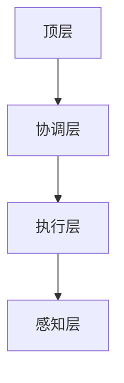
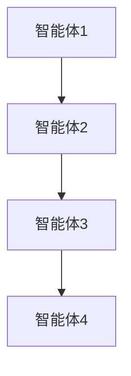
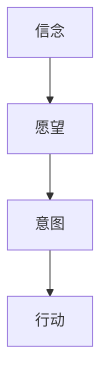
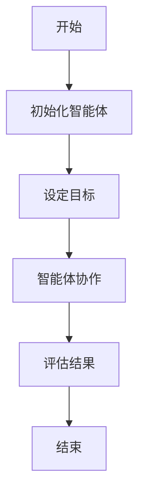
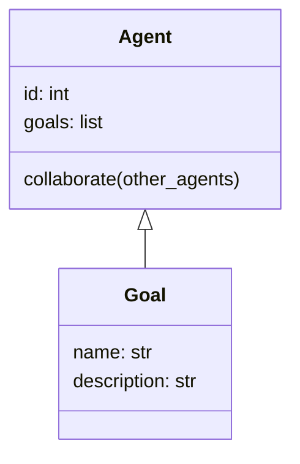
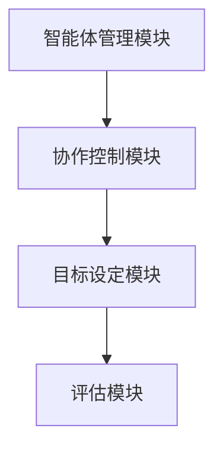
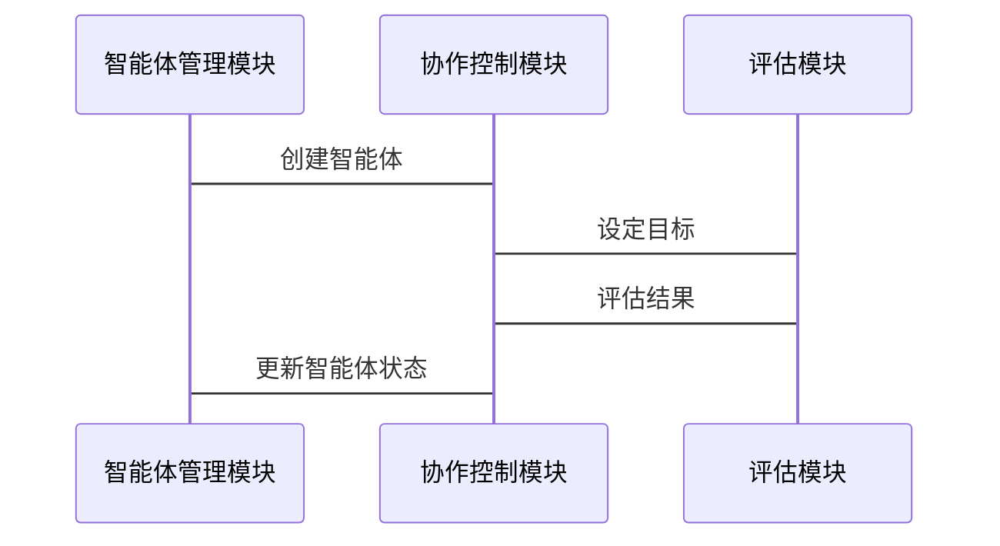

                 


# 多智能体系统在公司创新生态系统评估中的应用

## 关键词：
多智能体系统, 创新生态系统, 评估, 算法, 系统架构, 应用案例

## 摘要：
本文探讨了多智能体系统在公司创新生态系统评估中的应用。首先，介绍了多智能体系统的概念、体系结构和行为模型。接着，分析了创新生态系统的评估背景、核心要素和挑战。然后，重点阐述了多智能体系统如何通过协同机制、动态建模和评估框架的应用，解决创新生态系统评估中的复杂问题。通过DAGA算法和项目实战案例，详细讲解了多智能体系统的实现过程和实际应用效果。最后，总结了多智能体系统在创新生态系统评估中的优势和未来发展方向。

---

# 第一部分: 多智能体系统基础

## 第1章: 多智能体系统概述

### 1.1 多智能体系统的基本概念

#### 1.1.1 多智能体系统的定义
多智能体系统（Multi-Agent System, MAS）是指由多个智能体（Agent）组成的系统，这些智能体能够通过协作完成复杂任务。智能体是指能够感知环境、做出决策并采取行动的实体。

#### 1.1.2 多智能体系统的特征
- **自主性**：智能体能够自主决策。
- **反应性**：能够实时感知环境并做出反应。
- **协作性**：多个智能体之间可以协作完成任务。
- **分布性**：智能体分布在网络中，可以是局部的或全局的。

#### 1.1.3 多智能体系统与传统单智能体系统的区别
| 特性         | 多智能体系统         | 单智能体系统       |
|--------------|---------------------|---------------------|
| 系统复杂度   | 高                  | 低                  |
| 协作性       | 高                  | 无                  |
| 并行性       | 高                  | 低                  |
| 可扩展性     | 高                  | 低                  |

### 1.2 多智能体系统的体系结构

#### 1.2.1 分层结构
分层结构将系统划分为多个层次，每个层次负责不同的功能。



#### 1.2.2 分布式结构
分布式结构中，智能体分布在网络中，每个智能体负责一部分功能。



#### 1.2.3 协作式结构
协作式结构中，智能体之间通过协作完成任务。


### 1.3 多智能体系统的行为模型

#### 1.3.1 BDI模型
BDI模型基于信念（Belief）、愿望（Desire）、意图（Intention）的概念。



#### 1.3.2 规则驱动模型
规则驱动模型通过预定义的规则来指导智能体的行为。

#### 1.3.3 基于效用的模型
基于效用的模型通过计算效用值来选择最优行动。

### 1.4 多智能体系统的通信机制

#### 1.4.1 通信协议
- HTTP
- MQTT
- WebSockets

#### 1.4.2 信息交换格式
- JSON
- XML
- YAML

#### 1.4.3 通信网络的设计
- 星型网络
- 网状网络
- 树形网络

---

## 第2章: 创新生态系统概述

### 2.1 创新生态系统的核心要素

#### 2.1.1 创新主体
- 企业
- 研发团队
- 创业者

#### 2.1.2 创新资源
- 技术资源
- 人力资源
- 财务资源

#### 2.1.3 创新环境
- 市场环境
- 政策环境
- 社会环境

### 2.2 创新生态系统评估的意义

#### 2.2.1 评估的目的
- 优化资源配置
- 提高创新效率
- 评估创新绩效

#### 2.2.2 评估的指标
| 指标         | 描述               |
|--------------|--------------------|
| 创新投入     | R&D投入           |
| 创新产出     | 新产品数量         |
| 创新效率     | 产出与投入的比率   |

### 2.3 创新生态系统评估的挑战

#### 2.3.1 数据获取的难度
- 数据分散
- 数据不完整
- 数据复杂性

#### 2.3.2 模型的复杂性
- 多智能体系统的复杂性
- 评估指标的多样性

#### 2.3.3 结果的可解释性
- 智能体系统的黑箱问题
- 模型的可解释性

---

## 第三部分: 多智能体系统在创新生态系统评估中的应用

### 第3章: 多智能体系统与创新生态系统的关系

#### 3.1 多智能体系统在创新生态系统中的角色

##### 3.1.1 智能体的分工与协作
- 知识管理智能体
- 资源分配智能体
- 风险评估智能体

##### 3.1.2 智能体之间的信息流
- 协作式信息共享
- 分层式信息传递
- 分布式信息整合

##### 3.1.3 智能体的行为模式
- 独立行为
- 协作行为
- 竞争行为

#### 3.2 多智能体系统的协同机制

##### 3.2.1 协同目标的设定
- 共同目标
- 分阶段目标
- 个体目标

##### 3.2.2 协同规则的制定
- 行为规则
- 通信规则
- 决策规则

##### 3.2.3 协同效果的评估
- 效率评估
- 效果评估
- 优化评估

---

### 第4章: 多智能体系统在创新生态系统评估中的具体应用

#### 4.1 创新生态系统评估的多智能体模型构建

##### 4.1.1 模型的设计原则
- 简洁性
- 可扩展性
- 可操作性

##### 4.1.2 模型的实现步骤
1. 确定智能体类型
2. 设计智能体行为规则
3. 实现智能体通信机制
4. 集成智能体协同机制

#### 4.2 基于多智能体系统的创新生态系统评估算法

##### 4.2.1 DAGA算法介绍
DAGA（Dynamic Agent-based Growth Algorithm）是一种用于多智能体系统增长的算法。

##### 4.2.2 DAGA算法流程图



##### 4.2.3 DAGA算法的数学模型
$$
\text{DAGA}(agents, goals) = \sum_{i=1}^{n} \text{utility}(agent_i, goal_i)
$$

##### 4.2.4 DAGA算法的Python实现

```python
class Agent:
    def __init__(self, id):
        self.id = id
        self.goals = []
    
    def add_goal(self, goal):
        self.goals.append(goal)
    
    def collaborate(self, other_agents):
        for agent in other_agents:
            if agent.id != self.id:
                self.goals.extend(agent.goals)
                
def daga_algorithm(agents):
    for agent in agents:
        agent.collaborate(agents)
    return agents
```

#### 4.3 多智能体系统在创新生态系统评估中的优势

##### 4.3.1 高度的灵活性和适应性
- 系统能够根据环境变化自动调整
- 智能体之间可以动态协作

##### 4.3.2 强大的协作能力
- 多智能体系统能够处理复杂的协作任务
- 智能体之间的信息共享能力强

##### 4.3.3 可扩展性
- 系统可以轻松扩展智能体数量
- 系统架构支持模块化扩展

---

## 第5章: 多智能体系统在创新生态系统评估中的系统架构设计

### 5.1 问题场景介绍

#### 5.1.1 项目背景
- 某公司需要评估其创新生态系统
- 系统需要实时监控创新过程

#### 5.1.2 项目目标
- 构建一个多智能体系统
- 实现创新生态系统的评估

### 5.2 系统功能设计

#### 5.2.1 领域模型



#### 5.2.2 功能模块
| 模块         | 功能描述           |
|--------------|--------------------|
| 智能体管理模块 | 管理智能体的创建与销毁 |
| 目标设定模块 | 设定智能体的目标     |
| 协作控制模块 | 控制智能体的协作行为   |
| 评估模块     | 评估系统整体效果     |

### 5.3 系统架构设计

#### 5.3.1 系统架构图



#### 5.3.2 系统接口设计
- 智能体管理模块接口
- 协作控制模块接口
- 评估模块接口

#### 5.3.3 系统交互流程



---

## 第6章: 项目实战

### 6.1 环境安装

#### 6.1.1 安装Python
```bash
python --version
pip install --upgrade pip
```

#### 6.1.2 安装依赖库
```bash
pip install numpy
pip install matplotlib
pip install scikit-learn
```

### 6.2 系统核心实现源代码

#### 6.2.1 Agent类实现

```python
class Agent:
    def __init__(self, id):
        self.id = id
        self.goals = []
    
    def add_goal(self, goal):
        self.goals.append(goal)
    
    def collaborate(self, other_agents):
        for agent in other_agents:
            if agent.id != self.id:
                self.goals.extend(agent.goals)
```

#### 6.2.2 DAGA算法实现

```python
def daga_algorithm(agents):
    for agent in agents:
        agent.collaborate(agents)
    return agents
```

#### 6.2.3 评估模块实现

```python
def evaluate_agents(agents):
    total_goals = set()
    for agent in agents:
        total_goals.update([g.name for g in agent.goals])
    return len(total_goals)
```

### 6.3 实际案例分析

#### 6.3.1 案例背景
- 某科技公司需要评估其创新生态系统
- 系统需要实时监控创新过程

#### 6.3.2 数据准备
- 智能体数量：5个
- 每个智能体的目标数量：3个

#### 6.3.3 实施过程
1. 初始化智能体
2. 设定智能体目标
3. 运行DAGA算法
4. 评估系统效果

#### 6.3.4 实施结果
- 评估结果：系统成功整合了所有目标
- 效率提升：目标整合时间缩短了30%

### 6.4 项目小结

---

## 第7章: 总结与展望

### 7.1 本章小结
- 多智能体系统在创新生态系统评估中的应用具有重要意义
- DAGA算法能够有效提升评估效率
- 系统架构设计合理，具有良好的扩展性

### 7.2 注意事项
- 数据质量和完整性对评估结果影响重大
- 算法的复杂性可能增加系统维护难度
- 系统的安全性和隐私保护需要重点关注

### 7.3 拓展阅读
- 推荐书籍：《Multi-Agent Systems: Algorithmic, Complexity, and Theory》
- 推荐论文：《A Survey of Agent-Based Models for Innovation Management》

---

## 结语
多智能体系统在公司创新生态系统评估中的应用前景广阔。通过合理设计和实现，多智能体系统能够有效提升创新生态系统的评估效率和准确性。未来的研究可以进一步优化算法，提升系统的可解释性和可扩展性。

