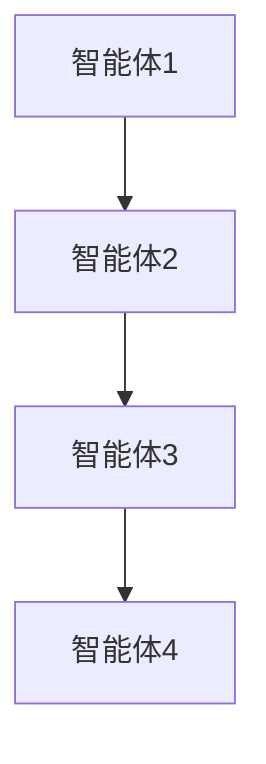
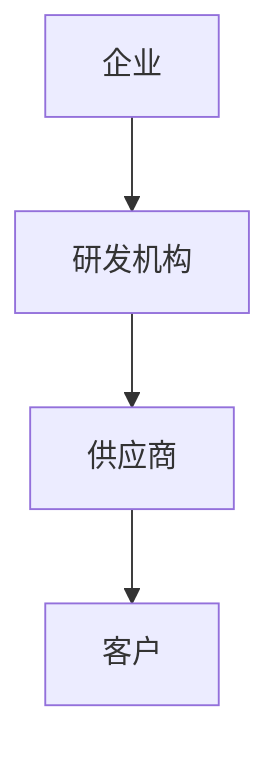
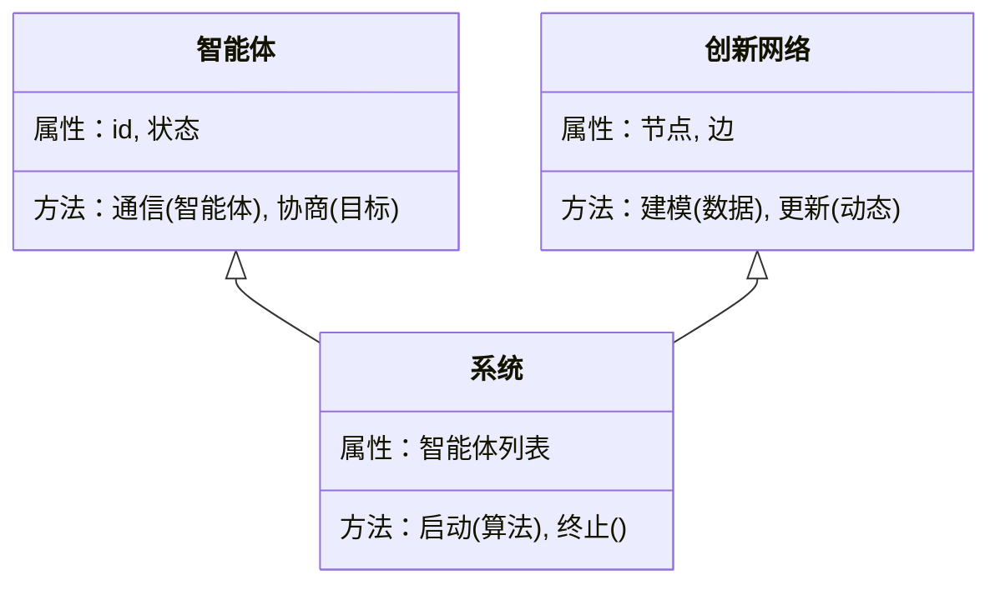
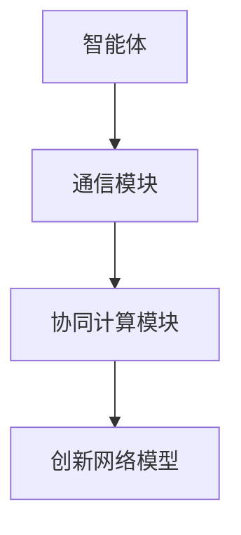

                 


# 多智能体系统在公司创新网络评估中的应用

---

## 关键词：
多智能体系统、创新网络评估、协同决策、复杂网络、分布式计算、系统架构设计

---

## 摘要：
随着企业创新活动的复杂化和网络化，传统的创新评估方法已难以应对日益复杂的创新环境。多智能体系统（Multi-Agent Systems，MAS）作为一种新兴的分布式计算范式，能够通过多个智能体的协同合作，实现对创新网络的动态建模与评估。本文从创新网络的复杂性出发，探讨多智能体系统在创新网络评估中的核心概念、算法原理、系统设计与实际应用。通过分析创新网络的结构特征，结合多智能体系统的分布式计算和协同决策能力，提出了一种基于MAS的创新网络评估框架，并通过实际案例展示了该框架的应用效果。本文旨在为企业的创新网络评估提供一种高效、动态、可扩展的解决方案。

---

# 第1章: 多智能体系统与创新网络概述

## 1.1 多智能体系统的定义与特点
### 1.1.1 多智能体系统的定义
多智能体系统（Multi-Agent Systems，MAS）是由多个智能体（Agent）组成的分布式系统，这些智能体通过协作和交互完成复杂任务。智能体具有自主性、反应性、目标导向性和社会性等特征。

$$\text{MAS特点：自主性、分布性、协作性、动态性}$$

### 1.1.2 多智能体系统的核心特点
- **自主性**：智能体能够独立决策和行动。
- **分布性**：智能体通过分布式计算完成任务。
- **协作性**：智能体之间通过交互协同完成目标。
- **动态性**：系统环境和智能体状态动态变化。

### 1.1.3 多智能体系统的分类与应用领域
多智能体系统可以分为基于规则的MAS、基于模型的MAS和基于市场的MAS。其应用领域包括分布式计算、机器人协作、经济模拟、交通管理等。

---

## 1.2 创新网络的概念与结构
### 1.2.1 创新网络的定义
创新网络是指由企业、研究机构、供应商、客户等创新主体构成的网络，这些主体通过知识流动和协同创新推动技术进步。

### 1.2.2 创新网络的构成要素
创新网络由节点（如企业、研发机构）、边（如合作关系）和创新资源（如知识、技术）构成。

### 1.2.3 创新网络的复杂性与动态性
创新网络具有复杂性高、动态性强的特点，传统评估方法难以捕捉其动态变化。

---

## 1.3 多智能体系统在创新网络评估中的作用
### 1.3.1 创新网络评估的挑战与难点
创新网络评估面临动态性、复杂性和不确定性三大挑战。

### 1.3.2 多智能体系统的优势与适用性
MAS通过分布式计算和协作决策，能够有效应对创新网络的复杂性和动态性。

### 1.3.3 创新网络评估的目标与意义
创新网络评估的目标是识别关键节点、优化资源配置、提升创新效率。

---

## 1.4 本章小结
本章介绍了多智能体系统的基本概念、创新网络的结构特征，以及MAS在创新网络评估中的重要作用。

---

# 第2章: 多智能体系统的核心概念与原理

## 2.1 多智能体系统的组成与交互
### 2.1.1 智能体的定义与属性
智能体具有自主性、目标导向性和社会性等属性。

### 2.1.2 智能体之间的交互方式
智能体之间的交互可以通过直接通信或间接通信完成。

### 2.1.3 多智能体系统的通信协议
通信协议包括消息传递、分布式协调和事件驱动三种类型。



---

## 2.2 创新网络中的多智能体建模
### 2.2.1 创新网络的节点建模
节点代表创新主体，包括企业、研究机构等。

### 2.2.2 创新网络的关系建模
关系建模描述节点之间的合作、竞争和知识流动。

### 2.2.3 创新网络的动态建模
动态建模考虑创新网络的实时变化，如技术更新、合作强度变化等。



---

## 2.3 多智能体系统的协同与决策
### 2.3.1 协同机制的定义与分类
协同机制包括基于规则的协同、基于模型的协同和基于市场的协同。

### 2.3.2 协同决策的算法与模型
协同决策算法包括分布式计算、协商机制和共识算法。

### 2.3.3 协同决策的挑战与解决方案
协同决策的挑战包括信息不对称、冲突解决和计算效率。

---

## 2.4 本章小结
本章详细介绍了多智能体系统的组成、创新网络的建模方法，以及协同与决策机制。

---

# 第3章: 创新网络评估的数学模型与算法

## 3.1 创新网络评估的数学模型
### 3.1.1 创新网络的图论模型
图论模型通过节点和边表示创新网络的结构。

### 3.1.2 创新网络的博弈论模型
博弈论模型用于分析创新网络中各主体的利益冲突与合作。

### 3.1.3 创新网络的复杂网络模型
复杂网络模型用于描述创新网络的复杂性和动态性。

---

## 3.2 多智能体系统中的算法原理
### 3.2.1 分布式计算算法
分布式计算算法包括分布式任务分配和资源分配。

### 3.2.2 协作与决策算法
协作与决策算法包括协商算法和共识算法。

### 3.2.3 自适应优化算法
自适应优化算法用于动态调整创新网络评估模型。

---

## 3.3 算法实现与案例分析
### 3.3.1 算法实现步骤
1. 确定创新网络的节点和边。
2. 设计智能体的通信协议。
3. 实现分布式计算和协同决策算法。

### 3.3.2 案例分析与结果解读
通过具体案例分析，展示算法在创新网络评估中的应用效果。

---

## 3.4 本章小结
本章介绍了创新网络评估的数学模型和多智能体系统的算法原理，并通过案例分析展示了算法的应用效果。

---

# 第4章: 系统分析

## 4.1 系统功能设计
### 4.1.1 系统功能模块
系统功能模块包括数据采集、模型构建、协同计算和结果分析。

### 4.1.2 领域模型类图


### 4.1.3 系统架构设计


---

## 4.2 系统接口设计
### 4.2.1 系统接口设计
系统接口包括智能体接口、通信接口和用户接口。

### 4.2.2 系统交互设计
系统交互包括智能体之间的通信、协同计算和结果输出。

---

## 4.3 本章小结
本章详细介绍了系统功能设计、架构设计和接口设计。

---

# 第5章: 项目实战

## 5.1 环境安装
安装Python、第三方库（如networkx、numpy）和开发工具。

## 5.2 系统核心实现源代码
```python
class Agent:
    def __init__(self, id):
        self.id = id
        self.state = 'idle'

    def communicate(self, other_agent):
        pass

class InnovationNetwork:
    def __init__(self, nodes, edges):
        self.nodes = nodes
        self.edges = edges

    def update(self, changes):
        pass

# 示例代码
agent1 = Agent(1)
agent2 = Agent(2)
network = InnovationNetwork([agent1, agent2], [])
```

## 5.3 代码应用解读与分析
解读代码的功能，分析其在创新网络评估中的应用。

## 5.4 案例分析与结果解读
通过具体案例分析，展示系统的核心实现和应用效果。

## 5.5 项目小结
总结项目实现的过程、成果和经验教训。

---

## 总结
多智能体系统在公司创新网络评估中的应用是一种创新性的解决方案，能够有效应对创新网络的复杂性和动态性。通过MAS的分布式计算和协作决策能力，企业可以更高效地进行创新网络评估，优化资源配置，提升创新效率。

---

## 最佳实践 Tips
1. 在创新网络评估中，建议采用分布式计算和协同决策算法。
2. 系统设计时，注重模块化和可扩展性。
3. 实际应用中，结合具体业务需求进行模型优化。

---

## 参考文献
（此处列出相关参考文献）

---

希望这篇文章的目录和内容设计能够满足您的需求！如果需要进一步调整或补充，请随时告诉我！

