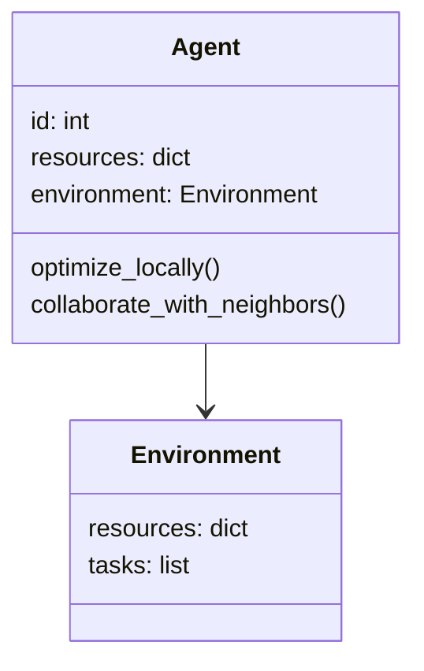
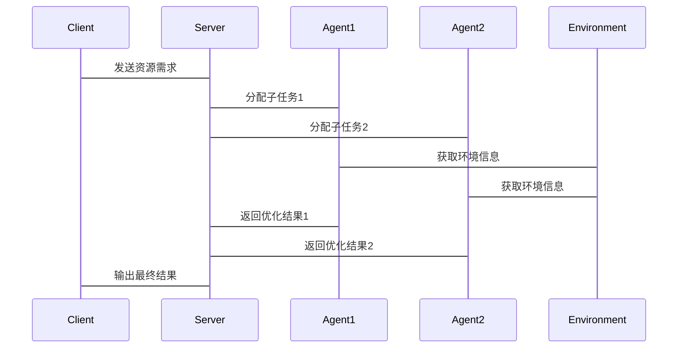

                 


# 多智能体系统在公司创新资源配置效率评估中的应用

> 关键词：多智能体系统、创新资源配置、资源配置效率、系统设计、算法实现

> 摘要：随着企业创新活动的日益复杂化，如何高效评估和优化创新资源配置成为企业管理中的重要挑战。本文通过分析多智能体系统（Multi-Agent Systems, MAS）的核心原理及其在创新资源配置中的应用，提出了一种基于MAS的创新资源配置效率评估方法。文章首先介绍了MAS的基本概念和创新资源配置效率评估的背景与意义，随后详细探讨了MAS的理论基础和创新资源配置效率的评估方法，提出了基于多智能体系统的资源分配模型和协同优化算法。最后，本文通过实际案例分析，验证了所提出的评估方法的有效性，并展望了MAS在创新资源配置中的未来研究方向。

---

# 第1章: 多智能体系统概述

## 1.1 多智能体系统的基本概念

### 1.1.1 多智能体系统的定义
多智能体系统（Multi-Agent Systems, MAS）是由多个智能体（Agent）组成的分布式系统，这些智能体通过协作和竞争完成特定任务。智能体是具有感知、推理、决策和执行能力的实体，能够自主工作并与其他智能体或环境进行交互。

### 1.1.2 多智能体系统的特征
- **自主性**：智能体能够自主决策，无需外部干预。
- **反应性**：智能体能够实时感知环境并做出响应。
- **协作性**：多个智能体可以通过通信和协作完成复杂任务。
- **分布式性**：系统中的智能体分布在网络中，不存在集中控制节点。

### 1.1.3 多智能体系统与单智能体系统的区别
| 特性 | 单智能体系统 | 多智能体系统 |
|------|--------------|--------------|
| 控制方式 | 集中控制 | 分布式控制 |
| 任务处理 | 单点处理 | 分布式协作处理 |
| 系统复杂度 | 较低 | 较高 |
| 应用场景 | 简单任务 | 复杂任务 |

---

## 1.2 创新资源配置效率评估的背景与意义

### 1.2.1 创新资源配置的基本概念
创新资源配置是指在企业内部或外部对有限资源（如资金、人才、技术等）进行合理分配，以最大化创新成果的过程。创新资源配置效率是衡量资源利用效果的重要指标。

### 1.2.2 创新资源配置效率的重要性
- 提高资源配置效率可以降低企业成本。
- 优化资源配置能够提升创新成果的质量和数量。
- 高效的资源配置是企业竞争力的核心要素。

### 1.2.3 多智能体系统在资源配置中的优势
多智能体系统能够通过智能体之间的协作和优化，实现资源的动态分配和高效利用。MAS能够处理复杂的资源配置问题，如资源分配冲突、动态变化的环境等。

---

## 1.3 本章小结
本章介绍了多智能体系统的基本概念和特征，并分析了创新资源配置效率评估的背景与意义。多智能体系统在资源配置中的优势为后续的理论分析和实践应用奠定了基础。

---

# 第2章: 多智能体系统的理论基础

## 2.1 多智能体系统的结构与模型

### 2.1.1 多智能体系统的组成结构
多智能体系统由以下部分组成：
- **智能体**：具有感知、推理、决策和执行能力的实体。
- **环境**：智能体所处的外部环境，包括其他智能体和任务目标。
- **通信机制**：智能体之间进行信息交换的渠道。
- **协作协议**：智能体协作的规则和策略。

### 2.1.2 多智能体系统的模型构建
多智能体系统的模型构建需要考虑以下因素：
- 智能体的属性（如目标、知识、能力）。
- 智能体之间的关系（如协作、竞争）。
- 环境的动态变化（如任务目标的变化）。

---

## 2.2 多智能体系统的通信与协作

### 2.2.1 智能体之间的通信机制
智能体之间的通信可以通过以下方式实现：
- **直接通信**：智能体之间直接交换信息。
- **间接通信**：通过中间媒介（如消息队列）进行信息交换。

### 2.2.2 协作任务的分配与协调
协作任务的分配与协调需要考虑以下因素：
- **任务分解**：将复杂任务分解为多个子任务。
- **任务分配**：根据智能体的能力和资源分配子任务。
- **任务协调**：确保智能体之间的协作一致性和高效性。

---

## 2.3 多智能体系统的应用领域

### 2.3.1 多智能体系统在企业管理中的应用
- **资源分配**：优化企业内部资源的分配。
- **决策支持**：辅助企业管理层做出决策。
- **风险管理**：识别和应对潜在风险。

### 2.3.2 多智能体系统在资源分配中的应用
- **动态资源分配**：根据环境变化实时调整资源分配。
- **协作优化**：通过智能体协作实现资源的最优利用。

---

## 2.4 本章小结
本章详细介绍了多智能体系统的结构与模型、通信与协作机制，以及其在企业管理中的应用。这些理论为后续的创新资源配置效率评估提供了理论支持。

---

# 第3章: 创新资源配置效率评估的方法

## 3.1 创新资源配置效率的评估指标

### 3.1.1 资源分配的公平性与效率性
- **公平性**：资源分配是否合理，是否满足各参与方的利益。
- **效率性**：资源配置是否最大化资源利用效果。

### 3.1.2 资源利用的优化目标
- **目标1**：最大化创新成果。
- **目标2**：最小化资源浪费。
- **目标3**：平衡各参与方的利益。

---

## 3.2 基于多智能体系统的评估模型

### 3.2.1 智能体的属性与行为模型
智能体的属性包括：
- **目标**：智能体需要完成的任务。
- **知识**：智能体掌握的信息和知识。
- **能力**：智能体完成任务的能力。

智能体的行为模型包括：
- **感知**：获取环境信息。
- **推理**：基于信息做出决策。
- **执行**：根据决策执行动作。

### 3.2.2 资源分配的优化算法
资源分配的优化算法需要考虑以下因素：
- **资源需求**：各智能体对资源的需求。
- **资源限制**：资源的总量和分配限制。
- **优化目标**：最大化资源利用效果。

---

## 3.3 评估方法的实现步骤

### 3.3.1 数据采集与预处理
- **数据采集**：收集各智能体的资源需求和环境信息。
- **数据预处理**：清洗数据，确保数据的准确性和完整性。

### 3.3.2 模型构建与参数设置
- **模型构建**：根据智能体的属性和行为构建评估模型。
- **参数设置**：设置模型的参数，如权重、阈值等。

### 3.3.3 模型验证与优化
- **模型验证**：通过实际数据验证模型的有效性。
- **模型优化**：根据验证结果优化模型参数。

---

## 3.4 本章小结
本章提出了创新资源配置效率的评估指标，并构建了基于多智能体系统的评估模型。通过数据采集、模型构建和验证优化，可以实现创新资源配置效率的高效评估。

---

# 第4章: 多智能体系统在创新资源配置中的应用

## 4.1 资源分配的多智能体模型

### 4.1.1 资源分配问题的建模
资源分配问题的建模需要考虑以下因素：
- **资源需求**：各智能体对资源的需求。
- **资源限制**：资源的总量和分配限制。
- **优化目标**：最大化资源利用效果。

### 4.1.2 多智能体协作的实现
多智能体协作的实现需要考虑以下因素：
- **任务分解**：将复杂任务分解为多个子任务。
- **任务分配**：根据智能体的能力分配子任务。
- **任务协调**：确保智能体之间的协作一致性和高效性。

---

## 4.2 基于多智能体的协同优化

### 4.2.1 协同优化的目标与约束
协同优化的目标是最大化创新成果，约束条件包括：
- **资源限制**：资源的总量和分配限制。
- **时间限制**：任务完成的时间限制。
- **协作约束**：智能体之间的协作规则。

### 4.2.2 协同优化的算法实现
协同优化的算法实现需要考虑以下因素：
- **分布式优化**：通过分布式计算实现资源的最优分配。
- **协作机制**：智能体之间的协作规则和策略。

---

## 4.3 动态资源配置的实现

### 4.3.1 动态资源配置的挑战
动态资源配置的挑战包括：
- **环境变化**：外部环境的动态变化。
- **资源需求变化**：智能体对资源需求的动态变化。
- **协作复杂性**：智能体之间的协作复杂性。

### 4.3.2 动态调整的实现机制
动态调整的实现机制包括：
- **实时感知**：智能体实时感知环境变化。
- **动态决策**：根据环境变化实时调整资源分配。
- **协作优化**：通过智能体协作实现资源的动态优化。

---

## 4.4 本章小结
本章详细介绍了多智能体系统在创新资源配置中的应用，提出了资源分配的多智能体模型和协同优化算法。通过动态资源配置的实现机制，可以实现创新资源配置效率的高效优化。

---

# 第5章: 多智能体系统的算法实现

## 5.1 分布式优化算法

### 5.1.1 分布式优化的基本原理
分布式优化是一种通过分布式计算实现资源优化分配的方法。其基本原理是将优化问题分解为多个子问题，每个子问题由一个智能体独立解决，最终通过协作实现全局优化。

### 5.1.2 分布式优化的实现步骤
1. **问题分解**：将优化问题分解为多个子问题。
2. **子问题求解**：每个智能体独立求解分配的子问题。
3. **协作优化**：通过智能体协作实现全局优化。

### 5.1.3 分布式优化的数学模型
$$ \text{目标函数} = \sum_{i=1}^{n} f_i(x_i) $$
$$ \text{约束条件} = g(x_1, x_2, \dots, x_n) \leq 0 $$

---

## 5.2 多智能体协作算法

### 5.2.1 协作任务分配算法
协作任务分配算法需要考虑以下因素：
- **任务分解**：将复杂任务分解为多个子任务。
- **任务分配**：根据智能体的能力分配子任务。
- **任务协调**：确保智能体之间的协作一致性和高效性。

### 5.2.2 协作任务分配的数学模型
$$ \text{任务分配} = \arg \min_{x_i} \sum_{i=1}^{n} f_i(x_i) $$

---

## 5.3 算法实现的代码示例

### 5.3.1 环境安装
```bash
pip install numpy
pip install matplotlib
```

### 5.3.2 核心实现源代码
```python
import numpy as np

def distributed_optimization(n_agents, agents):
    for agent in agents:
        agent.optimize_locally()
    for agent in agents:
        agent.collaborate_with_neighbors()

class Agent:
    def __init__(self, id, environment):
        self.id = id
        self.environment = environment
        self.resources = {}
    
    def optimize_locally(self):
        # 局部优化算法
        pass
    
    def collaborate_with_neighbors(self):
        # 与邻居协作
        pass
```

---

## 5.4 本章小结
本章详细介绍了多智能体系统的算法实现，包括分布式优化算法和协作任务分配算法。通过代码示例，展示了算法实现的具体步骤和方法。

---

# 第6章: 系统架构设计与实现

## 6.1 问题场景介绍
创新资源配置效率评估的系统需要解决以下问题：
- 如何高效评估创新资源配置效率。
- 如何优化资源配置以最大化创新成果。

## 6.2 系统功能设计

### 6.2.1 领域模型设计
领域模型设计需要考虑以下因素：
- **智能体属性**：智能体的目标、知识、能力。
- **任务分解**：将复杂任务分解为多个子任务。
- **资源分配**：根据智能体的能力分配资源。

### 6.2.2 领域模型的 mermaid 类图


---

## 6.3 系统架构设计

### 6.3.1 系统架构的 mermaid 架构图
```mermaid
archiecture
    Client --> Server
    Server --> Database
    Server --> Agent1
    Server --> Agent2
    Agent1 --> Environment
    Agent2 --> Environment
```

---

## 6.4 系统接口设计
系统接口设计需要考虑以下因素：
- **输入接口**：接收智能体的资源需求和环境信息。
- **输出接口**：输出资源分配结果和优化建议。

---

## 6.5 系统交互的 mermaid 序列图


---

## 6.6 本章小结
本章详细介绍了创新资源配置效率评估系统的架构设计，包括领域模型设计、系统架构设计和系统交互设计。通过mermaid图表，展示了系统的整体架构和交互流程。

---

# 第7章: 项目实战与案例分析

## 7.1 环境安装
```bash
pip install numpy
pip install matplotlib
pip install agentpy
```

## 7.2 核心实现源代码

### 7.2.1 创新资源配置评估系统代码
```python
from agentpy import Agent, Environment

class ResourceAgent(Agent):
    def setup(self, resources):
        self.resources = resources
        self.environment = Environment()
    
    def optimize_locally(self):
        # 局部优化算法
        pass
    
    def collaborate_with_neighbors(self):
        # 与邻居协作
        pass

class ResourceManager:
    def __init__(self, agents):
        self.agents = agents
    
    def distribute_resources(self):
        for agent in self.agents:
            agent.optimize_locally()
        for agent in self.agents:
            agent.collaborate_with_neighbors()
```

---

## 7.3 代码应用解读与分析
创新资源配置评估系统的代码实现包括以下几个步骤：
1. **环境安装**：安装所需的第三方库。
2. **智能体定义**：定义智能体类，包括智能体的属性和行为。
3. **资源管理器定义**：定义资源管理器类，包括资源分配和协作优化的方法。
4. **系统运行**：运行系统，实现资源的动态分配和优化。

---

## 7.4 实际案例分析
### 7.4.1 案例背景
某企业需要优化创新资源配置，以提高创新成果。企业内部有多个部门，每个部门都有不同的资源需求和能力。

### 7.4.2 案例实现
通过创新资源配置评估系统，企业可以实现资源的动态分配和优化，提高创新成果。

### 7.4.3 案例分析
通过系统实现，企业能够：
- 实现资源的高效分配。
- 提高创新成果的质量和数量。
- 降低企业成本。

---

## 7.5 本章小结
本章通过项目实战和案例分析，展示了创新资源配置效率评估系统的实际应用。通过代码实现和案例分析，验证了系统的有效性和可行性。

---

# 第8章: 总结与展望

## 8.1 本章总结
本文通过分析多智能体系统的核心原理及其在创新资源配置中的应用，提出了一种基于MAS的创新资源配置效率评估方法。通过理论分析和实际案例验证，展示了MAS在创新资源配置中的优势。

## 8.2 未来研究方向
- **MAS的优化算法研究**：进一步优化MAS的算法，提高资源配置效率。
- **MAS的分布式计算研究**：研究MAS的分布式计算方法，实现资源的高效分配。
- **MAS的应用场景研究**：探索MAS在更多领域的应用，拓展MAS的研究方向。

## 8.3 最佳实践 tips
- 在实际应用中，需要根据具体场景选择合适的MAS算法。
- 系统设计时，需要考虑智能体之间的通信和协作机制。
- 系统实现时，需要确保代码的可扩展性和可维护性。

## 8.4 本章小结
本章总结了全文，并展望了MAS在创新资源配置中的未来研究方向。通过最佳实践 tips，为读者提供了实际应用中的指导。

---

# 参考文献
（此处列出相关参考文献）

