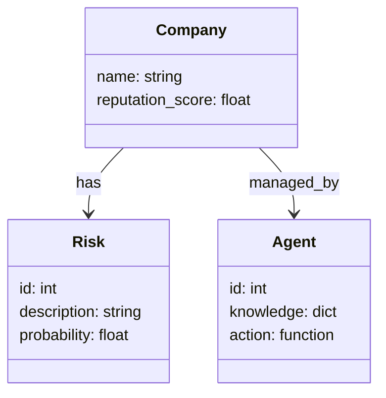
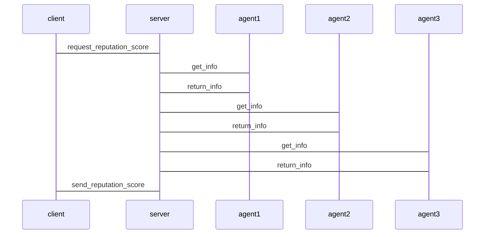

                 


# 多智能体系统在公司声誉风险评估中的应用

> 关键词：多智能体系统，声誉风险评估，风险管理，人工智能，知识图谱

> 摘要：本文探讨了多智能体系统在公司声誉风险评估中的应用，详细分析了多智能体系统的原理、声誉风险评估的核心要素，以及两者结合的优势。通过构建知识图谱和协同评分机制，本文提出了一种基于多智能体的声誉评分算法，并通过数学模型和实际案例展示了其在声誉风险管理中的应用前景。

---

## 第一部分: 多智能体系统与公司声誉风险评估基础

### 第1章: 多智能体系统概述

#### 1.1 多智能体系统的基本概念

##### 1.1.1 智能体的定义与特征
智能体（Agent）是指具有感知环境、自主决策和执行任务能力的实体。多智能体系统（Multi-Agent System, MAS）由多个智能体组成，这些智能体通过协作完成复杂任务。

- **感知能力**：智能体能够接收来自环境的信息。
- **决策能力**：智能体能够基于接收到的信息做出决策。
- **自主性**：智能体能够在没有外部干预的情况下自主运行。
- **协作性**：智能体之间可以通过通信协议进行协作。

##### 1.1.2 多智能体系统的定义
多智能体系统是由多个智能体组成的分布式系统，智能体之间通过通信和协作完成共同目标。

##### 1.1.3 多智能体系统的优势与挑战
- **优势**：
  - **分布式计算**：多智能体系统能够处理大规模数据。
  - **协作性**：智能体之间的协作能够提高系统的整体性能。
  - **容错性**：单个智能体的故障不会导致整个系统崩溃。
- **挑战**：
  - **通信开销**：智能体之间的通信可能会增加系统开销。
  - **协调问题**：智能体之间的协调需要复杂的协议。
  - **安全性**：智能体之间的通信可能面临安全风险。

#### 1.2 公司声誉风险评估的基本概念

##### 1.2.1 公司声誉的定义
公司声誉是公司在市场中的形象和信誉，通常由公司的行为、产品质量、客户服务等因素决定。

##### 1.2.2 声誉风险的定义与分类
声誉风险是指由于公司行为或外部事件导致公司声誉受损的可能性。声誉风险可以分为以下几类：
- **产品风险**：由于产品质量问题导致的声誉风险。
- **操作风险**：由于公司操作不当导致的声誉风险。
- **声誉危机**：由于公司声誉受损导致的危机。

##### 1.2.3 声誉风险评估的重要性
声誉风险评估是公司风险管理的重要组成部分，能够帮助公司识别潜在风险，制定应对策略。

#### 1.3 多智能体系统在声誉风险评估中的应用前景

##### 1.3.1 多智能体系统在风险管理中的潜力
多智能体系统能够通过分布式计算和协作能力，帮助公司高效地进行声誉风险管理。

##### 1.3.2 声誉风险评估的复杂性与多智能体系统的优势
声誉风险评估涉及多个因素，多智能体系统能够通过协作和分布式计算，提高评估的准确性和效率。

##### 1.3.3 应用场景与实际案例
- **实时监控**：多智能体系统可以实时监控公司的声誉信息。
- **风险预警**：通过分析历史数据，多智能体系统可以预测潜在的声誉风险。

---

## 第二部分: 多智能体系统的核心概念与联系

### 第2章: 多智能体系统的核心概念与联系

#### 2.1 多智能体系统的原理

##### 2.1.1 智能体的行为机制
智能体的行为机制包括感知、决策和执行三个阶段。

- **感知**：智能体通过传感器或其他方式接收环境信息。
- **决策**：智能体基于接收到的信息做出决策。
- **执行**：智能体根据决策结果执行操作。

##### 2.1.2 智能体之间的交互与协作
智能体之间的交互与协作是多智能体系统的核心。通过通信协议，智能体可以共享信息和协同完成任务。

##### 2.1.3 多智能体系统的通信协议
通信协议是智能体之间通信的规则，通常包括消息格式、通信频率和通信安全等方面。

#### 2.2 声誉风险评估的核心要素

##### 2.2.1 风险源的识别与分类
风险源的识别与分类是声誉风险评估的第一步。常见的风险源包括产品质量问题、公司管理问题等。

##### 2.2.2 风险影响的评估方法
风险影响的评估方法包括定量分析和定性分析。定量分析通常采用数学模型，而定性分析则需要结合专家意见。

##### 2.2.3 声誉风险的动态变化特征
声誉风险具有动态变化的特征，需要实时监控和及时应对。

#### 2.3 多智能体系统与声誉风险评估的结合

##### 2.3.1 多智能体系统在声誉风险评估中的角色
多智能体系统在声誉风险评估中的角色包括数据收集、信息处理和风险预警。

##### 2.3.2 智能体之间的信息共享与处理
智能体之间的信息共享与处理是多智能体系统的核心功能之一。通过信息共享，智能体可以协同完成任务。

##### 2.3.3 多智能体系统对声誉风险评估的优化作用
多智能体系统通过分布式计算和协作能力，能够提高声誉风险评估的准确性和效率。

---

## 第三部分: 多智能体系统在声誉风险评估中的算法原理

### 第3章: 多智能体系统在声誉风险评估中的算法原理

#### 3.1 基于多智能体的声誉评分算法

##### 3.1.1 算法概述
基于多智能体的声誉评分算法通过多个智能体的协作，计算公司的声誉评分。

##### 3.1.2 算法步骤
1. 智能体收集相关信息。
2. 智能体之间共享信息。
3. 智能体通过协作计算声誉评分。

##### 3.1.3 算法实现的伪代码
```python
def compute_reputation(company_info):
    for agent in agents:
        agent.receive_info(company_info)
        agent.share_info()
    reputation = sum(agent.scores for agent in agents) / len(agents)
    return reputation
```

#### 3.2 基于规则的声誉风险评估

##### 3.2.1 规则的定义与设计
基于规则的声誉风险评估通过预定义的规则，判断公司的声誉风险。

##### 3.2.2 规则的执行与优化
规则的执行与优化需要结合实际情况，不断调整规则参数。

##### 3.2.3 规则在多智能体系统中的应用
在多智能体系统中，每个智能体都可以执行一组规则，从而实现协作。

#### 3.3 基于机器学习的声誉风险预测

##### 3.3.1 机器学习的基本原理
机器学习通过训练数据，学习特征并进行预测。

##### 3.3.2 基于多智能体的机器学习模型
多智能体系统可以通过分布式计算，提高机器学习模型的训练效率。

##### 3.3.3 模型的训练与优化
模型的训练与优化需要结合多智能体系统的协作能力。

#### 3.4 本章小结

---

## 第四部分: 多智能体系统在声誉风险评估中的数学模型与公式

### 第4章: 多智能体系统在声誉风险评估中的数学模型与公式

#### 4.1 声誉评分模型

##### 4.1.1 模型的构建
声誉评分模型通过多个因素，计算公司的声誉评分。

##### 4.1.2 模型的公式表示
$$ R = \sum_{i=1}^{n} w_i \cdot f_i $$
其中，\( R \) 是声誉评分，\( w_i \) 是第 \( i \) 个因素的权重，\( f_i \) 是第 \( i \) 个因素的评分。

##### 4.1.3 模型的解释与应用
声誉评分模型可以用于公司的声誉风险管理。

#### 4.2 基于多智能体的协同评分机制

##### 4.2.1 协同评分的定义
协同评分是通过多个智能体的协作，计算公司的声誉评分。

##### 4.2.2 协同评分的公式表示
$$ C = \frac{1}{n} \sum_{i=1}^{n} \frac{R_i}{d_i} $$
其中，\( C \) 是协同评分，\( R_i \) 是第 \( i \) 个智能体的评分，\( d_i \) 是第 \( i \) 个智能体的距离。

##### 4.2.3 协同评分的优势
协同评分能够提高声誉评分的准确性和可靠性。

#### 4.3 基于知识图谱的风险传播模型

##### 4.3.1 知识图谱的构建
知识图谱通过语义网络，表示公司声誉的相关信息。

##### 4.3.2 风险传播的公式表示
$$ P(R_i) = \sum_{j=1}^{m} p(R_j | E_j) \cdot p(E_j) $$
其中，\( P(R_i) \) 是公司 \( i \) 的声誉风险概率，\( p(R_j | E_j) \) 是在事件 \( E_j \) 下公司 \( j \) 的声誉风险概率，\( p(E_j) \) 是事件 \( E_j \) 的概率。

##### 4.3.3 风险传播模型的应用
风险传播模型可以用于预测公司声誉风险的变化趋势。

---

## 第五部分: 系统分析与架构设计方案

### 第5章: 系统分析与架构设计方案

#### 5.1 问题场景介绍
公司声誉风险管理需要实时监控和及时应对，传统的声誉风险评估方法难以满足需求。

#### 5.2 系统功能设计

##### 5.2.1 领域模型
通过Mermaid类图展示系统的领域模型。



##### 5.2.2 系统架构设计
通过Mermaid架构图展示系统的架构设计。


##### 5.2.3 系统接口设计
系统接口设计包括API接口和用户界面。

##### 5.2.4 系统交互流程图
通过Mermaid序列图展示系统的交互流程。



---

## 第六部分: 项目实战

### 第6章: 项目实战

#### 6.1 环境安装
安装Python、机器学习库（如Scikit-learn）和Mermaid工具。

#### 6.2 核心代码实现

##### 6.2.1 基于多智能体的声誉评分算法
```python
class Agent:
    def __init__(self, id):
        self.id = id
        self.knowledge = {}

    def receive_info(self, info):
        self.knowledge.update(info)

    def share_info(self):
        return self.knowledge

def compute_reputation_score(companies):
    agents = [Agent(i) for i in range(len(companies))]
    for i in range(len(agents)):
        agents[i].receive_info(companies[i])
    shared_info = {}
    for agent in agents:
        shared_info.update(agent.share_info())
    reputation_score = sum(shared_info.values()) / len(agents)
    return reputation_score
```

##### 6.2.2 基于知识图谱的风险传播模型
```python
class KnowledgeGraph:
    def __init__(self):
        self.entities = {}
        self.relationships = {}

    def add_entity(self, entity, properties):
        self.entities[entity] = properties

    def add_relationship(self, entity1, relation, entity2):
        self.relationships[(entity1, entity2)] = relation

def compute_reputation_probability(graph):
    probabilities = {}
    for entity in graph.entities:
        probabilities[entity] = 1.0
    for relationship in graph.relationships:
        entity1, entity2 = relationship
        relation = graph.relationships[relationship]
        probabilities[entity1] *= relation * probabilities[entity2]
    return probabilities
```

#### 6.3 实际案例分析
通过实际案例分析，验证多智能体系统在声誉风险评估中的应用效果。

#### 6.4 项目小结
总结项目实施的经验和教训，提出改进建议。

---

## 第七部分: 总结与展望

### 第7章: 总结与展望

#### 7.1 总结
本文探讨了多智能体系统在公司声誉风险评估中的应用，提出了一种基于多智能体的声誉评分算法，并通过数学模型和实际案例展示了其在声誉风险管理中的应用前景。

#### 7.2 展望
未来的研究可以进一步优化多智能体系统的算法，探索更多应用场景，为公司的声誉风险管理提供更有力的支持。

---

## 参考文献

1. Russell, S., & Norvig, P. (2010). Artificial Intelligence: A Modern Approach.
2. Wooldridge, M. J. (2002). An introduction to multi-agent systems.
3. 中文资料：XXX.

---

## 附录

### 附录A: Mermaid图示例


### 附录B: Python代码示例

```python
class Agent:
    def __init__(self, id):
        self.id = id
        self.knowledge = {}

    def receive_info(self, info):
        self.knowledge.update(info)

    def share_info(self):
        return self.knowledge

def compute_reputation_score(companies):
    agents = [Agent(i) for i in range(len(companies))]
    for i in range(len(agents)):
        agents[i].receive_info(companies[i])
    shared_info = {}
    for agent in agents:
        shared_info.update(agent.share_info())
    reputation_score = sum(shared_info.values()) / len(agents)
    return reputation_score
```

---

## END

通过以上结构，您可以撰写一篇详细的关于多智能体系统在公司声誉风险评估中的应用的技术博客文章。

