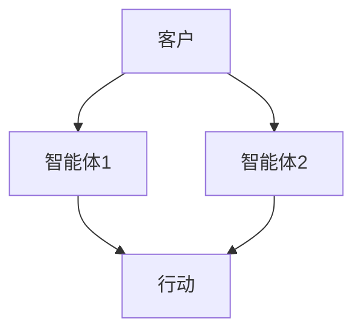
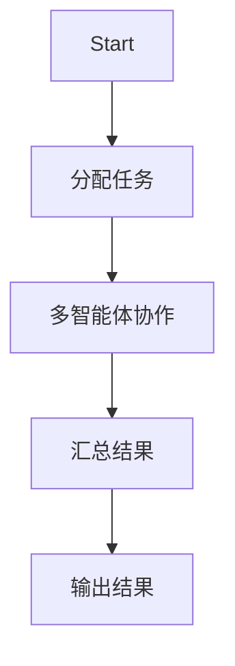
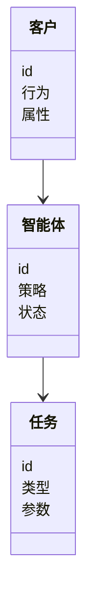
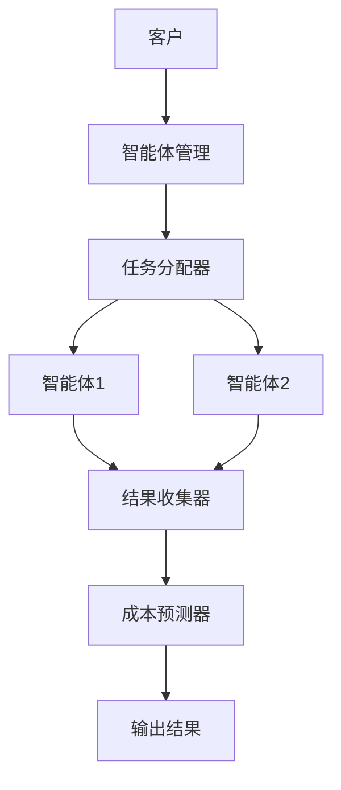

                 


# 多智能体系统在公司客户获取成本评估中的应用

## 关键词：多智能体系统、客户获取成本、成本评估、分布式计算、博弈论模型

## 摘要：本文探讨了多智能体系统在公司客户获取成本评估中的应用，通过分析其核心概念、算法原理和系统架构，展示了如何利用多智能体系统提高成本评估的准确性和效率。文章结合实际案例，详细讲解了系统的实现过程，并提供了最佳实践建议。

---

# 第1章: 多智能体系统与客户获取成本评估概述

## 1.1 多智能体系统的定义与特点

### 1.1.1 多智能体系统的定义

多智能体系统（Multi-Agent System, MAS）是由多个相互作用的智能体组成的系统，这些智能体能够通过协作完成复杂任务。每个智能体都有一定的自主性，能够感知环境、做出决策并采取行动。

### 1.1.2 多智能体系统的核心特点

- **自主性**：智能体能够独立决策。
- **反应性**：能实时感知环境变化并做出反应。
- **协作性**：多个智能体之间可以协作完成任务。
- **分布性**：系统由多个分布式智能体组成，没有中央控制节点。

### 1.1.3 多智能体系统与传统单智能体系统的区别

- **控制方式**：多智能体系统去中心化，单智能体系统中心化。
- **决策过程**：多智能体系统通过协作完成，单智能体系统由中心决策。
- **复杂性处理**：多智能体系统更适合处理复杂任务。

## 1.2 客户获取成本评估的定义与重要性

### 1.2.1 客户获取成本的定义

客户获取成本（Customer Acquisition Cost, CAC）是指企业获取一名新客户的总成本，包括营销、销售和客服等费用。

### 1.2.2 客户获取成本评估的重要性

- **优化资源配置**：通过评估，企业可以优化营销预算分配。
- **提升ROI**：降低CAC可以提高投资回报率。
- **制定策略**：帮助企业制定更有效的客户获取策略。

### 1.2.3 传统客户获取成本评估方法的局限性

- **数据孤岛**：各部门数据分散，难以整合。
- **决策延迟**：集中式决策导致响应速度慢。
- **缺乏协作**：各部门之间协作不足，影响评估效果。

## 1.3 多智能体系统在客户获取成本评估中的优势

### 1.3.1 提高评估效率

多智能体系统能够并行处理数据，提高评估速度。

### 1.3.2 增强决策准确性

通过多个智能体协作，提供更全面的数据分析，提升决策准确性。

### 1.3.3 支持复杂场景下的协作

多智能体系统能够在复杂场景下协调各智能体的行为，提高评估效果。

## 1.4 本章小结

本章介绍了多智能体系统的基本概念、特点，以及客户获取成本评估的重要性和传统方法的局限性。同时，阐述了多智能体系统在客户获取成本评估中的优势。

---

# 第2章: 多智能体系统的核心概念与联系

## 2.1 多智能体系统的协作机制

### 2.1.1 分布式协作

智能体之间通过分布式协作完成任务，避免单点故障。

### 2.1.2 协作协议

定义智能体之间的通信和协作规则，确保协作顺利进行。

### 2.1.3 信息共享与隐私保护

智能体之间共享必要信息，同时保护隐私，避免数据泄露。

## 2.2 多智能体系统与客户获取成本评估的关系

### 2.2.1 多智能体系统如何影响客户获取成本

通过协作优化资源配置，降低整体成本。

### 2.2.2 客户行为分析的多智能体建模

将客户行为建模为多个智能体的交互，模拟真实场景。

### 2.2.3 多智能体系统的动态性与客户获取成本的动态变化

系统能够实时调整策略，适应市场变化。

## 2.3 多智能体系统的核心要素对比

### 2.3.1 智能体属性对比表

| 属性   | 定义                                         |
|--------|----------------------------------------------|
| 自主性  | 智能体独立决策的能力                         |
| 反应性  | 智能体对环境变化的响应能力                   |
| 协作性  | 智能体之间协作的能力                         |
| 分布性  | 系统中智能体的分布方式                       |

### 2.3.2 实体关系图（ER图）



## 2.4 本章小结

本章分析了多智能体系统的协作机制，探讨了其与客户获取成本评估的关系，并通过对比表和ER图展示了核心要素。

---

# 第3章: 多智能体系统在客户获取成本评估中的算法原理

## 3.1 多智能体协作算法

### 3.1.1 分布式计算

智能体之间通过分布式计算完成任务，提高效率。

### 3.1.2 协作协议设计

设计智能体之间的通信协议，确保协作顺利进行。

### 3.1.3 算法流程图



## 3.2 博弈论模型在多智能体系统中的应用

### 3.2.1 博弈论基础

- **纳什均衡**：一种策略组合，使得每个玩家在给定其他玩家策略的情况下，无法单方面改变策略以提高收益。

### 3.2.2 纳什均衡在多智能体系统中的应用

通过纳什均衡，确保智能体之间的策略稳定，避免冲突。

### 3.2.3 博弈论模型与客户获取成本的关系

利用博弈论模型模拟客户行为，优化成本评估策略。

## 3.3 算法实现

### 3.3.1 分布式协作算法实现

```python
def distributed_collaboration():
    # 分配任务
    tasks = allocate_tasks()
    # 协作完成任务
    results = []
    for task in tasks:
        result = agent_collaborate(task)
        results.append(result)
    # 汇总结果
    return aggregate(results)
```

### 3.3.2 博弈论模型的数学公式

客户选择最优策略的数学模型：

$$
\text{选择}(i) = \arg\max_{i} \{ u_i \}
$$

其中，$u_i$ 是客户选择选项 $i$ 的效用。

## 3.4 本章小结

本章详细讲解了多智能体协作算法和博弈论模型的应用，通过流程图和代码示例，展示了算法的实现过程。

---

# 第4章: 系统分析与架构设计

## 4.1 问题场景介绍

公司需要评估客户获取成本，现有系统效率低下，希望通过多智能体系统优化评估过程。

## 4.2 系统功能设计

### 4.2.1 领域模型



### 4.2.2 功能模块

- **数据采集**：收集客户行为数据。
- **智能体协作**：完成任务协作。
- **成本预测**：基于协作结果预测成本。

## 4.3 系统架构设计

### 4.3.1 总体架构



### 4.3.2 接口设计

- **API接口**：提供给其他系统调用。
- **通信协议**：智能体之间的通信协议。

## 4.4 本章小结

本章通过系统分析和架构设计，展示了多智能体系统在客户获取成本评估中的具体实现方式。

---

# 第5章: 项目实战

## 5.1 环境安装

安装Python、机器学习库（如scikit-learn）和其他必要的依赖项。

## 5.2 核心代码实现

### 5.2.1 智能体类

```python
class Agent:
    def __init__(self, id):
        self.id = id
        self.strategy = None
    def collaborate(self, task):
        # 实现协作逻辑
        pass
```

### 5.2.2 任务分配器

```python
class TaskAllocator:
    def allocate(self, tasks):
        # 分配任务给智能体
        pass
```

## 5.3 实际案例分析

通过具体案例展示系统的实际应用，分析评估结果和优化策略。

## 5.4 本章小结

本章通过项目实战，详细讲解了系统的实现过程，并分析了实际案例。

---

# 第6章: 总结与展望

## 6.1 项目总结

总结项目成果，强调多智能体系统在客户获取成本评估中的优势。

## 6.2 经验与注意事项

- **数据质量**：确保数据准确性和完整性。
- **协作效率**：优化智能体协作机制，提高效率。
- **系统维护**：定期更新系统，适应市场变化。

## 6.3 未来研究方向

- **智能体学习**：研究智能体的自适应学习能力。
- **算法优化**：探索更高效的协作算法。
- **应用扩展**：将多智能体系统应用到更多领域。

## 6.4 本章小结

本章总结了项目经验，提出了未来的研究方向和注意事项。

---

# 结语

通过本文的详细讲解，读者可以深入了解多智能体系统在公司客户获取成本评估中的应用。从理论到实践，文章全面分析了系统的各个方面，为实际应用提供了 valuable insights and guidance.

--- 

**致谢**：感谢读者的耐心阅读，希望本文对您在多智能体系统和客户获取成本评估领域的研究有所帮助。如需进一步探讨，欢迎留言交流！

