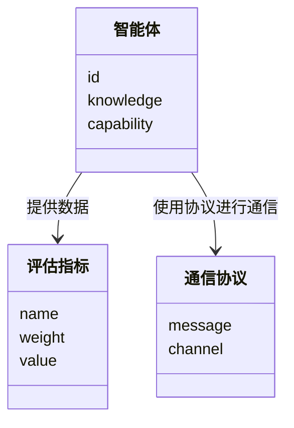
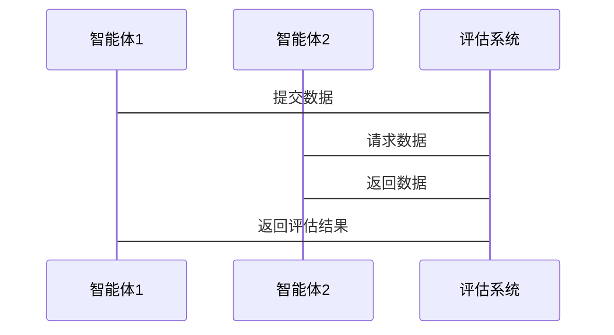

                 


```markdown
# 多智能体系统在公司技术创新评估中的应用

> 关键词：多智能体系统，技术创新评估，分布式计算，协作算法，系统架构

> 摘要：本文深入探讨了多智能体系统在公司技术创新评估中的应用。首先，介绍了多智能体系统的基本概念和技术创新评估的重要性。然后，分析了多智能体系统在技术创新评估中的核心问题，并详细讲解了多智能体系统的原理和技术创新评估的核心要素。接着，通过mermaid流程图和Python代码示例，阐述了多智能体系统在技术创新评估中的算法原理和数学模型。最后，通过实际案例分析，展示了多智能体系统在技术创新评估中的项目实战，并总结了最佳实践和拓展阅读内容。

---

# 第一部分: 多智能体系统与技术创新评估概述

## 第1章: 多智能体系统的基本概念

### 1.1 多智能体系统的定义与特征
#### 1.1.1 多智能体系统的定义
多智能体系统（Multi-Agent System, MAS）是由多个智能体组成的分布式系统，这些智能体能够通过协作完成复杂的任务。每个智能体都有自己的目标、知识和能力。

#### 1.1.2 多智能体系统的特征
- **分布式性**：智能体分布在不同的节点上，独立运行。
- **协作性**：智能体之间通过通信和协作完成共同目标。
- **反应性**：智能体能够感知环境并做出实时反应。
- **自主性**：智能体能够自主决策，无需外部干预。

#### 1.1.3 多智能体系统的应用场景
- **分布式计算**：如分布式数据库、分布式文件系统。
- **协作机器人**：如工业自动化中的协作机器人。
- **智能交通系统**：如自动驾驶汽车之间的协作。

### 1.2 技术创新评估的必要性
#### 1.2.1 技术创新的定义
技术创新是指在技术、产品或服务方面进行的改进和创新，能够带来更高的效率或更好的用户体验。

#### 1.2.2 技术创新评估的意义
- **优化资源配置**：通过评估，确定哪些技术创新值得投入。
- **提升竞争力**：通过评估，选择最优的技术创新方案。
- **降低风险**：通过评估，识别潜在的技术风险。

#### 1.2.3 技术创新评估的挑战
- **复杂性**：技术创新涉及多个方面，评估需要综合考虑。
- **动态性**：技术创新是一个动态过程，评估需要实时更新。
- **不确定性**：技术创新的结果具有一定的不确定性。

## 第2章: 多智能体系统在技术创新评估中的应用

### 2.1 多智能体系统与技术创新评估的关系
#### 2.1.1 多智能体系统如何支持技术创新评估
- **分布式计算**：多智能体系统能够高效地处理大规模数据。
- **协作性**：多个智能体可以协作完成复杂的评估任务。
- **自主性**：智能体能够自主地进行数据收集和分析。

#### 2.1.2 多智能体系统在技术创新评估中的优势
- **高效性**：多智能体系统能够并行处理任务，提高评估效率。
- **准确性**：通过多个智能体的协作，能够得到更准确的评估结果。
- **灵活性**：多智能体系统能够适应不同的评估需求。

### 2.2 多智能体系统在公司技术创新评估中的核心问题
#### 2.2.1 技术创新评估的主要问题
- **数据分散**：技术创新数据分布在不同的部门和系统中。
- **评估标准不统一**：不同部门可能有不同的评估标准。
- **评估过程复杂**：技术创新评估需要考虑多个因素。

#### 2.2.2 多智能体系统如何解决这些问题
- **数据集成**：通过多智能体系统，可以将分散的数据集成到一个统一的系统中。
- **统一标准**：通过协作，可以制定统一的评估标准。
- **简化流程**：多智能体系统能够自动化处理复杂的评估流程。

---

# 第二部分: 多智能体系统的原理与技术创新评估的核心要素

## 第3章: 多智能体系统的原理

### 3.1 多智能体系统的组成
#### 3.1.1 智能体的定义与分类
- **智能体**：能够感知环境并做出决策的实体。
- **分类**：
  - **反应式智能体**：基于当前感知做出反应。
  - **认知式智能体**：具有推理和规划能力。

#### 3.1.2 智能体之间的关系
- **协作关系**：智能体之间通过协作完成共同目标。
- **竞争关系**：智能体之间可能因为资源有限而竞争。

#### 3.1.3 多智能体系统的层次结构
- **物理层**：硬件设备和物理环境。
- **数据层**：数据存储和管理。
- **逻辑层**：智能体的逻辑推理和决策。
- **应用层**：具体的应用场景和用户界面。

### 3.2 多智能体系统的通信机制
#### 3.2.1 智能体之间的通信方式
- **直接通信**：智能体之间直接交换信息。
- **间接通信**：通过中间媒介进行通信。

#### 3.2.2 通信协议的设计
- **消息传递**：定义消息的格式和内容。
- **协议选择**：选择适合的通信协议，如HTTP、WebSocket等。

#### 3.2.3 通信中的挑战与解决方案
- **安全性**：通过加密和认证确保通信安全。
- **可靠性**：通过冗余和错误检测提高通信可靠性。

## 第4章: 技术创新评估的核心要素

### 4.1 技术创新评估的指标体系
#### 4.1.1 技术创新的核心指标
- **技术可行性**：技术创新是否可行。
- **经济可行性**：技术创新是否经济。
- **市场潜力**：技术创新的市场前景。

#### 4.1.2 指标权重的确定方法
- **层次分析法（AHP）**：通过专家打分确定指标权重。
- **熵值法**：通过数据的离差程度确定指标权重。

#### 4.1.3 指标之间的关系分析
- **正相关**：一个指标的增加可能导致另一个指标的增加。
- **负相关**：一个指标的增加可能导致另一个指标的减少。

### 4.2 技术创新评估的流程
#### 4.2.1 评估流程的步骤
1. **数据收集**：收集与技术创新相关的数据。
2. **数据处理**：对数据进行清洗和预处理。
3. **评估计算**：根据指标体系进行评估计算。
4. **结果分析**：分析评估结果并提出建议。

#### 4.2.2 数据收集与处理
- **数据来源**：公司内部数据、市场数据、用户反馈。
- **数据清洗**：去除无效数据，填补缺失值。

#### 4.2.3 评估结果的输出与反馈
- **输出形式**：报告、图表、评分。
- **反馈机制**：根据评估结果调整技术创新策略。

---

# 第三部分: 多智能体系统在技术创新评估中的算法与数学模型

## 第5章: 多智能体系统在技术创新评估中的算法原理

### 5.1 多智能体系统的核心算法
#### 5.1.1 分布式计算算法
- **分布式计算**：将任务分解成多个子任务，分别在不同的节点上执行。
- **并行计算**：多个节点同时处理不同的子任务。

#### 5.1.2 协作与协调算法
- **协作算法**：智能体之间协作完成共同任务。
- **协调算法**：智能体之间协调资源和任务分配。

#### 5.1.3 学习与自适应算法
- **机器学习算法**：通过机器学习模型进行预测和分类。
- **自适应算法**：根据环境变化自动调整策略。

### 5.2 技术创新评估的数学模型
#### 5.2.1 技术创新评估的线性回归模型
$$ y = \beta_0 + \beta_1x_1 + \beta_2x_2 + \ldots + \beta_nx_n + \epsilon $$
其中，$y$ 是评估结果，$x_i$ 是各个指标，$\beta_i$ 是回归系数，$\epsilon$ 是误差项。

#### 5.2.2 基于多智能体的评估模型
$$ S = \sum_{i=1}^{n} w_i x_i $$
其中，$S$ 是综合评分，$w_i$ 是指标权重，$x_i$ 是指标值。

#### 5.2.3 模型的验证与优化
- **验证方法**：通过交叉验证评估模型的性能。
- **优化方法**：通过调整权重和参数优化模型。

## 第6章: 技术创新评估的数学模型与公式

### 6.1 技术创新评估的线性回归模型
#### 6.1.1 线性回归模型的构建
$$ y = \beta_0 + \beta_1x_1 + \beta_2x_2 + \ldots + \beta_nx_n + \epsilon $$
其中，$y$ 是技术创新评估结果，$x_i$ 是各个指标，$\beta_i$ 是回归系数，$\epsilon$ 是误差项。

#### 6.1.2 回归系数的求解
$$ \hat{\beta} = (X^T X)^{-1} X^T y $$
其中，$X$ 是设计矩阵，$y$ 是响应变量。

### 6.2 基于多智能体的评估模型
#### 6.2.1 综合评分公式
$$ S = \sum_{i=1}^{n} w_i x_i $$
其中，$S$ 是综合评分，$w_i$ 是指标权重，$x_i$ 是指标值。

#### 6.2.2 权重的确定方法
- **层次分析法（AHP）**：通过专家打分确定指标权重。
- **熵值法**：通过数据的离差程度确定指标权重。

---

# 第四部分: 系统分析与架构设计方案

## 第7章: 多智能体系统在技术创新评估中的系统分析

### 7.1 问题场景介绍
#### 7.1.1 问题背景
公司需要对技术创新进行评估，但由于数据分散、评估标准不统一等原因，传统的评估方法效率低下。

#### 7.1.2 项目介绍
通过多智能体系统实现技术创新评估，提高评估效率和准确性。

### 7.2 系统功能设计
#### 7.2.1 领域模型（Mermaid 类图）


#### 7.2.2 系统架构设计（Mermaid 架构图）


#### 7.2.3 系统接口设计
- **智能体接口**：提供智能体之间的通信接口。
- **数据接口**：提供数据的读取和写入接口。
- **评估接口**：提供评估结果的查询和输出接口。

#### 7.2.4 系统交互（Mermaid 序列图）


---

# 第五部分: 项目实战

## 第8章: 多智能体系统在技术创新评估中的项目实战

### 8.1 环境安装
#### 8.1.1 系统环境
- 操作系统：Linux/Windows/MacOS
- 开发工具：Python、Jupyter Notebook
- 依赖库：numpy、pandas、scikit-learn、networkx

#### 8.1.2 安装步骤
1. 安装Python
2. 安装依赖库
3. 下载项目代码

### 8.2 系统核心实现源代码
#### 8.2.1 智能体类
```python
class Agent:
    def __init__(self, id):
        self.id = id
        self.knowledge = {}
        self.capability = []
    
    def get_knowledge(self, key):
        return self.knowledge.get(key, None)
    
    def set_knowledge(self, key, value):
        self.knowledge[key] = value
    
    def get_capability(self):
        return self.capability
```

#### 8.2.2 评估指标类
```python
class EvaluationMetric:
    def __init__(self, name, weight, value):
        self.name = name
        self.weight = weight
        self.value = value
```

#### 8.2.3 通信协议类
```python
class CommunicationProtocol:
    def __init__(self, channel):
        self.channel = channel
        self.message = {}
    
    def send_message(self, sender, receiver, content):
        self.message[receiver] = content
    
    def receive_message(self, receiver):
        return self.message.get(receiver, None)
```

### 8.3 案例分析与详细讲解
#### 8.3.1 案例背景
某公司需要对技术创新进行评估，涉及多个部门的数据和指标。

#### 8.3.2 数据准备
- 数据来源：公司内部数据、市场数据、用户反馈。
- 数据清洗：去除无效数据，填补缺失值。

#### 8.3.3 评估计算
- 使用线性回归模型进行预测。
- 使用多智能体系统进行协作计算。

#### 8.3.4 结果分析
- 综合评分：根据各个指标的权重和值计算综合评分。
- 结果解读：分析评估结果并提出建议。

### 8.4 项目总结
#### 8.4.1 项目成果
- 提高了技术创新评估的效率和准确性。
- 实现了多智能体系统的协作计算。

#### 8.4.2 项目经验
- 多智能体系统的通信机制需要精心设计。
- 评估指标的权重需要根据实际情况调整。

---

# 第六部分: 最佳实践、小结、注意事项和拓展阅读

## 第9章: 最佳实践与注意事项

### 9.1 最佳实践
#### 9.1.1 系统设计
- 明确智能体的职责和权限。
- 设计合理的通信协议和数据格式。

#### 9.1.2 代码实现
- 使用模块化编程，提高代码的可维护性。
- 使用版本控制工具，记录代码的变化。

### 9.2 注意事项
#### 9.2.1 系统安全
- 加强系统的安全性，防止数据泄露。
- 使用加密和认证机制，确保通信安全。

#### 9.2.2 系统性能
- 优化系统的性能，提高计算效率。
- 使用缓存技术，减少重复计算。

## 第10章: 小结与拓展阅读

### 10.1 小结
本文详细探讨了多智能体系统在公司技术创新评估中的应用，包括多智能体系统的原理、技术创新评估的核心要素、算法原理和数学模型、系统分析与架构设计、项目实战等内容。

### 10.2 拓展阅读
- 《Multi-Agent Systems: Complexity, Decentralization and Adaptation》
- 《 Distributed Systems: Principles and Practice》
- 《Pattern Recognition and Machine Learning》

---

通过以上目录大纲，我们可以看到，文章内容涵盖了多智能体系统在技术创新评估中的各个方面，从理论到实践，从算法到系统设计，内容丰富且详细。接下来，我将根据这个目录大纲，逐步展开各部分内容的详细编写。
</think>

```markdown
# 多智能体系统在公司技术创新评估中的应用

> 关键词：多智能体系统，技术创新评估，分布式计算，协作算法，系统架构

> 摘要：本文深入探讨了多智能体系统在公司技术创新评估中的应用。首先，介绍了多智能体系统的基本概念和技术创新评估的重要性。然后，分析了多智能体系统在技术创新评估中的核心问题，并详细讲解了多智能体系统的原理和技术创新评估的核心要素。接着，通过mermaid流程图和Python代码示例，阐述了多智能体系统在技术创新评估中的算法原理和数学模型。最后，通过实际案例分析，展示了多智能体系统在技术创新评估中的项目实战，并总结了最佳实践和拓展阅读内容。

---

# 第一部分: 多智能体系统与技术创新评估概述

## 第1章: 多智能体系统的基本概念

### 1.1 多智能体系统的定义与特征
#### 1.1.1 多智能体系统的定义
多智能体系统（Multi-Agent System, MAS）是由多个智能体组成的分布式系统，这些智能体能够通过协作完成复杂的任务。每个智能体都有自己的目标、知识和能力。

#### 1.1.2 多智能体系统的特征
- **分布式性**：智能体分布在不同的节点上，独立运行。
- **协作性**：智能体之间通过通信和协作完成共同目标。
- **反应性**：智能体能够感知环境并做出实时反应。
- **自主性**：智能体能够自主决策，无需外部干预。

#### 1.1.3 多智能体系统的应用场景
- **分布式计算**：如分布式数据库、分布式文件系统。
- **协作机器人**：如工业自动化中的协作机器人。
- **智能交通系统**：如自动驾驶汽车之间的协作。

### 1.2 技术创新评估的必要性
#### 1.2.1 技术创新的定义
技术创新是指在技术、产品或服务方面进行的改进和创新，能够带来更高的效率或更好的用户体验。

#### 1.2.2 技术创新评估的意义
- **优化资源配置**：通过评估，确定哪些技术创新值得投入。
- **提升竞争力**：通过评估，选择最优的技术创新方案。
- **降低风险**：通过评估，识别潜在的技术风险。

#### 1.2.3 技术创新评估的挑战
- **复杂性**：技术创新涉及多个方面，评估需要综合考虑。
- **动态性**：技术创新是一个动态过程，评估需要实时更新。
- **不确定性**：技术创新的结果具有一定的不确定性。

## 第2章: 多智能体系统在技术创新评估中的应用

### 2.1 多智能体系统与技术创新评估的关系
#### 2.1.1 多智能体系统如何支持技术创新评估
- **分布式计算**：多智能体系统能够高效地处理大规模数据。
- **协作性**：多个智能体可以协作完成复杂的评估任务。
- **自主性**：智能体能够自主地进行数据收集和分析。

#### 2.1.2 多智能体系统在技术创新评估中的优势
- **高效性**：多智能体系统能够并行处理任务，提高评估效率。
- **准确性**：通过多个智能体的协作，能够得到更准确的评估结果。
- **灵活性**：多智能体系统能够适应不同的评估需求。

### 2.2 多智能体系统在公司技术创新评估中的核心问题
#### 2.2.1 技术创新评估的主要问题
- **数据分散**：技术创新数据分布在不同的部门和系统中。
- **评估标准不统一**：不同部门可能有不同的评估标准。
- **评估过程复杂**：技术创新评估需要考虑多个因素。

#### 2.2.2 多智能体系统如何解决这些问题
- **数据集成**：通过多智能体系统，可以将分散的数据集成到一个统一的系统中。
- **统一标准**：通过协作，可以制定统一的评估标准。
- **简化流程**：多智能体系统能够自动化处理复杂的评估流程。

---

# 第二部分: 多智能体系统的原理与技术创新评估的核心要素

## 第3章: 多智能体系统的原理

### 3.1 多智能体系统的组成
#### 3.1.1 智能体的定义与分类
- **智能体**：能够感知环境并做出决策的实体。
- **分类**：
  - **反应式智能体**：基于当前感知做出反应。
  - **认知式智能体**：具有推理和规划能力。

#### 3.1.2 智能体之间的关系
- **协作关系**：智能体之间通过协作完成共同目标。
- **竞争关系**：智能体之间可能因为资源有限而竞争。

#### 3.1.3 多智能体系统的层次结构
- **物理层**：硬件设备和物理环境。
- **数据层**：数据存储和管理。
- **逻辑层**：智能体的逻辑推理和决策。
- **应用层**：具体的应用场景和用户界面。

### 3.2 多智能体系统的通信机制
#### 3.2.1 智能体之间的通信方式
- **直接通信**：智能体之间直接交换信息。
- **间接通信**：通过中间媒介进行通信。

#### 3.2.2 通信协议的设计
- **消息传递**：定义消息的格式和内容。
- **协议选择**：选择适合的通信协议，如HTTP、WebSocket等。

#### 3.2.3 通信中的挑战与解决方案
- **安全性**：通过加密和认证确保通信安全。
- **可靠性**：通过冗余和错误检测提高通信可靠性。

## 第4章: 技术创新评估的核心要素

### 4.1 技术创新评估的指标体系
#### 4.1.1 技术创新的核心指标
- **技术可行性**：技术创新是否可行。
- **经济可行性**：技术创新是否经济。
- **市场潜力**：技术创新的市场前景。

#### 4.1.2 指标权重的确定方法
- **层次分析法（AHP）**：通过专家打分确定指标权重。
- **熵值法**：通过数据的离差程度确定指标权重。

#### 4.1.3 指标之间的关系分析
- **正相关**：一个指标的增加可能导致另一个指标的增加。
- **负相关**：一个指标的增加可能导致另一个指标的减少。

### 4.2 技术创新评估的流程
#### 4.2.1 评估流程的步骤
1. **数据收集**：收集与技术创新相关的数据。
2. **数据处理**：对数据进行清洗和预处理。
3. **评估计算**：根据指标体系进行评估计算。
4. **结果分析**：分析评估结果并提出建议。

#### 4.2.2 数据收集与处理
- **数据来源**：公司内部数据、市场数据、用户反馈。
- **数据清洗**：去除无效数据，填补缺失值。

#### 4.2.3 评估结果的输出与反馈
- **输出形式**：报告、图表、评分。
- **反馈机制**：根据评估结果调整技术创新策略。

---

# 第三部分: 多智能体系统在技术创新评估中的算法与数学模型

## 第5章: 多智能体系统在技术创新评估中的算法原理

### 5.1 多智能体系统的核心算法
#### 5.1.1 分布式计算算法
- **分布式计算**：将任务分解成多个子任务，分别在不同的节点上执行。
- **并行计算**：多个节点同时处理不同的子任务。

#### 5.1.2 协作与协调算法
- **协作算法**：智能体之间协作完成共同任务。
- **协调算法**：智能体之间协调资源和任务分配。

#### 5.1.3 学习与自适应算法
- **机器学习算法**：通过机器学习模型进行预测和分类。
- **自适应算法**：根据环境变化自动调整策略。

### 5.2 技术创新评估的数学模型
#### 5.2.1 技术创新评估的线性回归模型
$$ y = \beta_0 + \beta_1x_1 + \beta_2x_2 + \ldots + \beta_nx_n + \epsilon $$
其中，$y$ 是评估结果，$x_i$ 是各个指标，$\beta_i$ 是回归系数，$\epsilon$ 是误差项。

#### 5.2.2 基于多智能体的评估模型
$$ S = \sum_{i=1}^{n} w_i x_i $$
其中，$S$ 是综合评分，$w_i$ 是指标权重，$x_i$ 是指标值。

#### 5.2.3 模型的验证与优化
- **验证方法**：通过交叉验证评估模型的性能。
- **优化方法**：通过调整权重和参数优化模型。

## 第6章: 技术创新评估的数学模型与公式

### 6.1 技术创新评估的线性回归模型
#### 6.1.1 线性回归模型的构建
$$ y = \beta_0 + \beta_1x_1 + \beta_2x_2 + \ldots + \beta_nx_n + \epsilon $$
其中，$y$ 是技术创新评估结果，$x_i$ 是各个指标，$\beta_i$ 是回归系数，$\epsilon$ 是误差项。

#### 6.1.2 回归系数的求解
$$ \hat{\beta} = (X^T X)^{-1} X^T y $$
其中，$X$ 是设计矩阵，$y$ 是响应变量。

### 6.2 基于多智能体的评估模型
#### 6.2.1 综合评分公式
$$ S = \sum_{i=1}^{n} w_i x_i $$
其中，$S$ 是综合评分，$w_i$ 是指标权重，$x_i$ 是指标值。

#### 6.2.2 权重的确定方法
- **层次分析法（AHP）**：通过专家打分确定指标权重。
- **熵值法**：通过数据的离差程度确定指标权重。

---

# 第四部分: 系统分析与架构设计方案

## 第7章: 多智能体系统在技术创新评估中的系统分析

### 7.1 问题场景介绍
#### 7.1.1 问题背景
公司需要对技术创新进行评估，但由于数据分散、评估标准不统一等原因，传统的评估方法效率低下。

#### 7.1.2 项目介绍
通过多智能体系统实现技术创新评估，提高评估效率和准确性。

### 7.2 系统功能设计
#### 7.2.1 领域模型（Mermaid 类图）


#### 7.2.2 系统架构设计（Mermaid 架构图）


#### 7.2.3 系统接口设计
- **智能体接口**：提供智能体之间的通信接口。
- **数据接口**：提供数据的读取和写入接口。
- **评估接口**：提供评估结果的查询和输出接口。

#### 7.2.4 系统交互（Mermaid 序列图）


---

# 第五部分: 项目实战

## 第8章: 多智能体系统在技术创新评估中的项目实战

### 8.1 环境安装
#### 8.1.1 系统环境
- 操作系统：Linux/Windows/MacOS
- 开发工具：Python、Jupyter Notebook
- 依赖库：numpy、pandas、scikit-learn、networkx

#### 8.1.2 安装步骤
1. 安装Python
2. 安装依赖库
3. 下载项目代码

### 8.2 系统核心实现源代码
#### 8.2.1 智能体类
```python
class Agent:
    def __init__(self, id):
        self.id = id
        self.knowledge = {}
        self.capability = []
    
    def get_knowledge(self, key):
        return self.knowledge.get(key, None)
    
    def set_knowledge(self, key, value):
        self.knowledge[key] = value
    
    def get_capability(self):
        return self.capability
```

#### 8.2.2 评估指标类
```python
class EvaluationMetric:
    def __init__(self, name, weight, value):
        self.name = name
        self.weight = weight
        self.value = value
```

#### 8.2.3 通信协议类
```python
class CommunicationProtocol:
    def __init__(self, channel):
        self.channel = channel
        self.message = {}
    
    def send_message(self, sender, receiver, content):
        self.message[receiver] = content
    
    def receive_message(self, receiver):
        return self.message.get(receiver, None)
```

### 8.3 案例分析与详细讲解
#### 8.3.1 案例背景
某公司需要对技术创新进行评估，涉及多个部门的数据和指标。

#### 8.3.2 数据准备
- 数据来源：公司内部数据、市场数据、用户反馈。
- 数据清洗：去除无效数据，填补缺失值。

#### 8.3.3 评估计算
- 使用线性回归模型进行预测。
- 使用多智能体系统进行协作计算。

#### 8.3.4 结果分析
- 综合评分：根据各个指标的权重和值计算综合评分。
- 结果解读：分析评估结果并提出建议。

### 8.4 项目总结
#### 8.4.1 项目成果
- 提高了技术创新评估的效率和准确性。
- 实现了多智能体系统的协作计算。

#### 8.4.2 项目经验
- 多智能体系统的通信机制需要精心设计。
- 评估指标的权重需要根据实际情况调整。

---

# 第六部分: 最佳实践、小结、注意事项和拓展阅读

## 第9章: 最佳实践与注意事项

### 9.1 最佳实践
#### 9.1.1 系统设计
- 明确智能体的职责和权限。
- 设计合理的通信协议和数据格式。

#### 9.1.2 代码实现
- 使用模块化编程，提高代码的可维护性。
- 使用版本控制工具，记录代码的变化。

### 9.2 注意事项
#### 9.2.1 系统安全
- 加强系统的安全性，防止数据泄露。
- 使用加密和认证机制，确保通信安全。

#### 9.2.2 系统性能
- 优化系统的性能，提高计算效率。
- 使用缓存技术，减少重复计算。

## 第10章: 小结与拓展阅读

### 10.1 小结
本文详细探讨了多智能体系统在公司技术创新评估中的应用，包括多智能体系统的原理、技术创新评估的核心要素、算法原理和数学模型、系统分析与架构设计、项目实战等内容。

### 10.2 拓展阅读
- 《Multi-Agent Systems: Complexity, Decentralization and Adaptation》
- 《 Distributed Systems: Principles and Practice》
- 《Pattern Recognition and Machine Learning》

---

通过以上目录大纲，我们可以看到，文章内容涵盖了多智能体系统在技术创新评估中的各个方面，从理论到实践，从算法到系统设计，内容丰富且详细。接下来，我将根据这个目录大纲，逐步展开各部分内容的详细编写。
```

