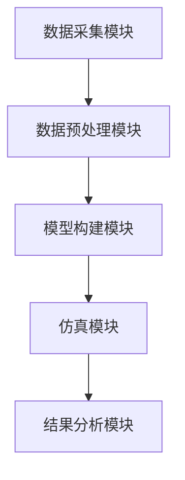
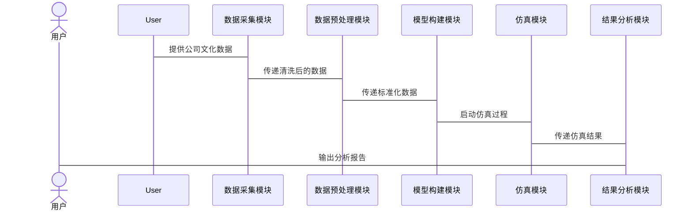

                 

# 多智能体系统在公司文化与创新关系分析中的应用

> 关键词：多智能体系统, 公司文化, 创新, 组织行为学, 系统建模

> 摘要：本文探讨了多智能体系统（MAS）在分析公司文化与创新关系中的应用。通过背景介绍、核心概念、算法原理、系统架构、项目实战等部分，详细阐述了如何利用MAS建模公司文化与创新的动态关系，揭示了公司文化对创新行为的复杂影响。文章最后总结了MAS在公司文化与创新分析中的优势、挑战及未来研究方向。

---

# 第一部分: 多智能体系统与公司文化创新关系的背景介绍

# 第1章: 多智能体系统与公司文化创新关系概述

## 1.1 多智能体系统的定义与特点
### 1.1.1 多智能体系统的定义
多智能体系统（Multi-Agent System, MAS）是由多个智能体（Agent）组成的分布式系统，这些智能体能够自主决策、协作或竞争，以实现特定目标。与传统的集中式系统不同，MAS强调去中心化、分布式计算和智能体之间的动态交互。

### 1.1.2 多智能体系统的核心特点
1. **自主性**：智能体能够独立决策，无需外部控制。
2. **反应性**：智能体能够感知环境并实时调整行为。
3. **协作性**：智能体之间可以通过通信和协作完成复杂任务。
4. **分布性**：系统中的智能体分布在网络中，不存在单点依赖。
5. **动态性**：系统中的交互和环境状态可能随时间变化。

### 1.1.3 多智能体系统与传统单智能体系统的区别
- **决策方式**：MAS强调去中心化决策，单智能体系统依赖中心控制。
- **交互复杂性**：MAS中存在复杂的智能体交互，单智能体系统中不存在。
- **适应性**：MAS能够更好地适应动态环境，单智能体系统适应性较弱。

## 1.2 公司文化与创新的关系
### 1.2.1 公司文化的定义与特征
公司文化是指企业在长期经营中形成的共同价值观、信仰、行为规范和思维方式。它包括显性文化（如规章制度）和隐性文化（如员工行为模式）。

### 1.2.2 创新定义与特征
创新是指企业通过引入新产品、技术、管理方法等实现价值创造的过程。创新可以是局部的（如产品改进）或全局的（如商业模式创新）。

### 1.2.3 公司文化对创新的影响机制
1. **文化对创新行为的促进作用**：
   - 开放、包容的文化促进员工尝试新想法。
   - 鼓励冒险和失败的文化有助于创新。
2. **文化对创新的抑制作用**：
   - 过分保守的文化限制员工的创新意愿。
   - 过分严格的层级结构可能导致创新受阻。

## 1.3 多智能体系统在公司文化与创新关系分析中的应用背景
### 1.3.1 传统公司文化与创新研究的局限性
- 传统研究多依赖问卷调查和统计分析，难以捕捉动态变化。
- 静态分析无法反映公司文化与创新的实时互动。

### 1.3.2 多智能体系统的优势与适用性
- MAS能够模拟公司文化与创新的动态交互。
- MAS可以建模员工行为、文化传播和创新扩散过程。
- MAS提供了一个去中心化的视角，适合分析复杂的组织行为。

### 1.3.3 当前研究现状与未来趋势
- 现有研究多集中于理论建模，缺乏实证验证。
- 未来研究可以结合真实企业数据，优化MAS模型。

---

# 第2章: 多智能体系统的核心概念与联系

## 2.1 多智能体系统的核心概念
### 2.1.1 智能体的定义与分类
智能体是指具有感知环境、自主决策和执行任务能力的实体。根据智能体的智能水平，可以分为：
1. **反应式智能体**：基于当前感知做出反应。
2. **认知式智能体**：具有推理、规划能力。
3. **混合智能体**：结合反应式和认知式智能体的特点。

### 2.1.2 多智能体系统的组成要素
- **智能体**：系统的最小单元，负责完成特定任务。
- **环境**：智能体所处的外部世界，包括物理环境和组织环境。
- **通信机制**：智能体之间交换信息的方式。
- **协作机制**：智能体之间协调行动的规则。

### 2.1.3 多智能体系统的交互机制
- **直接交互**：智能体之间通过共享信息或直接协作。
- **间接交互**：智能体通过环境或中间媒介进行交互。

## 2.2 公司文化与创新关系的核心概念
### 2.2.1 公司文化的构成要素
- **价值观**：企业对事物的评价标准。
- **信仰**：员工对公司目标和使命的共同认知。
- **行为规范**：员工在工作中遵循的具体规则。

### 2.2.2 创新行为的类型
1. **技术创新**：引入新技术或改进现有技术。
2. **产品创新**：开发新产品或服务。
3. **管理创新**：优化管理流程或引入新管理方法。

### 2.2.3 公司文化与创新关系的复杂性
- 公司文化对创新的影响是多维度的。
- 创新行为可以反过来影响公司文化。

## 2.3 多智能体系统与公司文化创新关系的联系
### 2.3.1 多智能体系统模拟公司文化的潜力
- 智能体可以代表员工或部门，模拟文化传播过程。
- 通过智能体之间的交互，可以观察文化对创新的影响。

### 2.3.2 多智能体系统分析创新行为的可能性
- 智能体可以代表创新者，模拟创新扩散过程。
- 通过建模创新行为，可以分析文化对创新的影响。

### 2.3.3 多智能体系统在公司文化与创新关系中的应用价值
- 提供动态视角，捕捉公司文化与创新的实时互动。
- 通过仿真分析，预测文化变化对创新的影响。

---

# 第3章: 多智能体系统在公司文化与创新关系分析中的算法原理

## 3.1 多智能体系统的基本算法
### 3.1.1 分布式计算与多智能体协作算法
- **分布式计算**：任务分解到多个智能体，实现去中心化计算。
- **多智能体协作算法**：智能体之间通过通信和协作完成任务。

### 3.1.2 多智能体系统的通信协议
- **广播通信**：所有智能体接收相同信息。
- **点对点通信**：特定智能体之间交换信息。

### 3.1.3 多智能体系统的协调与冲突解决算法
- **协调算法**：智能体之间通过协商达成一致。
- **冲突解决算法**：通过规则或仲裁解决冲突。

## 3.2 公司文化与创新关系的建模方法
### 3.2.1 公司文化特征的量化方法
- **社会网络分析**：通过员工关系网络反映公司文化。
- **文化指标量化**：将文化特征（如开放性）转化为量化指标。

### 3.2.2 创新行为的建模方法
- **创新扩散模型**：基于社会网络理论，模拟创新在组织中的扩散过程。
- **创新行为规则**：定义智能体的创新决策规则。

### 3.2.3 公司文化与创新关系的动态模型
- **动态系统模型**：将公司文化与创新关系建模为动态系统。
- **反馈机制**：文化变化对创新行为产生反馈，反之亦然。

## 3.3 多智能体系统与公司文化创新关系分析的算法流程
### 3.3.1 数据采集与预处理
- **数据来源**：公司内部数据（如员工行为记录）、外部数据（如行业趋势）。
- **数据预处理**：清洗、归一化、特征提取。

### 3.3.2 智能体行为规则的设计
- **行为规则**：定义智能体在特定文化环境下的创新行为。
- **规则表示**：使用条件语句、逻辑表达式等表示行为规则。

### 3.3.3 系统仿真与结果分析
- **仿真过程**：运行MAS，观察文化与创新的动态关系。
- **结果分析**：通过可视化工具分析仿真结果，提取文化对创新的影响规律。

---

# 第4章: 多智能体系统与公司文化创新关系分析的数学模型

## 4.1 多智能体系统的数学模型
### 4.1.1 多智能体系统的状态表示
- **状态空间**：智能体的状态可以用向量表示。
- **状态转移**：智能体的状态随时间变化，可以用马尔可夫链描述。

### 4.1.2 多智能体系统的通信模型
- **信息传递**：智能体之间通过消息传递信息。
- **信息编码**：消息可以是数值、符号或语义信息。

### 4.1.3 多智能体系统的协作模型
- **协作规则**：定义智能体协作的方式和目标。
- **协作收益**：协作带来的创新成果可以用效用函数表示。

## 4.2 公司文化与创新关系的数学模型
### 4.2.1 公司文化特征的数学表示
- **文化指标**：可以用向量表示，每个分量代表一个文化特征。
- **文化传播**：文化特征在智能体之间传播可以用扩散方程描述。

### 4.2.2 创新行为的数学模型
- **创新概率**：智能体在特定文化环境下创新的概率可以用概率论描述。
- **创新扩散**：创新行为在组织中的扩散可以用图论模型描述。

### 4.2.3 公司文化与创新关系的动态方程
- **动态方程**：文化与创新的关系可以用微分方程或差分方程描述。
- **参数估计**：通过数据拟合确定模型参数。

---

# 第5章: 多智能体系统与公司文化创新关系分析的系统架构

## 5.1 系统功能设计
### 5.1.1 问题场景介绍
- **目标**：分析公司文化对创新行为的影响。
- **输入**：公司文化数据、员工行为数据。
- **输出**：文化对创新的影响分析报告。

### 5.1.2 系统功能模块
1. **数据采集模块**：采集公司文化与创新相关数据。
2. **数据预处理模块**：清洗和标准化数据。
3. **模型构建模块**：建立MAS模型。
4. **仿真模块**：运行仿真，分析文化对创新的影响。
5. **结果分析模块**：生成分析报告和可视化结果。

## 5.2 系统架构设计
### 5.2.1 系统架构图

### 5.2.2 系统接口设计
- **输入接口**：接收公司文化数据和员工行为数据。
- **输出接口**：输出分析报告和可视化结果。

### 5.2.3 系统交互设计

---

# 第6章: 项目实战

## 6.1 环境安装与配置
### 6.1.1 环境要求
- **操作系统**：Windows 10 或更高版本，或 Linux 系统。
- **编程语言**：Python 3.8 或更高版本。
- **依赖库**：安装 `networkx`, `matplotlib`, `numpy`, `pymo

