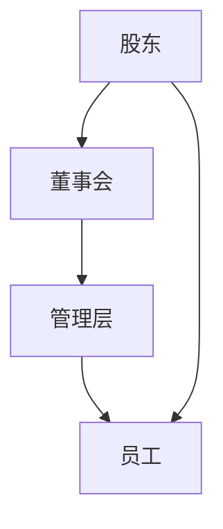
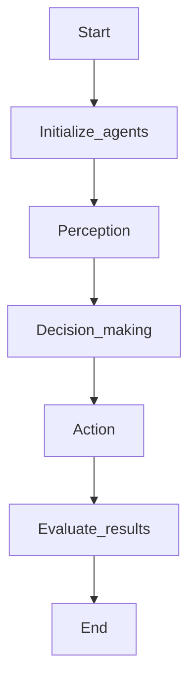
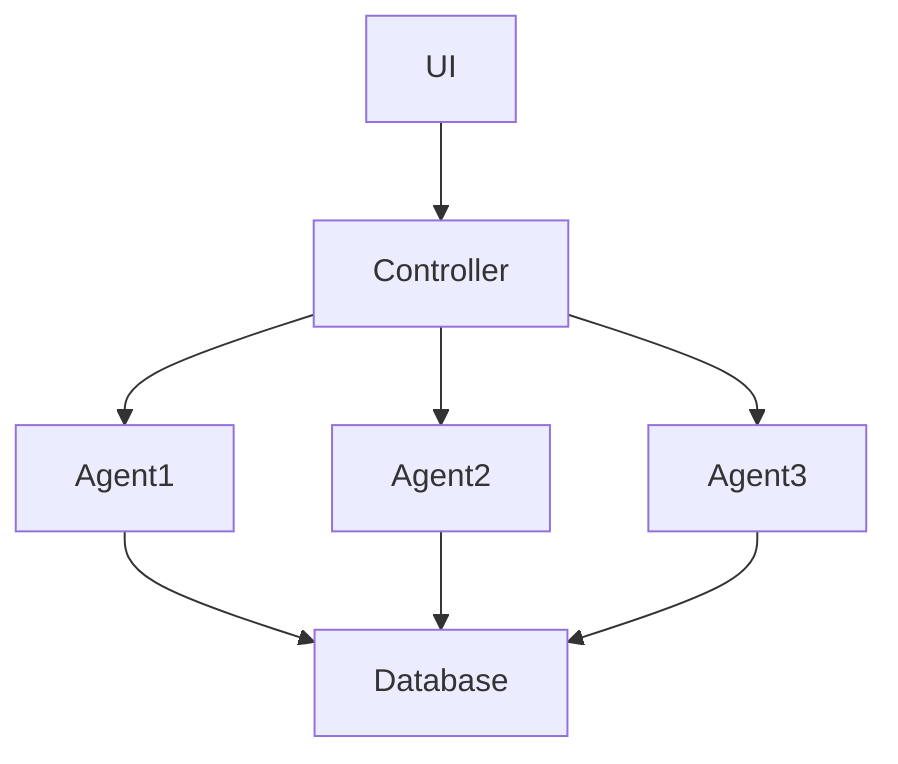
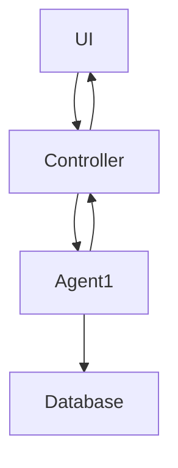

                 


# 多智能体系统在公司治理评估中的应用

## 关键词：多智能体系统、公司治理、评估模型、协作机制、动态分析

## 摘要：  
多智能体系统（Multi-Agent Systems, MAS）作为一种分布式计算范式，近年来在多个领域得到了广泛应用。本文探讨了MAS在公司治理评估中的应用，分析了其在多维度评估中的优势和挑战。通过构建 MAS 模型，结合实际案例，展示了其在公司治理动态分析和协作优化中的潜力。文章还详细介绍了 MAS 的核心算法和系统架构，为实际应用提供了理论基础和实践指导。

---

# 第1章: 多智能体系统与公司治理评估概述

## 1.1 多智能体系统的基本概念

### 1.1.1 多智能体系统的定义与特点  
多智能体系统是由多个智能体（Agent）组成的分布式系统，智能体是能够感知环境、自主决策、协作完成任务的实体。MAS 的特点包括：  
1. **分布式性**：智能体独立运行，无中央控制节点。  
2. **协作性**：智能体之间通过通信和协商完成共同目标。  
3. **动态性**：系统环境和智能体状态实时变化。  
4. **自主性**：智能体具备自主决策能力。  

### 1.1.2 多智能体系统的核心要素  
- **智能体**：具备感知、决策、执行能力的实体。  
- **通信机制**：智能体之间交换信息的方式。  
- **协作协议**：定义智能体之间的任务分配与协调规则。  
- **环境模型**：描述智能体所处的外部环境。  

### 1.1.3 多智能体系统与公司治理的关系  
公司治理涉及股东、董事会、管理层和员工等多个角色，MAS 的协作性和动态性与公司治理的多维度特性高度契合。

---

## 1.2 公司治理评估的背景与挑战

### 1.2.1 公司治理的基本概念  
公司治理是通过公司章程、制度和机制确保公司有效运作和合规性的管理活动。

### 1.2.2 现有公司治理评估方法的局限性  
传统评估方法通常依赖静态指标，难以捕捉公司治理的动态变化和多方协作关系。

### 1.2.3 多智能体系统在公司治理评估中的优势  
MAS 可以通过模拟多方协作关系，动态评估公司治理的效率和效果。

---

## 1.3 多智能体系统在公司治理评估中的应用前景

### 1.3.1 应用领域的拓展  
- **风险管理**：通过 MAS 模型评估公司风险敞口。  
- **决策优化**：优化公司治理中的决策流程。  
- **合规性分析**：动态监控公司是否符合监管要求。  

### 1.3.2 多智能体系统在公司治理评估中的潜在价值  
MAS 可以提供实时、动态的评估结果，帮助公司更好地应对内外部挑战。

### 1.3.3 未来发展趋势  
随着人工智能和大数据技术的发展，MAS 在公司治理中的应用将更加广泛和深入。

---

# 第2章: 多智能体系统的核心概念与联系

## 2.1 多智能体系统的原理

### 2.1.1 分布式计算与协作机制  
MAS 通过分布式计算实现智能体之间的协作，避免了单点故障和信息孤岛问题。

### 2.1.2 多智能体系统与公司治理评估的核心联系  
- MAS 的协作性与公司治理的多维度性高度契合。  
- MAS 的动态性适应公司治理的实时性需求。  

### 2.1.3 多智能体系统的任务分配与协调  
通过协商算法和协调算法，MAS 可以实现智能体之间的任务分配和协作优化。

---

## 2.2 多智能体系统的核心要素对比

### 2.2.1 实体关系图（ER图）分析  
以下是公司治理中的实体关系图：  



### 2.2.2 算法流程图  
以下是 MAS 的算法流程图：  



---

## 2.3 多智能体系统的核心要素对比

### 2.3.1 多智能体系统的协作性与公司治理的多维度性  
通过协作机制，MAS 可以同时评估公司治理的多个维度。

### 2.3.2 多智能体系统的动态性与公司治理的实时性需求  
MAS 的动态性适应公司治理的实时性需求。

### 2.3.3 多智能体系统的自适应性与公司治理的灵活性要求  
MAS 的自适应性帮助公司治理更好地应对复杂变化。

---

# 第3章: 多智能体系统的算法原理

## 3.1 多智能体系统的通信与协作机制

### 3.1.1 分布式计算的数学模型  
$$\text{ MAS 的通信模型可以用图论表示，其中节点代表智能体，边代表通信关系。}$$

### 3.1.2 协商算法的实现  
协商算法用于智能体之间分配任务和协调行动。以下是协商算法的伪代码：

```python
def协商算法(智能体列表):
    初始化任务分配
    while 未达成一致:
        每个智能体提出自己的任务分配方案
        智能体之间进行通信和协商
        更新任务分配方案
    返回最终任务分配方案
```

---

## 3.2 多智能体系统的协作机制

### 3.2.1 协调算法的实现  
以下是协调算法的实现：

```python
def协调算法(智能体列表):
    初始化协调目标
    while 未达成协调:
        每个智能体汇报当前状态
        计算协调方案
        智能体执行协调方案
    返回协调结果
```

### 3.2.2 协调算法的数学模型  
$$\text{ 协调算法的目标是最小化冲突，最大化整体收益。}$$

---

## 3.3 多智能体系统的动态分析

### 3.3.1 动态分析的数学模型  
$$\text{ 动态分析模型可以用微分方程表示，描述系统状态的变化。}$$

### 3.3.2 动态分析的实现  
以下是动态分析的实现：

```python
def动态分析(时间范围):
    初始化系统状态
    for 时间 in 时间范围:
        更新智能体状态
        计算系统整体状态
    返回系统动态分析结果
```

---

# 第4章: 多智能体系统的系统分析与架构设计

## 4.1 系统分析

### 4.1.1 项目背景介绍  
本项目旨在通过 MAS 实现公司治理评估的动态分析和协作优化。

### 4.1.2 系统功能设计  
系统功能包括：  
1. 智能体管理：定义智能体及其属性。  
2. 通信管理：实现智能体之间的通信。  
3. 协商与协调：实现任务分配和协作优化。  

### 4.1.3 系统架构设计  
以下是系统架构设计：



---

## 4.2 系统架构设计

### 4.2.1 系统架构的详细设计  
系统架构包括用户界面（UI）、控制器（Controller）和多个智能体（Agent）。

### 4.2.2 系统接口设计  
系统接口包括：  
1. 用户输入接口。  
2. 智能体通信接口。  
3. 数据库接口。  

---

## 4.3 系统交互设计

### 4.3.1 系统交互的流程图  
以下是系统交互的流程图：



---

# 第5章: 多智能体系统的项目实战

## 5.1 项目实战

### 5.1.1 环境安装  
需要安装 Python 和相关库，如 `networkx` 和 `matplotlib`。

### 5.1.2 核心代码实现  
以下是核心代码实现：

```python
import networkx as nx
import matplotlib.pyplot as plt

def绘制网络图():
    G = nx.DiGraph()
    G.add_node("股东")
    G.add_node("董事会")
    G.add_node("管理层")
    G.add_node("员工")
    G.add_edge("股东", "董事会")
    G.add_edge("董事会", "管理层")
    G.add_edge("管理层", "员工")
    nx.draw(G, node_size=1500, node_color="lightblue", edge_color="red")
    plt.show()

绘制网络图()
```

---

## 5.2 代码应用解读与分析

### 5.2.1 代码实现的详细解读  
上述代码实现了公司治理中的实体关系图，展示了智能体之间的关系。

### 5.2.2 代码实现的分析  
通过网络图，可以直观地看到公司治理中的多方关系。

---

## 5.3 实际案例分析

### 5.3.1 案例介绍  
通过 MAS 模型评估某公司的治理结构。

### 5.3.2 案例分析  
分析治理结构中的协作关系和效率。

### 5.3.3 案例总结  
总结 MAS 在公司治理评估中的优势和应用价值。

---

# 第6章: 总结与展望

## 6.1 总结

### 6.1.1 项目经验总结  
通过 MAS 实现公司治理评估的优势和挑战。

### 6.1.2 项目成果展示  
展示 MAS 在公司治理评估中的实际应用效果。

---

## 6.2 未来展望

### 6.2.1 未来研究方向  
探索 MAS 在公司治理评估中的更广泛应用。

### 6.2.2 未来技术发展  
随着人工智能的进步，MAS 在公司治理中的应用将更加智能化和高效化。

---

## 6.3 最佳实践 tips

### 6.3.1 项目实施中的注意事项  
确保智能体之间的通信和协作机制设计合理。

### 6.3.2 代码实现中的注意事项  
注意智能体之间的通信和协作算法的优化。

### 6.3.3 系统维护中的注意事项  
定期更新系统以适应公司治理的动态变化。

---

## 6.4 拓展阅读

### 6.4.1 推荐书籍  
- 《Multi-Agent Systems: Algorithmic, Complexity, and Synthesis》
- 《Agent-Based Modeling and Simulation》

### 6.4.2 推荐文章  
- "Multi-Agent Systems for Business Process Management"
- "Agent-Based Models for Organizational Analysis"

---

## 结语  
多智能体系统为公司治理评估提供了新的思路和方法，通过 MAS 的应用，可以实现公司治理的动态分析和协作优化，为公司治理的高效运作提供了有力支持。未来，随着人工智能技术的不断发展，MAS 在公司治理中的应用将更加广泛和深入。

