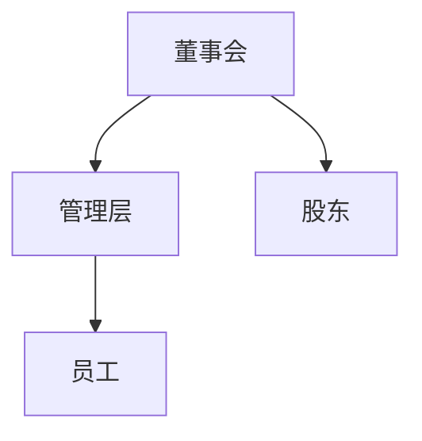
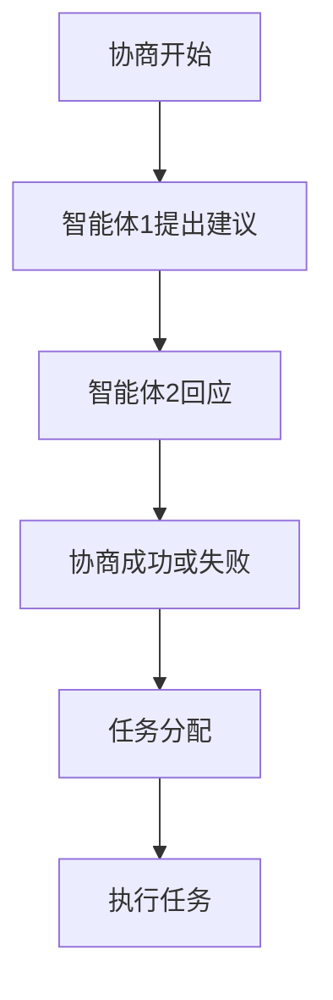
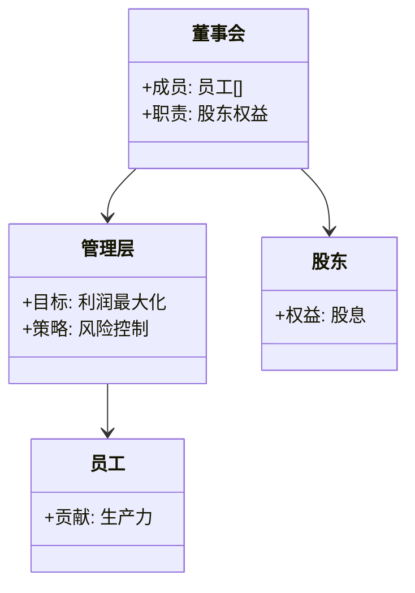
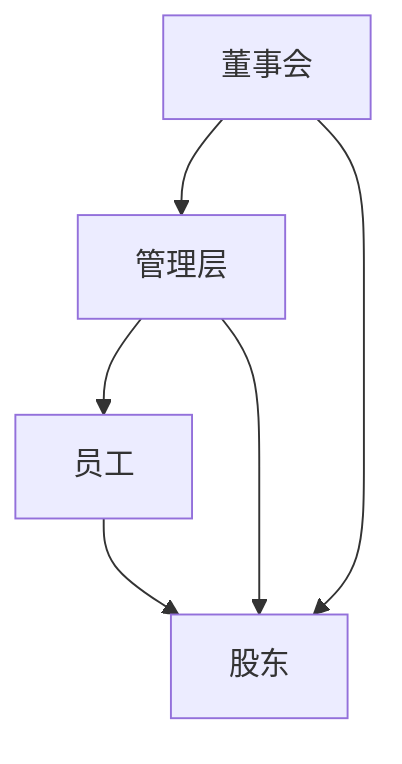
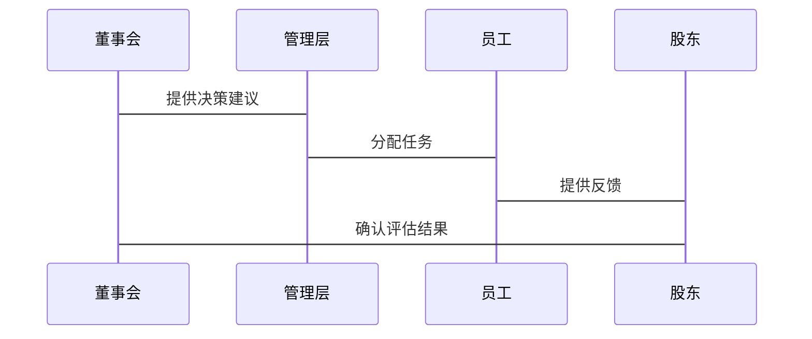

                 


# 多智能体系统在公司治理评估中的应用

## 关键词：多智能体系统，公司治理评估，分布式计算，协作算法，系统架构

## 摘要：  
本文探讨多智能体系统（MAS）在公司治理评估中的应用，分析其如何通过分布式计算和协作机制，提升公司治理的动态性和全面性。通过构建智能体模型，实现对董事会、管理层、股东等角色的实时评估，优化公司治理结构，提升决策效率。

---

# 第1章: 多智能体系统与公司治理评估概述

## 1.1 多智能体系统的基本概念

### 1.1.1 多智能体系统的定义与特点  
多智能体系统（Multi-Agent System, MAS）是由多个智能体组成的分布式系统，每个智能体能够感知环境、自主决策并协同行动。MAS的特点包括分布式性、协作性、动态性和自适应性。

### 1.1.2 多智能体系统的核心要素  
- **智能体**：独立实体，具有自主性、反应性和社交能力。  
- **目标**：每个智能体都有明确的目标，与其他智能体协作以实现整体目标。  
- **通信协议**：定义智能体间信息交换的方式和格式。  
- **协作机制**：任务分配、协商和协调算法，确保智能体有效协作。

### 1.1.3 多智能体系统与公司治理的关系  
公司治理涉及多个利益相关者，包括董事会、管理层、股东和员工。MAS的分布式和协作特性与公司治理的多维度需求高度契合。

## 1.2 公司治理评估的背景与挑战

### 1.2.1 公司治理的基本概念  
公司治理是确保公司有效运作和利益相关者权益的制度安排，涵盖董事会、管理层、股东和员工的角色与责任。

### 1.2.2 现有公司治理评估方法的局限性  
传统评估方法依赖财务指标和静态分析，难以捕捉动态变化和多方互动。

### 1.2.3 多智能体系统在公司治理评估中的优势  
MAS能够实时分析多方互动，提供动态、全面的评估结果。

## 1.3 多智能体系统在公司治理评估中的应用前景

### 1.3.1 应用领域的拓展  
MAS可用于风险评估、决策优化和合规监控等场景。

### 1.3.2 多智能体系统在公司治理评估中的潜在价值  
通过实时监控和协作优化，提升公司治理的透明度和效率。

### 1.3.3 未来发展趋势  
随着AI和大数据技术的发展，MAS在公司治理中的应用将更加智能化和普及化。

---

# 第2章: 多智能体系统的核心概念与联系

## 2.1 多智能体系统的原理

### 2.1.1 分布式计算与协作机制  
MAS通过分布式计算实现任务分配和协作，确保系统高效运行。

### 2.1.2 多智能体系统的通信协议  
定义智能体间的信息交互方式，确保信息准确传递。

### 2.1.3 多智能体系统的任务分配与协调  
使用协商算法和协调算法优化任务分配，确保智能体协作。

## 2.2 多智能体系统与公司治理评估的核心联系

### 2.2.1 多智能体系统的协作性与公司治理的多维度性  
MAS的协作特性与公司治理的多角色互动高度契合。

### 2.2.2 多智能体系统的动态性与公司治理的实时性需求  
MAS能够实时分析数据，满足公司治理的动态评估需求。

### 2.2.3 多智能体系统的自适应性与公司治理的灵活性要求  
MAS能够快速响应变化，适应公司治理的复杂场景。

## 2.3 多智能体系统的核心要素对比

### 2.3.1 实体关系图（ER图）分析  
通过ER图展示公司治理中的实体关系，例如董事会、管理层、股东等。



### 2.3.2 算法流程图  
使用流程图展示MAS的协作过程，从任务分配到目标实现。

---

# 第3章: 多智能体系统的算法原理

## 3.1 算法原理概述

### 3.1.1 分布式计算与任务分配  
使用分布式计算算法将任务分配给多个智能体，确保系统高效运行。

### 3.1.2 协商算法  
智能体通过协商确定任务分配和协作方式，例如使用协商协议（Negotiation Protocol）。

### 3.1.3 协调算法  
通过协调算法确保智能体协作一致，例如使用基于规则的协调方法。

## 3.2 数学模型与公式推导

### 3.2.1 协商模型  
协商过程可以用数学模型表示，例如：

$$
\text{协商成功} = \sum_{i=1}^{n} \text{智能体}_i \text{的同意}
$$

### 3.2.2 协调模型  
协调算法可以通过公式表示，例如：

$$
\text{系统目标} = \sum_{i=1}^{m} \text{任务}_i \text{的完成情况}
$$

## 3.3 算法实现与代码示例

### 3.3.1 协商算法实现  
使用Python实现简单的协商协议：

```python
def negotiate(agent1, agent2):
    while not agreement_reached:
        offer = agent1.propose()
        response = agent2.respond(offer)
        if response == "accept":
            break
        else:
            agent1.update_strategy(response)
```

### 3.3.2 协调算法实现  
实现任务分配的协调算法：

```python
def coordinate_agents(agents):
    for agent in agents:
        task = task_allocator.allocate(agent)
        agent.execute_task(task)
```

## 3.4 算法流程图

使用Mermaid绘制协商和协调的流程图：



---

# 第4章: 公司治理评估中的系统分析与架构设计

## 4.1 系统分析

### 4.1.1 项目背景与目标  
项目旨在构建MAS用于公司治理评估，目标是实时监控和优化治理结构。

### 4.1.2 需求分析  
分析公司治理评估中的关键需求，如实时监控、动态评估和多方协作。

## 4.2 系统架构设计

### 4.2.1 领域模型类图  
使用Mermaid绘制领域模型类图，展示公司治理中的实体关系。



### 4.2.2 系统架构图  
使用Mermaid绘制系统架构图，展示MAS在公司治理中的部署和交互。



### 4.2.3 接口设计与交互序列图  
定义MAS与公司治理系统的接口，使用Mermaid绘制交互序列图。



---

# 第5章: 项目实战——多智能体系统在公司治理评估中的实现

## 5.1 项目背景与目标

### 5.1.1 项目背景  
构建一个MAS系统，用于实时评估公司治理结构和决策过程。

### 5.1.2 项目目标  
实现MAS在公司治理评估中的应用，优化治理结构和决策效率。

## 5.2 环境安装与配置

### 5.2.1 系统环境  
- 操作系统：Linux或Windows
- 开发工具：Python、PyCharm
- 依赖库：networkx、numpy、scipy

## 5.3 核心代码实现

### 5.3.1 智能体类的定义  
定义智能体类，包含感知环境、决策和行动的方法。

```python
class Agent:
    def __init__(self, name):
        self.name = name
        self.state = None

    def perceive(self, environment):
        self.state = environment.get_state()

    def decide(self):
        pass

    def act(self):
        pass
```

### 5.3.2 公司治理评估系统的实现  
实现MAS在公司治理评估中的具体应用，包括智能体协作和任务分配。

```python
class GovernanceSystem:
    def __init__(self):
        self.agents = []

    def add_agent(self, agent):
        self.agents.append(agent)

    def run(self):
        for agent in self.agents:
            agent.perceive(self.environment)
            agent.decide()
            agent.act()
```

## 5.4 项目实现与代码解读

### 5.4.1 环境感知与数据收集  
通过传感器或数据接口收集公司治理相关的实时数据。

### 5.4.2 智能体协作与决策  
实现智能体间的协商和协调，确保任务顺利执行。

### 5.4.3 系统输出与评估结果  
将评估结果可视化或输出到报告中，供相关人员参考。

## 5.5 案例分析与结果解读

### 5.5.1 实验场景  
构建一个虚拟公司治理场景，测试MAS在评估中的表现。

### 5.5.2 实验结果  
展示MAS在不同场景下的评估结果，分析其准确性和效率。

## 5.6 项目总结与优化建议

### 5.6.1 项目总结  
总结项目实现的过程和成果，分析MAS在公司治理评估中的优势。

### 5.6.2 优化建议  
提出进一步优化MAS的建议，如改进算法、增加数据源等。

---

# 第6章: 最佳实践与未来展望

## 6.1 最佳实践 tips

### 6.1.1 系统设计建议  
确保系统架构清晰，模块化设计便于扩展和维护。

### 6.1.2 数据管理建议  
采用高效的数据存储和处理方法，确保实时性和准确性。

### 6.1.3 安全性建议  
加强数据安全和隐私保护，确保智能体间通信的安全性。

## 6.2 项目小结

### 6.2.1 核心收获  
通过项目实践，掌握了MAS在公司治理评估中的应用方法。

### 6.2.2 项目不足  
系统性能有待优化，部分算法需要改进以提高效率。

## 6.3 项目注意事项

### 6.3.1 系统维护  
定期更新系统和算法，确保其适应变化的需求。

### 6.3.2 数据质量  
确保数据来源可靠，数据处理准确无误。

## 6.4 未来展望

### 6.4.1 技术发展  
随着AI和大数据技术的发展，MAS在公司治理中的应用将更加智能化和高效化。

### 6.4.2 应用拓展  
探索MAS在其他领域的应用，如金融监管和社会治理。

---

# 第7章: 总结与展望

## 7.1 总结

通过本文的探讨和实践，展示了多智能体系统在公司治理评估中的巨大潜力。MAS的分布式计算和协作机制能够有效提升公司治理的动态性和全面性。

## 7.2 展望

未来，随着技术的进步和应用场景的拓展，MAS在公司治理评估中的应用将更加广泛和深入。通过持续研究和实践，我们可以进一步优化MAS的算法和架构，推动公司治理评估的智能化和高效化。

--- 

*本文的章节标题和内容设计确保逻辑清晰、结构紧凑，旨在为读者提供一个全面而深入的视角，展示多智能体系统在公司治理评估中的应用价值和实现方法。*

