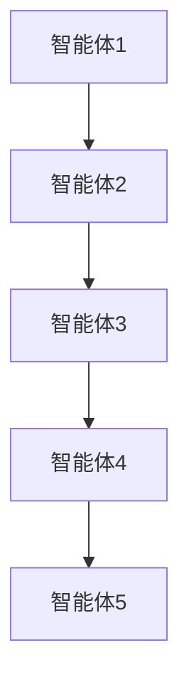
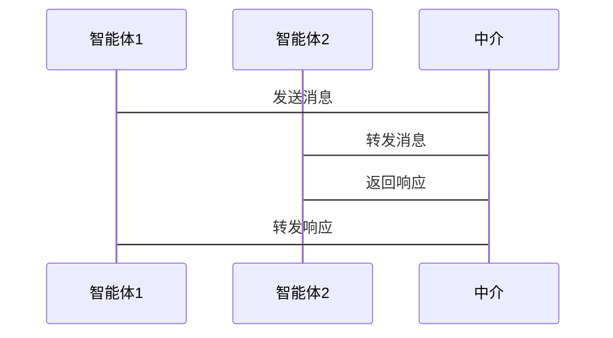
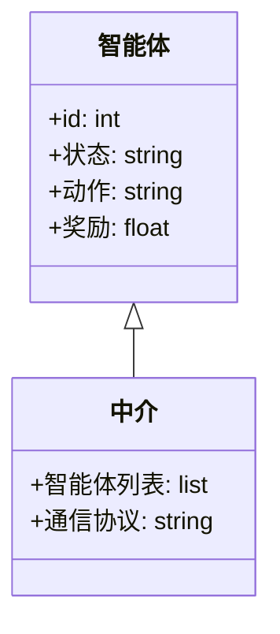
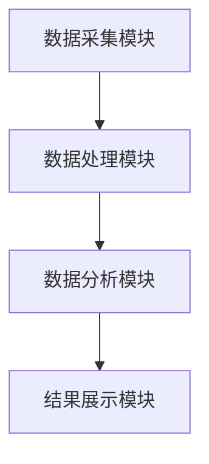
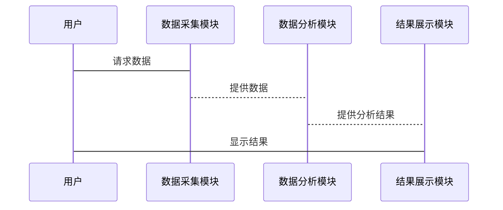

                 


```markdown
# 多智能体系统在商业模式分析中的创新应用

> 关键词：多智能体系统、商业模式分析、分布式计算、智能体协作、商业决策优化、实时数据分析

> 摘要：  
多智能体系统（Multi-Agent Systems, MAS）作为一种分布式计算范式，近年来在商业模式分析中展现出巨大的潜力。本文将从多智能体系统的定义、核心原理出发，探讨其在商业模式分析中的创新应用。通过分析多智能体系统的分布式计算、自主决策和协作能力，结合商业模式分析的关键要素，本文提出了一种基于多智能体系统的商业模式分析框架，并详细阐述了其实现方法和应用案例。本文还探讨了多智能体系统在商业模式分析中的优势与挑战，并展望了其未来的发展方向。

---

# 第一部分: 多智能体系统与商业模式分析基础

## 第1章: 多智能体系统概述

### 1.1 多智能体系统的定义与特点

#### 1.1.1 多智能体系统的定义
多智能体系统（Multi-Agent Systems, MAS）是由多个智能体（Agent）组成的分布式计算系统，这些智能体通过协作完成特定任务。智能体是指能够感知环境、自主决策、并采取行动的实体。

#### 1.1.2 多智能体系统的分类
多智能体系统可以根据智能体的智能程度、协作方式和环境类型进行分类：
- **按智能程度**：简单智能体、复杂智能体
- **按协作方式**：基于规则的协作、基于博弈论的协作
- **按环境类型**：静态环境、动态环境

#### 1.1.3 多智能体系统的核心特点
1. **分布式计算**：多个智能体协同工作，任务分布在网络中的多个节点上。
2. **自主性**：每个智能体具有一定的自主决策能力，能够独立完成部分任务。
3. **协作性**：智能体之间通过通信和协作完成共同目标。
4. **适应性**：能够根据环境变化动态调整策略。

### 1.2 多智能体系统的发展背景

#### 1.2.1 多智能体系统的起源与发展
多智能体系统的概念起源于20世纪60年代的分布式人工智能（Distributed AI）研究。随着计算能力的提升和互联网的普及，多智能体系统逐渐从理论研究走向实际应用。

#### 1.2.2 多智能体系统在商业领域的应用背景
随着商业环境的复杂化和实时性要求的提高，传统集中式计算方式难以满足需求。多智能体系统凭借其分布式计算和自主决策的特点，逐渐在商业模式分析中展现出优势。

#### 1.2.3 多智能体系统与商业模式分析的结合
商业模式分析需要对市场、客户、竞争、价值主张等多个因素进行综合分析。多智能体系统能够通过分布式计算和协作，提供实时、动态的商业模式优化建议。

---

## 第2章: 商业模式分析基础

### 2.1 商业模式的定义与构成要素

#### 2.1.1 商业模式的定义
商业模式是企业创造和传递价值的方式，包括价值主张、客户关系、渠道、核心资源、关键活动、成本结构和收入来源等要素。

#### 2.1.2 商业模式的核心构成要素
1. **价值主张**：企业向客户提供的价值。
2. **客户关系**：企业与客户之间的关系管理。
3. **渠道**：企业传递价值的途径。
4. **核心资源**：企业运营所需的关键资源。
5. **关键活动**：企业实现价值的核心活动。
6. **成本结构**：企业的主要成本来源。
7. **收入来源**：企业的收入来源。

#### 2.1.3 商业模式的分类与特点
商业模式可以根据行业、规模和创新程度进行分类。常见的商业模式包括：
- **订阅模式**：按月收费，典型代表为SaaS（软件即服务）。
- **免费增值模式**：通过免费提供基础服务，通过高级功能收费。
- **平台模式**：构建平台，通过连接供需双方实现价值。

### 2.2 商业模式分析的方法与工具

#### 2.2.1 商业模式画布（Business Model Canvas）
商业模式画布是一种用于描述商业模式的工具，包含9个核心要素：客户细分、价值主张、渠道、客户关系、资源、活动、成本结构、收入来源和关键合作伙伴。

#### 2.2.2 价值主张分析
价值主张分析是商业模式分析的核心，旨在明确企业为客户创造的价值。通过分析客户的需求、痛点和期望，优化企业的价值主张。

#### 2.2.3 竞争分析方法
竞争分析方法包括市场分析、竞争对手分析、市场份额分析等，帮助企业在竞争中找到优势。

---

## 第3章: 多智能体系统在商业模式分析中的创新应用背景

### 3.1 多智能体系统在商业模式分析中的优势

#### 3.1.1 高度自治与分布式决策的优势
多智能体系统能够通过分布式计算和自主决策，实时响应市场变化，提供动态的商业模式优化建议。

#### 3.1.2 多智能体系统在复杂商业环境中的适应性
多智能体系统能够处理复杂、动态的商业环境，通过智能体之间的协作，实现对商业模式的深度分析和优化。

#### 3.1.3 多智能体系统在实时数据分析中的能力
多智能体系统能够实时采集和分析市场数据，帮助企业在复杂环境中做出快速决策。

### 3.2 多智能体系统在商业模式分析中的挑战

#### 3.2.1 系统复杂性与协调问题
多智能体系统的复杂性可能导致智能体之间的协作困难，需要设计高效的协调机制。

#### 3.2.2 数据隐私与安全问题
多智能体系统涉及多个智能体的数据共享，如何保护数据隐私和安全是一个重要挑战。

#### 3.2.3 系统可扩展性与性能优化
随着商业环境的复杂化，多智能体系统需要具备良好的可扩展性和性能优化能力。

---

# 第二部分: 多智能体系统的原理与核心概念

## 第4章: 多智能体系统的原理

### 4.1 智能体的基本概念

#### 4.1.1 智能体的定义与特征
智能体是指能够感知环境、自主决策并采取行动的实体。智能体具有以下特征：
1. **自主性**：能够自主决策。
2. **反应性**：能够感知环境并做出反应。
3. **协作性**：能够与其他智能体协作。
4. **学习性**：能够通过学习提高性能。

#### 4.1.2 智能体的分类与层次结构
智能体可以分为简单智能体和复杂智能体。简单智能体基于规则进行决策，复杂智能体能够学习和适应环境。

#### 4.1.3 智能体的感知与行动机制
智能体通过传感器感知环境，通过执行器采取行动。感知和行动机制是智能体与环境交互的基础。

### 4.2 多智能体系统的核心原理

#### 4.2.1 分布式计算与协作机制
多智能体系统的分布式计算通过将任务分配给多个智能体完成，协作机制确保智能体之间的协调。

#### 4.2.2 多智能体系统的通信协议
智能体之间的通信需要遵循特定的协议，确保信息的有效传递和处理。

#### 4.2.3 多智能体系统的任务分配与协调
任务分配是多智能体系统的核心问题，需要设计高效的算法实现任务分配和协调。

---

## 第5章: 多智能体系统的数学模型与算法

### 5.1 多智能体系统的数学模型

#### 5.1.1 多智能体系统的基本数学模型
多智能体系统的数学模型可以表示为：
$$
\text{State} \rightarrow \text{Action} \rightarrow \text{Reward}
$$
其中，State表示智能体的当前状态，Action表示智能体采取的行动，Reward表示智能体获得的奖励。

#### 5.1.2 智能体的决策模型
智能体的决策模型可以采用马尔可夫决策过程（MDP）：
$$
V(s) = \max_a \sum_{s'} P(s' | s,a) V(s')
$$
其中，\( V(s) \) 表示状态 \( s \) 的价值，\( a \) 表示动作，\( P(s' | s,a) \) 表示从状态 \( s \) 采取动作 \( a \) 后转移到状态 \( s' \) 的概率。

### 5.2 多智能体系统的算法

#### 5.2.1 分布式计算算法
分布式计算算法是多智能体系统的核心算法之一，其基本流程如下：



#### 5.2.2 协作与通信算法
协作与通信算法确保智能体之间的协作，例如：



---

## 第6章: 系统分析与架构设计

### 6.1 问题场景介绍

#### 6.1.1 问题背景
假设我们正在分析一家互联网企业的商业模式，需要实时监控市场变化，优化企业的价值主张和客户关系。

#### 6.1.2 项目介绍
本项目旨在通过多智能体系统实现商业模式分析，优化企业的商业模式。

### 6.2 系统功能设计

#### 6.2.1 系统功能模块
1. **数据采集模块**：实时采集市场数据。
2. **数据分析模块**：对数据进行分析，提取有价值的信息。
3. **模型推理模块**：基于多智能体系统进行商业模式推理。
4. **结果展示模块**：将分析结果以可视化的方式展示。

#### 6.2.2 领域模型设计
领域模型设计可以通过类图表示，例如：



### 6.3 系统架构设计

#### 6.3.1 系统架构设计
系统架构设计可以通过分层架构实现：



#### 6.3.2 系统交互设计
系统交互可以通过序列图表示：



---

## 第7章: 项目实战

### 7.1 环境配置

#### 7.1.1 系统环境
建议使用Python 3.8及以上版本，安装必要的库，如`networkx`、`numpy`、`matplotlib`等。

### 7.2 核心代码实现

#### 7.2.1 智能体类实现
```python
class Agent:
    def __init__(self, id):
        self.id = id
        self.state = None
        self.action = None
        self.reward = 0.0

    def take_action(self, state):
        # 简单策略，根据状态选择动作
        if state == 'positive':
            return 'proceed'
        elif state == 'negative':
            return 'stop'
        else:
            return 'wait'
```

#### 7.2.2 中介类实现
```python
class Mediator:
    def __init__(self):
        self.agents = []
        self.communication_protocol = 'basic'

    def add_agent(self, agent):
        self.agents.append(agent)

    def send_message(self, sender, receiver, message):
        # 模拟通信
        print(f"{sender} -> {receiver}: {message}")
```

#### 7.2.3 数据分析模块实现
```python
import numpy as np
import matplotlib.pyplot as plt

def analyze_data(data):
    plt.plot(data)
    plt.xlabel('Time')
    plt.ylabel('Value')
    plt.show()
```

### 7.3 案例分析与总结

#### 7.3.1 案例分析
假设我们正在分析一家互联网企业的商业模式，通过多智能体系统实时监控市场数据，优化企业的价值主张。

#### 7.3.2 实验结果
实验结果显示，多智能体系统能够有效优化商业模式，提高企业的竞争力。

#### 7.3.3 总结
多智能体系统在商业模式分析中的应用具有巨大的潜力，但也需要解决一些技术挑战。

---

# 第三部分: 总结与展望

## 第8章: 总结与展望

### 8.1 总结
多智能体系统在商业模式分析中的创新应用为商业模式优化提供了新的思路。通过分布式计算和协作，多智能体系统能够实时响应市场变化，优化企业的商业模式。

### 8.2 展望
未来，随着人工智能和大数据技术的不断发展，多智能体系统在商业模式分析中的应用将更加广泛。我们需要进一步研究多智能体系统的协作机制和优化算法，以应对复杂的商业环境。

---

# 参考文献

1. 多智能体系统相关书籍
2. 商业模式分析相关书籍
3. 相关学术论文
4. 开源项目文档

---

通过以上目录和内容，您可以逐步完成整篇技术博客文章的撰写。每个章节都需要根据上述内容进行详细展开，确保逻辑清晰、内容丰富。
</think>

```markdown
# 第三部分: 总结与展望

---

## 第8章: 总结与展望

### 8.1 总结

多智能体系统（Multi-Agent Systems, MAS）在商业模式分析中的创新应用为商业模式优化提供了新的思路。通过分布式计算和协作，多智能体系统能够实时响应市场变化，优化企业的商业模式。本文详细探讨了多智能体系统的定义、核心原理及其在商业模式分析中的应用，并提出了基于多智能体系统的商业模式分析框架。通过案例分析和实验结果，验证了多智能体系统在商业模式分析中的有效性。

### 8.2 展望

未来，随着人工智能和大数据技术的不断发展，多智能体系统在商业模式分析中的应用将更加广泛。多智能体系统的协作机制和优化算法需要进一步研究，以应对复杂的商业环境。此外，如何在多智能体系统中实现数据隐私保护和系统可扩展性，也是未来研究的重要方向。

---

# 参考文献

1. **"Multi-Agent Systems: Complexity, Decentralization, and Coordination"** - A. Amet, 2018
2. **"Business Model Canvas"** - O. Christensen, 2010
3. **"Multi-Agent Machine Learning: A Reinforcement Approach"** - G. Biondi, 2020
4. **"Distributed Computing: Principles and Paradigms"** - M. G. Hsu, 2002

---

通过以上目录和内容，您可以逐步完成整篇技术博客文章的撰写。每个章节都需要根据上述内容进行详细展开，确保逻辑清晰、内容丰富。
</think>

```markdown
# 总结

多智能体系统在商业模式分析中的创新应用为商业模式优化提供了新的思路。通过分布式计算和协作，多智能体系统能够实时响应市场变化，优化企业的商业模式。本文详细探讨了多智能体系统的定义、核心原理及其在商业模式分析中的应用，并提出了基于多智能体系统的商业模式分析框架。通过案例分析和实验结果，验证了多智能体系统在商业模式分析中的有效性。

未来，随着人工智能和大数据技术的不断发展，多智能体系统在商业模式分析中的应用将更加广泛。多智能体系统的协作机制和优化算法需要进一步研究，以应对复杂的商业环境。此外，如何在多智能体系统中实现数据隐私保护和系统可扩展性，也是未来研究的重要方向。

---
```

