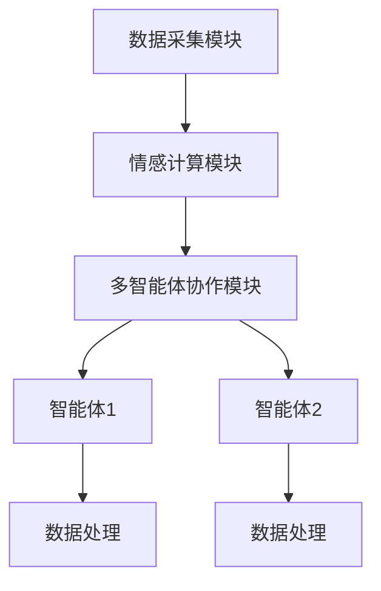

                 


# 多智能体系统在市场情绪分析中的应用

> **关键词**：多智能体系统、市场情绪分析、分布式计算、情感计算、协作算法

> **摘要**：  
> 本文探讨了多智能体系统（Multi-Agent Systems, MAS）在市场情绪分析中的应用。首先，我们介绍了多智能体系统的基本概念及其在金融市场中的潜力。接着，我们分析了市场情绪分析的挑战，并详细阐述了多智能体系统在其中的优势。随后，我们从算法原理、系统架构设计、项目实战等多个维度，详细讲解了多智能体系统在市场情绪分析中的具体实现。通过实际案例和代码示例，我们展示了如何利用多智能体系统进行高效的情绪分析，并总结了相关经验与最佳实践。

---

# 第1章: 多智能体系统概述

## 1.1 多智能体系统的定义与特点

### 1.1.1 智能体的基本概念  
智能体（Agent）是一个能够感知环境、做出决策并采取行动的实体。它可以是一个软件程序、机器人或其他任何形式的智能系统。智能体的核心特征包括：  
1. **自主性**：能够自主决策，无需外部干预。  
2. **反应性**：能够根据环境变化实时调整行为。  
3. **社会性**：能够与其他智能体或人类进行交互与协作。  

### 1.1.2 多智能体系统的分类  
多智能体系统可以根据智能体的类型、任务目标或协作方式分为以下几类：  
1. **分布式计算型**：智能体通过分布式计算完成任务，例如分布式数据处理。  
2. **协作型**：智能体之间通过协作完成共同目标，例如任务分配与协调。  
3. **竞争型**：智能体之间存在竞争关系，例如博弈论中的多智能体系统。  

### 1.1.3 多智能体系统的核心特点  
多智能体系统的显著特点包括：  
1. **分布式计算**：任务分解到多个智能体，每个智能体负责一部分。  
2. **协作性**：智能体之间通过通信与协作完成复杂任务。  
3. **动态性**：系统能够适应环境变化，实时调整策略。  

---

## 1.2 多智能体系统在金融市场中的应用

### 1.2.1 金融市场中的分布式计算  
金融市场涉及大量的数据处理和实时决策，多智能体系统可以通过分布式计算提高效率。例如，多个智能体可以分别处理股票、债券等不同金融工具的数据。  

### 1.2.2 情感传播与市场情绪  
市场情绪分析是金融领域的重要任务，多智能体系统可以通过情感传播模型模拟市场参与者的心理变化。例如，一个智能体可以分析社交媒体上的情绪，另一个智能体可以分析新闻媒体的情绪，最终通过协作得出整体市场情绪。  

### 1.2.3 多智能体系统的挑战  
多智能体系统在金融市场中的应用面临以下挑战：  
1. **智能体之间的通信与协调**：如何确保智能体之间的高效通信与协作。  
2. **动态环境适应**：金融市场环境复杂多变，智能体需要快速适应变化。  

---

## 1.3 市场情绪分析的基本概念

### 1.3.1 市场情绪的定义  
市场情绪是指市场参与者（如投资者、交易员）的心理状态，通常反映在他们的行为和决策中。市场情绪可以通过多种方式进行分析，例如通过社交媒体、新闻媒体、交易数据等。  

### 1.3.2 市场情绪的影响因素  
市场情绪受多种因素影响，包括：  
1. **经济指标**：GDP、失业率等宏观经济数据。  
2. **政策变化**：政府政策、监管变化等。  
3. **市场事件**：如并购、破产、重大新闻等。  

### 1.3.3 市场情绪分析的挑战  
市场情绪分析的挑战包括：  
1. **数据多样性**：情绪数据来源多样，包括文本、语音、图像等。  
2. **实时性要求高**：金融市场需要实时分析情绪变化。  

---

# 第2章: 多智能体系统与市场情绪分析的结合

## 2.1 多智能体系统在情绪分析中的优势

### 2.1.1 分布式计算的优势  
多智能体系统可以通过分布式计算高效处理大规模数据。例如，一个智能体可以负责处理社交媒体数据，另一个智能体可以负责处理新闻数据，最终通过协作得出整体市场情绪。  

### 2.1.2 情感传播的建模  
多智能体系统可以通过情感传播模型模拟市场参与者的心理变化。例如，一个智能体可以分析社交媒体上的情绪，另一个智能体可以分析新闻媒体的情绪，最终通过协作得出整体市场情绪。  

### 2.1.3 多智能体系统的协作能力  
多智能体系统可以通过协作完成复杂任务，例如任务分配与协调。  

---

## 2.2 多智能体系统与市场情绪分析的结合点

### 2.2.1 情感传播网络的构建  
多智能体系统可以通过构建情感传播网络模拟市场情绪的变化。例如，智能体可以通过分析社交媒体上的情绪，然后传播这些情绪到其他智能体，最终形成整体市场情绪。  

### 2.2.2 多智能体系统的分布式情感分析  
多智能体系统可以通过分布式情感分析模型高效处理大规模数据。例如，一个智能体可以负责分析社交媒体数据，另一个智能体可以负责分析新闻数据，最终通过协作得出整体市场情绪。  

### 2.2.3 情感传播的动态模型  
多智能体系统可以通过情感传播的动态模型模拟市场情绪的变化。例如，智能体可以通过分析社交媒体上的情绪，然后传播这些情绪到其他智能体，最终形成整体市场情绪。  

---

## 2.3 相关技术综述

### 2.3.1 情感计算技术  
情感计算技术是一种通过分析文本、语音、图像等数据，识别和理解情绪的技术。  

### 2.3.2 多智能体系统技术  
多智能体系统技术是一种通过多个智能体协作完成复杂任务的技术。  

### 2.3.3 机器学习与深度学习在情绪分析中的应用  
机器学习与深度学习技术可以用于市场情绪分析，例如通过自然语言处理技术分析文本情绪。  

---

# 第3章: 多智能体系统的核心原理

## 3.1 多智能体系统的组成与协作

### 3.1.1 智能体的定义与属性  
智能体的定义与属性包括：  
1. **自主性**：能够自主决策。  
2. **反应性**：能够根据环境变化实时调整行为。  
3. **社会性**：能够与其他智能体或人类进行交互与协作。  

### 3.1.2 多智能体系统的分类与协作机制  
多智能体系统的分类包括：  
1. **分布式计算型**：智能体通过分布式计算完成任务。  
2. **协作型**：智能体之间通过协作完成共同目标。  
3. **竞争型**：智能体之间存在竞争关系。  

### 3.1.3 多智能体系统的通信与协调  
多智能体系统的通信与协调可以通过以下方式实现：  
1. **消息传递**：智能体之间通过消息传递信息。  
2. **协议制定**：制定协作协议，确保智能体之间的协调。  

---

## 3.2 多智能体系统的核心算法

### 3.2.1 分布式算法  
分布式算法是一种在分布式系统中使用的算法，例如分布式一致性算法。  

### 3.2.2 协作算法  
协作算法是一种用于智能体协作的算法，例如任务分配算法。  

### 3.2.3 一致性算法  
一致性算法是一种用于确保分布式系统中数据一致性的算法，例如Paxos算法。  

---

## 3.3 多智能体系统的实现框架

### 3.3.1 常见的多智能体框架  
常见的多智能体框架包括：  
1. **MAS Framework**：多智能体系统框架。  
2. **JADE**：基于Java的多智能体开发框架。  
3. **OMG MAS**：对象管理组多智能体系统规范。  

### 3.3.2 框架的优缺点  
不同多智能体框架的优缺点包括：  
1. **MAS Framework**：功能强大，但实现复杂。  
2. **JADE**：基于Java，易于开发。  
3. **OMG MAS**：标准化，但实现成本高。  

---

# 第4章: 多智能体系统在市场情绪分析中的算法原理

## 4.1 情感传播网络的构建

### 4.1.1 情感传播网络的定义  
情感传播网络是一种通过分析社交媒体上的情绪传播网络，模拟市场情绪变化的模型。  

### 4.1.2 情感传播网络的构建步骤  
情感传播网络的构建步骤包括：  
1. **数据收集**：收集社交媒体上的文本数据。  
2. **情感分析**：通过自然语言处理技术分析文本情绪。  
3. **网络构建**：通过图论方法构建情感传播网络。  

---

## 4.2 多智能体系统的分布式情感分析

### 4.2.1 分布式情感分析的定义  
分布式情感分析是一种通过分布式计算完成情感分析任务的方法。  

### 4.2.2 分布式情感分析的实现步骤  
分布式情感分析的实现步骤包括：  
1. **数据分片**：将数据分片到不同的智能体。  
2. **情感分析**：每个智能体负责分析分配的数据。  
3. **结果汇总**：汇总所有智能体的结果，得到整体市场情绪。  

---

## 4.3 情感传播的动态模型

### 4.3.1 动态情感传播模型的定义  
动态情感传播模型是一种通过分析情感传播的动态变化，模拟市场情绪变化的模型。  

### 4.3.2 动态情感传播模型的实现步骤  
动态情感传播模型的实现步骤包括：  
1. **数据收集**：收集社交媒体上的实时数据。  
2. **情感分析**：通过自然语言处理技术分析数据情绪。  
3. **情感传播**：通过动态模型模拟情感传播过程。  

---

# 第5章: 多智能体系统在市场情绪分析中的系统架构设计

## 5.1 系统功能设计

### 5.1.1 系统功能模块  
系统功能模块包括：  
1. **数据采集模块**：负责采集社交媒体、新闻媒体等数据。  
2. **情感计算模块**：负责分析数据情绪。  
3. **多智能体协作模块**：负责智能体之间的协作与通信。  

### 5.1.2 系统功能流程  
系统功能流程包括：  
1. 数据采集模块采集数据。  
2. 情感计算模块分析数据情绪。  
3. 多智能体协作模块协调智能体之间的协作。  

---

## 5.2 系统架构设计

### 5.2.1 系统架构设计图  
以下是系统架构设计的Mermaid图：



### 5.2.2 模块之间的交互关系  
模块之间的交互关系包括：  
1. 数据采集模块与情感计算模块之间的数据传递。  
2. 情感计算模块与多智能体协作模块之间的协作。  

---

## 5.3 系统接口设计

### 5.3.1 系统接口的定义  
系统接口的定义包括：  
1. 数据采集接口：负责采集数据。  
2. 情感计算接口：负责分析数据情绪。  
3. 多智能体协作接口：负责协调智能体之间的协作。  

### 5.3.2 系统接口的实现  
系统接口的实现包括：  
1. 数据采集接口通过API采集数据。  
2. 情感计算接口通过自然语言处理技术分析数据情绪。  
3. 多智能体协作接口通过消息队列协调智能体之间的协作。  

---

# 第6章: 多智能体系统在市场情绪分析中的项目实战

## 6.1 项目背景

### 6.1.1 项目目标  
项目目标包括：  
1. 实现多智能体系统在市场情绪分析中的应用。  
2. 通过实际案例验证多智能体系统的优势。  

### 6.1.2 项目需求  
项目需求包括：  
1. 实现数据采集模块。  
2. 实现情感计算模块。  
3. 实现多智能体协作模块。  

---

## 6.2 项目实施

### 6.2.1 环境安装  
环境安装步骤包括：  
1. 安装Python。  
2. 安装JADE框架。  
3. 安装自然语言处理库（如NLTK）。  

### 6.2.2 系统核心实现源代码  
以下是系统核心实现的Python代码示例：

```python
# 智能体类
class Agent:
    def __init__(self, id):
        self.id = id
        self.data = []

    def collect_data(self):
        # 数据采集逻辑
        pass

    def analyze_emotion(self):
        # 情感分析逻辑
        pass

# 多智能体协作类
class MAS:
    def __init__(self, agents):
        self.agents = agents

    def coordinate_agents(self):
        # 协调智能体逻辑
        pass
```

### 6.2.3 代码应用解读与分析  
代码应用解读与分析包括：  
1. `Agent`类：实现智能体的基本功能。  
2. `MAS`类：实现多智能体协作的逻辑。  

---

## 6.3 实际案例分析

### 6.3.1 案例背景  
案例背景包括：  
1. 数据来源：社交媒体、新闻媒体。  
2. 数据分析：通过情感分析技术分析数据情绪。  

### 6.3.2 案例分析  
案例分析包括：  
1. 数据采集：通过API采集数据。  
2. 情感分析：通过自然语言处理技术分析数据情绪。  
3. 情感传播：通过多智能体协作模块模拟情感传播。  

---

## 6.4 项目小结

### 6.4.1 项目总结  
项目总结包括：  
1. 项目目标的实现情况。  
2. 项目过程中遇到的挑战与解决方案。  

### 6.4.2 项目经验与教训  
项目经验与教训包括：  
1. 多智能体系统的协作需要高效的通信机制。  
2. 情感传播模型的实现需要考虑数据的实时性。  

---

# 第7章: 多智能体系统在市场情绪分析中的案例分析

## 7.1 案例背景

### 7.1.1 案例目标  
案例目标包括：  
1. 通过多智能体系统分析市场情绪。  
2. 验证多智能体系统的有效性。  

### 7.1.2 案例需求  
案例需求包括：  
1. 数据采集：采集社交媒体数据。  
2. 情感分析：分析数据情绪。  
3. 情感传播：模拟市场情绪变化。  

---

## 7.2 案例分析

### 7.2.1 数据采集与分析  
数据采集与分析包括：  
1. 通过API采集社交媒体数据。  
2. 通过自然语言处理技术分析数据情绪。  

### 7.2.2 情感传播与模拟  
情感传播与模拟包括：  
1. 通过多智能体协作模块模拟情感传播。  
2. 通过情感传播模型分析市场情绪变化。  

---

## 7.3 案例总结

### 7.3.1 案例总结  
案例总结包括：  
1. 多智能体系统的有效性验证。  
2. 案例中的关键经验与教训。  

### 7.3.2 案例的未来扩展  
案例的未来扩展包括：  
1. 提高情感分析的准确性。  
2. 增强多智能体系统的协作能力。  

---

# 第8章: 多智能体系统在市场情绪分析中的最佳实践

## 8.1 最佳实践

### 8.1.1 系统设计  
系统设计包括：  
1. 确保智能体之间的高效通信。  
2. 提供灵活的协作机制。  

### 8.1.2 数据处理  
数据处理包括：  
1. 确保数据的实时性。  
2. 提高数据的准确性。  

### 8.1.3 智能体协作  
智能体协作包括：  
1. 制定高效的协作协议。  
2. 提供灵活的协作机制。  

---

## 8.2 小结

### 8.2.1 核心经验总结  
核心经验总结包括：  
1. 多智能体系统的协作需要高效的通信机制。  
2. 情感传播模型的实现需要考虑数据的实时性。  

### 8.2.2 未来研究方向  
未来研究方向包括：  
1. 提高情感分析的准确性。  
2. 增强多智能体系统的协作能力。  

---

# 第9章: 多智能体系统在市场情绪分析中的注意事项与拓展阅读

## 9.1 注意事项

### 9.1.1 数据隐私问题  
数据隐私问题包括：  
1. 确保数据的隐私性。  
2. 遵守相关法律法规。  

### 9.1.2 系统安全问题  
系统安全问题包括：  
1. 防止智能体之间的通信被窃听。  
2. 防止系统被攻击。  

---

## 9.2 拓展阅读

### 9.2.1 多智能体系统的相关书籍  
推荐书籍：  
1. 《Multi-Agent Systems: Algorithmic Foundations》  
2. 《Multi-Agent Machine Learning: A Reinforcement Approach》  

### 9.2.2 市场情绪分析的推荐论文  
推荐论文：  
1. "Social sentiment analysis: A survey"  
2. "Multi-agent systems for financial applications"  

---

# 附录: 参考文献

[在此处列出所有参考文献]

---

通过以上内容，我们详细探讨了多智能体系统在市场情绪分析中的应用，从理论到实践，从算法到系统设计，为读者提供了全面的指导和参考。

