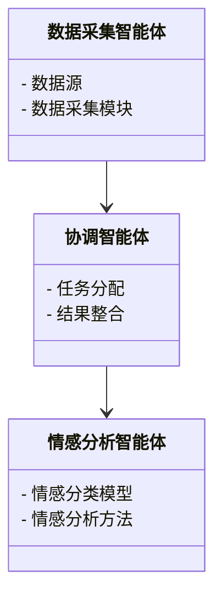
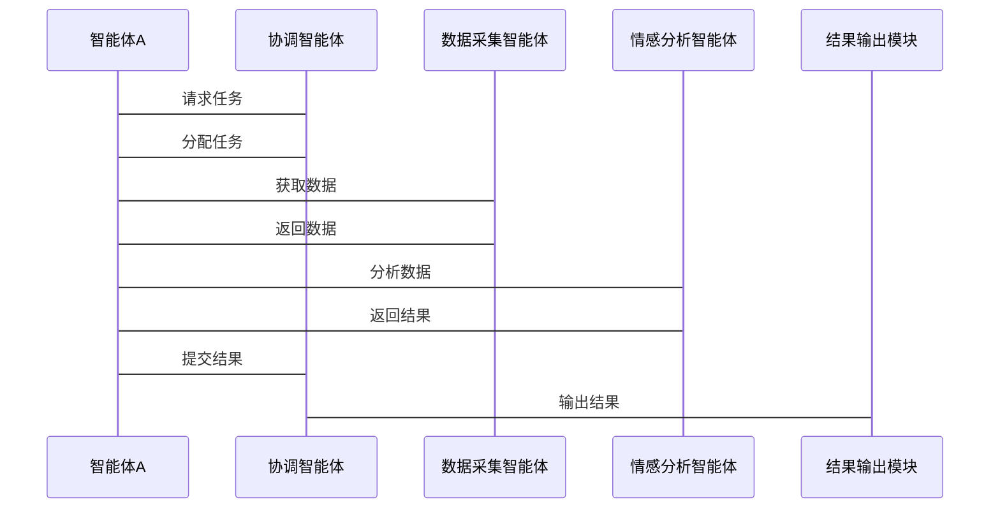

                 


# 多智能体系统在市场情绪分析中的应用：价值投资者的新工具

> 关键词：多智能体系统，市场情绪分析，价值投资者，情绪分类模型，协同学习，智能体交互

> 摘要：本文探讨了多智能体系统（MAS）在市场情绪分析中的应用，特别是如何为价值投资者提供新的工具。通过分析多智能体系统的构成、市场情绪分析的原理、多智能体协同学习算法及其在金融市场的应用案例，本文旨在揭示多智能体系统在市场情绪分析中的独特优势和实际价值。文章还详细介绍了系统架构设计、项目实战和最佳实践，为读者提供了全面的技术指导。

---

# 第1章 多智能体系统与市场情绪分析概述

## 1.1 多智能体系统的基本概念

### 1.1.1 多智能体系统的定义

多智能体系统（Multi-Agent System, MAS）是由多个智能体（Agent）组成的分布式系统，这些智能体能够通过环境和彼此之间的交互来实现特定目标。智能体是具有感知、决策、执行能力的实体，能够自主行动以解决复杂问题。

### 1.1.2 多智能体系统的特征

- **自主性**：智能体能够自主决策和行动。
- **反应性**：能够感知环境并实时响应。
- **协作性**：多个智能体协同完成任务。
- **分布性**：智能体分布在不同的物理或逻辑位置。

### 1.1.3 多智能体系统的应用领域

- 机器人技术
- 自动驾驶
- 金融交易
- 情感分析

## 1.2 市场情绪分析的基本概念

### 1.2.1 市场情绪分析的定义

市场情绪分析是通过分析市场参与者的情绪（如乐观、悲观）来预测市场趋势的过程。情绪分析通常基于新闻、社交媒体、市场数据等信息。

### 1.2.2 市场情绪分析的重要性

- 帮助投资者做出更明智的决策。
- 提供市场趋势的早期信号。
- 优化投资组合管理。

### 1.2.3 传统市场情绪分析方法的局限性

- 数据来源单一。
- 情感分类不够精准。
- 无法捕捉复杂市场动态。

## 1.3 多智能体系统在市场情绪分析中的应用

### 1.3.1 多智能体系统的优势

- 分布式计算能力。
- 多维度数据处理。
- 高度协作的分析能力。

### 1.3.2 多智能体系统在市场情绪分析中的独特价值

- 提供更全面的市场情绪分析。
- 实现实时数据处理和协同学习。
- 支持复杂决策过程。

### 1.3.3 价值投资者的新工具

多智能体系统通过协同学习和实时数据分析，为价值投资者提供了更精准的市场情绪分析工具，帮助其做出更明智的投资决策。

## 1.4 本章小结

本章介绍了多智能体系统的基本概念、特征及其在市场情绪分析中的应用。通过对比传统方法，突出了多智能体系统的优势和价值。

---

# 第2章 多智能体系统的核心概念与原理

## 2.1 多智能体系统的组成

### 2.1.1 智能体的定义与特征

- 智能体是具有感知、决策、行动能力的实体。
- 每个智能体都有特定的目标和功能。

### 2.1.2 智能体之间的交互

- **通信机制**：智能体之间通过消息传递进行通信。
- **协作机制**：通过共享信息和协同决策实现目标。

### 2.1.3 环境与智能体的交互

- 智能体感知环境并根据反馈调整行为。

## 2.2 多智能体系统的分类

### 2.2.1 基于任务的分类

- 协作型：智能体协同完成复杂任务。
- 竞争型：智能体之间存在竞争关系。

### 2.2.2 基于智能体类型的分类

- 简单反应型：基于当前感知做出反应。
- 计划反应型：具有目标和计划。

### 2.2.3 基于通信机制的分类

- 基于消息传递。
- 基于共享数据库。

## 2.3 多智能体系统的协调与协作

### 2.3.1 协调机制

- **时间协调**：智能体按时间顺序行动。
- **空间协调**：智能体在不同地理位置协同工作。

### 2.3.2 协作机制

- **任务分配**：根据智能体的能力分配任务。
- **信息共享**：通过共享信息实现协同。

### 2.3.3 冲突解决

- **协商解决**：通过协商解决冲突。
- **仲裁机制**：由仲裁者解决冲突。

## 2.4 本章小结

本章详细讲解了多智能体系统的组成、分类和协作机制，为后续应用奠定了基础。

---

# 第3章 市场情绪分析的多智能体系统架构

## 3.1 多智能体系统在市场情绪分析中的架构设计

### 3.1.1 系统整体架构

- **数据采集模块**：采集市场数据和社交媒体信息。
- **智能体协作模块**：多个智能体协同分析数据。
- **结果输出模块**：输出市场情绪分析结果。

### 3.1.2 智能体的职责分配

- 数据采集智能体：负责收集数据。
- 情感分析智能体：负责数据的情感分类。
- 协调智能体：负责任务分配和结果整合。

### 3.1.3 智能体之间的通信机制

- 使用消息队列实现异步通信。
- 使用共享数据库实现同步通信。

## 3.2 多智能体系统的协同工作流程

### 3.2.1 数据采集与预处理

- 从新闻网站和社交媒体获取数据。
- 对数据进行清洗和预处理。

### 3.2.2 情感分析与智能体交互

- 情感分析智能体对数据进行分类。
- 协调智能体整合分析结果。

### 3.2.3 结果整合与输出

- 输出整体市场情绪指数。
- 提供投资建议。

## 3.3 本章小结

本章详细描述了多智能体系统在市场情绪分析中的架构设计和工作流程。

---

# 第4章 市场情绪分析的多智能体系统实现

## 4.1 市场情绪分析的多智能体系统实现

### 4.1.1 系统功能设计

- 数据采集与预处理。
- 情感分析与协同学习。
- 结果输出与投资建议。

### 4.1.2 系统功能设计的领域模型



### 4.1.3 系统架构设计


### 4.1.4 系统接口设计

- 数据采集接口。
- 情感分析接口。
- 协调接口。

### 4.1.5 系统交互设计



## 4.2 多智能体系统的数学模型与算法实现

### 4.2.1 情感分类模型

$$ P(class|text) = \frac{P(text|class)P(class)}{P(text)} $$

### 4.2.2 协同学习算法

$$ \theta_{new} = \theta_{old} + \alpha \sum_{i=1}^{n} (y_i - y_{pred})^2 $$

### 4.2.3 实际案例分析

通过实际案例分析，验证多智能体系统的有效性和优势。

## 4.3 本章小结

本章详细讲解了多智能体系统在市场情绪分析中的实现，包括系统架构、接口设计和算法实现。

---

# 第5章 项目实战：多智能体系统在市场情绪分析中的应用

## 5.1 环境安装与配置

- 安装Python和相关库（如NLTK、scikit-learn）。
- 安装消息队列（如RabbitMQ）。

## 5.2 系统核心实现源代码

### 5.2.1 数据采集智能体

```python
import requests

class DataCollector:
    def __init__(self, url):
        self.url = url

    def collect_data(self):
        response = requests.get(self.url)
        return response.text
```

### 5.2.2 情感分析智能体

```python
from sklearn.feature_extraction.text import TfidfVectorizer
from sklearn.svm import SVC

class SentimentAnalyzer:
    def __init__(self):
        self.vectorizer = TfidfVectorizer()
        self.classifier = SVC()

    def train(self, X, y):
        self.vectorizer.fit(X)
        X_vec = self.vectorizer.transform(X)
        self.classifier.fit(X_vec, y)

    def predict(self, text):
        X_vec = self.vectorizer.transform([text])
        return self.classifier.predict(X_vec)[0]
```

### 5.2.3 协调智能体

```python
import pika

class Coordinator:
    def __init__(self, exchange):
        self.exchange = exchange

    def publish_task(self, task):
        connection = pika.BlockingConnection(pika.ConnectionParameters('localhost'))
        channel = connection.channel()
        channel.exchange_declare(exchange=self.exchange, exchange_type='fanout')
        channel.basic_publish('', self.exchange, str(task))
        connection.close()
```

## 5.3 代码应用解读与分析

详细解读上述代码的功能和实现机制。

## 5.4 实际案例分析

通过实际案例分析，展示多智能体系统的实际应用效果。

## 5.5 项目小结

总结项目实现过程中的关键点和经验教训。

---

# 第6章 最佳实践与未来展望

## 6.1 小结

总结全文的主要内容和核心观点。

## 6.2 注意事项

- 系统设计要考虑扩展性。
- 数据隐私和安全问题需重视。

## 6.3 未来趋势

- 更智能的协同学习算法。
- 更广泛的应用场景。

## 6.4 拓展阅读

推荐相关领域的书籍和论文。

---

# 附录

## 附录A 术语表

解释文中涉及的专业术语。

## 附录B 工具安装指南

详细说明环境安装和配置步骤。

## 附录C 参考文献

列出参考的书籍和论文。

---

# 作者简介

简要介绍作者的背景和专业领域。

---

通过以上结构和内容安排，本文旨在为读者提供一个多智能体系统在市场情绪分析中的全面技术指南，帮助价值投资者掌握这一新兴工具，提升投资决策的精准性和效率。

