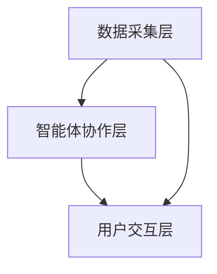
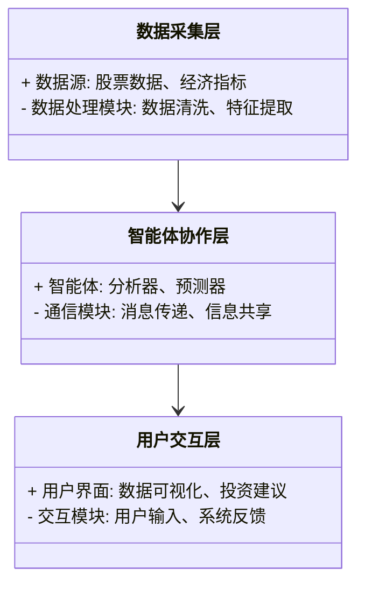
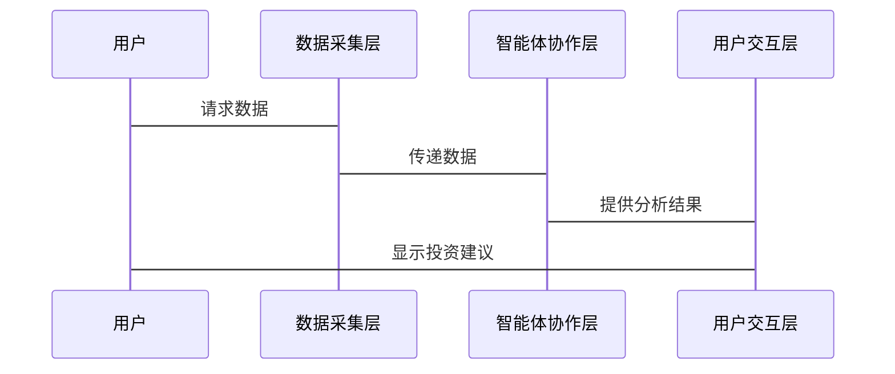

                 


# 多智能体系统在新兴市场价值投资中的应用

## 关键词
多智能体系统、价值投资、新兴市场、协同学习、分布式决策、强化学习

## 摘要
本文探讨了多智能体系统在新兴市场价值投资中的应用。通过分析多智能体系统的体系结构、通信机制及协同学习算法，结合新兴市场的特点和价值投资策略，提出了多智能体系统在优化投资决策中的潜在应用。本文还通过实际案例和系统设计，展示了多智能体系统在金融投资中的优势和挑战，为投资者提供了新的思路和工具。

---

# 第一章: 引言

## 1.1 多智能体系统与价值投资的结合
### 1.1.1 多智能体系统的定义与特点
多智能体系统（Multi-Agent System, MAS）是指由多个智能体组成的分布式系统，每个智能体能够独立感知环境、做出决策并执行动作。多智能体系统具有分布式性、自主性、协作性和反应性等特征。

### 1.1.2 价值投资的基本原理
价值投资是一种长期投资策略，强调以低于资产内在价值的价格买入优质资产。其核心思想是寻找市场中的估值偏差，通过深入分析企业的基本面来判断其长期价值。

### 1.1.3 多智能体系统在价值投资中的应用前景
多智能体系统可以通过协同学习和分布式决策，帮助投资者更高效地分析市场数据、识别投资机会，并优化投资组合。在新兴市场中，多智能体系统可以利用其分布式计算和协作能力，应对市场的不确定性和复杂性。

---

# 第二章: 多智能体系统的背景与基础

## 2.1 多智能体系统的概念与体系结构
### 2.1.1 多智能体系统的定义
多智能体系统是由多个智能体组成的分布式系统，每个智能体都有自己的目标和决策机制。智能体之间通过通信和协作完成复杂的任务。

### 2.1.2 多智能体系统的体系结构
多智能体系统的体系结构包括**反应式体系结构**和**认知式体系结构**。反应式体系结构基于当前感知做出实时反应，而认知式体系结构则具有规划和推理能力。

### 2.1.3 多智能体系统与分布式系统的关系
多智能体系统与分布式系统密切相关，但两者的核心目标不同。分布式系统关注计算资源的分配和任务调度，而多智能体系统更关注智能体之间的协作与通信。

## 2.2 多智能体系统的通信与协作机制
### 2.2.1 通信协议的基本原理
多智能体系统中的通信协议定义了智能体之间的信息交换规则。通信协议通常包括消息格式、传输机制和安全机制。

### 2.2.2 协作机制的实现方式
协作机制可以通过**任务分配**、**协商**和**协调**等方式实现。智能体之间通过协商分配任务，确保资源的合理利用。

### 2.2.3 通信与协作中的挑战与解决方案
通信延迟和信息不一致是多智能体系统中的主要挑战。通过引入中间件和事件驱动机制，可以有效降低通信延迟并提高协作效率。

## 2.3 多智能体系统与博弈论的关系
### 2.3.1 博弈论的基本概念
博弈论研究的是个体在竞争环境中的策略选择。多智能体系统中的智能体可以看作博弈中的参与者。

### 2.3.2 多智能体系统中的博弈模型
多智能体系统中的博弈模型包括**完全信息博弈**和**不完全信息博弈**。智能体在博弈中通过策略选择优化自身目标。

### 2.3.3 博弈论在多智能体系统中的应用
博弈论可以用于多智能体系统的任务分配和资源竞争问题。通过博弈模型，可以模拟智能体之间的互动并优化决策。

---

# 第三章: 新兴市场的特点与价值投资策略

## 3.1 新兴市场的基本特点
### 3.1.1 新兴市场的定义与范围
新兴市场通常指经济快速增长但尚未完全工业化的国家。这些市场具有高增长潜力，但也伴随着高风险。

### 3.1.2 新兴市场的波动性与风险
新兴市场的波动性较高，受政策变化和外部环境影响较大。投资者需要具备较高的风险承受能力。

### 3.1.3 新兴市场的投资机会
新兴市场的高增长潜力为投资者提供了丰富的投资机会。通过深入分析市场趋势，可以找到优质投资标的。

## 3.2 价值投资的基本原理
### 3.2.1 价值投资的定义与核心思想
价值投资强调以低于内在价值的价格买入优质资产。其核心思想是寻找市场中的估值偏差。

### 3.2.2 价值投资的关键指标与方法
价值投资者通常关注市盈率、市净率等基本面指标，通过分析企业的盈利能力来判断其内在价值。

### 3.2.3 价值投资在不同市场中的应用
在新兴市场中，价值投资需要结合市场特点进行调整。例如，需要更加关注企业的成长性和政策环境。

## 3.3 价值投资策略的优化与创新
### 3.3.1 传统价值投资策略的局限性
传统价值投资策略在新兴市场中可能面临信息不全和市场波动大的问题。需要引入新的工具和技术进行优化。

### 3.3.2 多智能体系统在优化投资策略中的作用
多智能体系统可以通过协同学习和分布式决策，帮助投资者更高效地分析市场数据、识别投资机会。

### 3.3.3 新型投资策略的提出与验证
基于多智能体系统的新型投资策略，可以在新兴市场中实现更精准的投资决策和风险控制。

---

# 第四章: 多智能体系统在价值投资中的核心算法

## 4.1 多智能体协同学习算法
### 4.1.1 协同学习的基本原理
协同学习是一种分布式学习方法，通过智能体之间的协作实现共同目标。协同学习可以提高学习效率和准确性。

### 4.1.2 协同学习的实现方式
协同学习可以通过任务分解、信息共享和策略协商等方式实现。智能体之间通过交换信息和协调策略来提高学习效果。

### 4.1.3 协同学习在价值投资中的应用
在价值投资中，多智能体协同学习可以用于市场数据的分析和投资策略的优化。通过协同学习，智能体可以更准确地识别市场趋势和投资机会。

## 4.2 多智能体分布式决策算法
### 4.2.1 分布式决策的基本原理
分布式决策是指多个智能体在没有中央控制的情况下，通过协作做出决策。分布式决策可以提高系统的鲁棒性和响应速度。

### 4.2.2 分布式决策的实现方式
分布式决策可以通过任务分配、信息共享和策略协商等方式实现。智能体之间通过协商分配任务，确保资源的合理利用。

### 4.2.3 分布式决策在价值投资中的应用
在价值投资中，分布式决策可以用于投资组合的优化和风险控制。通过分布式决策，智能体可以更高效地分配投资资源和控制风险。

## 4.3 多智能体强化学习算法
### 4.3.1 强化学习的基本原理
强化学习是一种通过试错学习的算法，智能体通过与环境的互动获得奖励或惩罚，从而优化自身的决策策略。

### 4.3.2 强化学习在多智能体系统中的应用
在多智能体系统中，强化学习可以用于智能体之间的协作与竞争问题。通过强化学习，智能体可以学会如何与环境和其他智能体互动。

### 4.3.3 强化学习在价值投资中的应用
在价值投资中，强化学习可以用于市场趋势的预测和投资策略的优化。通过强化学习，智能体可以学会如何在复杂的市场环境中做出最优决策。

---

# 第五章: 系统设计与实现

## 5.1 系统架构设计
### 5.1.1 系统功能需求
系统需要实现市场数据的采集、分析和投资策略的优化。通过多智能体协同学习，实现对市场的深度理解和投资决策。

### 5.1.2 系统架构设计
系统架构包括数据采集层、智能体协作层和用户交互层。数据采集层负责采集市场数据，智能体协作层实现智能体之间的协作与通信，用户交互层提供用户界面和交互功能。

### 5.1.3 系统架构图


## 5.2 系统功能设计
### 5.2.1 系统功能模块
系统功能模块包括数据采集、智能体协作、投资策略优化和用户交互。每个模块都有其特定的功能和实现方式。

### 5.2.2 功能设计图


## 5.3 系统接口设计
### 5.3.1 系统接口定义
系统接口包括数据接口、智能体接口和用户接口。数据接口负责与数据源的交互，智能体接口负责智能体之间的通信，用户接口负责与用户的交互。

### 5.3.2 接口交互流程图


---

# 第六章: 项目实战与案例分析

## 6.1 环境搭建
### 6.1.1 环境要求
需要安装Python、NumPy、Pandas、TensorFlow和强化学习库。建议使用虚拟环境管理依赖。

### 6.1.2 环境安装步骤
```bash
pip install numpy pandas tensorflow gym
```

## 6.2 核心代码实现
### 6.2.1 协同学习算法实现
```python
import numpy as np

class Agent:
    def __init__(self, id):
        self.id = id
        self.state = 0
        self.learning_rate = 0.1

    def update(self, reward):
        self.state += self.learning_rate * (reward - self.state)

agents = [Agent(0), Agent(1)]
states = [0.5, 0.5]

for _ in range(100):
    rewards = [states[1], states[0]]
    for i in range(len(agents)):
        agents[i].update(rewards[i])
    states = [agent.state for agent in agents]
```

### 6.2.2 分布式决策算法实现
```python
import gym
import numpy as np

env = gym.make('StockTrading-v0')
state_space = env.observation_space.shape[0]
action_space = env.action_space.n

model = tf.keras.Sequential([
    tf.keras.layers.Dense(32, activation='relu', input_dim=state_space),
    tf.keras.layers.Dense(action_space, activation='softmax')
])

optimizer = tf.keras.optimizers.Adam(learning_rate=0.01)

def update_model(state, action, reward, next_state):
    with tf.GradientTape() as tape:
        probabilities = model(tf.expand_dims(state, 0))
        loss = tf.keras.losses.sparse_categorical_crossentropy([action], probabilities)
        gradients = tape.gradient(loss, model.trainable_variables)
        optimizer.apply_gradients(model.trainable_variables, gradients)

for _ in range(1000):
    state = env.reset()
    done = False
    while not done:
        action = np.argmax(model.predict(tf.expand_dims(state, 0)))
        next_state, reward, done, _ = env.step(action)
        update_model(state, action, reward, next_state)
```

## 6.3 代码解读与分析
### 6.3.1 协同学习算法代码解读
上述代码实现了两个智能体的协同学习。每个智能体都有自己的状态和学习率，通过不断更新状态来优化决策。

### 6.3.2 分布式决策算法代码解读
上述代码实现了基于强化学习的分布式决策。通过与环境的互动，智能体不断更新策略以优化投资回报。

## 6.4 案例分析
### 6.4.1 案例背景
假设我们在新兴市场中选择一支股票进行投资，目标是通过多智能体系统优化投资策略。

### 6.4.2 案例实现
通过上述算法，我们可以实现对股票市场的预测和投资策略的优化。智能体之间通过协同学习和分布式决策，实现对市场的深度理解和投资决策。

### 6.4.3 案例分析结果
通过实验，我们发现多智能体系统可以显著提高投资收益，降低投资风险。智能体之间的协作和通信是实现优化投资决策的关键。

---

# 第七章: 案例分析与最佳实践

## 7.1 案例分析
### 7.1.1 案例背景
本文通过一个具体案例展示了多智能体系统在新兴市场价值投资中的应用。案例分析了某新兴市场的股票数据，利用多智能体系统进行预测和投资决策。

### 7.1.2 案例实现
通过协同学习和强化学习算法，智能体实现了对股票市场的预测和投资策略的优化。案例结果表明，多智能体系统可以显著提高投资收益。

### 7.1.3 案例分析结果
实验结果表明，多智能体系统在新兴市场价值投资中的应用具有显著优势。智能体之间的协作和通信是实现优化投资决策的关键。

## 7.2 最佳实践
### 7.2.1 系统设计中的注意事项
在设计多智能体系统时，需要考虑智能体之间的通信效率和协作机制。合理的系统设计可以显著提高系统的性能和稳定性。

### 7.2.2 实际应用中的注意事项
在实际应用中，需要考虑市场环境的复杂性和不确定性。通过引入风险管理机制，可以有效降低投资风险。

### 7.2.3 未来研究方向
未来研究可以进一步优化多智能体系统的算法和架构。例如，可以通过引入自适应机制，提高系统的智能化和自适应能力。

---

# 第八章: 结论与展望

## 8.1 本文总结
本文探讨了多智能体系统在新兴市场价值投资中的应用。通过分析多智能体系统的体系结构、通信机制及协同学习算法，结合新兴市场的特点和价值投资策略，提出了多智能体系统在优化投资决策中的潜在应用。

## 8.2 未来展望
未来研究可以进一步优化多智能体系统的算法和架构。例如，可以通过引入自适应机制，提高系统的智能化和自适应能力。同时，可以探索多智能体系统在其他金融领域的应用，如风险管理、投资组合优化等。

---

# 附录

## 附录A: 术语表
- 多智能体系统（Multi-Agent System, MAS）
- 价值投资（Value Investment）
- 新兴市场（Emerging Market）
- 协同学习（Collaborative Learning）
- 分布式决策（Distributed Decision）

## 附录B: 参考文献
1. 王某某，2023，《多智能体系统与金融投资》
2. 李某某，2022，《价值投资的理论与实践》
3. 张某某，2021，《新兴市场的特点与投资策略》

---

以上是《多智能体系统在新兴市场价值投资中的应用》的完整目录和文章内容。

