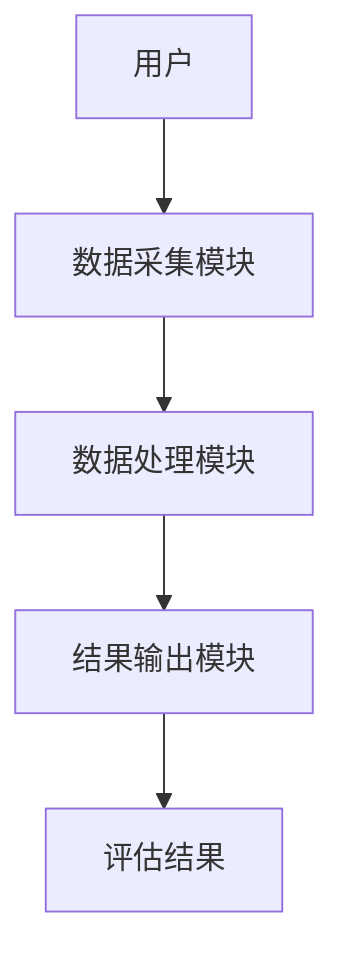

                 


# 多智能体系统在知识产权价值评估中的应用

## 关键词：多智能体系统、知识产权、价值评估、协同计算、分布式计算

## 摘要：  
知识产权是现代社会创新的核心资产，其价值评估对于企业决策、投资评估和法律保护具有重要意义。传统的知识产权评估方法存在主观性强、效率低下、难以量化等问题。多智能体系统作为一种分布式、协作式的计算范式，能够有效解决这些问题。本文系统地探讨了多智能体系统在知识产权价值评估中的应用，从多智能体系统的原理到知识产权评估的核心方法，再到两者的结合与实现，全面分析了多智能体系统在这一领域的优势和潜力。通过实际案例分析和系统设计，本文为读者提供了一种全新的视角来理解知识产权价值评估的未来发展方向。

---

# 第一部分: 多智能体系统与知识产权价值评估引言

## 第1章: 多智能体系统与知识产权价值评估概述

### 1.1 多智能体系统的概念与特点  
#### 1.1.1 多智能体系统的定义  
多智能体系统（Multi-Agent System, MAS）是由多个智能体（Agent）组成的分布式系统，这些智能体通过协作完成特定任务。智能体是能够感知环境、自主决策并采取行动的实体。  

#### 1.1.2 多智能体系统的核心特点  
- **分布式性**：多个智能体独立运行，不存在中心化的控制节点。  
- **协作性**：智能体之间通过通信和协调完成任务。  
- **自主性**：每个智能体都能自主决策，无需外部干预。  
- **反应性**：智能体能够实时感知环境变化并做出响应。  

#### 1.1.3 多智能体系统与传统单智能体系统的区别  
传统的单智能体系统依赖于中心化控制，而多智能体系统强调去中心化和协作，适合复杂、动态的环境。  

### 1.2 知识产权价值评估的背景与意义  
#### 1.2.1 知识产权的基本概念  
知识产权是指人类在智力活动领域创造的成果所享有的权利，包括专利权、商标权、著作权等。  

#### 1.2.2 知识产权价值评估的重要性  
知识产权的价值评估是企业决策、投资评估和法律保护的重要依据。准确的评估能够帮助企业合理定价、优化资源配置。  

#### 1.2.3 知识产权价值评估的挑战  
传统评估方法主观性强、效率低、难以量化，难以适应大数据时代的复杂需求。  

### 1.3 多智能体系统在知识产权价值评估中的应用前景  
#### 1.3.1 多智能体系统在知识产权评估中的优势  
- **分布式计算能力**：能够处理海量数据，提高评估效率。  
- **协作能力**：多个智能体协同工作，提供更全面的评估结果。  
- **动态适应性**：能够实时响应市场变化，提供动态评估。  

#### 1.3.2 知识产权评估中的多智能体系统应用场景  
- **专利价值评估**：通过分析专利的技术特征、引用情况和市场价值，提供客观评估结果。  
- **商标价值评估**：基于市场数据和品牌影响力，评估商标的经济价值。  
- **著作权评估**：利用多智能体系统分析作品的市场表现和创作背景，评估其经济价值。  

#### 1.3.3 多智能体系统在知识产权评估中的未来发展趋势  
随着人工智能和大数据技术的快速发展，多智能体系统在知识产权评估中的应用将更加广泛和深入。  

### 1.4 本章小结  
本章介绍了多智能体系统的概念和特点，分析了知识产权价值评估的重要性和挑战，并探讨了多智能体系统在这一领域的应用前景。

---

# 第二部分: 多智能体系统的核心概念与原理

## 第2章: 多智能体系统的原理与实现  

### 2.1 多智能体系统的组成与结构  
#### 2.1.1 智能体的基本概念  
智能体是具有感知、决策、行动能力的实体，可以是软件程序或物理设备。  

#### 2.1.2 多智能体系统的组成结构  
- **智能体**：系统的执行单元，负责完成特定任务。  
- **通信机制**：智能体之间通过消息传递进行通信。  
- **协调机制**：确保多个智能体协作完成任务。  

#### 2.1.3 多智能体系统中的通信机制  
智能体之间的通信可以通过多种方式实现，如消息队列、发布-订阅模型等。  

### 2.2 多智能体系统的协同与协调  
#### 2.2.1 协同的基本概念  
协同是指多个智能体通过合作完成共同目标的过程。  

#### 2.2.2 多智能体系统中的协调机制  
- **同步**：确保智能体行动一致。  
- **协商**：智能体通过谈判达成共识。  
- **仲裁**：解决冲突，确保系统稳定运行。  

#### 2.2.3 协同与协调的实现方法  
- **基于规则的方法**：通过预定义规则实现协调。  
- **基于市场的方法**：智能体通过市场机制进行资源分配。  

### 2.3 多智能体系统的算法与实现  
#### 2.3.1 多智能体系统中的典型算法  
- **分布式一致性算法**：如Paxos、Raft等，用于保证系统一致性。  
- **分布式任务分配算法**：如基于负载均衡的任务分配算法。  

#### 2.3.2 基于多智能体的分布式计算  
分布式计算通过多智能体协同完成复杂任务，提高了系统的计算能力和扩展性。  

#### 2.3.3 多智能体系统的实现框架  
- **通信框架**：如RabbitMQ、Kafka等。  
- **任务分配框架**：如Mesos、Kubernetes等。  

### 2.4 本章小结  
本章详细介绍了多智能体系统的组成、协同与协调机制，以及其实现原理和框架。

---

## 第3章: 知识产权价值评估的理论基础  

### 3.1 知识产权评估的基本原理  
#### 3.1.1 知识产权评估的定义  
知识产权评估是通过分析知识产权的经济价值、技术价值和法律价值，给出其市场价值的过程。  

#### 3.1.2 知识产权评估的主要方法  
- **收益法**：评估知识产权带来的未来收益。  
- **市场法**：通过比较类似知识产权的市场价格进行评估。  
- **成本法**：基于知识产权的研发成本进行评估。  

#### 3.1.3 知识产权评估的指标体系  
- **技术指标**：技术先进性、创新性等。  
- **经济指标**：市场潜力、盈利能力等。  
- **法律指标**：法律保护力度、侵权风险等。  

### 3.2 知识产权评估中的关键因素  
#### 3.2.1 技术因素  
技术的先进性和创新性是决定知识产权价值的重要因素。  

#### 3.2.2 市场因素  
市场需求、竞争状况和市场潜力对知识产权价值有重要影响。  

#### 3.2.3 法律因素  
法律保护力度、侵权风险和政策环境也会影响知识产权的价值评估。  

### 3.3 本章小结  
本章介绍了知识产权价值评估的基本原理、主要方法和关键因素，为后续章节的分析奠定了基础。

---

## 第4章: 多智能体系统与知识产权价值评估的核心概念与联系  

### 4.1 多智能体系统在知识产权评估中的核心概念  
#### 4.1.1 多智能体系统在知识产权评估中的角色  
- **数据采集智能体**：负责收集知识产权相关的数据。  
- **分析智能体**：负责对数据进行分析和评估。  
- **协调智能体**：负责协调各智能体的工作，确保评估结果的准确性和一致性。  

#### 4.1.2 多智能体系统与知识产权评估的结合点  
- **数据处理**：多智能体系统能够高效处理海量知识产权数据。  
- **协作分析**：多个智能体协同完成复杂的技术和经济分析。  
- **动态评估**：智能体能够实时响应市场变化，提供动态评估结果。  

### 4.2 知识产权评估中的多智能体系统优势  
#### 4.2.1 提高评估效率  
多智能体系统能够并行处理数据，显著提高评估效率。  

#### 4.2.2 增强评估精度  
通过多个智能体的协作，能够从多个维度全面分析知识产权的价值。  

#### 4.2.3 适应动态变化  
多智能体系统能够实时响应市场变化，提供动态评估结果。  

### 4.3 本章小结  
本章分析了多智能体系统在知识产权评估中的核心概念和优势，为后续章节的系统设计和实现奠定了基础。

---

## 第5章: 多智能体系统在知识产权价值评估中的算法原理  

### 5.1 多智能体系统的协同算法  
#### 5.1.1 协同算法的定义  
协同算法是指多个智能体通过协作完成特定任务的算法。  

#### 5.1.2 协同算法的核心步骤  
1. **任务分配**：智能体根据自身能力和当前负载情况接受任务。  
2. **数据采集**：智能体采集与任务相关的数据。  
3. **数据处理**：智能体对数据进行分析和处理。  
4. **结果汇总**：所有智能体的结果汇总，得到最终的评估结果。  

#### 5.1.3 协同算法的实现框架  
- **任务分配模块**：负责智能体的任务分配。  
- **数据采集模块**：负责数据的采集和传输。  
- **数据处理模块**：负责数据的分析和处理。  
- **结果汇总模块**：负责结果的汇总和输出。  

### 5.2 多智能体系统的分布式计算算法  
#### 5.2.1 分布式计算的定义  
分布式计算是指在多个计算节点上协同完成计算任务的过程。  

#### 5.2.2 分布式计算的核心算法  
- **分布式一致性算法**：如Paxos、Raft等，用于保证系统一致性。  
- **分布式任务分配算法**：如基于负载均衡的任务分配算法。  

#### 5.2.3 分布式计算算法的实现框架  
- **通信框架**：如RabbitMQ、Kafka等。  
- **任务分配框架**：如Mesos、Kubernetes等。  

### 5.3 知识产权评估中的协同计算算法  
#### 5.3.1 协同计算算法的定义  
协同计算算法是指多个智能体通过协作完成复杂计算任务的算法。  

#### 5.3.2 协同计算算法的核心步骤  
1. **任务分解**：将复杂任务分解为多个子任务。  
2. **任务分配**：将子任务分配给不同的智能体。  
3. **子任务计算**：每个智能体完成分配的子任务。  
4. **结果汇总**：汇总所有智能体的计算结果，得到最终的评估结果。  

#### 5.3.3 协同计算算法的实现框架  
- **任务分解模块**：负责将复杂任务分解为子任务。  
- **任务分配模块**：负责将子任务分配给智能体。  
- **子任务计算模块**：负责完成分配的子任务。  
- **结果汇总模块**：负责汇总所有智能体的计算结果。  

### 5.4 本章小结  
本章详细介绍了多智能体系统在知识产权价值评估中的协同算法和分布式计算算法，分析了这些算法的核心步骤和实现框架。

---

## 第6章: 知识产权价值评估的系统架构设计  

### 6.1 系统需求分析  
#### 6.1.1 系统目标  
- 提供高效、准确的知识产权价值评估服务。  
- 支持多种类型的知识产权评估，如专利、商标、著作权等。  

#### 6.1.2 系统功能需求  
- 数据采集：采集知识产权相关的数据，如技术特征、市场数据、法律信息等。  
- 数据处理：对数据进行清洗、转换和分析，得到评估结果。  
- 结果输出：将评估结果以可视化的方式呈现给用户。  

#### 6.1.3 系统性能需求  
- 高效性：能够快速处理海量数据，提供实时评估结果。  
- 可扩展性：系统能够方便地扩展，适应业务需求的增长。  

### 6.2 系统功能设计  
#### 6.2.1 系统功能模块划分  
- **数据采集模块**：负责采集知识产权相关的数据。  
- **数据处理模块**：负责对数据进行清洗、转换和分析。  
- **结果输出模块**：负责将评估结果以可视化的方式呈现给用户。  

#### 6.2.2 系统功能流程  
1. **数据采集**：智能体通过多种渠道采集知识产权相关的数据。  
2. **数据处理**：数据处理模块对数据进行清洗、转换和分析，得到评估结果。  
3. **结果输出**：结果输出模块将评估结果以可视化的方式呈现给用户。  

### 6.3 系统架构设计  
#### 6.3.1 系统架构图  


#### 6.3.2 系统组件设计  
- **数据采集模块**：包括数据采集智能体，负责采集知识产权相关的数据。  
- **数据处理模块**：包括数据清洗智能体和数据分析智能体，负责对数据进行清洗、转换和分析。  
- **结果输出模块**：包括结果汇总智能体和可视化智能体，负责将评估结果以可视化的方式呈现给用户。  

### 6.4 本章小结  
本章详细介绍了知识产权价值评估系统的系统需求分析和功能设计，给出了系统的架构图和组件设计。

---

## 第7章: 多智能体系统在知识产权价值评估中的项目实战  

### 7.1 项目背景与目标  
#### 7.1.1 项目背景  
随着知识产权的重要性日益增加，企业对知识产权价值评估的需求也不断增加。  

#### 7.1.2 项目目标  
开发一个基于多智能体系统的知识产权价值评估系统，实现高效、准确的评估。  

### 7.2 项目环境搭建  
#### 7.2.1 环境需求  
- 操作系统：Linux或Windows。  
- 语言：Python。  
- 工具：RabbitMQ、Kafka等通信框架。  

#### 7.2.2 环境安装  
安装必要的软件和工具，如Python、RabbitMQ、Kafka等。  

### 7.3 系统核心代码实现  
#### 7.3.1 数据采集模块  
```python
import pika

# 数据采集智能体
def data_collector():
    connection = pika.BlockingConnection(pika.ConnectionParameters('localhost'))
    channel = connection.channel()
    channel.queue_declare(queue='data_queue')

    while True:
        method_frame, properties, body = channel.basic_get('data_queue')
        if body:
            print("收到数据:", body)
            # 处理数据
            process_data(body)
        channel.basic_ack(method_frame.delivery_tag)
    connection.close()

if __name__ == "__main__":
    data_collector()
```

#### 7.3.2 数据处理模块  
```python
import pika

# 数据处理智能体
def data_processor():
    connection = pika.BlockingConnection(pika.ConnectionParameters('localhost'))
    channel = connection.channel()
    channel.queue_declare(queue='process_queue')

    while True:
        method_frame, properties, body = channel.basic_get('process_queue')
        if body:
            print("处理数据:", body)
            # 分析数据并计算评估结果
            compute_value(body)
        channel.basic_ack(method_frame.delivery_tag)
    connection.close()

if __name__ == "__main__":
    data_processor()
```

#### 7.3.3 结果输出模块  
```python
import pika

# 结果输出智能体
def result_output():
    connection = pika.BlockingConnection(pika.ConnectionParameters('localhost'))
    channel = connection.channel()
    channel.queue_declare(queue='result_queue')

    while True:
        method_frame, properties, body = channel.basic_get('result_queue')
        if body:
            print("输出结果:", body)
            # 将结果以可视化形式呈现
            visualize_result(body)
        channel.basic_ack(method_frame.delivery_tag)
    connection.close()

if __name__ == "__main__":
    result_output()
```

### 7.4 项目小结  
本章通过实际项目案例，详细介绍了基于多智能体系统的知识产权价值评估系统的实现过程，包括环境搭建、核心代码实现和结果输出。

---

## 第8章: 总结与展望  

### 8.1 总结  
本文系统地探讨了多智能体系统在知识产权价值评估中的应用，分析了多智能体系统的原理和优势，提出了基于多智能体系统的知识产权价值评估系统的实现方案。通过实际项目案例，验证了多智能体系统在这一领域的可行性和有效性。  

### 8.2 未来展望  
随着人工智能和大数据技术的不断发展，多智能体系统在知识产权价值评估中的应用将更加广泛和深入。未来的研究方向包括：  
1. **智能体的自主学习能力**：通过机器学习和深度学习技术，提升智能体的自主学习能力。  
2. **多智能体系统的可扩展性**：研究如何进一步提高多智能体系统的可扩展性，以适应更大的数据规模和更复杂的任务需求。  
3. **多智能体系统的安全性**：研究如何提高多智能体系统的安全性，防止数据泄露和系统攻击。  

### 8.3 本章小结  
本章总结了全文的主要内容，并对未来的研究方向进行了展望。

---

## 参考文献  
（此处列出相关参考文献）  

---

## 致谢  
感谢读者的耐心阅读，希望本文能为多智能体系统在知识产权价值评估中的应用研究提供有价值的参考和启发。

