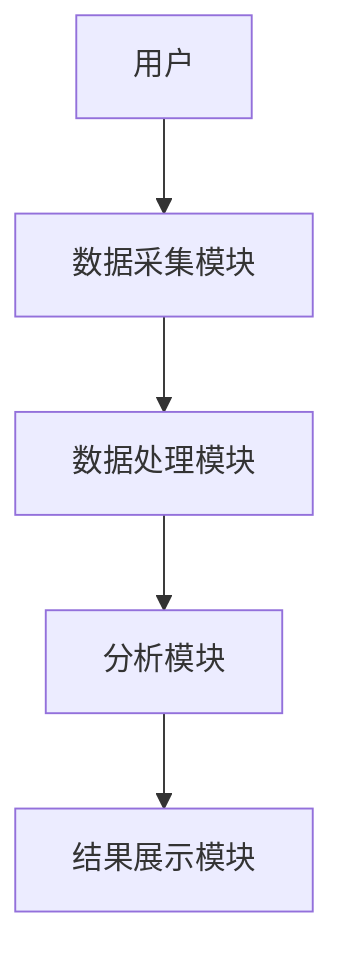
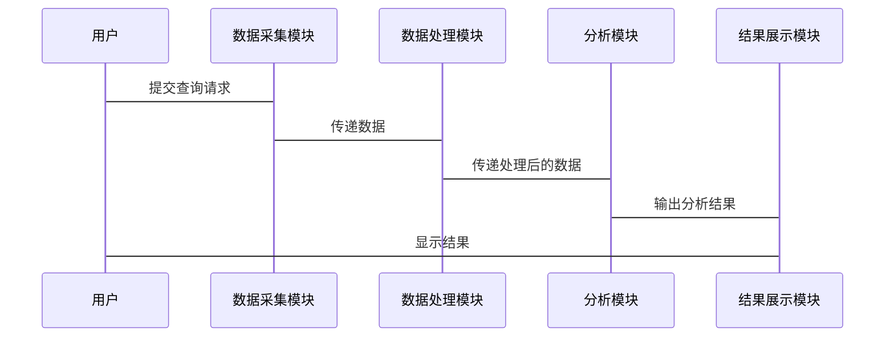

                 


# 多智能体系统在竞争优势分析中的应用：寻找护城河

> 关键词：多智能体系统，竞争优势分析，护城河，商业策略，系统架构，数学模型，算法原理

> 摘要：本文深入探讨了多智能体系统在竞争优势分析中的应用，详细阐述了如何利用多智能体系统构建和维护企业的竞争优势，寻找并巩固企业的护城河。文章从多智能体系统的概念、竞争优势分析的基本理论、护城河的构建与维护等多个维度展开，结合具体的数学模型和算法原理，分析了多智能体系统在商业竞争中的实际应用案例，并通过系统架构设计和项目实战，展示了如何将多智能体系统应用于竞争优势分析的实践中。文章最后总结了多智能体系统在竞争优势分析中的优势，并提出了相关的最佳实践建议。

---

# 目录

1. [多智能体系统概述](#多智能体系统概述)
2. [竞争优势分析与护城河概念](#竞争优势分析与护城河概念)
3. [多智能体系统在竞争优势分析中的应用](#多智能体系统在竞争优势分析中的应用)
4. [多智能体系统的数学模型与算法原理](#多智能体系统的数学模型与算法原理)
5. [系统设计与实现](#系统设计与实现)
6. [项目实战](#项目实战)
7. [总结与展望](#总结与展望)

---

## 第1章: 多智能体系统概述

### 1.1 多智能体系统的基本概念
多智能体系统（Multi-Agent System, MAS）是由多个智能体（Agent）组成的分布式系统，这些智能体能够通过协作和交互完成复杂的任务。智能体是具有感知、推理、决策和行动能力的实体，可以是软件程序、机器人或其他智能设备。

#### 1.1.1 多智能体系统的定义
多智能体系统是一种分布式人工智能系统，由多个智能体组成，每个智能体都有自己的目标、知识和行为规则。这些智能体通过通信和协作，共同完成复杂的任务。

#### 1.1.2 多智能体系统的特征
- **分布式性**：智能体独立运行，分布在不同的节点上。
- **自主性**：每个智能体都有自主决策的能力。
- **协作性**：智能体之间通过协作完成共同的目标。
- **反应性**：智能体能够根据环境的变化动态调整行为。

#### 1.1.3 多智能体系统与单智能体系统的区别
单智能体系统只有一个中心化的决策单元，而多智能体系统由多个独立的智能体组成，具有更高的灵活性和适应性。

### 1.2 多智能体系统的组成部分
多智能体系统由以下几个部分组成：
- **智能体**：具有感知、推理、决策和行动能力的实体。
- **环境**：智能体所处的外部环境，包括物理环境和信息环境。
- **通信机制**：智能体之间交换信息的渠道。
- **协作机制**：智能体之间协作完成任务的规则和协议。

### 1.3 多智能体系统的应用领域
多智能体系统广泛应用于多个领域，包括：
- **经济学**：模拟市场行为，分析经济趋势。
- **计算机科学**：分布式计算、机器人协作。
- **商业竞争分析**：竞争对手行为预测、市场趋势分析。

---

## 第2章: 竞争优势分析与护城河概念

### 2.1 竞争优势的基本理论
竞争优势是指企业在市场中相对于竞争对手的有利条件，包括成本优势、技术优势、品牌优势等。

#### 2.1.1 竞争优势的定义
竞争优势是指企业在市场中提供产品或服务时所拥有的独特优势，使其能够在竞争中占据优势地位。

#### 2.1.2 竞争优势的来源
竞争优势的来源主要包括：
- **成本优势**：企业能够以更低的成本生产产品或提供服务。
- **技术优势**：企业拥有独特的技术或专利。
- **品牌优势**：企业拥有强大的品牌影响力。
- **资源优势**：企业拥有独特的资源或供应链优势。

#### 2.1.3 竞争优势的分类
竞争优势可以分为短期竞争优势和长期竞争优势。短期竞争优势通常基于市场波动，而长期竞争优势则基于企业的核心竞争力。

### 2.2 护城河的概念与特征
护城河是指企业在市场竞争中建立的障碍，防止竞争对手进入或破坏企业的竞争优势。

#### 2.2.1 护城河的定义
护城河是指企业通过某种方式构建的市场准入障碍，使其竞争优势难以被竞争对手复制或超越。

#### 2.2.2 护城河的类型
护城河可以分为以下几种类型：
- **成本优势型**：企业通过规模经济或技术优势降低成本。
- **品牌优势型**：企业通过强大的品牌影响力吸引客户。
- **技术优势型**：企业通过专利或技术壁垒保护竞争优势。
- **网络效应型**：企业通过用户网络效应形成市场壁垒。

#### 2.2.3 护城河与竞争优势的关系
护城河是竞争优势的重要组成部分，是企业长期保持竞争优势的关键因素。

### 2.3 护城河在商业竞争中的作用
护城河能够帮助企业抵御竞争对手的攻击，巩固市场地位，实现长期稳定的竞争优势。

#### 2.3.1 护城河对企业长期价值的影响
护城河能够增强企业的市场地位，提高企业的长期盈利能力。

#### 2.3.2 护城河与企业市场地位的关系
护城河越强大，企业的市场地位越稳固，竞争对手越难以进入市场。

#### 2.3.3 护城河的构建与维护
企业需要通过不断创新和技术研发来维护和加强护城河。

---

## 第3章: 多智能体系统在竞争优势分析中的应用

### 3.1 多智能体系统在竞争优势分析中的优势
多智能体系统具有分布式计算能力、协作优化能力和动态适应能力，能够有效支持竞争优势分析。

#### 3.1.1 多智能体系统的分布式计算能力
多智能体系统能够将复杂的任务分解为多个子任务，由不同的智能体分别处理，提高计算效率。

#### 3.1.2 多智能体系统的协作优化能力
智能体之间的协作能够实现资源优化配置，提高整体系统的效率。

#### 3.1.3 多智能体系统的动态适应能力
多智能体系统能够根据环境变化动态调整行为，适应市场变化。

### 3.2 多智能体系统在竞争优势分析中的具体应用
多智能体系统可以应用于竞争对手行为预测、市场趋势分析和企业战略决策支持。

#### 3.2.1 竞争对手行为预测
通过分析竞争对手的智能体行为模式，预测其可能的市场动作。

#### 3.2.2 市场趋势分析
利用多智能体系统的协作能力，分析市场趋势，帮助企业制定战略决策。

#### 3.2.3 企业战略决策支持
多智能体系统可以为企业提供基于数据的决策支持，优化企业战略。

### 3.3 多智能体系统在护城河构建中的作用
多智能体系统可以帮助企业识别护城河、优化护城河结构，并实时监控护城河的动态。

#### 3.3.1 护城河的识别与评估
通过多智能体系统分析，帮助企业识别现有的竞争优势，并评估其护城河的强度。

#### 3.3.2 护城河的动态优化
根据市场变化，动态调整护城河策略，确保竞争优势的持续性。

#### 3.3.3 护城河的可视化与监控
通过多智能体系统的可视化功能，实时监控护城河的状态，及时发现潜在威胁。

---

## 第4章: 多智能体系统的数学模型与算法原理

### 4.1 多智能体系统的数学模型
多智能体系统的数学模型描述了智能体之间的协作和交互过程。

#### 4.1.1 多智能体系统的状态表示
智能体的状态可以用向量表示，包括位置、速度、目标等。

#### 4.1.2 多智能体系统的动作空间
智能体的动作空间定义了智能体可以执行的操作。

#### 4.1.3 多智能体系统的奖励机制
奖励机制用于评估智能体的行为，指导智能体的决策。

### 4.2 多智能体系统的算法原理
多智能体系统的算法主要包括博弈论算法和强化学习算法。

#### 4.2.1 基于博弈论的多智能体算法
博弈论算法模拟智能体之间的竞争与合作，帮助智能体做出最优决策。

#### 4.2.2 基于强化学习的多智能体算法
强化学习算法通过智能体与环境的交互，学习最优策略。

#### 4.2.3 多智能体系统的算法实现
以下是多智能体系统的一种实现方式：

```python
class Agent:
    def __init__(self, state_space, action_space):
        self.state_space = state_space
        self.action_space = action_space
        self.policy = self.init_policy()

    def init_policy(self):
        # 初始化策略
        pass

    def act(self, state):
        # 根据当前状态选择动作
        pass

    def update_policy(self, reward, next_state):
        # 更新策略
        pass
```

---

## 第5章: 系统设计与实现

### 5.1 问题场景介绍
在商业竞争分析中，企业需要实时监控市场动态，分析竞争对手的行为，并制定相应的战略。

### 5.2 系统功能设计
系统功能包括：
- 竞争对手行为分析
- 市场趋势预测
- 企业战略优化

### 5.3 系统架构设计
以下是系统架构的Mermaid图：



### 5.4 系统接口设计
系统接口包括：
- 数据接口：与外部数据源对接
- 用户接口：供用户输入查询
- 结果接口：输出分析结果

### 5.5 系统交互设计
以下是系统交互的Mermaid序列图：



---

## 第6章: 项目实战

### 6.1 环境安装
安装Python和相关库（如NumPy、Pandas、Matplotlib）。

### 6.2 核心代码实现
以下是核心代码实现：

```python
import numpy as np
import pandas as pd
import matplotlib.pyplot as plt

def analyze_competition(data):
    # 数据分析逻辑
    pass

def main():
    data = pd.read_csv('market_data.csv')
    result = analyze_competition(data)
    plt.figure()
    plt.plot(result['time'], result['value'])
    plt.show()

if __name__ == "__main__":
    main()
```

### 6.3 实际案例分析
通过实际案例分析，展示多智能体系统在竞争优势分析中的应用效果。

---

## 第7章: 总结与展望

### 7.1 总结
本文详细探讨了多智能体系统在竞争优势分析中的应用，展示了如何利用多智能体系统构建和维护企业的竞争优势，寻找并巩固企业的护城河。

### 7.2 展望
未来，随着人工智能技术的不断发展，多智能体系统在竞争优势分析中的应用将更加广泛，帮助企业更好地应对市场竞争。

---

## 最佳实践 Tips

- 在使用多智能体系统进行竞争优势分析时，建议结合企业的实际情况，选择合适的算法和模型。
- 定期更新和优化智能体系统的策略，以适应市场变化。
- 注重数据的准确性和实时性，确保分析结果的有效性。

---

希望这篇文章能够为您提供有价值的信息，帮助您更好地理解多智能体系统在竞争优势分析中的应用。如果需要进一步了解相关内容，可以参考相关技术文献或联系专业团队进行深入探讨。

