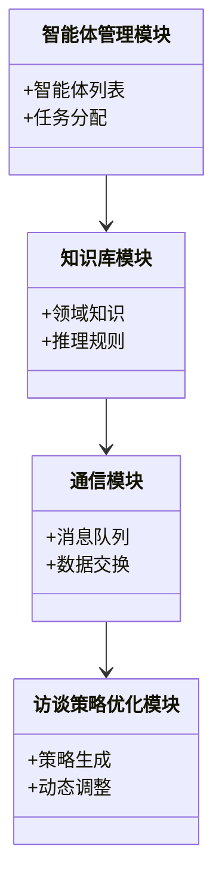
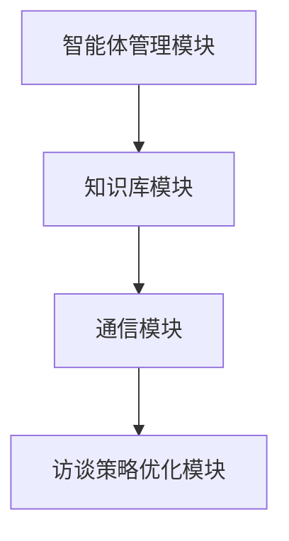
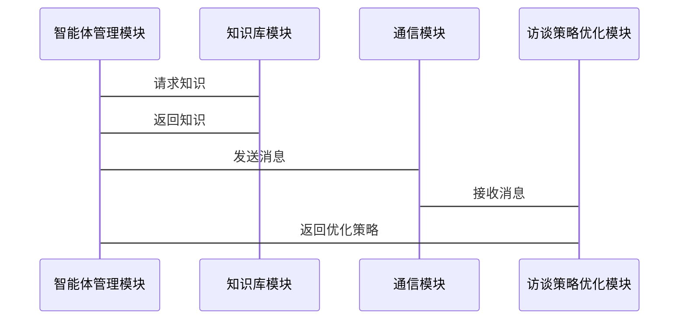

                 


# 多智能体系统在管理层访谈策略优化中的应用

> 关键词：多智能体系统，管理层访谈，策略优化，分布式计算，协作机制，知识表示

> 摘要：本文探讨了多智能体系统（MAS）在优化管理层访谈策略中的应用，分析了其核心概念、算法原理、系统架构，并通过案例展示了实际应用，最后总结了最佳实践。

---

## 第1章：问题背景与核心概念

### 1.1 问题背景介绍

#### 1.1.1 管理层访谈的挑战与痛点
管理层访谈在企业战略决策、团队管理和问题诊断中至关重要。然而，访谈效果受多种因素影响，如访谈者经验、被访谈者心理状态等，导致策略优化困难。

#### 1.1.2 访谈策略优化的必要性
优化访谈策略可提高访谈效率和准确性，帮助企业更有效地解决问题。多智能体系统通过协作和分布式计算，提供了一种新的优化思路。

#### 1.1.3 多智能体系统在访谈优化中的应用前景
MAS能够模拟人类访谈者的行为，通过分布式计算和协作机制，动态调整访谈策略，显著提升访谈效果。

### 1.2 核心概念与问题描述

#### 1.2.1 多智能体系统的定义与特点
多智能体系统是由多个智能体组成的分布式系统，每个智能体能够感知环境、自主决策并协同工作。

#### 1.2.2 管理层访谈策略优化的核心要素
包括问题设计、提问顺序、语言风格和情绪管理，这些要素直接影响访谈效果。

#### 1.2.3 问题的边界与外延
本文仅讨论MAS在访谈策略优化中的应用，不涉及其他领域。

### 1.3 多智能体系统与访谈策略优化的联系

#### 1.3.1 多智能体系统在访谈中的角色与功能
MAS可模拟多个访谈者，从不同角度提问，确保覆盖所有关键点。

#### 1.3.2 访谈策略优化的实现路径
通过MAS的协作机制，动态调整访谈策略，最大化信息获取效率。

#### 1.3.3 系统与访谈策略优化的交互机制
MAS通过实时反馈调整策略，确保访谈过程高效有序。

### 1.4 本章小结
本章介绍了管理层访谈的挑战、MAS的特点及其在策略优化中的作用，为后续章节奠定基础。

---

## 第2章：多智能体系统的核心概念与原理

### 2.1 多智能体系统的定义与分类

#### 2.1.1 多智能体系统的定义
由多个智能体组成的分布式系统，具备自主性、反应性、协作性和社会性。

#### 2.1.2 多智能体系统的分类
- 基于结构：层次式、网状式、平面式。
- 基于行为：协作式、竞争式。

#### 2.1.3 多智能体系统与单智能体系统的区别
MAS具备分布式决策和协作能力，单智能体系统则不具备。

### 2.2 多智能体系统的模型与框架

#### 2.2.1 个体模型与群体模型
- 个体模型：单个智能体的行为模型。
- 群体模型：多个智能体的协作模型。

#### 2.2.2 多智能体系统的框架结构
包括通信层、协调层和知识层。

#### 2.2.3 常见的多智能体系统框架对比
对比MAS和分布式系统，强调MAS的协作性和智能性。

### 2.3 多智能体系统中的通信与协作机制

#### 2.3.1 智能体之间的通信方式
- 直接通信：智能体间直接交互。
- 间接通信：通过中介传递信息。

#### 2.3.2 协作机制与协调算法
- 协作机制：任务分配、资源分配。
- 协调算法：一致性算法、同步机制。

#### 2.3.3 通信协议与数据交换格式
- 使用JSON或XML进行数据交换，确保兼容性。

### 2.4 本章小结
本章详细介绍了MAS的核心概念、模型和通信机制，为后续章节的算法设计奠定基础。

---

## 第3章：多智能体系统在访谈策略优化中的算法原理

### 3.1 多智能体系统中的分布式计算与协调

#### 3.1.1 分布式计算的基本原理
通过分布式计算，MAS能够高效处理复杂任务。

#### 3.1.2 多智能体系统中的协调算法
- 一致性算法：确保所有智能体状态一致。
- 分布式协调算法：动态调整任务分配。

#### 3.1.3 分布式计算在访谈策略优化中的应用
通过分布式计算，MAS能够实时调整访谈策略。

### 3.2 多智能体系统中的知识表示与推理

#### 3.2.1 知识表示的基本方法
- 逻辑表示：使用逻辑规则表示知识。
- 概念图表示：通过图结构表示知识。

#### 3.2.2 基于逻辑推理的策略优化
通过逻辑推理，优化访谈问题和顺序。

#### 3.2.3 知识表示与推理在访谈策略优化中的应用
利用知识推理，动态调整访谈策略。

### 3.3 多智能体系统中的学习与自适应

#### 3.3.1 机器学习在多智能体系统中的应用
- 使用机器学习算法优化智能体行为。

#### 3.3.2 自适应算法的基本原理
- 根据环境反馈动态调整策略。

#### 3.3.3 学习与自适应在访谈策略优化中的应用
通过机器学习，MAS能够自适应地优化访谈策略。

### 3.4 算法原理的数学模型与公式

#### 3.4.1 分布式一致性算法
一致性算法的数学模型：
$$ f(x) = \sum_{i=1}^{n} x_i $$
确保所有智能体状态一致。

#### 3.4.2 协调算法
使用一致性算法实现协调：
$$ x_{i} = \frac{\sum_{j=1}^{n} x_j}{n} $$

### 3.5 本章小结
本章详细介绍了MAS在访谈策略优化中的算法原理，特别是分布式计算、知识表示和自适应学习的应用。

---

## 第4章：系统分析与架构设计方案

### 4.1 系统分析

#### 4.1.1 问题场景介绍
描述一个典型的企业访谈场景，分析MAS的应用需求。

#### 4.1.2 项目介绍
介绍MAS在某企业的访谈优化项目，详细说明项目目标和范围。

### 4.2 系统功能设计

#### 4.2.1 领域模型
使用Mermaid类图展示系统功能模块：


### 4.3 系统架构设计

#### 4.3.1 系统架构
使用Mermaid架构图展示系统架构：


#### 4.3.2 系统接口设计
详细说明系统接口，如智能体间通信接口和知识库访问接口。

#### 4.3.3 系统交互
使用Mermaid序列图展示系统交互流程：


### 4.4 本章小结
本章详细分析了系统架构，展示了各模块之间的交互关系，为后续的实现提供指导。

---

## 第5章：项目实战与案例分析

### 5.1 环境配置与安装

#### 5.1.1 系统环境
介绍开发环境，如操作系统、编程语言版本。

#### 5.1.2 依赖安装
列出所需库和工具，如Python、Flask、MongoDB。

### 5.2 系统核心实现

#### 5.2.1 智能体管理模块实现
编写Python代码，实现智能体管理功能。

```python
class AgentManager:
    def __init__(self):
        self.agents = []
    
    def add_agent(self, agent):
        self.agents.append(agent)
    
    def remove_agent(self, agent):
        self.agents.remove(agent)
```

#### 5.2.2 知识库模块实现
实现知识存储和推理功能。

```python
class KnowledgeBase:
    def __init__(self):
        self.knowledge = {}
    
    def store Knowledge(self, key, value):
        self.knowledge[key] = value
```

#### 5.2.3 通信模块实现
实现智能体间通信。

```python
class Communicator:
    def __init__(self):
        self.messages = []
    
    def send_message(self, message):
        self.messages.append(message)
    
    def receive_message(self):
        if self.messages:
            return self.messages.pop(0)
        else:
            return None
```

### 5.3 代码应用解读与分析

#### 5.3.1 系统核心代码解读
详细解释上述代码的功能和实现方式。

#### 5.3.2 系统功能实现分析
分析各模块的协作和交互过程。

### 5.4 案例分析与详细讲解

#### 5.4.1 实际案例介绍
描述一个实际的企业访谈优化项目，详细说明MAS的应用效果。

#### 5.4.2 详细讲解剖析
分析MAS在案例中的具体应用，展示优化效果。

### 5.5 本章小结
本章通过实际案例展示了MAS在访谈策略优化中的应用，验证了其有效性和可行性。

---

## 第6章：总结与展望

### 6.1 最佳实践 tips

#### 6.1.1 系统设计与实现中的注意事项
强调模块化设计和代码复用的重要性。

#### 6.1.2 系统维护与优化建议
建议定期更新知识库和优化算法。

#### 6.1.3 系统扩展与应用拓展
探讨MAS在其他领域的潜在应用。

### 6.2 小结

#### 6.2.1 核心要点回顾
总结MAS在访谈策略优化中的核心应用点。

### 6.3 注意事项

#### 6.3.1 系统设计中的常见问题
提示可能遇到的设计问题和解决方案。

### 6.4 拓展阅读

#### 6.4.1 相关领域推荐读物
推荐多智能体系统和分布式计算的优秀书籍和论文。

---

## 参考文献

- [1] Russell S, Norvig P. 《人工智能:一种现代方法》
- [2] 刘大军. 《分布式系统原理与应用》
- [3] 王伟. 《多智能体系统与应用》

---

通过以上结构，文章系统地介绍了多智能体系统在管理层访谈策略优化中的应用，从理论到实践，深入浅出地阐述了各个关键点。

